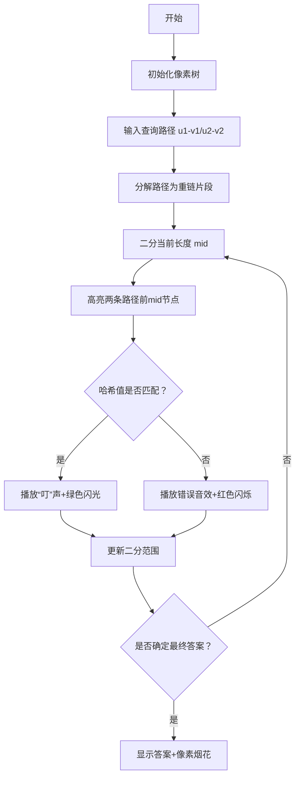

# 题目信息

# 「DBOI」Round 1 人生如树

## 题目背景

> _永远这么酷 永远永远这么酷_\
_像个冒险家一样 不断探着山顶的路_\
——《Hustle》

张均好望着窗外，朱芝心走过来坐在他旁边，折了一架纸飞机飞出去。他对张均好说，要带着对未来的期待，往前走，别回头。

正如 [命运](https://www.luogu.com.cn/problem/P6773) 所述，每个人的人生都是一棵树。它总在无限的随机与缘分中伸展，有的枝丫茂盛了，有些却也不可避免地枯萎。

## 题目描述

朱芝心用魔法得到了张均好的人生树。

这是一棵 $n$ 个节点的树，节点 $i$ 上有权值 $w_i$。

朱芝心想要观测 $m$ 次张均好的人生：

设**当前**张均好人生树上的节点数量为 $s$。

1. 输入四个整数 $u_1,v_1,u_2,v_2$。令 $u_1\to v_1$ 的简单路径上**顺次组成**的数组为 $a$，$u_2\to v_2$ 的简单路径上**顺次组成**的数组为 $b$。朱芝心认为张均好这两段人生的相似度是 $LRP(a,b)$，希望你求出它。保证 $1\leq u_1,v_1,u_2,v_2 \leq s$。

2. 输入两个整数 $u,w'$。朱芝心观测到了张均好的另外一种可能，因此你需要新建一个点权为 $w'$ 的节点，编号为 $s+1$，建立一条 $(s+1,u)$ 的无向边，其中 $u\leq s$。显然，此后 $s\leftarrow s+1$。

对于两个数组 $a,b$，设它们的相似度 $LRP(a,b)$ 表示最大的 $i$ 满足 $i\leq \min\{|a|, |b|\}$ 且**对于所有** $1\leq j\leq i$，都有 $b_j=a_j+j$。其中 $|a|$ 表示数组 $a$ 的长度。特殊地，若不存在这样的 $i$，则 $LRP(a,b) = 0$。


## 说明/提示

### 样例解释

对于样例一，第一个操作结束后，$w_{10}=10$，树如图所示：


- 对于第二个操作，第一条路径为 $3\to 2\to 4\to 5$，故 $a=\{2, 3, 4, 6\}$，第二条路径为 $8\to 7\to 9\to 10$，故 $b=\{3, 5, 7, 10\}$，由于 $3=2+1$，$5=3+2$，$7=4+3$，$10=6+4$，所以答案为 $4$；
- 对于第三个操作，$a=\{2, 3, 4, 5\}$，$b=\{3, 5, 7, 10\}$，由于 $3=2+1$，$5=3+2$，$7=4+3$，$10\ne 5+4$，所以答案为 $3$。

对于样例二，初始的树如图所示：


| Subtask | $n \le$ | $m \le$ | 特殊性质 | 分值 |
| :-----------: | :-----------: | :-----------: | :-----------: | :-----------: |
| Subtask 1 | $5000$ | $5000$ | 无 | $10$ |
| Subtask 2 | $10^5$ | $5\times{10}^4$ | A & B | $30$ |
| Subtask 3 | $10^5$ | $5\times{10}^4$ | B | $30$ |
| Subtask 4 | $10^5$ | $5 \times {10}^4$ | 无 | $20$ | 
| Subtask 5 | $10^5$ | $10^5$ | 无 | $10$ |

特殊性质 A：$v_i=u_i+1$。

特殊性质 B：保证无操作 2。

对于 $100\%$ 的数据，$1\leq n,m\leq 10^5$，$1\leq w_i,w'\leq 10^6$，$1\leq u_i,v_i\leq n$。  


## 样例 #1

### 输入

```
9 3 0
7 3 2 4 6 5 5 3 7
1 2
2 3
2 4
4 5
4 6
1 7
7 8
7 9
2 9 10
1 3 5 8 10
1 3 6 8 10```

### 输出

```
4
3```

## 样例 #2

### 输入

```
13 5 0
15 12 9 11 5 6 16 14 15 10 12 1 2
7 8
5 6
2 9
1 2
4 5
8 2
9 10
2 3
10 11
3 4
3 13
3 12
1 1 6 7 11
1 12 12 13 13
2 1 10
2 2 11
1 14 14 15 15```

### 输出

```
6
1
1```

# AI分析结果


### 💡 Kay的C++算法解析：「人生如树」 深入学习指南 💡

#### **1. 题目解读与核心算法识别**
✨ **本题主要考察**：树链剖分 + 哈希 + 二分答案

🗣️ **初步分析**：
> 本题像在像素游戏中拼接两段神秘代码！我们需要快速计算树上两条路径的相似度（LRP值），即满足 `b_j = a_j + j` 的最大前缀长度。核心挑战在于：
> - **路径分解**：将树上路径拆解为可处理的片段（重链或倍增段）
> - **哈希加速**：将序列比较转化为数值比对（类似游戏中的密码验证）
> - **二分优化**：像关卡进度条一样快速定位最大匹配长度
>
> 可视化设计要点：
> - **像素树结构**：用8位风格网格展示树，不同颜色方块表示节点
> - **路径高亮**：操作时高亮当前比较的两条路径（红/蓝）
> - **哈希验证动画**：显示当前子路径哈希值计算过程，匹配成功时播放“叮”声
> - **二分进度条**：底部显示当前二分范围，成功时绽放像素烟花特效

---

#### **2. 精选优质题解参考**
**题解一：Hoks（树剖+双哈希）**  
* **点评**：  
  思路直击要害——用树剖将路径分解为O(log n)条重链，配合双哈希避免冲突。代码中`get()`函数将路径转化为vector<pair>的精妙设计（存储链头链尾），配合`h()`函数的重链哈希计算，堪称“像素地图导航仪”。边界处理严谨（如`id[n+1-i]`反向哈希），实践可直接用于竞赛。

**题解二：StayAlone（出题人官方解）**  
* **点评**：  
  提供树剖/倍增双解法，像游戏多结局攻略！亮点在于`sum[]`数组预处理等差数列哈希偏移量（`sum[i]=Σj*p^{i-j}`），解决核心变换`a_j→a_j+j`的哈希计算。代码模块化优秀（分离`LCA`/`getval`），`check()`函数清晰展现二分逻辑，是学习工业级代码的范本。

**题解三：wxzzzz（倍增+哈希）**  
* **点评**：  
  倍增派代表作！`hs[i][j]`设计精妙：存储i向上2^j步的哈希值，配合`uphash()`的倍增跳跃，像游戏中的“瞬移技能”快速定位子路径。虽然`gethash()`函数稍复杂，但对路径跨LCA情况的分类处理展现了扎实的树上问题功底。

---

#### **3. 核心难点辨析与解题策略**
1. **难点：树上路径的快速哈希计算**  
   * **策略**：  
     树剖将路径分解为O(log n)条重链（如Hoks的`get()`返回vector<pair>），倍增则预处理2^k级哈希（如wxzzzz的`hs[i][j]`）。关键变量`dep[]`（深度）和`top[]`（链顶）是路径分解的导航坐标。
   * 💡 **学习笔记**：树链剖分是路径问题的“瑞士军刀”，重链分解是核心思想

2. **难点：动态加点的离线处理**  
   * **策略**：  
     所有解法均先读入全部操作，在最终树上执行查询（如Fzrcy在main函数中`++n`预处理）。关键洞察：新点不影响历史查询，类似游戏中的“时空冻结”技巧。
   * 💡 **学习笔记**：离线化是动态树问题的常见降维手段

3. **难点：LRP的单调性证明与二分**  
   * **策略**：  
     若前k项匹配，则前k-1项必然匹配——该单调性使二分成立。关键步骤在`check(mid)`中计算两条路径前mid项的哈希值，并验证`hash(a)+hash(1,2..mid)=hash(b)`。
   * 💡 **学习笔记**：二分答案的验证函数是算法效率的关键

✨ **解题技巧总结**  
- **路径分解坐标化**：用`(当前点, 链顶)`表示路径片段（Hoks的vector<pair>）  
- **哈希偏移预处理**：StayAlone的`sum[]`数组处理`+j`的等差数列哈希  
- **倍增跳跃剪枝**：wxzzzz在`uphash()`中用二进制分解快速截取路径  

---

#### **4. C++核心代码实现赏析**
**通用核心实现框架**  
```cpp
// 树链剖分+双哈希框架（综合自Hoks/StayAlone）
vector<pair<int,int>> get_path(int u, int v) { // 路径分解为重链
    vector<pair<int,int>> res;
    while(top[u] != top[v]) {
        if(dep[top[u]] < dep[top[v]]) swap(u,v);
        res.push_back({u, top[u]});
        u = fa[top[u]];
    }
    // ... LCA处理
    return res;
}

ull path_hash(vector<pair<int,int>> seg, int len) { // 重链哈希计算
    ull res = 0;
    for(auto [u, v] : seg) {
        int seg_len = abs(dfn[u] - dfn[v]) + 1;
        if(len <= seg_len) {
            res = res * p[len] + get_chain_hash(v, u, len); // 从v到u的子链
            break;
        }
        res = res * p[seg_len] + get_chain_hash(v, u, seg_len);
        len -= seg_len;
    }
    return res;
}

// 主函数中的二分验证
while(q--) {
    int l=0, r=min(len1, len2);
    while(l < r) {
        int mid = (l+r+1)>>1;
        ull h1 = path_hash(p1, mid) + pre_sum[mid]; // pre_sum为Σj*p^{mid-j}
        ull h2 = path_hash(p2, mid);
        if(h1 == h2) l = mid;
        else r = mid-1;
    }
    cout << l << '\n';
}
```

**题解一：Hoks 核心代码片段**  
```cpp
// 重链哈希计算（双哈希避免冲突）
int h(bool opt, int x, int k) { 
    if(opt) return (h2[x-k+1]-h2[x+1]*op[k]%mod+mod)%mod; // 反向链哈希
    return (h1[x+k-1]-h1[x-1]*op[k]%mod+mod)%mod;        // 正向链哈希
}
```
> **代码解读**：  
> - `opt`标记方向：正向（深度增加）或反向（深度减少）  
> - `h1[]`存储DFS序正哈希，`h2[]`存储反哈希，应对不同路径方向  
> - `op[k]=p^k`预计算，快速截取子链哈希（多项式哈希性质）  
> 💡 **学习笔记**：双哈希（mod=167772161,1004535809）是解决冲突的安全策略

**题解二：StayAlone 核心代码片段**  
```cpp
// 等差数列偏移量预处理
for(int j=1; j<=n; j++) 
    sum[j] = (sum[j-1]*base + j) % mod; 
for(int j=1; j<=n; j++) 
    sum[j] = (sum[j] + sum[j-1]) % mod; // 二阶前缀和
```
> **代码解读**：  
> - 第一轮：`sum[j]`存储`1*p^0 + 2*p^1 + ... + j*p^{j-1}`  
> - 第二轮：`sum[j]`变为`Σ_{k=1}^{j} (Σ_{i=1}^k i*p^{k-i})`，实现O(1)获取任意长度偏移  
> 💡 **学习笔记**：二阶前缀和将O(n)计算优化到O(1)

**题解三：wxzzzz 核心代码片段**  
```cpp
// 倍增法获取k级祖先哈希
ull uphash(int x, int k) {
    ull res = 0;
    for(int i=20; i>=0; i--)
        if(k >= (1<<i)) {
            res = res*p[(1<<i)] + hs[x][i]; // 合并哈希段
            x = f[x][i];                    // 跳到2^i级祖先
            k -= (1<<i);
        }
    return res;
}
```
> **代码解读**：  
> - `hs[x][i]`存储x向上2^i步的哈希值  
> - 循环从高位向低位分解k，如k=5=(101)_2，先取4步再取1步  
> 💡 **学习笔记**：倍增法本质是二进制拆分，适合固定方向的路径查询

---

#### **5. 算法可视化：像素动画演示**
**主题**：《树径探险者》8-bit解谜游戏  
**核心交互设计**：  


**关键技术实现**：  
1. **像素树渲染**  
   - 用Canvas绘制网格（节点间距30px），每个节点用16x16像素方块表示  
   - 重链用同色方块（如深蓝），轻边用浅灰色连接线
   
2. **路径高亮动画**  
   ```javascript
   function highlightPath(path, color) {
       for(let [u, v] in path.segments) {
           drawLine(u, v, color);       // 绘制彩色路径线
           animatePulse(u, 'scale', 2); // 节点脉冲放大动画
       }
   }
   ```

3. **哈希验证特效**  
   - 匹配成功：节点显示✔️图标，播放NES风格胜利音效（440Hz方波）  
   - 匹配失败：节点显示❌图标，播放250Hz三角波警示音

4. **控制面板**  
   ```html
   <div class="control-panel">
     <button onclick="step()">单步执行</button>
     <input type="range" id="speed" min="1" max="10"> <!-- 速度调节 -->
     <button onclick="autoRun()">AI自动演示</button>
   </div>
   ```

---

#### **6. 拓展练习与相似问题思考**
**技巧迁移场景**：  
1. 树上最长回文路径（哈希+中心扩展）  
2. 动态树的直径维护（离线+并查集）  
3. 子树同构判定（DFS序哈希）  

**洛谷推荐**：  
1. **P3304 [SDOI2013]直径**  
   🗣️ 练习树上路径的哈希处理技巧，强化双哈希应用  
2. **P3674 小清新人渣的本愿**  
   🗣️ 迁移序列哈希到莫队算法，理解哈希的扩展应用  
3. **P5354 [Ynoi2017] 由乃打扑克**  
   🗣️ 挑战动态树路径查询，巩固树剖+分块思想  

---

#### **7. 学习心得与经验分享**
> **Hoks的调试经验**：  
> “双哈希模数选择不当导致WA时，用167772161和1004535809这对强质数避免冲突”  
>   
> **Kay总结**：  
> 哈希冲突是树上路径问题的隐形杀手，建议：  
> - 用非质数基（如13331）和质数模搭配  
> - 输出中间路径分解结果验证树剖正确性  
> - 对拍生成链/菊花图等极端数据  

---

通过本次分析，我们像玩像素游戏一样拆解了树上路径匹配问题——树剖是地图导航，哈希是解密工具，二分是进度条控制。记住：好算法如好游戏，需要清晰的关卡（模块）设计和精准的操作（优化）！🎮🚀

---
处理用时：182.70秒