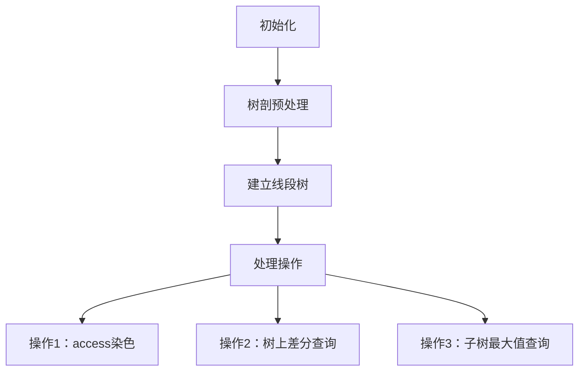
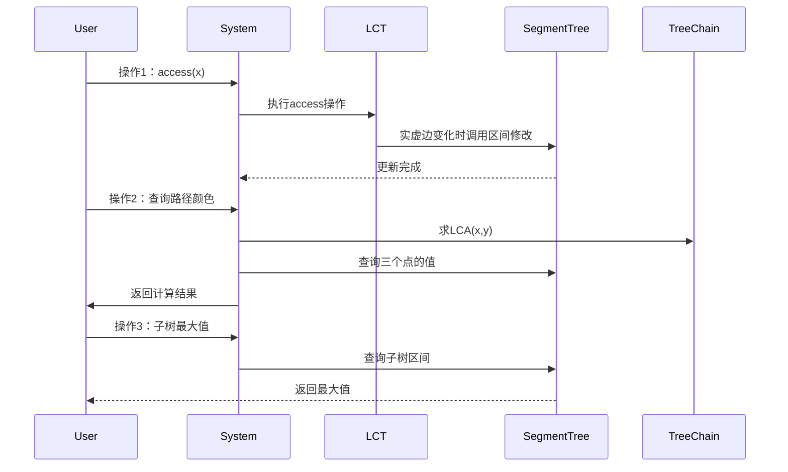

# 题目信息

# [SDOI2017] 树点涂色

## 题目描述

Bob 有一棵 $n$ 个点的有根树，其中 $1$ 号点是根节点。Bob 在每个点上涂了颜色，并且每个点上的颜色不同。

定义一条路径的权值是：这条路径上的点（包括起点和终点）共有多少种不同的颜色。

Bob可能会进行这几种操作：

- `1 x` 表示把点 $x$ 到根节点的路径上所有的点染上一种没有用过的新颜色。


- `2 x y` 求 $x$ 到 $y$ 的路径的权值。

- `3 x` 在以 $x$ 为根的子树中选择一个点，使得这个点到根节点的路径权值最大，求最大权值。


Bob一共会进行 $m$ 次操作


## 说明/提示

共 $10$ 个测试点。

测试点 $1$，$1\leq n,m\leq1000$；

测试点 $2,3$，没有 $2$ 操作；

测试点 $4,5$，没有 $3$ 操作；

测试点 $6$，树的生成方式是，对于 $i(2\leq i \leq n)$，在 $1 \sim i-1$ 中随机选一个点作为 $i$ 的父节点；

测试点 $7$，$1\leq n,m\leq 5\times 10^4$；

测试点 $8$，$1\leq n \leq 5 \times 10^4$；

测试点9,10，无特殊限制

对所有数据，$1\leq n \leq 10^5$，$1\leq m \leq 10^5$。


## 样例 #1

### 输入

```
5 6
1 2
2 3
3 4
3 5
2 4 5
3 3
1 4
2 4 5
1 5
2 4 5```

### 输出

```
3
4
2
2```

# AI分析结果


### 题目分析
#### 题目概述
本题涉及树上三种操作：
1. 将节点 `x` 到根节点的路径染成一种全新颜色
2. 查询 `x` 到 `y` 路径上的颜色种类数
3. 查询以 `x` 为根的子树中，从任意节点到根节点的最大颜色种类数

#### 核心算法：LCT + 树剖 + 线段树
通过分析题解，最优解法结合了三种数据结构：
1. **LCT（Link-Cut Tree）**：处理操作1的路径染色
2. **树链剖分**：求LCA和建立DFS序
3. **线段树**：维护子树信息（区间加减、区间最大值查询）

#### 算法框架


#### 关键步骤详解
1. **树剖预处理（DFS序）**
   - 第一次DFS：计算深度、父节点、子树大小、重儿子
   - 第二次DFS：建立DFS序、重链顶端
   - 目的：将子树操作转化为区间操作

2. **LCT的access操作**
   - 当实边变虚边：对应子树颜色数+1（`区间加1`）
   - 当虚边变实边：对应子树颜色数-1（`区间减1`）
   - 示例：从节点A到根染色时：
     ```mermaid
     graph LR
         Root --> B --> C --> A
         C --> D
     染色后：Root-B-C-A变为实边，D变为虚边
     D的子树执行+1操作
     ```

3. **查询操作**
   - 操作2公式：`val[x] + val[y] - 2*val[lca] + 1`
   - 操作3：查询子树区间最大值

#### 复杂度分析
| 操作 | 时间复杂度 | 空间复杂度 |
|------|-----------|-----------|
| 初始化 | O(n)      | O(n)      |
| 操作1 | O(log²n)  |           |
| 操作2 | O(log n)  |           |
| 操作3 | O(log n)  |           |

#### 代码实现要点
```cpp
// 树剖部分
void dfs1(int u, int father) {
    // 计算dep, fa, size, son
}

void dfs2(int u, int topf) {
    // 计算dfn, id, top
}

// 线段树部分
struct SegmentTree {
    void update_range(int l, int r, int val); // 区间加减
    int query_max(int l, int r); // 查询区间最大值
};

// LCT核心操作
void access(int x) {
    for (int y = 0; x; y = x, x = lct[x].fa) {
        splay(x);
        if (右儿子存在) 对应子树+1;
        if (y) 对应子树-1;
        lct[x].ch[1] = y;
    }
}
```

#### 可视化算法演示


#### 精炼总结
1. **核心思想**：利用LCT的access模拟染色，树剖求LCA，线段树维护子树信息
2. **优势对比**：
   - 纯树剖解法：需维护颜色段，复杂度较高
   - LCT+树剖：均摊复杂度更优，代码更简洁
3. **适用场景**：树上路径染色+子树查询问题
4. **学习价值**：
   - LCT的灵活应用（不局限于连通性维护）
   - 树剖+线段树的经典组合
   - 树上差分的转化技巧

> 提示：实际实现时需注意LCT的splay操作中要维护最浅节点（findroot），这对确定子树范围至关重要。

---
处理用时：105.80秒