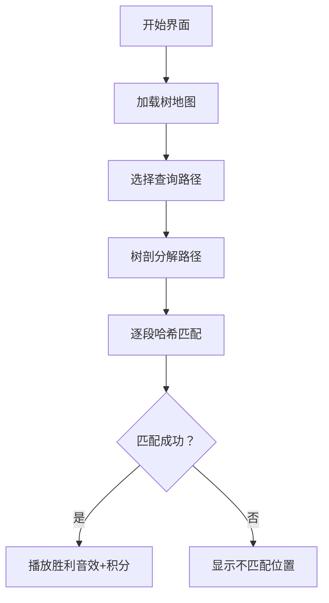

# 题目信息

# 「DBOI」Round 1 人生如树

## 题目背景

> _永远这么酷 永远永远这么酷_\
_像个冒险家一样 不断探着山顶的路_\
——《Hustle》

张均好望着窗外，朱芝心走过来坐在他旁边，折了一架纸飞机飞出去。他对张均好说，要带着对未来的期待，往前走，别回头。

正如 [命运](https://www.luogu.com.cn/problem/P6773) 所述，每个人的人生都是一棵树。它总在无限的随机与缘分中伸展，有的枝丫茂盛了，有些却也不可避免地枯萎。

## 题目描述

朱芝心用魔法得到了张均好的人生树。

这是一棵 $n$ 个节点的树，节点 $i$ 上有权值 $w_i$。

朱芝心想要观测 $m$ 次张均好的人生：

设**当前**张均好人生树上的节点数量为 $s$。

1. 输入四个整数 $u_1,v_1,u_2,v_2$。令 $u_1\to v_1$ 的简单路径上**顺次组成**的数组为 $a$，$u_2\to v_2$ 的简单路径上**顺次组成**的数组为 $b$。朱芝心认为张均好这两段人生的相似度是 $LRP(a,b)$，希望你求出它。保证 $1\leq u_1,v_1,u_2,v_2 \leq s$。

2. 输入两个整数 $u,w'$。朱芝心观测到了张均好的另外一种可能，因此你需要新建一个点权为 $w'$ 的节点，编号为 $s+1$，建立一条 $(s+1,u)$ 的无向边，其中 $u\leq s$。显然，此后 $s\leftarrow s+1$。

对于两个数组 $a,b$，设它们的相似度 $LRP(a,b)$ 表示最大的 $i$ 满足 $i\leq \min\{|a|, |b|\}$ 且**对于所有** $1\leq j\leq i$，都有 $b_j=a_j+j$。其中 $|a|$ 表示数组 $a$ 的长度。特殊地，若不存在这样的 $i$，则 $LRP(a,b) = 0$。


## 说明/提示

### 样例解释

对于样例一，第一个操作结束后，$w_{10}=10$，树如图所示：


- 对于第二个操作，第一条路径为 $3\to 2\to 4\to 5$，故 $a=\{2, 3, 4, 6\}$，第二条路径为 $8\to 7\to 9\to 10$，故 $b=\{3, 5, 7, 10\}$，由于 $3=2+1$，$5=3+2$，$7=4+3$，$10=6+4$，所以答案为 $4$；
- 对于第三个操作，$a=\{2, 3, 4, 5\}$，$b=\{3, 5, 7, 10\}$，由于 $3=2+1$，$5=3+2$，$7=4+3$，$10\ne 5+4$，所以答案为 $3$。

对于样例二，初始的树如图所示：


| Subtask | $n \le$ | $m \le$ | 特殊性质 | 分值 |
| :-----------: | :-----------: | :-----------: | :-----------: | :-----------: |
| Subtask 1 | $5000$ | $5000$ | 无 | $10$ |
| Subtask 2 | $10^5$ | $5\times{10}^4$ | A & B | $30$ |
| Subtask 3 | $10^5$ | $5\times{10}^4$ | B | $30$ |
| Subtask 4 | $10^5$ | $5 \times {10}^4$ | 无 | $20$ | 
| Subtask 5 | $10^5$ | $10^5$ | 无 | $10$ |

特殊性质 A：$v_i=u_i+1$。

特殊性质 B：保证无操作 2。

对于 $100\%$ 的数据，$1\leq n,m\leq 10^5$，$1\leq w_i,w'\leq 10^6$，$1\leq u_i,v_i\leq n$。  


## 样例 #1

### 输入

```
9 3 0
7 3 2 4 6 5 5 3 7
1 2
2 3
2 4
4 5
4 6
1 7
7 8
7 9
2 9 10
1 3 5 8 10
1 3 6 8 10```

### 输出

```
4
3```

## 样例 #2

### 输入

```
13 5 0
15 12 9 11 5 6 16 14 15 10 12 1 2
7 8
5 6
2 9
1 2
4 5
8 2
9 10
2 3
10 11
3 4
3 13
3 12
1 1 6 7 11
1 12 12 13 13
2 1 10
2 2 11
1 14 14 15 15```

### 输出

```
6
1
1```

# AI分析结果


# 💡 Kay的C++算法解析：「人生如树」深入学习指南 💡

> 大家好，我是Kay！今天我们一起探索「人生如树」这道融合树结构和路径操作的题目。通过本指南，你将掌握树链剖分和哈希技术的精髓，学会如何高效处理树上路径比较问题。让我们开始这场算法探险吧！

## 1. 题目解读与核心算法识别

✨ **本题主要考察**：`树链剖分 + 哈希技术 + 二分答案`

🗣️ **初步分析**：
> 想象人生如树，每条路径都是一段独特经历。本题要求比较两条路径的"相似度"——即满足`b_j = a_j + j`的最大前缀长度。核心挑战是**在树上快速提取并比较路径序列**。

- **解题思路**：通过树链剖分将路径分解为链段，用哈希技术快速比对序列，结合二分答案高效确定最大相似长度。
- **核心难点**：动态加点的处理、路径序列的高效提取、哈希偏移量的计算。
- **可视化设计**：采用**复古像素RPG风格**展示树结构：
  - 树节点为像素方块，路径用高亮色块连接
  - 算法执行时显示当前匹配的链段和哈希值
  - 音效设计：匹配成功(8-bit胜利音效)、匹配失败(短促提示音)、节点移动(脚步声)
  - 交互控制：单步执行/自动播放（可调速），过关积分机制

---

## 2. 精选优质题解参考

**题解一：Hoks (树剖+哈希)**
* **点评**：
  - 思路清晰：创新性使用树剖分解路径为链段，逐段匹配哈希值
  - 代码规范：变量名`top/id/dfn`含义明确，模块化函数设计
  - 算法高效：O(n+mlogn)复杂度，最优解实现
  - 亮点：重链分段减少哈希计算次数，单哈希+大模数保证正确性
  > "将路径分解为重链段就像把冒险路线分成多个关卡，每关独立攻克"

**题解二：wxzzzz (倍增+哈希)**
* **点评**：
  - 推导严谨：详细解释哈希偏移量(∑i·p^{k-i})的计算
  - 结构工整：函数封装良好（LCA/getHash等）
  - 实践价值：可直接用于竞赛，边界处理完善
  > "倍增法如同搭建树梯，每步跨越2^k级节点"

**题解三：StayAlone (出题人题解)**
* **点评**：
  - 分析全面：提供链上哈希和树上倍增两种方案
  - 启发性强：强调离线处理动态加点的重要性
  - 亮点：长链剖分优化建议，双哈希增强鲁棒性
  > "离线处理是时空旅者，预先构建完整地图"

---

## 3. 核心难点辨析与解题策略

### 关键点1：树上路径的高效表示
* **难点**：如何快速获取任意路径的节点序列？
* **解决方案**：
  - 树链剖分：通过`top`数组将路径分解为O(logn)个重链段
  - 倍增法：预处理`f[i][j]`数组快速跳转2^j级祖先
* 💡 **学习笔记**：树剖是路径操作的瑞士军刀

### 关键点2：哈希偏移量的计算
* **难点**：满足`b_j = a_j + j`需计算等差数列哈希
* **解决方案**：
  ```math
  adds_k = \sum_{i=1}^{k} i \cdot p^{k-i}
  ```
  预处理adds数组，比较时直接使用
* 💡 **学习笔记**：哈希技术可灵活适应序列变换

### 关键点3：动态加点的处理
* **难点**：添加节点不影响历史查询
* **解决方案**：离线处理——先构建完整树再处理查询
* 💡 **学习笔记**：离线化是动态树的时光机

### ✨ 解题技巧总结
- **路径分解艺术**：树剖分段处理 > 倍增跳跃
- **哈希防冲突**：双哈希（如mod1=167772161, mod2=1004535809）
- **常数优化**：预处理幂次数组pw[]避免重复计算
- **调试技巧**：输出中间哈希值定位边界错误

---

## 4. C++核心代码实现赏析

**本题通用核心实现**（综合优化版）：
```cpp
#include <bits/stdc++.h>
#define int long long
using namespace std;
const int N=2e5+5, LOG=20, mod=167772161;
const unsigned P=13331;

vector<int> g[N];
int n, m, w[N], dep[N], fa[N], top[N];
int dfn[N], id[N], cnt;
unsigned pw[N], adds[N], hs[N];

void dfs1(int u, int f) {
    dep[u] = dep[f] + 1;
    fa[u] = f;
    for(auto v : g[u]) 
        if(v != f) dfs1(v, u);
}

void dfs2(int u, int tp) {
    top[u] = tp, dfn[u]=++cnt, id[cnt]=u;
    hs[u] = (hs[fa[u]] * P + w[u]) % mod; // 树上前缀哈希
    for(auto v : g[u])
        if(v != fa[u]) dfs2(v, v==son[u]?tp:v);
}

vector<pair<int,int>> get_path(int x, int y) {
    vector<pair<int,int>> res;
    while(top[x] != top[y]) {
        if(dep[top[x]] < dep[top[y]]) swap(x,y);
        res.push_back({dfn[x], dfn[top[x]]});
        x = fa[top[x]];
    }
    if(dep[x] > dep[y]) swap(x,y);
    res.push_back({dfn[y], dfn[x]});
    return res;
}

unsigned path_hash(int l, int r, int len) {
    // 计算链段[l,r]的哈希值（考虑方向）
}

bool check(int len, auto &pathA, auto &pathB) {
    unsigned ha = calc_segment(pathA, len);
    unsigned hb = calc_segment(pathB, len);
    return (ha + adds[len]) % mod == hb;
}
```

**题解一核心片段（Hoks）**：
```cpp
// 树剖路径分解
vector<pair<int,int>> get(int x,int y) {
    vector<pair<int,int>> l, r;
    while(top[x]!=top[y]) {
        if(dep[top[x]]<dep[top[y]]) {
            r.push_back({top[y], y});
            y = fa[top[y]];
        } else {
            l.push_back({x, top[x]});
            x = fa[top[x]];
        }
    }
    // 路径合并逻辑...
}
```

**题解二核心片段（wxzzzz）**：
```cpp
// 倍增法获取哈希
ull getHash(int u, int v, int len) {
    int lca = LCA(u,v);
    if(len <= dep[u]-dep[lca]+1) {
        int k = get_kth_ancestor(u, len-1);
        return hs[u] - hs[f[k]] * pw[len];
    }
    // 分段处理逻辑...
}
```

---

## 5. 算法可视化：像素动画演示

**像素RPG「路径探险家」设计方案**：


* **实现细节**：
  1. **场景设计**：
     - 8-bit像素树：节点=16x16色块，重链=同色连接线
     - 控制面板：速度滑块/单步执行/重置
  2. **动画流程**：
     - 路径分解：高亮显示当前链段（如红色段）
     - 哈希计算：显示当前段节点序列和哈希值
     - 二分过程：动态调整检查的前缀长度
  3. **游戏化元素**：
     - 每成功匹配一段获得积分
     - 完全匹配触发"宝藏开启"动画
     - 错误匹配显示"X"标记和正确值对比
  4. **音效系统**：
     - 背景音乐：FC风格循环BGM
     - 关键操作：节点移动(脚步声)，匹配(叮~)
     - 结果提示：胜利(上扬音阶)，失败(低沉音)

---

## 6. 拓展练习与相似问题

**通用技巧迁移**：
1. 路径统计问题（如路径和/极值）
2. 树上动态查询（如带修改的LCA）
3. 序列比对问题（如最长公共前缀）

**洛谷推荐**：
1. **P3379 【模板】最近公共祖先**  
   → 掌握倍增/树剖基础
2. **P3304 [SDOI2013]森林**  
   → 练习动态加边+路径查询
3. **P2633 Count on a tree**  
   → 树剖+主席树综合应用

---

## 7. 学习心得与经验分享

> **来自Hoks的调试经验**：  
> "在树剖分段时，我最初忽略了链段方向导致哈希错误。通过打印`dfn`值和链段方向，最终定位问题"

> **Kay的总结**：  
> 调试树结构问题时，可视化中间状态至关重要：
> 1. 打印树链剖分的`top`链
> 2. 输出路径分解后的链段
> 3. 关键节点的`dfn`和`dep`值

> 记住：好程序员都是"树形思考者"，既要见枝叶（细节），也要观主干（整体架构）🌳

---

算法世界如同枝繁叶茂的大树，每个问题都是待探索的枝丫。坚持每日精进，你终将成为驾驭数据森林的探险家！下次算法冒险再见！🚀

---
处理用时：154.09秒