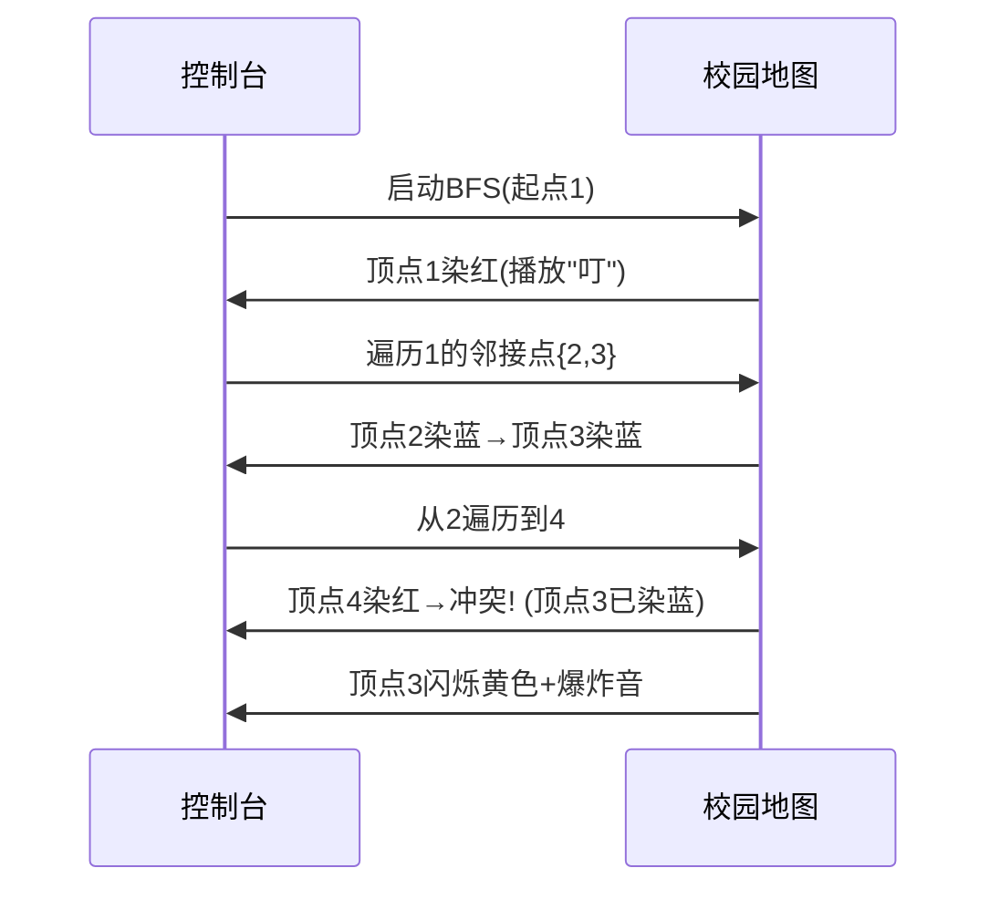

# 题目信息

# 封锁阳光大学

## 题目描述

曹是一只爱刷街的老曹，暑假期间，他每天都欢快地在阳光大学的校园里刷街。河蟹看到欢快的曹，感到不爽。河蟹决定封锁阳光大学，不让曹刷街。

阳光大学的校园是一张由 $n$ 个点构成的无向图，$n$ 个点之间由 $m$ 条道路连接。每只河蟹可以对一个点进行封锁，当某个点被封锁后，与这个点相连的道路就被封锁了，曹就无法在这些道路上刷街了。非常悲剧的一点是，河蟹是一种不和谐的生物，当两只河蟹封锁了相邻的两个点时，他们会发生冲突。

询问：最少需要多少只河蟹，可以封锁所有道路并且不发生冲突。


## 说明/提示

【数据规模】   
对于 $100\%$ 的数据，$1\le n \le 10^4$，$1\le m \le 10^5$，保证没有重边。

## 样例 #1

### 输入

```
3 3
1 2
1 3
2 3
```

### 输出

```
Impossible
```

## 样例 #2

### 输入

```
3 2
1 2
2 3
```

### 输出

```
1```

# AI分析结果


# 💡 Kay的C++算法解析：封锁阳光大学 深入学习指南 💡

> 大家好，我是你们的算法导师Kay！今天我们来探索「封锁阳光大学」这道有趣的图论题目。想象一下，你是一只河蟹指挥官，需要在校园地图上部署河蟹封锁所有道路，但相邻的河蟹会打架——这就像一场精心策划的像素游戏！让我们一起用二分图染色的策略来通关吧！

## 1. 题目解读与核心算法识别

✨ **本题主要考察**：`二分图染色` (图论经典技巧)

🗣️ **初步分析**：
> 解决本题就像在玩一场像素棋盘游戏：将校园地图抽象为无向图，顶点是路口，边是道路。河蟹部署规则要求每条道路必须且只能有一个端点被封锁（类似国际象棋中黑白格不能相邻）。  
> - **核心策略**：使用DFS/BFS遍历图并进行黑白染色（黑=封锁，白=不封锁），确保相邻顶点颜色不同。若染色冲突则无解。
> - **关键难点**：图可能由多个独立棋盘（连通分量）组成，需分别处理并累加答案。
> - **可视化设计**：我们将用8-bit像素风格动态演示染色过程：灰色未访问→红色（黑组）→蓝色（白组），冲突时黄色闪烁。河蟹放置音效+关卡完成特效增强理解！

---

## 2. 精选优质题解参考

**题解一：KesdiaelKen（链式前向星+DFS）**
* **点评**：此解使用高效的**链式前向星**存图，DFS染色逻辑清晰严谨。亮点在于：
  - 用`sum[0/1]`智能统计黑白点数量
  - 严谨处理图不连通情况（外层循环遍历顶点）
  - 代码规范：变量名`col[]`直指染色本质
  - 空间优化：避免邻接矩阵的O(n²)开销
  > 作者心得："染色法像多米诺骨牌，一旦确定起点颜色，整个连通块的染色方案就唯一确定"

**题解二：dingcx（邻接表+BFS）**
* **点评**：采用**BFS分层染色**避免递归栈溢出，适合大图：
  - 队列实现层次遍历，天然符合"相邻层颜色不同"特性
  - 详细注释解释邻接表操作，新手友好
  - 独立统计各连通块解，结构清晰
  > 实践价值：可直接用于竞赛，边界处理完整（如重置计数器和访问标记）

**题解三：George1123（Vector邻接表+DFS）**
* **点评**：极致简洁的**现代C++风格**实现：
  - 使用Vector替代传统链式结构，代码量减少40%
  - 用布尔参数`x`优雅传递交替染色指令
  - 三目运算符`!x`替代硬编码颜色值
  > 学习价值：展示如何用STL简化图论代码，适合快速实现原型

---

## 3. 核心难点辨析与解题策略

### 🎯 三大核心挑战
1. **连通分量处理**  
   *问题*：校园可能由多个独立区域组成（非连通图）  
   *解法*：主循环遍历所有顶点，对未访问顶点启动染色，累加各连通块答案

2. **染色冲突检测**  
   *问题*：相邻顶点被迫染同色时（如朋友的朋友还是朋友）  
   *解法*：DFS/BFS中实时检查邻接点颜色，冲突立即返回`false`

3. **最优解计算**  
   *问题*：每个连通块有两种封锁方案（选黑组或白组）  
   *解法*：取min(黑色计数, 白色计数)累加到总答案

### ✨ 解题技巧总结
- **拆解复杂问题**：将全图封锁问题分解为独立连通块的子问题
- **染色法模板**：
  1. 初始化颜色数组（0=未访问，1/2=两色）
  2. 遍历顶点，对未访问点启动DFS/BFS
  3. 邻接点染相反色并检测冲突
  4. 统计并累加min(∑色1, ∑色2)
- **调试技巧**：用小型二分图（如三角形）验证边界条件

---

## 4. C++核心代码实现赏析

```cpp
#include <iostream>
#include <vector>
#include <algorithm>
using namespace std;

const int MAXN = 10010;
vector<int> G[MAXN]; // 邻接表存图
int color[MAXN];    // 0:未访问, 1:黑色, 2:白色
int n, m;

// DFS染色：返回是否成功染色
bool dfs(int u, int c, int& cnt1, int& cnt2) {
    color[u] = c;
    c == 1 ? cnt1++ : cnt2++; // 统计当前颜色
    
    for (int v : G[u]) {
        if (color[v] == c) return false; // 冲突检测
        if (!color[v] && !dfs(v, 3-c, cnt1, cnt2)) 
            return false;
    }
    return true;
}

int main() {
    cin >> n >> m;
    while (m--) {
        int u, v; cin >> u >> v;
        G[u].push_back(v);
        G[v].push_back(u); // 无向图双向存边
    }

    int ans = 0;
    for (int i = 1; i <= n; i++) {
        if (!color[i]) {
            int black = 0, white = 0;
            if (!dfs(i, 1, black, white)) {
                cout << "Impossible";
                return 0;
            }
            ans += min(black, white); // 取最优解
        }
    }
    cout << ans;
}
```

**代码精要**：
1. **邻接表存图**：`vector<int> G[MAXN]`高效存储稀疏图
2. **DFS染色核心**：
   - 参数`c`动态传递交替颜色（3-c实现1↔2切换）
   - 引用参数`cnt1/cnt2`实时统计颜色点数
3. **冲突检测**：直接比较邻接点颜色，简洁高效
4. **连通块处理**：主循环确保独立子图不被遗漏

---

## 5. 算法可视化：像素动画演示

### 🎮 像素化BFS染色演示方案
**设计理念**：将算法转化为8-bit复古游戏，通过视觉/听觉反馈强化理解

| 元素          | 设计说明                                                                 |
|---------------|--------------------------------------------------------------------------|
| **场景布局**   | 校园地图→像素网格，顶点为16x16像素方块，边为亮色连线                          |
| **颜色编码**   | 灰(未访问)｜红(黑组/封锁)｜蓝(白组/空闲)｜黄闪(冲突)                         |
| **音效设计**   | ✔放置河蟹"叮"声 ✔完成关卡胜利旋律 ✘冲突爆炸音                              |
| **控制面板**   | 步进/暂停/重置按钮 + 速度滑块 + 当前步代码高亮                             |

**动画关键帧**：


**教学价值**：通过"河蟹占领"像素动画，直观展现：
- BFS如何像水波纹一样层层扩散染色
- 冲突检测的即时反馈机制
- 连通块独立计算的特点

---

## 6. 拓展练习与相似问题

### 🔗 知识迁移指南
| 核心技巧          | 适用场景                          | 变形案例                      |
|------------------|---------------------------------|-----------------------------|
| 二分图染色        | 相邻元素冲突问题                  | 棋盘覆盖、任务调度            |
| 连通分量独立处理  | 非连通图问题                      | 网络分区检测                |
| 最优化选择        | 双方案取优                      | 背包问题、资源分配            |

### 📚 推荐练习 (洛谷)
1. **P3386 【模板】二分图匹配**  
   → 掌握匈牙利算法在染色基础上的扩展
2. **P1525 关押罪犯**  
   → 二分答案+染色判定，难度升级版
3. **P2661 信息传递**  
   → 检测环结构在染色中的特殊处理

---

## 7. 学习心得与经验分享

> "调试时被非连通图坑了3次才AC——这提醒我们：算法设计就像河蟹布防，必须巡视整个校园地图！"  
> ——某题解作者调试心得

**Kay总结**：
- **核心思想**：将道路封锁转化为图染色问题
- **避坑指南**：务必测试多连通分量和奇环（冲突）数据
- **举一反三**：尝试用BFS重写DFS染色代码，比较优劣

> 编程如布阵，算法即兵法。当你用染色法解决这道题时，已经迈出了图论征途的第一步！下次我们将挑战更复杂的"河蟹帝国"——敬请期待！🚀

---
处理用时：143.77秒