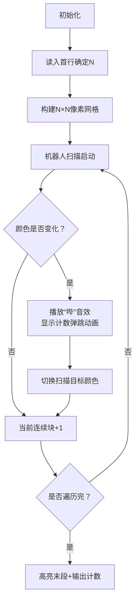

# 题目信息

# 压缩技术（续集版）

## 题目描述

设某汉字由 $N \times N$ 的 $\texttt 0$ 和 $\texttt 1$ 的点阵图案组成。

我们依照以下规则生成压缩码。连续一组数值：从汉字点阵图案的第一行第一个符号开始计算，按书写顺序从左到右，由上至下。第一个数表示连续有几个 $\texttt 0$，第二个数表示接下来连续有几个 $\texttt 1$，第三个数再接下来连续有几个 $\texttt 0$，第四个数接着连续几个 $\texttt 1$，以此类推……

例如: 以下汉字点阵图案：

```
0001000
0001000
0001111
0001000
0001000
0001000
1111111
```

对应的压缩码是： $\texttt {7 3 1 6 1 6 4 3 1 6 1 6 1 3 7}$ （第一个数是 $N$ ,其余各位表示交替表示0和1 的个数，压缩码保证 $N \times N=$ 交替的各位数之和）


## 说明/提示

数据保证，$3\leq N\leq 200$。

## 样例 #1

### 输入

```
0001000
0001000
0001111
0001000
0001000
0001000
1111111
```

### 输出

```
7 3 1 6 1 6 4 3 1 6 1 6 1 3 7```

# AI分析结果


### 💡 Kay的C++算法解析：压缩技术（续集版） 深入学习指南 💡

**引言**  
今天我们来分析“压缩技术（续集版）”这道C++编程题。本指南将帮助你掌握矩阵压缩的核心逻辑，理解模拟算法的实现技巧，并通过像素动画直观感受算法流程。

---

## 1. 题目解读与核心算法识别

✨ **本题主要考察**：`模拟应用`

🗣️ **初步分析**：  
> 这道题就像在玩一款“像素扫描”游戏：想象你是一个8位游戏中的扫描机器人，从左到右、从上到下遍历由0/1组成的像素矩阵。每当遇到颜色变化（0→1或1→0），就记录当前连续相同颜色的像素块长度。  
> - **核心思路**：顺序遍历矩阵，动态统计连续相同字符的数量并在字符变化时输出计数。关键难点在于处理起始字符（若首字符是1需先输出0）和边界统计（最后一段需在循环外输出）。  
> - **可视化设计**：将用复古像素网格展示扫描过程，当前统计的连续块高亮闪烁，字符切换时触发“哔”音效，输出计数时显示8位数字弹跳动画。自动演示模式像经典游戏《吃豆人》般自动遍历矩阵。

---

## 2. 精选优质题解参考

**题解一（作者：volatile）**  
* **点评**：  
  思路清晰直白——先将所有行拼接成字符串再遍历。亮点在于完美处理边界：首字符特判（`if(b[0]!='0')`）和循环外补末段计数（`cout<<t`）。代码简洁规范（变量`t`含义明确），时间复杂度O(N²)已达最优。调试提示“循环结束后补输出”极具实践价值。

**题解二（作者：_ArenaBreakout114514）**  
* **点评**：  
  采用二维数组逐行存储，通过`ysm`变量动态切换统计目标（0/1）。亮点是优雅处理首字符问题：初始化`ysm='0'`，若首字符是1则自然输出0。双重循环结构易理解，但空间复杂度略高于解法一。

**题解三（作者：cse071549）**  
* **点评**：  
  创新使用数组存储各段长度最后统一输出。亮点是数学思维：通过字符总数`sum`反推矩阵尺寸（`sqrt(sum)`）。`last`变量跟踪前值的设计简洁高效，注释提醒“全WA查首字符”体现实战经验。

---

## 3. 核心难点辨析与解题策略

1. **起始字符处理**  
   * **分析**：若首字符是1，需先输出0（表示0个0）。优质解法通过`if(b[0]!='0')`或初始化统计目标为0解决。  
   * 💡 **学习笔记**：起始状态决定输出序列的奇偶性——首段永远是0的个数。

2. **连续块统计技巧**  
   * **分析**：用`t`计数时，比较当前与前一个字符（`b[i]`和`b[i-1]`）。若相同则`t++`，否则输出`t`并重置为1。  
   * 💡 **学习笔记**：`t`初始值应为1而非0——当前字符已是新段的开始。

3. **边界处理与输出**  
   * **分析**：循环结束后需补输出末段计数（易遗漏！）。解法一、三显式输出，解法二通过循环范围自然覆盖。  
   * 💡 **学习笔记**：遍历结束时必然剩一段未输出，这是模拟类题目的常见陷阱。

### ✨ 解题技巧总结
- **技巧A：输入优化** – 单字符串存储整个矩阵（`b+=a`），避免二维数组遍历  
- **技巧B：状态机思维** – 用`last`或`ysm`变量标记当前统计目标（0/1）  
- **技巧C：边界预演** – 手动模拟N=3的极端案例（如全0/全1/交替矩阵）验证逻辑  

---

## 4. C++核心代码实现赏析

**通用核心实现参考**  
```cpp
#include <iostream>
#include <string>
using namespace std;

int main() {
    string a, b;
    cin >> a;
    b = a;
    int n = a.size();
    while (cin >> a) b += a; // 拼接所有行
    
    cout << n << " ";        // 输出矩阵尺寸
    if (b[0] == '1') cout << "0 "; // 首字符特判
    
    int cnt = 1;
    for (int i = 1; i < n*n; i++) {
        if (b[i] == b[i-1]) cnt++;
        else {
            cout << cnt << " ";
            cnt = 1; // 重置计数器
        }
    }
    cout << cnt; // 输出最后一段
    return 0;
}
```
* **说明**：综合优质题解的最简实现，包含关键处理：矩阵拼接、首字符特判、连续统计及边界输出。  
* **代码解读概要**：  
  1. 读入首行获取矩阵尺寸`n`  
  2. 拼接所有行到`b`实现线性遍历  
  3. 首字符为'1'时输出"0 "（压缩码首段为0的个数）  
  4. 遍历统计连续相同字符，变化时输出计数  
  5. 循环外补输出末段计数  

---

**题解一核心代码片段**  
```cpp
if(b[0]!='0') cout<<"0 ";  // 首字符特判
for(int i=1; i<n*n; i++){
    if(b[i]==b[i-1]) t++;  // 连续相同则计数+1
    else {
        cout<<t<<" ";      // 变化时输出计数
        t=1;               // 重置计数器
    }
}
cout<<t;                   // 输出末段
```
* **亮点**：边界处理完整，代码如流水般自然  
* **代码解读**：  
  > 首字符特判是点睛之笔——当`b[0]`不是'0'（必为'1'），需先输出0表示0个0。  
  > 循环从`i=1`开始，始终比较`b[i]`和`b[i-1]`，如同两人并排行进观察前方是否变色。  
  > **学习笔记**：`t`的生命周期贯穿整个遍历，最后需单独输出——像接力赛最后一棒需单独计时。  

**题解二核心代码片段**  
```cpp
char ysm='0';       // 初始化统计目标为0
for(int i=0; i<n; i++){
    for(int j=0; j<n; j++){
        if(dzt[i][j]==ysm) js++; // 匹配则计数
        else {
            cout<<js<<" ";       // 输出当前段
            ysm = (ysm=='0')?'1':'0'; // 切换目标
            js=1;                // 重置计数器
        }
    }
}
```
* **亮点**：通过`ysm`动态切换统计目标，避免首字符特判  
* **代码解读**：  
  > `ysm`如同变色镜片：初始过滤0（统计0的个数），遇到1时切换镜片颜色（改统计1）。  
  > 双层循环保留行列信息，适合需要坐标的场景（如后续扩展图形分析）。  
  > **学习笔记**：`ysm^=1`可优化切换逻辑——字符本质是ASCII码，异或1实现'0'/'1'互换。  

**题解三核心代码片段**  
```cpp
sum += p;           // 累计字符总数
k[++cnt]=p;         // 存储当前段长度
if(a!=last) {       // 字符变化时
    p=0;            // 重置计数器
    last=a;         // 更新前值
}
p++;                // 计数+1
```
* **亮点**：用数组存储各段长度，最后统一输出  
* **代码解读**：  
  > 通过`last`保存前值，如同记住上一个像素点的颜色。当前后颜色不同时，将计数器`p`存入数组`k`。  
  > **学习笔记**：`sum`累加所有段长度，最终`sqrt(sum)`得矩阵尺寸——数学思维提升代码灵活性。  

---

## 5. 算法可视化：像素动画演示

**动画主题**：`《像素扫描者：数据压缩大冒险》`（8-bit风格）  
**核心演示**：扫描机器人遍历0/1像素矩阵，实时统计连续块并生成压缩码  

### 设计框架


### 关键交互设计
1. **像素网格渲染**  
   - 复古绿色调CRT显示器风格，0=黑色像素块，1=白色像素块  
   - 当前统计块用黄色边框高亮，机器人位置显示为红色◆

2. **动态效果与音效**  
   ```javascript
   // 伪代码：扫描逻辑
   let currentChar = grid[0][0];
   let count = 1;
   for (let i=0; i<N; i++){
     for (let j=0; j<N; j++){
       绘制高亮方块(i, j, YELLOW); // 当前扫描位置
       if (grid[i][j] !== currentChar) {
         播放音效("beep.wav"); 
         显示弹跳数字(count);     // 8位字体弹跳动画
         currentChar ^= 1;        // 切换0/1
         count = 1;               // 重置计数器
       } else count++;
       暂停(300ms);               // 可控速度
     }
   }
   显示弹跳数字(count);           // 末段输出
   播放胜利音效();                // 压缩完成
   ```

3. **游戏化元素**  
   - **关卡设计**：每关对应不同测试数据（全0/棋盘格/随机矩阵）  
   - **评分系统**：根据压缩码长度（越短分越高）授予“压缩大师”称号  
   - **AI演示模式**：自动以最优速度扫描，如同经典游戏《吃豆人》幽灵巡逻  

---

## 6. 拓展练习与相似问题思考

### 通用技巧迁移
连续统计模式还可应用于：
1. 图像游程编码（RLE）  
2. 基因组序列分析（如统计连续碱基）  
3. 传感器信号处理（捕捉连续高/低电平）  

### 洛谷推荐练习
1. **P1319 压缩技术**  
   🗣️ *推荐理由*：本题的原型，帮助掌握交替统计的基本框架。  

2. **P2550 彩票摇奖**  
   🗣️ *推荐理由*：强化连续匹配的统计思维，引入多组数据比较。  

3. **P5731 蛇形方阵**  
   🗣️ *推荐理由*：进阶模拟题，训练坐标遍历与状态切换能力。  

---

## 7. 学习心得与经验分享

**参考经验（来自 volatile & cse071549）**：  
> “循环结束后补输出末段计数”、“全WA时检查首字符是否为1”  

**点评**：  
> 这两位作者的调试经验直击模拟类题目的核心痛点——边界处理。如同赛车手提醒“最后一圈最易失误”，编程中首尾位置需特别关注。建议：  
> 1. 用`N=3`全1矩阵`["111","111","111"]`快速验证首字符处理  
> 2. 结束时检查是否输出末段——想象扫描机器人需在终点报告最后一段像素  

---

**结语**  
通过本次分析，我们掌握了矩阵压缩的模拟技巧与边界处理方法。记住：好的代码像8位游戏一样简洁有力——每个变量都是像素点，每行逻辑都是扫描线。下次遇到类似问题，不妨想象自己操作着复古扫描机器人！🚀

---
处理用时：142.49秒