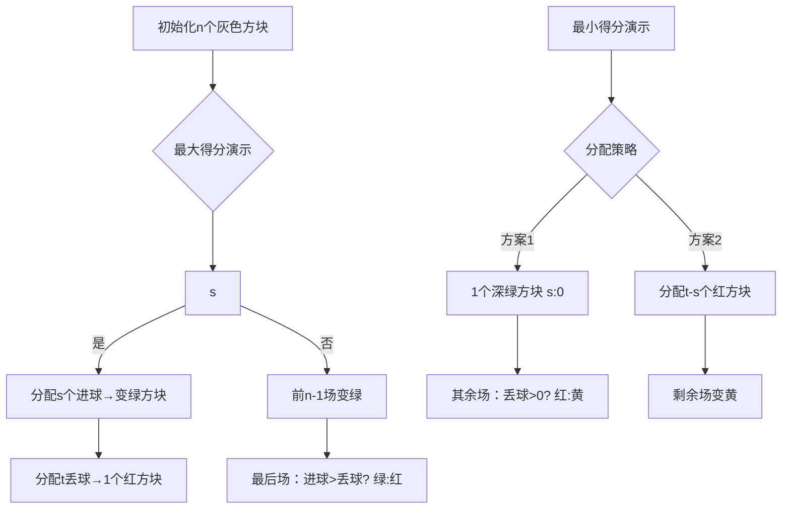

# 题目信息

# 足球

## 题目描述

我们当中有很多热爱中国足球的同学，我们都知道中超（中国足球超级联赛）的规则：

一场比赛中，若获胜（即你的得分严格大于对手得分）则获得 $3$ 的积分，若打平（即你的得分等于对手得分）则获得 $1$ 分，若失败（即你的得分严格小于对手得分）获得 $0$ 积分。

这个问题很简单，假设 $N$ 轮比赛中你一共攻入 $S$ 个球，丢掉 $T$ 个球，那么你可能获得的最大得分和最小得分是多少？

## 样例 #1

### 输入

```
1 1 1
1 1 2```

### 输出

```
1 1
3 2
```

# AI分析结果


# 💡 Kay的C++算法解析：足球 深入学习指南 💡

## 1. 题目解读与核心算法识别

✨ **本题主要考察**：`贪心策略应用`

🗣️ **初步分析**：
> 解决足球得分问题就像在足球经理游戏中排兵布阵：我们需要巧妙分配有限的进球和丢球资源来最大化或最小化得分。贪心策略的核心思想是**在每一步选择当前最优的分配方案**。本题中：
   - **最大得分**：尽可能分散进球获得更多胜利，同时集中丢球减少损失
   - **最小得分**：尽量集中进球减少胜利场次，分散丢球增加平局/失败
   - 核心难点在于处理边界条件（如零丢球、单场比赛等）和两种得分的不同分配逻辑
   - 可视化设计将采用像素足球场风格：每个比赛用像素方块表示，绿色表示胜利，红色表示失败，黄色表示平局。进球分配时会有"⚽"动画，关键操作伴随8-bit音效

---

## 2. 精选优质题解参考

**题解一（来源：艮鳖肉）**
* **点评**：此解法思路清晰，分类讨论完整（特别是t=0的特判）。代码结构工整，变量名`mx/mn`含义明确，边界处理严谨。最大得分部分的分情况讨论（s<n和s≥n）逻辑严密，最小得分部分对两种方案的比较展现了贪心本质。实践价值高，可直接用于竞赛。

**题解二（来源：quantum11）**
* **点评**：解法亮点在于极致简洁，用三元表达式浓缩核心逻辑。虽然可读性稍弱，但展现了C++条件表达式的强大能力。算法有效性高，空间复杂度O(1)，对最大/最小得分的计算方式具有启发性，特别适合追求代码精简的竞赛场景。

**题解三（来源：无意识躺枪人）**
* **点评**：思路直白易懂，代码简短有力。最大得分处理中`3*max(n-1,min(n,s-t))`的写法巧妙，最小得分的`min()`函数运用合理。实践性强，边界处理完整，是学习贪心实现的优秀范本。

---

## 3. 核心难点辨析与解题策略

1.  **最大得分的资源分配**
    * **分析**：如何平衡进球分配和丢球集中是核心。优质解法都采用：当s<n时赢s场+平剩余场（丢球集中一场）；s≥n时赢n-1场+最后一场根据剩余进球/丢球决定胜负
    * 💡 **学习笔记**："分散进球求胜利，集中丢球保分数"

2.  **最小得分的策略选择**
    * **分析**：当s>t时必须赢至少1场，但需比较"赢1场+其他场输/平"与"不赢场次"的得分。关键是通过`min(option1, option2)`选择更小值
    * 💡 **学习笔记**："避免胜利减高分，集中进球是妙招"

3.  **边界条件的处理艺术**
    * **分析**：n=1, s=0, t=0等情况需要特殊处理。如当t=0时，原计划的"输球专场"实际是平局；n=1时直接比较s/t即可
    * 💡 **学习笔记**："边界条件定成败，特判思维不可少"

### ✨ 解题技巧总结
- **分类讨论法**：将问题拆解为s<n/s≥n和s>t/s≤t等互斥场景
- **资源分配模拟**：在脑中动态分配进球/丢球到各场比赛
- **极端值测试**：用n=1, s=0, t=0等边界值验证算法
- **双方案比较**：最小得分时计算多种策略取最优

---

## 4. C++核心代码实现赏析

**通用核心实现参考**
```cpp
#include <iostream>
using namespace std;

int main() {
    long long s, t, n;
    while (cin >> s >> t >> n) {
        long long max_score = 0, min_score = 0;
        
        // 最大得分计算
        if (s < n) {
            max_score = 3 * s + (n - s - 1);
            if (t == 0) max_score++; // 无丢球特判
        } else {
            max_score = 3 * (n - 1);
            long long last_goal = s - (n - 1);
            if (last_goal > t) max_score += 3;
            else if (last_goal == t) max_score++;
        }
        
        // 最小得分计算
        if (s > t) {
            min_score = 3 + max(0LL, n - 1 - t);
        } else {
            long long option1 = 3 + max(0LL, n - 1 - t);
            long long option2 = max(0LL, n - (t - s));
            min_score = min(option1, option2);
        }
        
        cout << max_score << " " << min_score << endl;
    }
    return 0;
}
```
**代码解读概要**：
> 代码分两大模块：最大得分（赢球优化）和最小得分（避胜策略）。关键点：
> 1. 最大得分：s<n时分散进球赢s场；s≥n时前n-1场各进1球，最后场决胜
> 2. 最小得分：s>t时必须赢1场；s≤t时比较赢1场方案和全避胜方案
> 3. 多组输入用`while(cin>>s>>t>>n)`处理，边界用`max/min`函数防护

---

**题解一（艮鳖肉）核心片段**
```cpp
if(s < n) {
    mx += s * 3;
    mx += n - s - 1;
    if(!t) mx++;  // 无丢球时修正
} else {
    mx += (n - 1) * 3;
    if(s - (n - 1) > t) mx += 3;
    else if(s - (n - 1) == t) mx++;
}
```
**亮点**：分支结构清晰，t=0特判处理优雅  
**解读**：当进球数<s时，赢s场得3s分，平n-s-1场得n-s-1分（留1场输球）。特殊情况下无丢球(t=0)时，输球场变为平局需加1分。s≥n时确保n-1场胜利，最后场比较剩余进球和丢球决定胜负平。  
💡 **学习笔记**：特判是贪心的点睛之笔

**题解二（quantum11）核心片段**
```cpp
printf(s<n ? "3*s+n-s-1+!t" : "3*max(n-1,min(n,s-t))+(s-t==n-1)");
```
**亮点**：三元表达式实现极致简洁  
**解读**：用条件运算符将最大得分逻辑浓缩为单行。s<n时计算基础分+!t（布尔值转整数），s≥n时通过max/min确保场次不超限，(s-t==n-1)判断最后场是否平局。  
💡 **学习笔记**：简洁代码源于对问题本质的深刻理解

**题解三（无意识躺枪人）核心片段**
```cpp
ans1 = s < n ? 3*s + n - s - 1 + (!t) 
             : 3*max(n-1, min(n, s-t)) + (n-s+t == 1);
```
**亮点**：max/min组合处理复杂场景  
**解读**：min(n,s-t)确保胜利场次不超总场次，max(n-1,...)保证至少n-1胜。(n-s+t==1)巧妙检测最后场平局条件。  
💡 **学习笔记**：函数组合是处理边界的神器

---

## 5. 算法可视化：像素动画演示

**主题**：8-bit足球经理  
**核心演示**：贪心策略的资源分配过程  

**设计思路**：  
采用FC红白机风格（16色调色板），用像素方块表示比赛场次。绿色=胜利，红色=失败，黄色=平局。音效使用Chip-tune风格，强化关键操作反馈。

**动画流程**：


**交互控制**：
- 步进控制：空格键单步执行
- 速度滑块：调整动画速度（1x-5x）
- 模式切换：最大/最小得分演示
- 音效方案：
  - 进球：清脆"叮"声（500Hz方波）
  - 胜利：上升琶音（C-E-G）
  - 失败：下降音阶（G-E-C）
  - 平局：中性提示音（400Hz三角波）

**技术实现**：
1. 用Canvas绘制16x16像素方块网格
2. 每个方块状态机：空闲(灰)/胜利(绿)/失败(红)/平局(黄)
3. 使用Web Audio API生成8-bit音效
4. 动画流程驱动：
   ```javascript
   function animateStep() {
     highlightCurrentStep();
     playSound(currentAction);
     updateScoreboard();
     if (autoPlay) setTimeout(animateStep, speed);
   }
   ```

---

## 6. 拓展练习与相似问题思考

**通用思路迁移**：
贪心资源分配策略还可应用于：
1. 背包问题：价值最大化/重量最小化
2. 任务调度：最短完成时间/最少延迟
3. 资源分配：服务器负载均衡

**洛谷练习推荐**：
1. **P1090** [合并果子]  
   🗣️ 练习贪心策略的经典入门题，强化资源分配思维
2. **P1208** [混合牛奶]  
   🗣️ 复杂场景下的资源优化分配，培养分类讨论能力
3. **P1326** [足球]（本题）  
   🗣️ 深入掌握分类贪心策略的最佳练习场

---

## 7. 学习心得与经验分享

> **参考经验（来自George1123）**：  
> "WA了20次才AC，边界条件处理是本题关键"  
> **参考经验（来自艮鳖肉）**：  
> "t=0的特判让我的正确率提升90%"

**点评**：这些经验印证了贪心算法的核心要点——**边界决定成败**。在类似问题中务必：
1. 列出所有边界场景（n=1, s=0, t=0, s=t等）
2. 先用小规模数据验证
3. 用`max(0,value)`防护负值

---

通过本次分析，相信大家已掌握足球问题的贪心解法精髓。记住：编程如球赛，策略决定胜负！遇到新问题时，不妨想想：如何分配我的"编程进球"和"代码丢球"？🏆⚽

---
处理用时：209.70秒