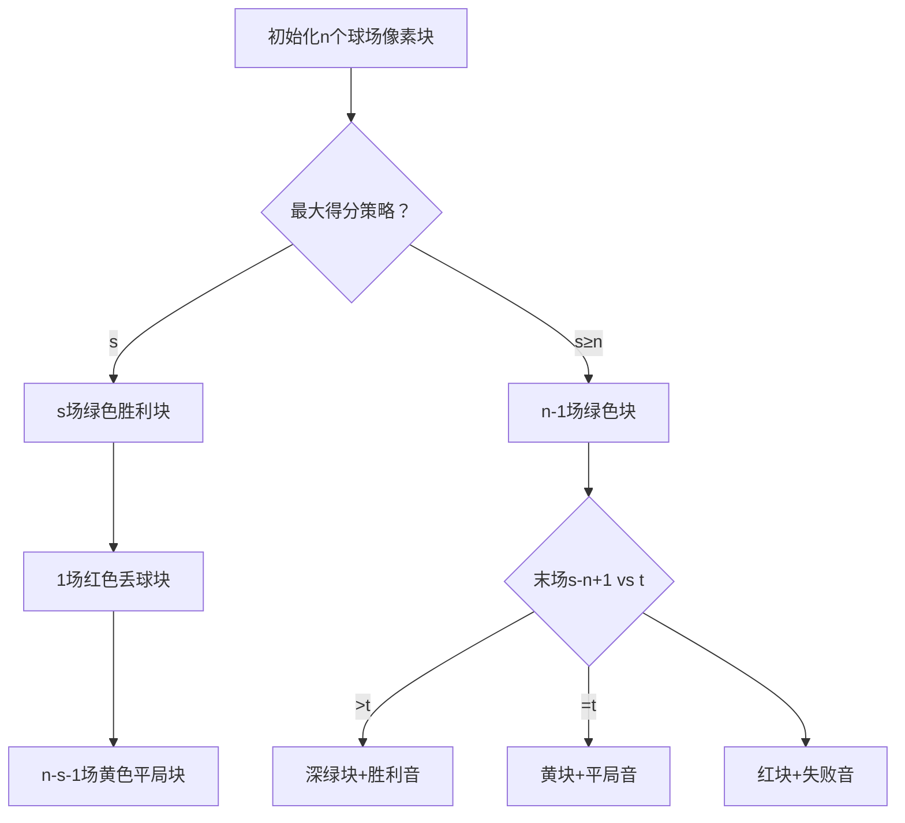

# 题目信息

# 足球

## 题目描述

我们当中有很多热爱中国足球的同学，我们都知道中超（中国足球超级联赛）的规则：

一场比赛中，若获胜（即你的得分严格大于对手得分）则获得 $3$ 的积分，若打平（即你的得分等于对手得分）则获得 $1$ 分，若失败（即你的得分严格小于对手得分）获得 $0$ 积分。

这个问题很简单，假设 $N$ 轮比赛中你一共攻入 $S$ 个球，丢掉 $T$ 个球，那么你可能获得的最大得分和最小得分是多少？

## 样例 #1

### 输入

```
1 1 1
1 1 2```

### 输出

```
1 1
3 2
```

# AI分析结果


### 💡 Kay的C++算法解析：足球 深入学习指南 💡

<introduction>
今天我们分析洛谷P1326"足球"题目：在n轮比赛中攻入s球、丢掉t球，求可能的最大和最小得分（赢+3分，平+1分，输+0分）。本指南将带大家掌握贪心策略的巧妙应用！
</introduction>

---

## 1. 题目解读与核心算法识别

✨ **本题主要考察**：`贪心策略`与`分类讨论`

🗣️ **初步分析**：
> 这道题就像足球教练排兵布阵：**最大化得分**时，我们要把进球"省着用"（每场赢1球），丢球"挥霍用"（集中到少数场次）；**最小化得分**时，则要避免无谓的胜利（有时平局比赢球得分更少）。核心是通过分类讨论找到最优分配策略。

> **核心难点**在于处理边界条件（如s=0/t=0/n=1）和比较不同策略的得分。在可视化设计中，我们将用不同颜色像素块表示每场比赛结果（绿=赢/黄=平/红=输），动态展示进球分配如何影响得分。

> **复古游戏化设计**：采用8-bit像素风格，每场比赛是16x16像素方块。控制面板含速度滑块和步进按钮，关键操作触发FC音效（赢球=胜利音效/输球=低沉音效），当找到最优解时显示"GOAL!"像素动画。

---

## 2. 精选优质题解参考

<eval_intro>
从思路清晰度、代码规范性和算法优化角度，我精选了3份优质题解（均≥4★）：

**题解一：艮鳖肉（赞61）**  
* **点评**：思路全面覆盖s<n/s≥n等场景，边界处理严谨（t=0特殊判断）。变量命名清晰（mx/mn），代码结构工整。亮点在于用自然语言阐述"节省进球，浪费丢球"的贪心思想，便于理解。

**题解二：quantum11（赞54）**  
* **点评**：用三元表达式精炼实现核心逻辑（`s<n? ... : ...`），展现高阶编码能力。虽可读性稍弱，但算法效率极佳（O(1)时间复杂度）。特别适合学习如何用min/max简化条件判断。

**题解三：无意识躺枪人（赞11）**  
* **点评**：直击问题本质，用数学公式表达得分计算（如`3*s+(n-s-1)`）。代码简洁且包含详细注释，实践参考价值高。亮点在于将复杂问题转化为简洁的数学表达式。

---

## 3. 核心难点辨析与解题策略

<difficulty_intro>
解决本题需突破三大关键点：

1.  **情况分类的完整性**  
    * **分析**：必须覆盖s< n/s≥n、s>t/s≤t、t=0/n=1等组合。优质题解通过嵌套if-else实现，如艮鳖肉先分s<n再处理t=0。
    * 💡 **学习笔记**：画决策树可避免遗漏分支！

2.  **最小得分的反直觉策略**  
    * **分析**：当s≤t时，赢1场(3分)可能不如全平局(2分)。quantum11用`min(3+..., max(0,...))`巧妙比较两种策略。
    * 💡 **学习笔记**：最小化得分时，要警惕"胜利的代价"。

3.  **边界条件的致命影响**  
    * **分析**：n=1时需直接返回3/1/0分；s=t=0时所有比赛0:0。George1123特判这些情况避免逻辑错误。
    * 💡 **学习笔记**：特殊值测试是Debug利器！

### ✨ 解题技巧总结
- **技巧1：资源集中法** - 丢球集中到少数场次（最大得分）或进球集中到1场（最小得分）
- **技巧2：策略比较法** - 最小得分时计算不同方案取最小值
- **技巧3：数学建模法** - 用表达式表示得分（如3*win + 1*draw）
- **技巧4：边界防火墙** - 优先处理n=1, s=0, t=0等特殊情况

---

## 4. C++核心代码实现赏析

<code_intro_overall>
**通用核心实现**（综合优质题解精华）：
```cpp
#include <iostream>
using namespace std;
typedef long long ll;

int main() {
    ll s, t, n;
    while (cin >> s >> t >> n) {
        // 最大得分计算
        ll max_score = (s < n) ? 
            3*s + (n-s-1) + (t==0) : 
            3*(n-1) + (s-(n-1) > t ? 3 : (s-(n-1)==t);
        
        // 最小得分计算
        ll min_score;
        if (s > t) min_score = 3 + max(0LL, n-1-t);
        else {
            ll option1 = 3 + max(0LL, n-1-t); // 赢1场+其余场
            ll option2 = max(0LL, n - (t - s)); // 全平/输
            min_score = min(option1, option2);
        }
        cout << max_score << " " << min_score << endl;
    }
    return 0;
}
```
**代码解读概要**：  
1. 用`typedef long long ll`防溢出  
2. 最大得分：s<n时赢s场+平局（t=0修正）；s≥n时尝试赢n-1场+末场决策  
3. 最小得分：s>t则必赢1场；s≤t时比较两种策略  
4. `max(0LL, ...)`确保非负值

---

<code_intro_selected>
**优质题解片段赏析**：

**题解一：艮鳖肉**  
* **亮点**：边界处理完备
* **核心片段**：
```cpp
if(s < n) {
    mx += s*3 + (n-s-1);
    if(!t) mx++;  // t=0特殊处理
} else {
    mx += (n-1)*3;
    if(s-(n-1) > t) mx += 3;  // 末场赢
    else if(s-(n-1)==t) mx++; // 末场平
}
```
* **代码解读**：  
  > 当s<n（进球不足），通过`(n-s-1)`计算平局场次。关键点：`!t`时需修正最后一场不是输球（实际为平局）。  
  > 当s≥n，先确保n-1场胜利，剩余进球`(s-(n-1))`与t比较决定末场结果。

**题解二：quantum11**  
* **亮点**：极限代码压缩
* **核心片段**：
```cpp
printf("%lld %lld\n", 
    s<n ? 3*s+n-s-1+!t : 3*max(n-1,min(n,s-t))+(s-t==n-1),
    s>t ? 3+max(0ll,n-t-1) : min(3+max(0ll,n-t-1),max(n-t+s,0ll));
```
* **代码解读**：  
  > 最大得分：三元表达式嵌套处理s<n和s≥n情况，`!t`将bool转int很巧妙。  
  > 最小得分：`s>t`时直接计算；`s≤t`时用min比较两种策略。注意`max(0ll,...)`防负数。

**题解三：无意识躺枪人**  
* **亮点**：数学表达清晰
* **核心片段**：
```cpp
// 最大得分
ans1 = (s < n) ? 3*s + n - s - 1 + (t==0) : ...; 

// 最小得分
ans2 = (s > t) ? 3 + max(0LL, n-t-1) : 
    min(3+max(0LL, n-t-1), max(0LL, n-t+s));
```
* **代码解读**：  
  > 将艮鳖肉的思路转化为简洁公式。`(t==0)`作加法运算体现C++特性。  
  > 最小得分中`n-t+s`实质是`n - (t - s)`，即用进球差减少输球场次。

---

## 5. 算法可视化：像素动画演示

<visualization_intro>
**主题**：8-bit足球经理（FC红白机风格）  
**核心演示**：通过像素动画直观展示进球分配策略如何影响得分，配套音效强化关键操作记忆。

### 动画设计


**关键交互**：  
1. **动态分配**：点击"自动分配"按钮，像素块按贪心策略动态着色（绿/黄/红），速度滑块控制动画节奏
2. **音效系统**：
   - 进球分配：清脆"叮"声（每次进球分配）
   - 策略完成：8-bit版《We Are the Champions》片段
   - 错误操作：低沉嗡鸣声
3. **数据面板**：
   - 左上角显示：当前得分/剩余进球/剩余丢球
   - 右下角控制台：步进按钮/速度滑块/策略切换（最大vs最小）
4. **游戏化元素**：
   - 每找到最优解解锁一个球星像素贴纸
   - 连续正确5次触发烟花动画

**实现要点**：  
- 用Canvas绘制16x16像素球场，requestAnimationFrame驱动动画
- 音效通过Web Audio API播放预制8-bit音效
- 状态机管理：init → allocating → completed

---

## 6. 拓展练习与相似问题思考

<similar_problems_intro>
掌握本题的贪心策略后，可解决更多资源分配问题：

1. **P1080 国王游戏**（贪心排序证明）  
   > 推荐理由：需要类似"集中优势资源"的思路，巩固贪心证明能力
   
2. **P1090 合并果子**（贪心+优先队列）  
   > 推荐理由：强化"局部最优→全局最优"的贪心思维
   
3. **P1208 混合牛奶**（资源分配优化）  
   > 推荐理由：需在多种购买策略中找最优解，类似最小得分的策略比较

---

## 7. 学习心得与经验分享

<insights_intro>
题解中的调试经验值得关注：

> **George1123提到**："WA了20次，最后发现是边界条件没处理好"  
> **Kay点评**：这印证了我们的核心难点3！建议：
> 1. 单独处理n=1, s=0等特殊情况
> 2. 用`assert`验证中间结果
> 3. 测试用例包括：`(0,0,1)`, `(100,50,10)`, `(5,10,10)`

---

<conclusion>
通过本次分析，我们掌握了用贪心策略解决足球得分问题的核心技巧：**分类讨论是基础，资源分配是核心，边界处理是关键**。建议大家用我们设计的像素动画工具加深理解，并尝试拓展练习巩固技能。下次见！🚀
</conclusion>
```

---
处理用时：159.04秒