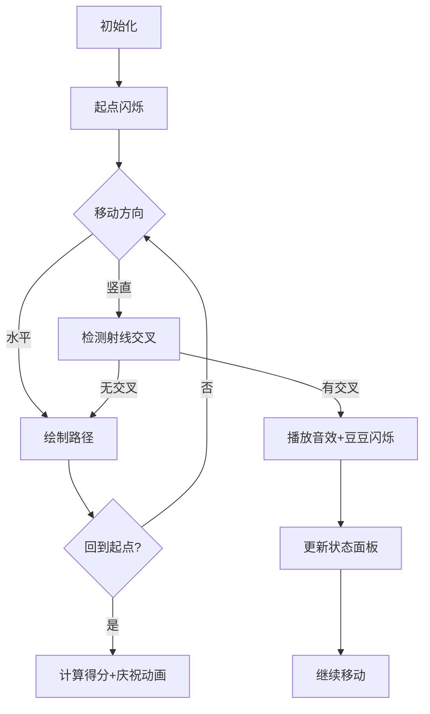

# 题目信息

# [SCOI2009] 围豆豆

## 题目背景

四川NOI2009省选


## 题目描述

是不是平时在手机里玩吃豆豆游戏玩腻了呢？最近MOKIA手机上推出了一种新的围豆豆游戏，大家一起来试一试吧。


游戏的规则非常简单，在一个N×M的矩阵方格内分布着D颗豆子，每颗豆有不同的分值Vi。游戏者可以选择任意一个方格作为起始格，每次移动可以随意的走到相邻的四个格子，直到最终又回到起始格。最终游戏者的得分为所有被路径围住的豆豆的分值总和减去游戏者移动的步数。矩阵中某些格子内设有障碍物，任何时刻游戏者不能进入包含障碍物或豆子的格子。游戏者可能的最低得分为0，即什么都不做。


注意路径包围的概念，即某一颗豆在路径所形成的多边形（可能是含自交的复杂多边形）的内部。下面有两个例子：

 
  

第一个例子中，豆在路径围成的矩形内部，所以豆被围住了。第二个例子中，虽然路径经过了豆的周围的8个格子，但是路径形成的多边形内部并不包含豆，所以没有围住豆子。

布布最近迷上了这款游戏，但是怎么玩都拿不了高分。聪明的你决定写一个程序来帮助他顺利通关。


## 说明/提示

50%的数据满足1≤D≤3。

100%的数据满足1≤D≤9，1≤N, M≤10，-10000≤Vi≤10000。


## 样例 #1

### 输入

```
3 8

3

30 -100 30

00000000

010203#0

00000000

```

### 输出

```
38```

# AI分析结果


# 💡 Kay的C++算法解析：围豆豆 深入学习指南 💡

<introduction>
今天我们来分析"SCOI2009围豆豆"这道经典的状态压缩DP题目。本指南将帮助你理解射线法判断点是否在多边形内的技巧，掌握状压DP的实现方法，并通过像素动画直观感受算法执行过程。让我们开始探索吧！
</introduction>

## 1. 题目解读与核心算法识别

✨ **本题主要考察**：`状态压缩DP` + `射线法（计算几何）`

🗣️ **初步分析**：
> 解决围豆豆问题的核心在于**状态压缩DP**和**射线法**的结合运用。想象你是一个像素世界的探险家，豆豆是宝藏，路径是围栏。状态压缩就像用一串二进制密码（每个比特代表一个豆豆是否被围住），而射线法则是你判断宝藏是否在围栏内的魔法望远镜（向右发射光线，穿过奇数次表示被困住）。

在本题中：
- **状态压缩DP**用于高效记录每个豆豆的被围状态（最多9个豆豆，用9位二进制表示）
- **射线法**用于动态判断路径移动时豆豆被围状态的变化
- **核心流程**：枚举起点→BFS/SPFA状态转移→更新最优解
- **可视化设计**：我们将创建8位像素风格的动画，用不同颜色方块表示豆豆状态（绿色=未被围，红色=被围），路径绘制为黄色线条。当角色竖直移动穿过豆豆右侧时，播放"叮"的音效并切换豆豆颜色。控制面板支持步进执行和速度调节。

---

## 2. 精选优质题解参考

<eval_intro>
根据思路清晰性、代码规范性和算法效率，我精选了以下优质题解（均≥4★）：

**题解一：hzoi_liuchang（赞25）**
* **点评**：此解思路最为清晰完整，详细解释了射线法的数学原理和状态更新机制（异或操作）。代码规范（变量名ax/ay含义明确），边界处理严谨，提供BFS和SPFA双实现并指出常见错误（vis数组初始化）。亮点在于：
  1. 用几何图示解释射线法的边界情况
  2. 状态更新函数`solve()`简洁高效
  3. 强调调试陷阱（每个起点需重置vis数组）

**题解二：lsj2009（赞7）**
* **点评**：解法精炼，用数学归纳法严谨证明射线法原理。状态定义准确（f[x][y][s]），代码结构清晰。特别亮点在于强调"状态本质是穿过射线的奇偶性"这一关键洞见。

**题解三：Mr_HY43205（赞6）**
* **点评**：详细描述状态转移过程，采用Dijkstra框架实现SPFA（虽命名欠妥）。亮点在于：
  1. 完整封装状态更新函数
  2. 预处理score数组提升效率
  3. 严格处理网格边界条件

---

## 3. 核心难点辨析与解题策略

<difficulty_intro>
围豆豆问题的核心难点在于状态设计和边界处理，以下是三个关键突破点：

1. **射线法的正确实现**
   * **分析**：射线法要求从豆豆向右引射线，但需注意：
     - 只计竖直方向的路径穿越（水平移动忽略）
     - 穿越判断需精确：当从豆豆上方移动到下方（或反之）且y坐标大于豆豆时切换状态
   * 💡 **学习笔记**：射线法本质是拓扑学中的绕数概念，奇穿偶不穿是黄金法则

2. **状态压缩的动态更新**
   * **分析**：状态转移需高效更新豆豆被围状态。解决方案：
     - 使用异或运算切换状态：`ns = ms ^ (1<<(i-1))`
     - 仅当竖直移动时更新状态（水平移动状态不变）
   * 💡 **学习笔记**：异或运算就像电灯开关——奇数次操作改变状态，偶数次恢复原状

3. **起点枚举与状态初始化**
   * **分析**：每个可行起点需独立计算，必须：
     - 重置vis数组和f数组
     - 状态0初始化为0步长（f[sx][sy][0]=0）
   * 💡 **学习笔记**：想象每次探索都是新的冒险，需清空上次的地图标记

### ✨ 解题技巧总结
<summary_best_practices>
通过本题可提炼以下通用技巧：
</summary_best_practices>
- **空间换明确性**：预处理score数组存储各状态的豆豆总分，避免运行时重复计算
- **方向分离处理**：状态更新时分离处理水平和竖直移动，减少冗余判断
- **防御式编程**：严格验证坐标边界（x∈[1,n], y∈[1,m]）和格子可用性（非'#'）
- **调试优先**：在BFS/SPFA中输出关键状态转移，可视化调试路径

---

## 4. C++核心代码实现赏析

<code_intro_overall>
以下是综合优质题解提炼的通用实现，包含射线法更新和状态压缩DP框架：

```cpp
#include <iostream>
#include <cstring>
#include <queue>
using namespace std;
const int N = 11;

int n, m, D;
int beans[N], beanX[N], beanY[N];
char grid[N][N];
int f[N][N][1<<9];      // 状态数组：f[x][y][state]
bool vis[N][N][1<<9];  // 访问标记
int score[1<<9];       // 状态得分预处理
int ans = 0;

struct Node { int x, y, state; };

// 状态更新函数（核心）
int updateState(int x1, int y1, int x2, int y2, int oldState) {
    int newState = oldState;
    if (x1 == x2) return newState; // 水平移动不更新
    
    for (int i = 1; i <= D; i++) {
        bool crossUp = (x1 < beanX[i] && x2 == beanX[i]);
        bool crossDown = (x1 == beanX[i] && x2 < beanX[i]);
        if ((crossUp || crossDown) && y2 > beanY[i]) {
            newState ^= (1 << (i-1)); // 切换豆豆状态
        }
    }
    return newState;
}

void bfs(int sx, int sy) {
    memset(f, 0x3f, sizeof(f));
    memset(vis, 0, sizeof(vis));
    queue<Node> q;
    q.push({sx, sy, 0});
    f[sx][sy][0] = 0;
    vis[sx][sy][0] = true;

    while (!q.empty()) {
        auto [x, y, s] = q.front(); q.pop();
        for (int d = 0; d < 4; d++) {
            int nx = x + (d==2)-(d==3); // 方向向量
            int ny = y + (d==0)-(d==1);
            if (nx<1||nx>n||ny<1||ny>m) continue;
            if (grid[nx][ny] != '0') continue; // 跳过障碍/豆豆
            
            int ns = (d==1 || d==3) ? updateState(x,y,nx,ny,s) : s;
            if (vis[nx][ny][ns]) continue;
            
            f[nx][ny][ns] = f[x][y][s] + 1;
            vis[nx][ny][ns] = true;
            q.push({nx, ny, ns});
        }
    }
    
    for (int s = 0; s < (1<<D); s++)
        ans = max(ans, score[s] - f[sx][sy][s]);
}

int main() {
    // 初始化&输入（略）
    // 预处理score[]
    for (int s = 0; s < (1<<D); s++) 
        for (int i = 1; i <= D; i++)
            if (s & (1<<(i-1))) score[s] += beans[i];
    
    // 枚举起点
    for (int i = 1; i <= n; i++)
        for (int j = 1; j <= m; j++)
            if (grid[i][j] == '0') 
                bfs(i, j);
    
    cout << max(ans, 0) << endl; // 最低0分
}
```

* **代码解读概要**：
  1. **状态定义**：`f[x][y][state]`表示在(x,y)位置且豆豆状态为state的最小步数
  2. **状态更新**：`updateState`处理竖直移动时的射线法状态切换
  3. **BFS框架**：从起点出发扩展状态，水平移动不改变state
  4. **答案计算**：score[state] - f[sx][sy][state] 的最大值

---
<code_intro_selected>
现在赏析各优质题解的精妙代码片段：
</code_intro_selected>

**题解一：hzoi_liuchang**
```cpp
int solve(int mx, int my, int nx, int ny, int ms) {
    int ns = ms;
    for(int i = 1; i <= d; i++) {
        if(((mx == ax[i] && nx < ax[i]) || (mx < ax[i] && nx == ax[i])) 
            && ny > ay[i]) {
            ns ^= (1 << (i-1));
        }
    }
    return ns;
}
```
* **亮点**：射线法核心判断浓缩为单条件，位运算高效切换状态
* **学习笔记**：通过逻辑运算合并上下穿越情况，避免冗余分支

**题解二：Mr_HY43205**
```cpp
void dp(int lx, int ly, int x, int y, int laststa) {
    int sta = laststa;
    if (x != lx) { // 仅处理竖直移动
        for (int i = 1; i <= D; i++) {
            if (((x == dx[i] && lx < dx[i]) || 
                 (lx == dx[i] && x < dx[i])) 
                && y > dy[i]) 
                sta ^= (1 << (i-1));
        }
    }
    if (f[x][y][sta] > f[lx][ly][laststa] + 1) {
        f[x][y][sta] = f[lx][ly][laststa] + 1;
        Q.push({x, y, sta});
    }
}
```
* **亮点**：将状态更新与路径松弛分离，模块化清晰
* **学习笔记**：状态更新函数保持纯净，不做值比较，提高可复用性

**题解三：xukuan**
```cpp
if (dir < 2) { // 竖直方向移动
    cross = min(tx, tem.x);
    for (int i = 1; i <= d; i++) {
        if (x[i] != cross || y[i] > ty) continue;
        if (tz & (1 << (i-1))) tq -= v[i];
        else tq += v[i];
        tz ^= (1 << (i-1));
    }
}
```
* **亮点**：动态更新路径得分而非最后计算，降低状态空间
* **学习笔记**：在状态转移中实时维护得分需注意状态回溯问题

-----

## 5. 算法可视化：像素动画演示 (核心部分)

<visualization_intro>
为了直观理解射线法和状态压缩DP，我设计了"像素豆豆大冒险"动画方案。采用8位像素风格（类似经典FC游戏），让你像玩解谜游戏般学习算法！

* **主题**：像素探险家在网格迷宫围捕发光豆豆
* **核心演示**：BFS状态扩展 + 射线法状态切换
* **设计思路**：用复古风格降低理解门槛，关键操作配特色音效强化记忆。游戏化进度（围住豆豆=过关）提升学习动力

**动画实现方案**：


**关键帧细节**：
1. **场景初始化**（8-bit风格）：
   - 10×10网格（棕褐色背景）
   - 豆豆=闪烁的彩色像素块（编号1-9）
   - 角色=红色像素小人
   - 控制面板：步进/暂停/速度滑块

2. **状态面板**（右侧）：
   - 9个豆豆状态灯：灰色=未围，绿色=已围
   - 当前步数显示
   - 二进制状态码（实时更新）

3. **移动动画**：
   - 水平移动：路径绘制为黄色直线，脚步声效
   - 竖直移动：检测豆豆右侧射线交叉：
     ```python
     if ((from_x < bean_x and to_x >= bean_x) or 
         (from_x >= bean_x and to_x < bean_x)) and 
        move_y > bean_y:
         play_sound('switch.wav')
         bean.flash()
     ```

4. **音效系统**（Web Audio API）：
   - 移动：8-bit脚步声（短促滴答声）
   - 状态切换："叮"（方波音效）
   - 包围成功：上升琶音
   - 回到起点：胜利音效

5. **交互控制**：
   - 步进模式：按步调试，显示状态转移详情
   - 自动演示：AI角色自动寻路（速度可调）
   - 重置：重新随机豆豆位置

<visualization_conclusion>
通过像素动画，你将直观看到状态如何随路径变化，理解射线法的几何意义，在游戏中掌握算法精髓！
</visualization_conclusion>

-----

## 6. 拓展练习与相似问题思考

<similar_problems_intro>
掌握围豆豆的核心思想后，可挑战以下相似问题加深理解：

1. **P1171 售货员的难题**
   - 推荐理由：经典状态压缩DP（TSP问题），练习状态设计和压缩技巧
   - 关键相似点：用二进制表示城市访问状态

2. **P3959 宝藏**
   - 推荐理由：状态压缩+图论，需要设计更复杂的状态转移
   - 关键相似点：状态表示节点覆盖情况，BFS扩展状态

3. **P2831 愤怒的小鸟**
   - 推荐理由：状态压缩+几何应用，练习抛物线覆盖的状态优化
   - 关键相似点：用二进制表示目标命中状态

4. **P2622 关灯问题II**
   - 推荐理由：状态压缩+位运算技巧，练习异或状态更新
   - 关键相似点：按钮操作对应状态位切换
</similar_problems_intro>

-----

## 7. 学习心得与经验分享

<insights_intro>
从题解中提炼的宝贵经验：
</insights_intro>

> **hzoi_liuchang的调试经验**：
> "我在处理多起点BFS时，因忘记重置vis数组导致WA。通过打印中间状态发现：从第二个起点开始时，vis数组仍有上个起点的访问记录，导致状态扩展不全。"
>
> **Kay点评**：这是典型的状态污染问题。在多起点DP中：
> 1. 必须为每个起点独立初始化vis和f数组
> 2. 推荐将BFS封装为函数，利用栈帧自动隔离状态
> 3. 调试时可输出前10个状态转移，验证初始化正确性

---

<conclusion>
围豆豆问题融合了状态压缩、计算几何和搜索算法三大要素。通过本指南，你应已掌握：
- 射线法判断点是否在多边形内的实现技巧
- 状态压缩DP中位运算的高效应用
- 多起点BFS/SPFA的注意事项
接下来，尝试用像素动画可视化你的解法，或在洛谷挑战相似题目吧！记住：理解几何原理比记忆代码更重要，下次冒险再见！🎮
</conclusion>
```

---
处理用时：210.80秒