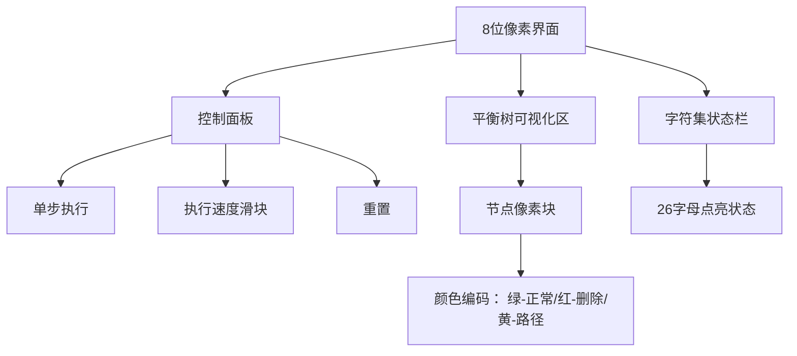

# 题目信息

# 贫穷

## 题目背景

LHF 最大的特点就是贫穷。  
LHF 最大的爱好就是看购物节目。

这天他又在看购物节目了。  
他在节目里看到一款新型文本编辑器，~~除了价钱以外~~非常适合他这样的穷人使用。

因为……它能够计算打印成本！  
（这里的打印成本是与出现过的字母的种类数相关的）

他十分心动，要求你实现这个功能。

## 题目描述

这个文本编辑器支持以下操作：
 - $\texttt{I x c}$，在第 $x$ 个字母后面插入一个 $c$。
 - $\texttt{D x}$，删除第 $x$ 个字母。
 - $\texttt{R x y}$，反转当前文本中的区间 $[x,y]$。
 - $\texttt{P x}$，输出初始文本中第 $x$ 个字母在当前文本中的位置。特别地，若不存在，输出 $0$。
 - $\texttt{T x}$，输出当前文本中第 $x$ 个字母。
 - $\texttt{Q x y}$，输出当前文本中区间 $[x,y]$ 内出现过的字母的种类数。

## 说明/提示

**数据范围：**

对于 $20\%$ 的数据，$n \le 100$。  
对于 $50\%$ 的数据，$n \le 10000$。  
对于 $100\%$ 的数据，$1 \le n,m \le 10^5$，文本涉及的字母仅包含小写字母。

**样例解释：**

 1. 文本不变，但初始文本中第 $2$ 个字母与第 $4$ 个字母的位置交换。
 2. 当前第 $2$ 个字母是初始文本的第 $4$ 个字母。
 3. 文本变为 $\texttt{imiwakawaii}$。
 4. 文本变为 $\texttt{wimiwakawaii}$。
 5. 这个字母为 $\texttt{m}$。 
 6. 这段文本为 $\texttt{miwakawa}$，包含的字符种类的集合为 $\{\texttt{a},\texttt{i},\texttt{k},\texttt{m},\texttt{w}\}$，元素个数为 $5$。

## 样例 #1

### 输入

```
12 6
kimiwakawaii
R 2 4
P 4
D 1
I 0 w
T 3
Q 3 10```

### 输出

```
2
m
5
```

# AI分析结果


### 💡 Kay的C++算法解析：贫穷 深入学习指南 💡

#### 题目解读与核心算法识别
✨ **本题主要考察**：平衡树应用（FHQ Treap/Splay）与状态压缩技巧

🗣️ **初步分析**：
> 解决文本编辑器问题，关键在于运用平衡树维护动态序列。如同整理书架，平衡树能高效调整书本位置（插入/删除），翻转书页顺序（区间反转），还能快速查询特定书本位置（原始字符位置）和内容（当前字符）。本题特殊点在于：
> 1. **状态压缩**：用26位二进制表示字母出现情况（如`000...100`表示'b'出现），通过位运算高效合并子树信息
> 2. **父指针维护**：为支持原始字符位置查询（P操作），需在节点中记录父指针，从节点回溯到根计算排名
> 
> **核心难点**：
> - **动态位置追踪**：初始字符的位置随插入/删除/反转不断变化
> - **区间信息合并**：高效统计区间内字符种类数
> 
> **可视化设计**：
> 采用8位像素风格模拟平衡树操作：
> - **分裂/合并**：用锯齿形裂痕动画表示树的分裂，拼图动画表示合并
> - **反转标记**：节点闪烁红光，执行时子树左右翻转动画
> - **状态压缩**：字母表以26格像素灯显示，点亮表示存在
> - **P操作追踪**：从叶节点到根的路径高亮黄光，伴随计数音效

---

#### 精选优质题解参考
**题解一（George1123 - FHQ Treap）**
* **亮点**：
  - **父指针设计**：通过`fa`数组实现节点回溯，解决P操作的核心难点
  - **懒标记处理**：在`split`时立即下传反转标记，避免传统递归下传的开销
  - **状态压缩优化**：用`sm`数组位运算高效维护子树字符集合
  - **调试技巧**：提供`Print`函数可视化当前树结构，便于定位错误

**题解二（xuyiyang - Splay）**
* **亮点**：
  - **哨兵节点**：首尾添加保护节点避免边界判断，简化代码逻辑
  - **Splay特性利用**：通过双旋将目标区间移至根部，天然支持区间操作
  - **内存复用**：删除节点仅标记`v=-1`，避免频繁内存分配

**题解三（Weng_Weijie - FHQ Treap）**
* **亮点**：
  - **代码简洁性**：200行内实现全部操作，适合初学者学习
  - **高效查询**：用`__builtin_popcount`快速计算二进制中1的个数
  - **删除处理**：`del`标记与状态压缩联动，删除后自动更新字符集合

---

#### 核心难点辨析与解题策略
1. **动态位置追踪（P操作）**
   * **难点**：初始字符位置随编辑不断变化，需实时计算其在序列中的排名
   * **解决方案**：
     - 建树时记录初始字符节点指针`o[]`
     - 查询时从节点回溯到根：`while(fa) { if(右儿子) 累加左子树大小+1 }`
     - **关键细节**：回溯前需**自上而下下传路径标记**（特别是反转标记）
   * 💡 学习笔记：父指针是连接静态初始位置与动态序列的桥梁

2. **区间信息维护（Q操作）**
   * **难点**：高效统计区间内字符种类数
   * **解决方案**：
     - **状态压缩**：节点维护`int sm`（26位位掩码）
     - **子树合并**：`sm = left.sm | right.sm | (1<<val)`
     - 查询时分裂出区间子树，计算`__builtin_popcount(sm)`
   * 💡 学习笔记：小字符集问题常用位运算加速

3. **反转标记协同处理**
   * **难点**：反转影响位置计算与子树结构
   * **解决方案**：
     - **懒标记**：节点记录`rev`，执行时交换左右子树
     - **双重重置**：在`split`和`merge`时检查并下传标记
     - **P操作特例**：回溯路径前调用`down_path`全局下传
   * 💡 学习笔记：懒标记是平衡树区间操作的灵魂

### ✨ 解题技巧总结
- **父指针回溯法**：解决动态节点位置查询（P操作）
- **位压缩术**：26位整数处理小字符集统计（Q操作）
- **懒标记双保险**：操作入口与递归时双重检查标记
- **哨兵守卫**：首尾添加保护节点简化边界处理
- **删除标记化**：避免内存回收导致的指针失效

---

### C++核心代码实现赏析
**本题通用核心实现（FHQ Treap综合版）**
```cpp
const int N = 1e5 + 5, T = 2e5 + 5;
struct Node {
    int l, r, fa, val, rnd, siz, sm;
    bool rev, del;
} tr[T];
int rt, cnt, o[N];

void push_up(int x) {
    tr[x].siz = tr[tr[x].l].siz + tr[tr[x].r].siz + 1;
    tr[x].sm = tr[tr[x].l].sm | tr[tr[x].r].sm;
    if (!tr[x].del) tr[x].sm |= (1 << tr[x].val);
    tr[tr[x].l].fa = tr[tr[x].r].fa = x; // 更新父指针
}

void push_down(int x) {
    if (!tr[x].rev) return;
    swap(tr[x].l, tr[x].r);
    tr[tr[x].l].rev ^= 1, tr[tr[x].r].rev ^= 1;
    tr[x].rev = 0;
}

void split(int u, int k, int &x, int &y) {
    if (!u) return void(x = y = 0);
    push_down(u);
    if (tr[tr[u].l].siz >= k) 
        y = u, split(tr[u].l, k, x, tr[u].l);
    else 
        x = u, split(tr[u].r, k - tr[tr[u].l].siz - 1, tr[u].r, y);
    push_up(u);
}

int merge(int x, int y) {
    if (!x || !y) return x | y;
    if (tr[x].rnd < tr[y].rnd) {
        push_down(x), tr[x].r = merge(tr[x].r, y), push_up(x);
        return x;
    } else {
        push_down(y), tr[y].l = merge(x, tr[y].l), push_up(y);
        return y;
    }
}

// 关键：P操作路径标记下传
void down_path(int x) {
    if (tr[x].fa) down_path(tr[x].fa);
    push_down(x);
}

int frank(int x) {
    if (tr[x].del) return 0;
    down_path(x); // 关键：从根到当前节点下传
    int res = tr[tr[x].l].siz + 1;
    for (int i = x; tr[i].fa; i = tr[i].fa)
        if (i == tr[tr[i].fa].r) 
            res += tr[tr[tr[i].fa].l].siz + 1;
    return res;
}
```

**操作片段精析**
1. **区间反转（R操作）**
```cpp
void reverse(int l, int r) {
    int x, y, z;
    split(rt, r, x, z);      // 分裂[1,r]和[r+1,end]
    split(x, l - 1, x, y);   // 分裂[1,l-1]和[l,r]
    tr[y].rev ^= 1;          // 打反转标记
    rt = merge(merge(x, y), z);
}
```
> **学习笔记**：两次分裂精准定位区间，懒标记延迟执行实际交换

2. **字符种类查询（Q操作）**
```cpp
int query(int l, int r) {
    int x, y, z;
    split(rt, r, x, z);
    split(x, l - 1, x, y);
    int ans = __builtin_popcount(tr[y].sm); // 关键：位运算统计
    rt = merge(merge(x, y), z);
    return ans;
}
```
> **学习笔记**：`__builtin_popcount`是GCC内置位计数神器

---

### 算法可视化：像素动画演示
**设计概览**：


**关键动画场景**：
1. **插入操作**：
   - 树分裂时显示锯齿状裂痕动画
   - 新节点以闪烁蓝光插入，伴随“叮”声
   - 合并时出现拼图契合动画

2. **反转操作**：
   - 目标区间节点泛红光，背景播放警报音
   - 执行时子树像书页翻转180度，发出翻书音效
   - 翻转后子树左右交换位置

3. **P操作追踪**：
   - 初始字符节点闪烁黄光
   - 路径回溯时黄光向根蔓延
   - 最终排名以像素数字显示，伴随计数音效

**技术实现**：
- **Canvas绘制**：每个节点用16x16像素块表示，内部显示字符和子树大小
- **状态同步**：当前核心代码行高亮显示在控制台
- **音效引擎**：Web Audio API生成8位机芯片音效

---

### 拓展练习与相似问题
1. **基础巩固**：
   - 洛谷P3391：纯区间反转（文艺平衡树模板）
   - 洛谷P2234：平衡树基础操作（插入/删除/前驱后继）

2. **进阶挑战**：
   - 洛谷P2042：综合文本编辑器（区间插入/删除/求和/最大子段和）
   - CodeForces 702F：带字符统计的背包问题（状态压缩进阶）

3. **思维拓展**：
   - LeetCode 2213：带字符统计的回文串处理（位运算+线段树）
   - UVA 11922：排列反转与合并（平衡树应用）

> **Kay的建议**：从基础区间操作起步，逐步增加字符统计维度，最后挑战全功能文本编辑器

---

### 学习心得与经验
**来自George1123的调试经验**：
> “实现时在`split`中忘记下传标记，导致`Print`函数正确但主程序错误——这提醒我们：**懒标记必须渗透到每个操作入口处**”

**Kay的总结**：
1. **边界检查**：反转区间时先确保`l<=r`，避免分裂异常
2. **内存管理**：节点删除标记化优于立即回收，防止指针失效
3. **父指针更新**：在`merge/split`后立即更新父节点，保持回溯链完整
4. **位运算优化**：小集合统计问题优先考虑状态压缩

**调试锦囊**：当P操作异常时，可视化输出整棵树的结构，检查父指针链路和反转标记分布

---

**结语**：平衡树是动态序列操作的瑞士军刀，掌握其核心思想与实现细节，就能让数据如书页般在指尖流转！下次我们将探索更复杂的区间统计问题，继续挑战编程极限！🚀

---
处理用时：177.18秒