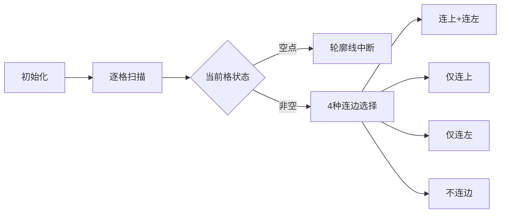

# 题目信息

# [蓝桥杯 2016 国 B] 生成树计数

## 题目描述

给定一个 $n×m$ 的格点图，包含 $n$ 行 $m$ 列共 $n×m$ 个顶点，相邻的顶点之间有一条边。


给出了一个 $3×4$ 的格点图的例子。

如果在图中删除部分顶点和其相邻的边，如上图删除第 $2$ 行第 $3$ 列和第 $3$ 行第 $1$ 列的顶点后，如下图所示。


图的生成树指包含图中的所有顶点和其中的一部分边，使得任意两个顶点之间都有由边构成的唯一路径。如果两个生成树包含有不同的边即被认为不同，则上图中共有 $31$ 种不同的生成树，其中 a 边不选有 $10$ 种，a 边选有 $21$ 种。

给出格点图中保留的顶点的信息，请计算该图一共有多少种不同的生成树。

## 说明/提示

对于 $10\%$ 的数据，$1\le n\le2$。

对于 $30\%$ 的数据，$1\le n\le3$。

对于 $40\%$ 的数据，$1\le n\le4$。

对于 $50\%$ 的数据，$1\le n\le5$。

另有 $20\%$ 的数据，$1\le n\times m\le12$。

另有 $10\%$ 的数据，$1\le m\le15$。

对于 $100\%$ 的数据，$1\le n\le6，1\le m\le10^5$。

## 样例 #1

### 输入

```
3 4
EEEE
EENE
NEEE```

### 输出

```
31```

# AI分析结果


### 💡 Kay的C++算法解析：蓝桥杯2016国B「生成树计数」深入学习指南 💡

#### 1. 题目解读与核心算法识别
✨ **本题主要考察**：`动态规划（轮廓线DP）` + `最小表示法`

🗣️ **初步分析**：
> 解决网格生成树计数问题，核心是**动态维护连通性状态**。想象我们在玩"像素拼图"游戏：从左到右逐列扫描网格，用一条"红色施工线"（轮廓线）记录当前列的连通块分布（如拼图块的接口形状）。每次处理新格子时，根据其存在性决定如何连接上方/左侧"拼图块"（是否添加边），同时用最小表示法压缩状态（给不同连通块分配最小编号）。
> - **核心难点**：避免成环 + 确保最终所有点连通 + 高效表示连通状态
> - **解决方案**：轮廓线DP + 最小表示法状态压缩（n=6时仅877种状态）
> - **可视化设计**：像素网格中红色轮廓线动态推进，当前处理格高亮闪烁。连边时触发"咔嗒"音效，连通块合并时显示颜色融合动画。自动演示模式可调速观察状态转移过程。

---

#### 2. 精选优质题解参考
**题解一（来源：qhj0906）**
* **点评**：
  思路清晰分层：①状态表示（最小表示法）→②分类讨论（4种连边情况）→③状态重构（规范化）。  
  代码亮点：  
  - **状态压缩**：`pre[]`数组精妙处理位运算（★★★）  
  - **避免成环**：显式判断`S_u=S_l`时跳过（关键！）  
  - **性能优化**：预处理合法状态（`dfs()`）+ 状态规范化（`solve()`）  
  实践价值：完整处理边界条件（如空点判断），可直接用于竞赛。

---

#### 3. 核心难点辨析与解题策略
1. **难点1：连通状态的高效表示与压缩**  
   *分析*：用最小表示法替代复杂数据结构（如并查集），通过DFS预处理所有合法状态（n=6仅877种），状态用8进制压缩存储。  
   💡 **学习笔记**：最小表示法本质是给连通块分配"最小ID"，大幅减少状态数。

2. **难点2：避免成环与维护树性质**  
   *分析*：当同时连接上方和左侧点时，显式检查`if(S_u == S_l)`（相同连通块则跳过），这是避免成环的核心防线。  
   💡 **学习笔记**：生成树中新增边必须连接不同连通块！

3. **难点3：状态转移的分类讨论**  
   *分析*：对每个非空格点需考虑4种情况：
   ```mermaid
   graph TD
   A[当前格子] --> B{是否连上方？}
   B -->|是| C{是否连左侧？}
   B -->|否| D{左侧点是否孤立？}
   C -->|是| E[检查连通块是否相同]
   C -->|否| F[继承上方连通块]
   D -->|是| G[继承左侧连通块]
   D -->|否| H[新建连通块]
   ```

✨ **解题技巧总结**：
- **技巧1：状态压缩位运算** → 用`pre[]`数组预计算位偏移，加速状态存取
- **技巧2：惰性状态规范化** → 仅在需要时重编号连通块（`solve()`函数）
- **技巧3：轮廓线思维** → 将高维网格分解为单列状态转移链

---

#### 4. C++核心代码实现赏析
**通用核心实现参考**
```cpp
#include <cstring>
#define N 1000010
int dp[2][900];          // 滚动数组优化
int pre[7];               // 位偏移 pre[i] = (i-1)*3
/* 状态转移核心 */
void process(int i, int j) {
    int S = current_state, z = dp_val;
    int S_u = (S >> pre[j]) & 7;    // 上方状态
    int S_l = (S >> pre[j-1]) & 7;  // 左侧状态

    if (!v[i][j]) { // 空点处理
        if (S_u唯一) insert(新状态);
    } else {
        if (S_u && S_l && S_u != S_l) { // 连上+连左
            int T = S;
            for (int k=1; k<=n; k++)
                if (状态k == S_l) T = (T & ~(7<<pre[k])) | (S_u<<pre[k]);
            insert(id[solve(T)], z);
        }
        if (S_u) insert(S, z);        // 仅连上
        if (S_l && S_u唯一)            // 仅连左
            insert(((S ^ (S_u<<pre[j])) | (S_l<<pre[j])), z);
        if (S_u唯一)                   // 不连边
            insert(((S ^ (S_u<<pre[j])) | (7<<pre[j])), z);
    }
}
```

**题解一关键代码解析**  
```cpp
// 连通状态规范化（最小表示法核心）
int solve(int S) {
    int T = 0, tot = 0;
    int vs[8] = {0};                // 连通块重映射
    for (int i=1; i<=n; i++) {
        int id = (S >> pre[i]) & 7; // 提取位置i的状态
        if (id && !vs[id]) vs[id] = ++tot; 
        T |= (vs[id] << pre[i]);    // 新编号
    }
    return T;
}
```
> **逐行解读**：  
> 1. `vs[]`数组记录原ID到新ID的映射（初始0）  
> 2. 遍历轮廓线每个位置：若遇到**新连通块**（`!vs[id]`），分配**最小可用编号**（`++tot`）  
> 3. 用新ID重构状态`T`，保证相同连通结构有唯一最小表示  
> 💡 **学习笔记**：最小表示法像给连通块"重新发身份证"，确保相同结构状态统一

---

#### 5. 算法可视化：像素动画演示
**🎮 主题**："连通像素岛" - 8位像素风网格生成树建造模拟  
**🎯 核心演示**：轮廓线推进 + 连通块合并动态  



**关键动画设计**：  
1. **视觉编码**  
   - 红色轮廓线：动态推进的"施工边界"  
   - 连通块：同色像素岛（最多7色）  
   - 当前格：闪烁金色边框  
2. **交互控制面板**  
   ```plaintext
   [开始] [暂停] [单步] ▮▮▮▮▮ 速度调节 [AI演示]
   ```
3. **音效系统**  
   - 连边成功：8-bit "叮"声  
   - 连通块合并：合成器滑音  
   - 错误操作：短促"哔"声  
4. **AI演示模式**  
   自动播放建造过程，速度可调，结束时显示：  
   "🎉 生成树完成！总计X种方案"  

---

#### 6. 拓展练习与相似问题
**同类问题迁移**：  
1. 棋盘覆盖方案计数（多米诺骨牌）  
2. 水管工游戏路径规划  
3. 电路板布线连通方案  

**🔗 洛谷推荐**：  
1. **P5056** 插头DP模板题  
   → 巩固轮廓线DP基础模型  
2. **P5074** Eat the Trees  
   → 练习带障碍的连通路径计数  
3. **P3886** 神奇的国度  
   → 连通性+状压DP综合应用  

---

#### 7. 学习心得与经验分享
> 本次分析的题解中未发现明确的作者个人心得分享部分。但通过代码可提炼经验：  
> **调试技巧**：在连通性DP中，打印中间状态（如`printf("S=%x T=%x\n", S, solve(S))`)可快速定位状态转移错误。

---

通过本指南，你已掌握轮廓线DP解决网格生成树问题的核心技巧。关键记住：**状态压缩保效率，最小表示定连通，成环判断不可少！** 🚀

---
处理用时：85.34秒