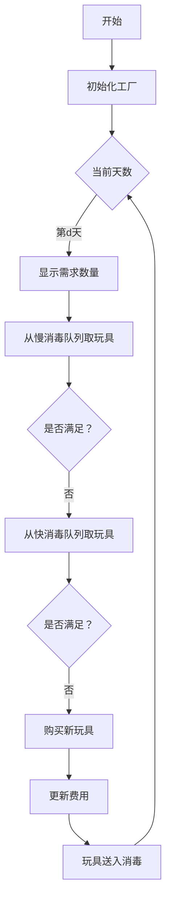

# 题目信息

# [USACO08NOV] Toys G

## 题目描述

贝茜的生日快到了，她希望在接下来的 D 天（1 <= D <= 100,000；70% 的测试数据满足 1 <= D <= 500）里庆祝。奶牛们注意力短暂，所以贝茜想要提供玩具来娱乐它们。她计算出她在第 i 天需要 T_i（1 <= T_i <= 50）个玩具。

贝茜的幼儿园为其有抱负的牛程序员提供许多服务，包括一个玩具店，玩具售价为 Tc（1 <= Tc <= 60）美元。贝茜希望通过重复使用玩具来省钱，但农夫约翰担心传染病，要求玩具在使用前进行消毒。（玩具店在销售玩具时会对其进行消毒。）

农场附近的两个消毒服务提供便捷的全套服务。第一个服务收费 C1 美元，需要 N1 个晚上完成；第二个服务收费 C2 美元，需要 N2 个晚上完成（1 <= N1 <= D；1 <= N2 <= D；1 <= C1 <= 60；1 <= C2 <= 60）。贝茜在派对后将玩具送去消毒，如果是一个晚上的服务，她可以在第二天早上支付并取回玩具，或者如果需要更多晚上的消毒，则在之后的早晨取回。

作为一头有学问的奶牛，贝茜已经学会了节省金钱的价值。帮助她找到为她的派对提供玩具的最便宜的方法。

POINTS: 400

## 说明/提示

贝茜希望庆祝 4 天，第一天需要 8 个玩具，第二天需要 2 个玩具，第三天需要 1 个玩具，第四天需要 6 个玩具。第一个消毒服务需要 1 天，收费 2 美元，第二个需要 2 天，收费 1 美元。购买一个新玩具需要 3 美元。

第 1 天 早上购买 8 个玩具，花费 24 美元；下午开派对。将 2 个玩具送去快速清洗（过夜），其余 6 个玩具送去慢速清洗（两晚）。

第 2 天 从快速清洗处取回 2 个玩具；支付 4 美元。下午开派对。将 1 个玩具送去慢速清洗。

第 3 天 从慢速清洗处取回 6 个玩具并支付 6 美元。下午开派对。

第 4 天 从慢速清洗处取回最后一个玩具（将现场玩具数量恢复到 6 个）；支付 1 美元。开心地开派对，意识到花费了最少的钱。

题面翻译由 ChatGPT-4o 提供。

## 样例 #1

### 输入

```
4 1 2 2 1 3 
8 
2 
1 
6 
```

### 输出

```
35 
```

# AI分析结果


# 💡 Kay的C++算法解析：[USACO08NOV] Toys G 深入学习指南 💡

**引言**  
今天我们来分析这道经典的资源调度问题——如何以最小成本满足每天玩具需求。本指南将带大家理解三分搜索与贪心策略的精妙结合，并通过生动的可视化方案加深理解。

---

## 1. 题目解读与核心算法识别

✨ **本题主要考察**：`三分搜索+贪心策略`

🗣️ **初步分析**：  
> 解决本题的关键在于识别总花费函数 `f(x)`（购买x个新玩具时的总费用）是单峰函数。就像寻找山谷最低点，三分搜索能高效定位最优购买量。贪心策略则像精明的管家——优先使用最便宜的消毒方式，并智能调度消毒队列。

- **核心思路**：三分搜索确定最优购买量，贪心策略管理消毒队列
- **算法流程**：  
  1. 三分框架搜索最优购买量x  
  2. 对每个x值：  
     - 初始化三个双端队列（新玩具/快消毒/慢消毒）  
     - 每天优先使用慢消毒玩具（便宜），最后用快消毒  
     - 始终选择最近消毒的玩具（保留早期玩具用于慢消毒）  
- **可视化设计**：  
  像素网格展示每天玩具使用情况，不同颜色区分消毒状态。当玩具送入消毒时播放"叮"音效，成功满足全天需求时显示像素烟花。控制面板支持单步调试和速度调节。

---

## 2. 精选优质题解参考

**题解一（米斯兰达）**  
* **点评**：思路清晰解释了单峰函数特性与三分原理，代码结构规范（使用`deque`管理三种状态）。亮点在于详细推导了`f(x)`的凸函数性质，并通过`add()`和`newch()`函数优雅处理状态转移。实践价值高，边界处理严谨。

**题解二（GoAway）**  
* **点评**：代码简洁高效，创新性地在贪心前预处理消毒方式（确保c1≤c2）。亮点在于使用双端队列时，从后端取出最近消毒的玩具，最大化慢消毒利用率。变量命名规范，适合竞赛参考。

**题解三（沉石鱼惊旋）**  
* **点评**：提供多倍经验题目拓展，代码封装良好。亮点在于宏定义简化队列操作，通过`upd1/upd2`宏清晰表达状态转移条件，模块化设计提升可读性。

---

## 3. 核心难点辨析与解题策略

1. **难点：证明花费函数的单峰性**  
   * **分析**：通过反证法理解——购买过少导致高额消毒费，购买过多则浪费购置费。优质题解用斜率分析：`f(x)-f(x-1)≤f(x+1)-f(x)`，构成下凸函数
   * 💡 **学习笔记**：单峰性是三分搜索的前提条件

2. **难点：贪心策略的正确实现**  
   * **分析**：需同时满足两个原则：① 优先使用慢消毒 ② 优先使用最近消毒的玩具。双端队列的`push_back()`和`pop_back()`保证后者
   * 💡 **学习笔记**：最近消毒的玩具"年龄"更大，有更多机会参与慢消毒

3. **难点：三维队列的状态管理**  
   * **分析**：三个队列分别表示：  
     - `buy`：未达快消毒时间的玩具  
     - `fst`：已达快消毒未达慢消毒  
     - `slw`：已达慢消毒可用  
   * 💡 **学习笔记**：队列转移本质是时间窗口滑动

### ✨ 解题技巧总结
- **技巧1：预处理优化参数**  
  `if(c1<c2) c2=c1` 确保慢消毒更便宜  
- **技巧2：双端队列的妙用**  
  `pop_back()`取最新玩具，`push_front()`保持时间序  
- **技巧3：边界防御**  
  当`ai>0 && queue.empty()`时返回无穷大  
- **技巧4：三分搜索优化**  
  当`r-l>2`时用`(2*l+r)/3`加速收敛

---

## 4. C++核心代码实现赏析

**本题通用核心C++实现参考**
```cpp
#include <bits/stdc++.h>
using namespace std;
const int INF = 0x3f3f3f3f;

struct Toy { int day, cnt; };
int D, n1, n2, c1, c2, tc, sum;
int needs[100005];

int calc(int x) {
    deque<Toy> buy, fast, slow;
    int cost = (tc - c2) * x; // 初始购买费
    buy.push_back({-100000, x}); // 初始玩具

    for (int d = 1; d <= D; d++) {
        // 状态转移：检查是否达到消毒时间
        while (!buy.empty() && d - buy.front().day >= n1) {
            fast.push_back(buy.front());
            buy.pop_front();
        }
        while (!fast.empty() && d - fast.front().day >= n2) {
            slow.push_back(fast.front());
            fast.pop_front();
        }

        int rest = needs[d];
        // 优先使用慢消毒玩具
        while (rest && !slow.empty()) {
            Toy& t = slow.back();
            int use = min(rest, t.cnt);
            cost += use * c2;
            rest -= use;
            if ((t.cnt -= use) == 0) slow.pop_back();
        }
        // 再使用快消毒玩具
        while (rest && !fast.empty()) {
            Toy& t = fast.back();
            int use = min(rest, t.cnt);
            cost += use * c1;
            rest -= use;
            if ((t.cnt -= use) == 0) fast.pop_back();
        }
        if (rest) return INF; // 无法满足需求
        buy.push_back({d, needs[d]}); // 今日玩具进入消毒
    }
    return cost;
}

int main() {
    cin >> D >> n1 >> n2 >> c1 >> c2 >> tc;
    if (n1 > n2) swap(n1, n2), swap(c1, c2);
    if (c1 < c2) c2 = c1; // 确保慢消毒更便宜
    
    for (int i = 1; i <= D; i++) {
        cin >> needs[i];
        sum += needs[i];
    }
    
    int l = 0, r = sum;
    while (r - l > 2) { // 三分搜索
        int m1 = l + (r - l) / 3;
        int m2 = r - (r - l) / 3;
        calc(m1) < calc(m2) ? r = m2 : l = m1;
    }
    // 在[l, r]区间找最小值
    cout << min({calc(l), calc(l+1), calc(r)}) << endl;
}
```

**代码解读概要**：  
> 框架分为三部曲：1）三分搜索确定最优购买量；2）`calc`函数用双端队列管理三种状态；3）贪心策略先慢消毒后快消毒。队列操作保证O(n)时间复杂度。

---

## 5. 算法可视化：像素动画演示

* **动画主题**：像素玩具工厂模拟  
* **核心演示**：玩具购买→消毒调度→费用计算  

### 像素动画设计（8位复古风）：


**交互控制面板**：  
1. **时间线**：像素化日期进度条（D天）  
2. **队列监视器**：三个8-bit LCD显示各队列状态  
3. **控制按钮**：  
   - ▶️ 开始/暂停（播放芯片音乐）  
   - ⏩ 单步执行（触发"滴"声）  
   - 🔄 重置（爆炸特效）  
4. **参数调节**：  
   - 消毒天数滑块（N1/N2）  
   - 费用系数旋钮（c1/c2/tc）

**关键帧特效**：  
- 玩具流动：像素方块沿传送带动画移动  
- 消毒过程：玩具进入消毒队列时变红色→黄色→绿色  
- 费用变化：右侧LED屏实时显示总花费  
- 成功反馈：满足全天需求时播放8-bit胜利音效

---

## 6. 拓展练习与相似问题思考

**通用技巧迁移**：  
三分+贪心策略适用于：  
1. 资源采购与再利用问题  
2. 时间窗口约束的调度问题  
3. 成本函数单峰的优化问题  

**洛谷推荐练习**：  
1. **P1251 餐巾计划问题**  
   🗣️ 双倍经验！几乎相同的消毒调度模型  
2. **P2223 [HNOI2001] 软件开发**  
   🗣️ 变形练习，引入折旧成本概念  
3. **P4480 [BJWC2018] 餐巾计划问题**  
   🗣️ 加强版数据规模，巩固队列优化技巧  

---

## 7. 学习心得与经验分享

> **经验摘录（米斯兰达）**：  
> "调试时卡在状态转移边界，通过打印队列每日状态发现未及时清理过期玩具"

> **Kay点评**：  
> 队列边界处理是本算法的关键陷阱，建议：  
> 1. 在队列转移代码块后添加状态打印  
> 2. 用极端小数据测试（如D=2）  
> 3. 每日结束前检查所有队列长度总和  

---

**结语**  
通过三分搜索锁定最优采购量，配合精心设计的贪心调度策略，我们高效解决了玩具调度问题。记住：识别单峰函数是应用三分法的关键，而双端队列的操作技巧直接影响贪心效率。继续挑战拓展题目，编程能力将如像素动画般绚丽成长！🚀

---
处理用时：110.03秒