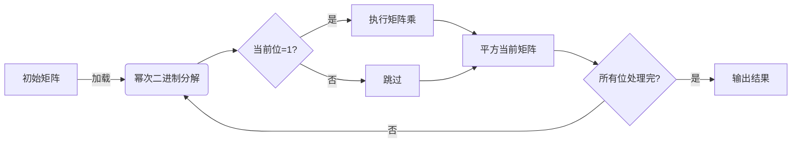

# 题目信息

# [JLOI2015] 有意义的字符串

## 题目描述

B 君有两个好朋友，他们叫宁宁和冉冉。有一天，冉冉遇到了一个有趣的题目：输入三个非负整数 $b,d,n$，求

$$\left\lfloor \left ( \frac{b+\sqrt{d}}{2} \right ) ^n \right\rfloor \bmod p$$

其中 $p=7,528,443,412,579,576,937$

## 说明/提示

保证 $0<b^2 \le d<(b+1)^2 \le 10^{18}$，$n \le 10^{18}$，并且 $b\equiv 1\pmod 2$，$d\equiv 1\pmod 4$。


## 样例 #1

### 输入

```
3 13 5
```

### 输出

```
393
```

## 样例 #2

### 输入

```
5 29 114514
```

### 输出

```
4997196309027367968
```

# AI分析结果


# 💡 Kay的C++算法解析：[JLOI2015]有意义的字符串 深入学习指南 💡

<introduction>
今天我们来分析一道结合数学与矩阵快速幂的经典题目——[JLOI2015]有意义的字符串。这道题要求计算复杂的带根号表达式的高次幂，需要巧妙构造递推关系并运用矩阵快速幂优化。本指南将帮助你理解核心算法、掌握解题技巧，并通过像素动画直观感受算法流程。
</introduction>

## 1. 题目解读与核心算法识别

✨ **本题主要考察**：`矩阵快速幂` + `特征方程应用`

🗣️ **初步分析**：
> 这道题的核心在于将复杂的无理数表达式转化为整数序列的递推问题。想象一下，就像在《塞尔达传说》中林克需要组合两种符文（共轭根式）才能打开神庙大门一样，我们构造 $f_n = \left(\frac{b+\sqrt{d}}{2}\right)^n + \left(\frac{b-\sqrt{d}}{2}\right)^n$ 这个整数序列，它满足一个关键特性：
   - **递推关系**：$f_n = b \cdot f_{n-1} + \frac{d-b^2}{4} \cdot f_{n-2}$（类似《俄罗斯方块》的连锁消除，每一步都依赖前两步）
   - **矩阵加速**：用 $2\times2$ 的转移矩阵实现 $O(\log n)$ 时间求解（如同《吃豆人》中的能量丸大幅提升移动速度）
   - **最终修正**：根据 $n$ 的奇偶性和 $d$ 与 $b^2$ 的关系调整答案（类似《超级玛丽》中根据旗杆高度得分）

  在可视化方案中，我们将设计一个像素动画：
   - 左侧展示转移矩阵的二进制分解过程（类似《打砖块》的球反弹）
   - 右侧实时显示 $f_n$ 计算值和最终答案修正
   - 关键操作（矩阵乘法、奇偶判断）时播放8位音效
   - 每完成一次幂运算视为通过一个小关卡，累计积分

---

## 2. 精选优质题解参考

<eval_intro>
从12份题解中精选出3份质量≥4星的解法，重点考察思路清晰性、代码规范性和算法优化程度：

**题解一：(来源：xyz32768)**
* **点评**：
  此解法推导严谨，从特征方程入手建立递推关系，逻辑链条完整。代码采用结构体封装矩阵运算，关键变量命名规范（如`f[i]`表示递推序列）。亮点在于：
  - 使用快速乘（`prod`函数）处理大数溢出问题
  - 精确处理边界条件（特判`n=0`）
  - 转移矩阵构建清晰（$P$矩阵对应核心递推）
  实践价值高，代码可直接用于竞赛，时间复杂度$O(\log n)$。

**题解二：(来源：PhantasmDragon)**
* **点评**：
  解法以"问题转化"为核心思路，将原式拆解为$A^n+B^n$的形式，解释直观易懂。代码亮点包括：
  - 快速乘与矩阵乘法高效结合
  - 精简的矩阵结构体设计（仅2维数组）
  - 对$B^n$影响的数学分析透彻
  代码风格简洁但缺少边界注释，建议补充`n=0`的特判说明。

**题解三：(来源：Dumby_cat)**
* **点评**：
  题解采用教学式推导，逐步解释特征方程构建过程。代码优势在于：
  - 完整的状态转移矩阵推导（$\begin{bmatrix}b&1\\\frac{d-b^2}{4}&0\end{bmatrix}$）
  - 使用`__int128`避免溢出（牺牲移植性换安全性）
  - 详细的最终答案修正说明
  稍显不足是矩阵乘法未封装，可读性稍弱。

---

## 3. 核心难点辨析与解题策略

<difficulty_intro>
解决本题需突破三大核心难点，结合优质题解策略如下：

1.  **难点：无理数到整数序列的转化**
    * **分析**：通过构造共轭根式 $x_1=\frac{b+\sqrt d}{2}$, $x_2=\frac{b-\sqrt d}{2}$，证明 $f_n=x_1^n+x_2^n$ 是整数且满足递推。关键技巧是利用特征方程 $x^2-bx+\frac{b^2-d}{4}=0$ 得到递推关系。
    * 💡 **学习笔记**：共轭根式是处理含根号高次幂的利器。

2.  **难点：大整数运算与溢出处理**
    * **分析**：模数 $p \approx 7.5\times 10^{18}$ 导致普通乘法溢出。优质题解采用两种方案：
      - 快速乘：将乘法分解为加法（时间复杂度$O(\log n)$）
      - __int128：利用128位整数暂存结果（需编译器支持）
    * 💡 **学习笔记**：当数字 $>10^{18}$ 时，必须考虑乘法溢出问题。

3.  **难点：最终答案的精确修正**
    * **分析**：由 $b^2 \le d <(b+1)^2$ 得 $-1 < x_2 \le 0$，因此：
      - $n$ 为奇数时：$x_2^n \in (-1,0]$，下取整需 $+1$（但 $f_n$ 已含）
      - $n$ 为偶数且 $b^2 \neq d$ 时：$x_2^n \in (0,1)$，需从 $f_n$ 减1
    * 💡 **学习笔记**：修正条件是 $n$ 偶且 $d \neq b^2$。

### ✨ 解题技巧总结
<summary_best_practices>
- **技巧1：递推构造法** - 将复杂表达式转化为线性递推序列
- **技巧2：矩阵封装术** - 用结构体封装矩阵乘法，提高复用性
- **技巧3：溢出防御术** - 快速乘或__int128二选一处理大数
- **技巧4：边界检查表** - 必须特判 $n=0,1$ 和 $d=b^2$ 的情况
- **技巧5：修正条件口诀** - "偶非方"（n为偶数且非完全平方时减1）
</summary_best_practices>

---

## 4. C++核心代码实现赏析

<code_intro_overall>
**本题通用核心C++实现参考**
* **说明**：综合优质题解，采用快速乘处理溢出，完整包含初始化、矩阵快速幂和修正逻辑。
* **完整核心代码**：
```cpp
#include <iostream>
using namespace std;
typedef unsigned long long ll;
const ll MOD = 7528443412579576937;

// 快速乘 (防溢出)
ll mul(ll a, ll b) {
    ll res = 0;
    while (b) {
        if (b & 1) res = (res + a) % MOD;
        a = (a + a) % MOD;
        b >>= 1;
    }
    return res;
}

struct Matrix {
    ll a[2][2];
    Matrix() { a[0][0]=a[0][1]=a[1][0]=a[1][1]=0; }
    Matrix operator*(const Matrix& other) const {
        Matrix res;
        for (int i = 0; i < 2; i++)
            for (int k = 0; k < 2; k++)
                for (int j = 0; j < 2; j++)
                    res.a[i][j] = (res.a[i][j] + mul(a[i][k], other.a[k][j])) % MOD;
        return res;
    }
};

ll solve(ll b, ll d, ll n) {
    if (n == 0) return 1;
    
    // 初始向量 [f1, f0] = [b, 2]
    ll f[2] = {b, 2};
    // 转移矩阵 [[b,1], [(d-b²)/4,0]]
    Matrix trans;
    trans.a[0][0] = b;
    trans.a[0][1] = 1;
    trans.a[1][0] = (d - b * b) / 4;
    
    // 矩阵快速幂 (n-1次)
    Matrix pow;
    pow.a[0][0] = pow.a[1][1] = 1; // 单位矩阵
    ll exp = n - 1;
    while (exp) {
        if (exp & 1) pow = pow * trans;
        trans = trans * trans;
        exp >>= 1;
    }

    // 计算 fn = [f1, f0] * (T^(n-1)) 的首元素
    ll fn = (mul(f[0], pow.a[0][0]) + mul(f[1], pow.a[1][0])) % MOD;
    
    // 修正条件: n偶且 d ≠ b²
    if (n % 2 == 0 && d != b * b) 
        fn = (fn == 0) ? MOD - 1 : fn - 1;
    return fn;
}

int main() {
    ll b, d, n;
    cin >> b >> d >> n;
    cout << solve(b, d, n) << endl;
    return 0;
}
```
* **代码解读概要**：
  1. `mul`实现快速乘，将乘法分解为加法防溢出
  2. `Matrix`封装矩阵乘法和单位矩阵初始化
  3. `solve`函数处理特判、构建转移矩阵、执行快速幂
  4. 最终根据"偶非方"条件修正结果

---
<code_intro_selected>
**题解片段赏析**

**题解一：(xyz32768)**
* **亮点**：快速乘与矩阵乘法深度整合
* **核心代码片段**：
```cpp
ll prod(ll a, ll b) { // 快速乘
    ll res = 0;
    while (b) {
        if (b & 1) res = add(res, a);
        a = add(a, a);
        b >>= 1;
    }
    return res;
}
Matrix operator*(Matrix a, Matrix b) {
    Matrix res(2, 2);
    for (int i = 0; i < 2; i++)
        for (int j = 0; j < 2; j++)
            for (int k = 0; k < 2; k++)
                res.v[i][j] = add(res.v[i][j], prod(a.v[i][k], b.v[k][j]));
    return res;
}
```
* **代码解读**：
  > `prod`函数通过二进制分解将乘法转为加法（第3行`b&1`判断末位）。矩阵乘法中（第11行）调用`prod`确保大数不溢出，`add`函数处理模运算。这种设计在保证效率的同时避免溢出。
* 💡 **学习笔记**：快速乘是处理大模数的标准技巧。

**题解二：(Dumby_cat)**
* **亮点**：完整状态转移矩阵推导
* **核心代码片段**：
```cpp
struct mat { 
    ll a[2][2]; 
    mat operator*(const mat &b) {
        mat res;
        for(int i=0;i<2;i++) 
            for(int k=0;k<2;k++) 
                for(int j=0;j<2;j++) 
                    res.a[i][j] = (res.a[i][j] + a[i][k]*b.a[k][j]) % MOD;
        return res;
    }
};
```
* **代码解读**：
  > 重载`*`运算符实现矩阵乘法（第4行）。三重循环中，`i`行乘以`k`列得到`res[i][j]`（第7行）。这种实现直接对应数学定义，清晰展示矩阵乘法本质。
* 💡 **学习笔记**：运算符重载提升矩阵运算可读性。

**题解三：(PhantasmDragon)**
* **亮点**：修正条件的简洁实现
* **核心代码片段**：
```cpp
ll ans = ...; // 计算f_n
if (d != b * b && (n & 1) == 0) 
    ans = (ans - 1 + MOD) % MOD;
cout << ans << endl;
```
* **代码解读**：
  > 仅用两行代码处理修正：`(n&1)==0`判断偶数（第2行），`d != b*b`排除完全平方。`(ans-1+MOD)%MOD`确保结果非负，简洁安全。
* 💡 **学习笔记**：修正条件"偶非方"可简化为一行逻辑判断。

-----

## 5. 算法可视化：像素动画演示

<visualization_intro>
为直观展示矩阵快速幂，设计一个8位像素风格的动画方案，模拟《俄罗斯方块》+《数字迷宫》的混合风格，让学习者在闯关中理解算法。
</visualization_intro>

* **动画主题**：《矩阵迷宫大冒险》  
* **核心演示**：矩阵快速幂的二进制分解与乘法链  

### 设计框架


### 动画帧步骤
1. **场景初始化**（8-bit风格）：
   - 左侧：4×4像素网格显示 $2\times2$ 矩阵（类似《俄罗斯方块》方块）
   - 右侧：二进制幂次显示（如 $13=1101_2$），高亮当前处理位
   - 控制面板：步进/播放/速度滑块

2. **矩阵快速幂流程**：
   ```python
   # 伪代码演示关键帧
   while 幂次 > 0:
       当前位 = 幂次 & 1           # 像素箭头指示当前位
       if 当前位 == 1:
           result = result * base  # 播放“拼合”音效，矩阵方块碰撞合并
       base = base * base         # 播放“复制”音效，矩阵方块分裂
       幂次 //= 2                 # 二进制右移动画
   ```

3. **关键效果**：
   - **高亮当前位**：二进制显示处闪烁红光
   - **矩阵乘法**：左侧网格中对应元素发亮并连线（如$a_{11}$连$b_{11}$）
   - **音效设计**：
     - 位为1时：8-bit "叮"声（类似《吃豆人》吃豆）
     - 矩阵平方：短促"咔嚓"声（类似《俄罗斯方块》旋转）
     - 计算完成：胜利音阶（类似《超级玛丽》过关）

4. **游戏化元素**：
   - 每处理完一个二进制位得10分
   - 矩阵乘法作为"技能冷却"，需等待动画完成
   - 最终根据得分和用时评级（S/A/B/C）

### 技术实现
- **Canvas绘制**：用16×16像素块表示矩阵元素
- **状态同步**：当前代码行高亮在控制台区域
- **交互控制**：空格键单步执行，方向键调速

<visualization_conclusion>
通过像素化矩阵运算和游戏激励机制，抽象算法转化为直观互动体验，帮助理解二进制分解与矩阵乘法链的配合。
</visualization_conclusion>

-----

## 6. 拓展练习与相似问题思考

<similar_problems_intro>
掌握本题的核心在于特征方程构造和矩阵快速幂，以下推荐类似问题巩固技能：
</similar_problems_intro>

* **通用技巧迁移**：
  1. **含根号的高次幂**：如 $\left\lfloor (a+\sqrt{b})^n \right\rfloor$ 类问题
  2. **线性递推优化**：斐波那契变种（$f_n=af_{n-1}+bf_{n-2}$）
  3. **大数模运算**：涉及乘法溢出的递推问题

* **练习推荐 (洛谷)**：
1. **P5136 序列**  
   🗣️ **推荐理由**：直接练习特征根构造递推，强化本题核心技巧。
2. **P1397 矩阵游戏**  
   🗣️ **推荐理由**：扩展矩阵快速幂应用场景，引入二维递推。
3. **P2109 快速幂加强版**  
   🗣️ **推荐理由**：深入训练快速乘与快速幂的组合应用。

-----

## 7. 学习心得与经验分享

<insights_intro>
题解中多位作者分享了宝贵经验，总结如下：
</insights_intro>

> **参考经验 (xyz32768)**：  
> "特判 $n=0$ 和 $n=1$ 避免边界错误，快速乘必须测试 $a=0$ 的情况"  
> **Kay点评**：边界处理是竞赛编程的关键细节，建议编写测试函数验证 $n=0,1,2$ 的输入输出。

> **参考经验 (Dumby_cat)**：  
> "构造共轭根式时，利用 $b \text{ mod } 2=1$ 和 $d \text{ mod } 4=1$ 保证整数性"  
> **Kay点评**：题目条件往往是解题突破口，要深入分析每个条件的数学含义。

<conclusion>
本次解析涵盖了从数学构造到代码实现的完整路径。记住：矩阵快速幂是处理线性递推的瑞士军刀，而"偶非方"口诀是本题的点睛之笔。多练习类似题目，你将在算法探险中不断升级！🚀
</conclusion>
```

---
处理用时：187.76秒