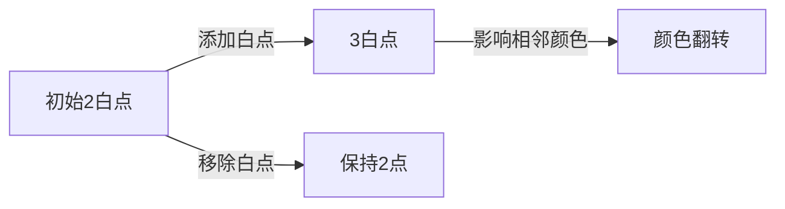

# 题目信息

# 「Wdsr-2」阴阳玉

## 题目背景

博丽灵梦有一块好大好大的阴阳玉，它是是博丽灵梦的主要武器之一。

但是阴阳玉的能量来源，源自主人的灵力聚集力量，因此，灵梦在平时总是需要对其进行保养。简单来说，灵梦会使用灵力，来获取阴阳玉所需的能量。


## 题目描述

灵力有阴阳之分。初始的时候，灵梦只有两个阳灵力，它们围成了一个圈。每次，灵梦可以进行以下两种操作：

- 在两个灵力直接加入一个阳灵力。

- 移走一个阳灵力。

为了保持稳定，任何时候这个圈上的灵力都**不应该少于两个**。

由于灵力的阴阳并不稳定，因此一旦某个灵力周围发生改变（多出一个灵力，或减少一个灵力），它就会从阳变成阴，或从阴变成阳。不过，如果只是周边灵力的性质改变，那么它就不会发生变化。

灵梦会不断调节灵力，直到它**最终**变成 $n$ 个（中途可能多于 $n$ 个）。然后，灵梦会从某个点**依次**按照顺时针或逆时针取下每个灵力。它会形成一条链。灵梦会用链上的能量，来加强她的阴阳玉。

做到这一点非常容易。但是灵梦非常好奇，一共可能形成多少种不同的**链**。

由于灵梦的偏好，她可能会有 $m$ 个限制条件。第 $i$ 个条件 $(p_i,c_i)$ ，规定了链上第 $p_i$ 个灵力应该为何种灵力。若 $c_i=0$ ，则应该为阴灵力；否则为阳。

由于可能结果太大，灵梦只需要得到答案对 $998244353$ 取模的结果。

两个链不同，当且仅当存在一个位置的点颜色不同。

## 说明/提示

#### 样例解释

对于样例一，可能存在以下两种构造方式：


其中， $\tt ADD$ 表示增加一个阳灵力，$\tt RMV$ 表示移走一个阳灵力。

将得到的两个环分别拆开，一共可以得到以下五种链：

- 环一：**阳—阳—阳—阳**。

- 环二：**阳—阳—阴—阴**，**阳—阴—阴—阳**，**阴—阴—阳—阳**，**阴—阳—阳—阴**。

因此答案为 $5$ 。

对于样例二，我们限定了链上第一个灵力为阳。因此结果为 $3$ 。

#### 数据范围

$$\def\t{\text}\def\arraystretch{1.5}
\begin{array}{|c|c|c|c|}\hline
\textbf{Subtask} & n\t{ 的范围} & m\t{ 的范围} & \t{分值}\cr\hline
1 & n\le 16 & m\le 16 & 15 \cr \hline
2 & n\le 10^6 &  m\le 5\times 10^3 & 40 \cr \hline
3 & n\le 10^{18} & m=0 & 15 \cr \hline
4 & n\le 10^{18} & m\le 5\times 10^3 & 30 \cr \hline
\end{array}$$

此外，对于全部数据，有 $1\le p_i\le n,c_i\in \{0,1\}, 0\le m\le n$ 且 $p_i$ 各不相同。

## 样例 #1

### 输入

```
4 0```

### 输出

```
5```

## 样例 #2

### 输入

```
4 1
1 1```

### 输出

```
3```

## 样例 #3

### 输入

```
20 10
5 1
12 0
17 0
3 1
7 1
13 0
8 1
18 1
2 1
19 0```

### 输出

```
344```

# AI分析结果


### 💡 Kay的C++算法解析：「阴阳玉」深入学习指南 💡

#### 1. 题目解读与核心算法识别
✨ **本题主要考察**：`动态规划` + `矩阵快速幂优化`  
🗣️ **初步分析**：
> 解决「阴阳玉」的关键在于**状态建模**和**高效转移**，如同在像素游戏中规划角色路径。初始有2个阳灵力（白点），通过添加/移除白点改变结构，最终形成n个点的环并拆解成链。核心挑战在于：
> - **双性质约束**：阴点数量恒为偶数，权值和S≢0(mod3)
> - **链上约束**：m个位置的颜色限制
> 
> **解题框架**：
> 1. **DP状态设计**：`f[i][j][k]`表示前i个点，阴点奇偶性为j，权值和mod3=k的方案数
> 2. **矩阵加速**：将DP转移转化为矩阵乘法，应对n≤10¹⁸
> 3. **约束处理**：对m个限制点分段执行矩阵快速幂
>
> **可视化设计**：
> 采用**8位像素风**演示灵力环的变化过程：
> - 白点显示为🔵，黑点显示为⚫
> - 添加白点时播放"叮"音效，移除时播放"咔"音效
> - 权值和S实时显示在屏幕顶部
> - 控制面板支持单步/自动播放，速度可调

---

#### 2. 精选优质题解参考
**题解一（作者：囧仙）**  
* **点评**：通过严谨的数学证明（阴点数量奇偶性、权值和模3性质）建立DP状态转移方程，代码采用模块化设计：  
  - 核心亮点：  
    ① 用`(j,k)`二维状态压缩替代三维DP（j=阴点奇偶性，k=S mod3）  
    ② 约束点分段处理：无约束段用矩阵幂，约束点暴力转移  
    ③ 转移矩阵设计清晰（6×6矩阵）  
  - 实践提示：注意第一个点的初始化需特殊处理

**题解二（作者：JackMerryYoung）**  
* **点评**：与题解一思路一致但更侧重教学性：  
  - 核心亮点：  
    ① 详细注释矩阵乘法类实现  
    ② 状态转移公式显式给出（优于直接写代码）  
    ③ 强调边界条件：`n=2`时需特判  
  - 学习价值：展示如何从数学性质推导DP状态

---

#### 3. 核心难点辨析与解题策略
1. **难点1：状态设计的数学基础**  
   *分析*：需证明两个核心性质：  
   - 阴点数量恒为偶：初始为0，操作只改变±2或不变  
   - S≢0(mod3)：初始S=±2，操作使S变化±3  
   *💡 学习笔记*：数学性质是DP状态设计的基石

2. **难点2：矩阵维度压缩**  
   *分析*：将DP转移抽象为线性变换：  
   ```
   |f_new| = | 0 1 0 1 0 0 |   |f_old|
            | 0 0 1 0 1 0 |
            | 1 0 0 0 0 1 |
            | ...         |
   ```
   *💡 学习笔记*：当DP仅依赖前一状态且状态数少时，必考虑矩阵快速幂

3. **难点3：约束点打断连续性**  
   *分析*：处理m个约束点的策略：  
   ```python
   sort(constraints)  # 按位置排序
   current_pos = 1
   for each constraint at position p:
       用矩阵幂加速 [current_pos, p-1] 段
       在p位置过滤非法状态（根据约束颜色）
       current_pos = p
   用矩阵幂加速 [last_constraint, n] 段
   ```
   *💡 学习笔记*：分段处理是混合DP的常用技巧

---

#### 4. C++核心代码实现赏析
**通用核心实现（综合题解）**  
```cpp
#include <bits/stdc++.h>
#define MOD 998244353
using namespace std;

struct Matrix {
    long long mat[6][6];
    Matrix operator*(const Matrix& other) {
        // 实现6×6矩阵乘法
    }
};

Matrix power(Matrix base, long long exp) {
    // 矩阵快速幂实现
}

int main() {
    long long n, m;
    vector<pair<long long, bool>> constraints;
    // 输入处理

    Matrix trans = { /* 转移矩阵 */ };
    vector<long long> state(6); // dp[j][k]

    // 初始化第一个点
    if(第一个点有约束) state[约束对应状态] = 1;
    else state[1] = state[3] = 1; // 无约束初始化

    long long last_pos = 1;
    for(auto [p, c] : constraints) {
        if(p > last_pos) {
            Matrix step = power(trans, p - last_pos);
            state = state * step; // 矩阵乘法更新状态
        }
        // 过滤非法状态（根据c）
        last_pos = p;
    }
    if(last_pos < n) {
        Matrix step = power(trans, n - last_pos);
        state = state * step;
    }

    cout << (state[1] + state[2]) % MOD;
}
```

**题解一核心片段赏析**  
```cpp
// 约束点处理逻辑
for(int i=1; i<=m; i++){
    if(约束点在位置p){
        Matrix step = power(trans, p - current_pos);
        state = state * step;
        // 根据约束颜色过滤state
        current_pos = p;
    }
}
```
* **亮点**：清晰的分段处理逻辑  
* **学习笔记**：矩阵幂与暴力DP切换时，注意状态向量维度匹配

---

#### 5. 算法可视化：像素动画演示  
**主题**：`灵力环构造模拟器`（复古RPG风格）  

**核心设计**：  


**交互实现**：  
1. **场景**：  
   - 灵力环：像素圆环（半径200px）  
   - 控制面板：8-bit风格按钮（开始/步进/重置）  
2. **动画逻辑**：  
   ```javascript
   function addPoint(position) {
     playSound('add'); // 添加音效
     flipColor(prevPoint(position));
     flipColor(nextPoint(position));
     points.splice(position, 0, WHITE);
   }
   ```
3. **动态显示**：  
   - 当前阴点数量：屏幕左上角  
   - 权值和S：环形进度条（红/蓝指示）  
4. **游戏化**：  
   - 每完成n/10个点：播放"升级"音效  
   - 错误操作时：屏幕抖动+警告音  

---

#### 6. 拓展练习
1. **洛谷 P3390** - 矩阵快速幂模板  
   *推荐理由*：巩固矩阵快速幂的编码实现  
2. **洛谷 P4159** - 状态压缩DP  
   *推荐理由*：练习状态压缩技巧+复杂度优化  
3. **洛谷 P7092** - 计数DP+约束处理  
   *推荐理由*：强化分段DP处理能力  

---

#### 7. 学习心得
> **经验分享**：  
> "调试时先验证小规模n=3,4的手算结果，避免矩阵构造错误"  
>   
> **Kay点评**：  
> 矩阵类题目常见陷阱：  
> 1. 单位矩阵初始化错误  
> 2. 矩阵乘法不满足交换律  
> 3. 状态索引计算偏移  
> 建议：封装矩阵类并重载运算符  

--- 
保持思考，算法就像阴阳玉的平衡——在数学严谨与代码创造间寻找和谐！✨

---
处理用时：154.45秒