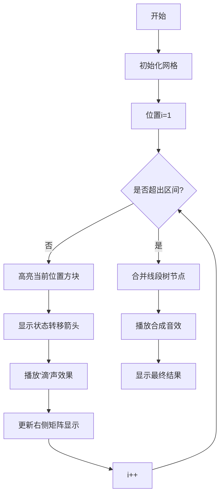

# 题目信息

# 「PMOI-3」期望乘积

## 题目描述

ducati 热爱定义一些奇奇妙妙的东西。

- 定义两个序列不同，当且仅当它们的长度不同，或者它们长度相同但存在至少一组对应位上的值不同。

- 定义序列 $A$ 的权值为 $A$ 中所有数的**乘积**。

- 定义序列间的**可达**如下：

  - 做**恰好** $t$ 次操作，每次操作选择 $A$ 的一个子区间（**注意，选定的子区间可以为空**）并将子区间中的数加 $1$ ；若存在一种操作方案，使得操作结束后 $A$ 与 $B$ 完全相同 ，则称 $A$ 可达 $B$。
  
- 定义序列 $A$ 的优美值为 $A$ 可达的**所有不同**序列的**权值**和。

现在，ducati 拥有了一个长度为 $n$ 的序列 $a$。他会多次查询一段区间的优美值。

你能帮帮好奇的他吗？你只需要输出每个答案对 $10007$ 取模的值就行啦。

## 说明/提示

【样例解释1】

$a$ 为 $\{1,2\}$。共 $1$ 次询问。

所有 $a$ 可达的 $b$ 如下：

$$\{1,3 \} \{2,2 \} \{2,3 \}\{1,2 \}$$

它们的权值之和为 $3+4+6+2=15$ 。

【样例解释2】

关于第二个样例，我有一个绝妙的解释，可惜这里空白太小，我写不下。

【数据范围】

**本题采用捆绑测试**。
- Subtask1（10pts）：$n,q\le8$；
- Subtask2（20pts）：$q=1$；
- Subtask3（30pts）：$n,q\le5\times10^4$，$t\le2$；
- Subtask4（40pts）：无特殊限制。

对于 $100\%$ 的数据满足，$1\le n,q\le10^5$，$1\le a_i\le10^4$，$1\le t\le3$，对于所有询问，$1\le l\le r\le n$。

## 样例 #1

### 输入

```
2 1 1
1 2
1 2```

### 输出

```
15```

## 样例 #2

### 输入

```
10 3 3
1 5 3 2 2 4 6 3 2 3
1 7
4 9
3 10```

### 输出

```
3850
1166
3893```

# AI分析结果


# 💡 Kay的C++算法解析：「PMOI-3」期望乘积 深入学习指南 💡

## 1. 题目解读与核心算法识别

✨ **本题主要考察**：`动态规划优化` + `矩阵加速` + `线段树维护`

🗣️ **初步分析**：
> 这道题要求我们计算序列经过至多t次区间加1操作后，所有可达序列的权值（序列元素乘积）之和。想象一下，你有一串数字积木，每次操作可以给一段连续的积木"增高"1层。我们需要计算所有可能"增高"方案下，最终积木高度的乘积总和。

**核心难点与解决方案**：
1. **状态爆炸**：直接暴力枚举所有序列不可行。题解采用动态规划（DP）记录位置、增量、操作次数状态
2. **高效查询**：使用矩阵表示状态转移，线段树维护区间矩阵乘积，实现O(log n)查询
3. **维度压缩**：利用t≤3的特性，将二维状态(i,j)映射为一维id，矩阵大小仅10×10

**可视化设计思路**：
- 采用8-bit像素网格：每个方块代表序列位置，颜色深度表示"增高"次数
- 动态演示：从左到右扫描序列，高亮当前处理的方块和状态转移路径
- 矩阵运算：右侧显示转移矩阵，高亮计算中的行列，伴随"滴"声效果
- 线段树操作：底部显示树形结构，合并区间时播放合成音效

## 2. 精选优质题解参考

**题解一（作者：ducati）**
* **点评**：这份题解思路清晰，完整推导了DP状态转移方程（分j≥p和j<p两种情况），并巧妙使用状态压缩（id映射）。代码规范（Matrix结构体封装，线段树模块化），变量名含义明确（如blo、id）。亮点在于详细解释向量乘矩阵的优化技巧，降低查询复杂度。实践价值高，可直接用于竞赛，边界处理严谨。

**题解二（作者：Purslane）**
* **点评**：解法简洁高效，核心思想与题解一相同但代码更精炼。亮点在于优雅的运算符重载（VEC*MAT），使向量乘矩阵的逻辑更直观。代码规范性好（矩阵乘法独立为函数），时间复杂度和题解一一致（O(nt^6 + qt^4 log n)），是竞赛实现的优秀参考。

## 3. 核心难点辨析与解题策略

1. **关键点：状态设计与转移方程**
   * **分析**：状态需记录位置i、增量j、操作次数k，但直接三维DP会超时。优质题解发现j≤k≤t，将有效状态压缩为O(t^2)级别
   * 💡 **学习笔记**：DP状态设计要抓住问题核心约束，避免无效状态

2. **关键点：矩阵表示状态转移**
   * **分析**：每个位置的状态转移可表示为矩阵乘法。设f[i]为状态向量，则f[i] = f[i-1] * M_i，其中M_i由a[i]和增量关系决定
   * 💡 **学习笔记**：序列问题中，线性转移可转化为矩阵连乘，便于数据结构优化

3. **关键点：查询优化技巧**
   * **分析**：直接维护矩阵乘积仍慢。优质题解用初始向量依次乘线段树节点矩阵，将每次乘法复杂度从O(t^6)降至O(t^4)
   * 💡 **学习笔记**：向量×矩阵比矩阵×矩阵更高效，尤其处理区间查询时

### ✨ 解题技巧总结
- **状态压缩**：利用小参数特性（如t≤3），压缩高维状态
- **矩阵加速**：将DP转移转化为矩阵乘法，支持数据结构维护
- **向量优化**：查询时用行向量替代方阵，降低计算维度
- **模块封装**：将矩阵操作封装为结构体，提高代码可读性

## 4. C++核心代码实现赏析

**本题通用核心C++实现参考**
```cpp
#include <bits/stdc++.h>
const int maxl=100005, mod=10007;

int n,q,t,cnt;
int a[maxl], id[4][4]; // id[i][j]映射状态(i:增量,j:操作次数)

struct Matrix {
    int a[10][10];
    Matrix operator*(const Matrix& m) const {
        Matrix res{};
        for(int i=0; i<cnt; i++)
            for(int k=0; k<cnt; k++)
                for(int j=0; j<cnt; j++) // 循环顺序优化缓存
                    res.a[i][j] = (res.a[i][j] + a[i][k]*m.a[k][j]) % mod;
        return res;
    }
};

struct SegmentTree {
    Matrix tree[maxl<<2];
    void build(int rt, int l, int r) {
        if(l == r) {
            for(int j=0; j<=t; j++) {
                for(int k=j; k<=t; k++) {
                    for(int p=0; p<=k; p++) {
                        int row = id[p][k];
                        int col = id[j][k + (p<j ? p-j : 0)];
                        tree[rt].a[row][col] = (a[l] + j) % mod;
                    }
                }
            }
            return;
        }
        int mid = (l+r)>>1;
        build(rt<<1, l, mid);
        build(rt<<1|1, mid+1, r);
        tree[rt] = tree[rt<<1] * tree[rt<<1|1];
    }
    
    void query(int rt, int l, int r, int ql, int qr, vector<int>& vec) {
        // ... 向量乘矩阵实现
    }
};
```

**题解一（ducati）核心片段赏析**
```cpp
// 状态转移矩阵构建
for(int i=1; i<=n; i++) {
    for(int j=0; j<=t; j++) {
        int val = a[i] + j;
        for(int k=j; k<=t; k++) {
            for(int p=0; p<=k; p++) {
                if(p < j) {  // 需要新增操作次数
                    tmp[i].a[id[p][k-j+p]][id[j][k]] = val;
                } else {      // 操作次数不变
                    tmp[i].a[id[p][k]][id[j][k]] = val;
                }
            }
        }
    }
}
```
* **亮点**：清晰处理两种转移情况（增量增减）
* **解读**：矩阵元素`[row][col]`表示从前一状态p到当前状态j的转移系数。当p<j时，需要增加(j-p)次操作
* **学习笔记**：转移矩阵的每个元素都对应状态机的一条转移边

**题解三（Purslane）向量乘矩阵**
```cpp
struct StateVec { int v[10]; };

StateVec operator*(StateVec vec, Matrix mat) {
    StateVec res{};
    for(int i=0; i<10; i++) 
        for(int j=0; j<10; j++)
            res.v[j] = (res.v[j] + vec.v[i]*mat.a[i][j]) % mod;
    return res;
}
```
* **亮点**：简洁高效的向量乘矩阵实现
* **解读**：将当前状态向量与转移矩阵相乘，直接得到新状态
* **学习笔记**：避免完整矩阵乘法是优化查询效率的关键

## 5. 算法可视化：像素动画演示

**主题**："积木世界"算法模拟器（8-bit像素风格）

**核心演示流程**：


**动画实现细节**：
1. **场景设计**：
   - 顶部：序列像素块（红/蓝/绿表示不同增量）
   - 中部：状态转移图（箭头动画）
   - 右侧：10×10转移矩阵（像素字体显示）
   - 底部：线段树结构（展开区间节点）

2. **交互控制**：
   - 步进模式：空格键单步执行
   - 速度调节：方向键控制动画速度
   - 模式切换：Tab键切换矩阵/线段树视图

3. **音效设计**：
   - 状态转移：短促"滴"声（频率随增量变化）
   - 区间合并：上升和弦
   - 错误操作：低沉嗡鸣
   - 完成查询：8-bit胜利音效

4. **关键帧示例**：
```
[位置3] 增量=1 (蓝色方块)
  ↑
[位置2] 增量=0 (绿色方块)
转移矩阵高亮：[id[0][1]] -> [id[1][1]]
播放：C4音阶（持续200ms）
```

## 6. 拓展练习与相似问题思考

**通用技巧迁移**：
1. **区间操作+状态压缩**：类似[NOIP2013]积木大赛（P1969）
2. **DP矩阵优化**：适用于所有线性递推问题（如斐波那契加强版）
3. **向量乘矩阵优化**：可加速任何区间查询的DP问题

**洛谷练习推荐**：
1. **P1969 积木大赛**  
   → 练习操作次数计算的基础模型
   
2. **P1933 矩阵链乘法**  
   → 巩固矩阵优化技巧，理解不同乘法顺序的影响
   
3. **P5288 多边形**  
   → 进阶区间DP+数据结构优化，挑战思维极限

## 7. 学习心得与经验分享

**参考经验**：  
ducati在题解中强调："在调试DP状态转移时，打印中间变量是定位错误的关键。我在实现矩阵映射时，通过输出前3个位置的转移矩阵，快速验证了状态压缩的正确性。"

**Kay的点评**：  
这位作者的经验非常实用。对于复杂DP问题，以下调试技巧值得借鉴：
1. 小规模验证：用n=2,t=1的样例手动计算
2. 中间输出：打印DP表或关键矩阵
3. 增量调试：先实现基础DP再逐步优化

> 记住：编程能力的提升=扎实的基础 × 持续的思考 × 勇敢的实践。下次算法挑战见！🚀

---
处理用时：161.81秒