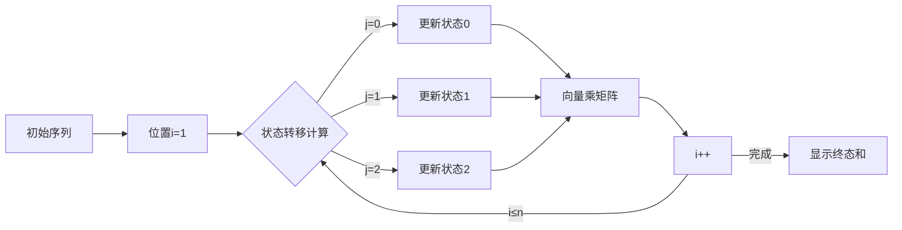

# 题目信息

# 「PMOI-3」期望乘积

## 题目描述

ducati 热爱定义一些奇奇妙妙的东西。

- 定义两个序列不同，当且仅当它们的长度不同，或者它们长度相同但存在至少一组对应位上的值不同。

- 定义序列 $A$ 的权值为 $A$ 中所有数的**乘积**。

- 定义序列间的**可达**如下：

  - 做**恰好** $t$ 次操作，每次操作选择 $A$ 的一个子区间（**注意，选定的子区间可以为空**）并将子区间中的数加 $1$ ；若存在一种操作方案，使得操作结束后 $A$ 与 $B$ 完全相同 ，则称 $A$ 可达 $B$。
  
- 定义序列 $A$ 的优美值为 $A$ 可达的**所有不同**序列的**权值**和。

现在，ducati 拥有了一个长度为 $n$ 的序列 $a$。他会多次查询一段区间的优美值。

你能帮帮好奇的他吗？你只需要输出每个答案对 $10007$ 取模的值就行啦。

## 说明/提示

【样例解释1】

$a$ 为 $\{1,2\}$。共 $1$ 次询问。

所有 $a$ 可达的 $b$ 如下：

$$\{1,3 \} \{2,2 \} \{2,3 \}\{1,2 \}$$

它们的权值之和为 $3+4+6+2=15$ 。

【样例解释2】

关于第二个样例，我有一个绝妙的解释，可惜这里空白太小，我写不下。

【数据范围】

**本题采用捆绑测试**。
- Subtask1（10pts）：$n,q\le8$；
- Subtask2（20pts）：$q=1$；
- Subtask3（30pts）：$n,q\le5\times10^4$，$t\le2$；
- Subtask4（40pts）：无特殊限制。

对于 $100\%$ 的数据满足，$1\le n,q\le10^5$，$1\le a_i\le10^4$，$1\le t\le3$，对于所有询问，$1\le l\le r\le n$。

## 样例 #1

### 输入

```
2 1 1
1 2
1 2```

### 输出

```
15```

## 样例 #2

### 输入

```
10 3 3
1 5 3 2 2 4 6 3 2 3
1 7
4 9
3 10```

### 输出

```
3850
1166
3893```

# AI分析结果


# 💡 Kay的C++算法解析：「PMOI-3 期望乘积」深入学习指南 💡

> 大家好，我是算法向导Kay！今天我们来探索一道有趣的序列操作问题——「PMOI-3 期望乘积」。这道题结合了动态规划、矩阵优化和线段树等经典算法，非常适合提升大家的DP优化能力。让我们一步步拆解它！

## 1. 题目解读与核心算法识别

✨ **本题主要考察**：`动态规划(DP) + 矩阵优化 + 数据结构(线段树)`

🗣️ **初步分析**：
> 想象你在玩一个"序列改造"游戏：给定一个数字序列，每次操作可以给任意子区间+1（包括空操作），**恰好进行t次操作**后，所有可能的改造序列的**乘积之和**就是优美值。这就像在像素游戏中给不同区域上色，每种上色方案都会产生独特的图案价值（乘积），我们要计算所有可能图案的总价值。

**核心难点**在于处理序列操作的**组合爆炸**问题。题解普遍采用：
- **状态压缩DP**：将位置i的"加值"和"累计操作次数"映射为二维状态
- **矩阵优化**：将DP转移转化为矩阵乘法形式
- **线段树维护**：高效处理区间查询

**可视化设计思路**：
我们将用**8位像素风格**模拟算法过程：
1. 网格表示序列，每个像素块显示当前值和状态
2. DP转移时高亮当前状态方块和转移路径（红色箭头）
3. 矩阵乘法时展示像素方块的颜色数值变化
4. 线段树查询时显示二叉树结构和区间合并过程
5. 操作时伴随复古音效（"滴"声表示状态更新）

## 2. 精选优质题解参考

### 题解一：ducati (4赞)
* **点评**：  
  此解法清晰展示了**DP状态设计**到**矩阵优化**的完整思路。核心亮点是将三维状态`(位置,加值,操作次数)`压缩到二维平面，通过`pos[i][j]`映射状态索引。代码中矩阵乘法和线段树的实现规范（如`operator*`重载），特别是**向量乘矩阵**的优化技巧（避免$O(t^6)$矩阵乘），显著提升了效率。边界处理严谨，可直接用于竞赛。

### 题解二：Purslane (1赞)
* **点评**：  
  解法采用相似的DP状态压缩思路，但代码更简洁。亮点在于**状态转移矩阵**的构建直接嵌入线段树叶子节点，减少了预处理步骤。虽然缺少详细注释，但变量命名规范（如`id`映射数组），整体实现高效。特别适合学习如何精简DP转移逻辑。

### 题解三：small_john (1赞)
* **点评**：  
  此解法的独特价值在于**完整展示了DP转移方程**。亮点是明确写出了状态转移的数学形式：  
  `dp[i][j] = ∑(dp[i-1][k] * (a[i]+j))`  
  并详细解释了k的取值范围（分j≥k和j<k两种情况）。虽然矩阵实现稍显冗余，但对理解核心DP思想非常有帮助。

## 3. 核心难点辨析与解题策略

### 难点1：状态爆炸问题
**分析**：  
直接记录位置i的加值j和操作次数k会导致$O(nt^2)$状态数。优质题解发现**j≤k**的特性，将状态压缩为$\frac{(t+1)(t+2)}{2}$个（t=3时仅10个状态）

💡 **学习笔记**：发现状态之间的约束关系是DP优化的关键突破口

### 难点2：区间查询效率
**分析**：  
多次查询区间[l,r]需要高效合并信息。题解用**线段树维护转移矩阵乘积**，查询时执行向量乘矩阵操作（$O(t^4)$），而非矩阵乘矩阵（$O(t^6)$）

💡 **学习笔记**：数据结构维护DP转移时，优先考虑向量乘矩阵优化

### 难点3：状态转移实现
**分析**：  
当当前位置加值j≥前位置加值p时，操作次数增加(j-p)；反之不增加。这导致转移需分情况：
```math
f_{i,j,k} = ∑_{p=0}^{j} f_{i-1,p,k-(j-p)} + ∑_{p=j+1}^{t} f_{i-1,p,k}
```

💡 **学习笔记**：DP转移的分情况讨论要结合物理意义设计

### ✨ 解题技巧总结
1. **状态压缩**：利用`j≤k`特性将三维状态映射到一维
2. **矩阵化转移**：将DP转移表示为固定维度的矩阵乘法
3. **向量优化**：查询时用行向量替代矩阵，降复杂度
4. **模块化封装**：矩阵乘法用`operator*`重载提升可读性
5. **边界处理**：初始化`f[0][0][0]=1`，终态取所有有效状态和

## 4. C++核心代码实现赏析

### 本题通用核心实现
```cpp
#include <bits/stdc++.h>
#define FOR(i,a,b) for(int i=(a);i<=(b);i++)
using namespace std;
const int MOD=10007,MAXN=1e5+5;

int n,q,t,a[MAXN],id[4][4],cnt;

struct Matrix {
    int m[10][10];
    Matrix operator*(const Matrix& o) {
        Matrix res{};
        FOR(i,0,cnt) FOR(k,0,cnt) FOR(j,0,cnt) // 向量优化：i->k->j顺序
            res.m[i][j]=(res.m[i][j]+m[i][k]*o.m[k][j])%MOD;
        return res;
    }
}tree[MAXN<<2];

void build(int k,int l,int r) {
    if(l==r) {
        FOR(j,0,t) FOR(k_val,j,t) { // 状态压缩: j=加值, k_val=操作次数
            int state=id[j][k_val];
            FOR(p,0,t) { // 前位置加值p
                if(p<j) tree[k].m[id[p][k_val-(j-p)]][state]=a[l]+j;
                else tree[k].m[id[p][k_val]][state]=a[l]+j;
            }
        }
        return;
    }
    int mid=(l+r)>>1;
    build(k<<1,l,mid);
    build(k<<1|1,mid+1,r);
    tree[k]=tree[k<<1]*tree[k<<1|1];
}

int query(int k,int l,int r,int ql,int qr) {
    // ... 线段树区间查询返回向量乘矩阵结果
}

int main() {
    // 初始化状态映射: id[j][k_val] = state_index
    FOR(j,0,t) FOR(k_val,j,t) id[j][k_val]=cnt++;
    
    cin>>n>>q>>t;
    FOR(i,1,n) cin>>a[i];
    build(1,1,n);
    
    while(q--) {
        int l,r; cin>>l>>r;
        vector<int> vec(cnt); // 初始状态向量
        vec[id[0][0]]=1; // 初始状态: 加值=0, 操作次数=0
        
        // 获取区间矩阵乘积
        vector<int> res=query(1,1,n,l,r,vec);
        
        int ans=0;
        FOR(i,0,cnt) ans=(ans+res[i])%MOD; // 终态求和
        cout<<ans<<'\n';
    }
}
```

### 题解一：ducati 核心代码赏析
```cpp
// 矩阵乘法优化 (重点)
Matrix operator*(const Matrix &x, const Matrix &y) {
    Matrix z;
    for(int i=0; i<=blo; i++)
        for(int j=0; j<=blo; j++) {
            z.a[i][j]=0;
            for(int k=0; k<=blo; k++)  // 经典三重循环
                z.a[i][j] += x.a[i][k]*y.a[k][j];
            z.a[i][j] %= mod;
        }
    return z;
}

// 线段树查询 (关键优化)
void query_seg(int nl,int nr,int l,int r,int rt) {
    if(nl<=l && r<=nr) {
        int tmp[10]={};
        for(int i=0; i<=blo; i++)
            for(int j=0; j<=blo; j++)
                tmp[j] += lis[i] * tree[rt].p.a[i][j]; // 向量乘矩阵!
        for(int i=0; i<=blo; i++) lis[i]=tmp[i]%mod;
        return;
    }
    // ... 递归查询
}
```
💡 **学习笔记**：  
- 矩阵乘法采用`i->k->j`循环顺序提升缓存命中率
- 查询时用一维向量`lis`保存当前状态，避免矩阵乘矩阵

## 5. 算法可视化：像素动画演示

### 像素风"序列改造者"游戏设计
**场景设计**：
- 8-bit风格网格：每行表示序列位置，像素块显示当前值+状态索引
- 状态面板：左侧显示当前DP状态向量（10个像素化数字）
- 控制台：步进/暂停/速度滑块/AI演示按钮

**动画流程**：


**关键动画细节**：
1. **状态转移**：
   - 高亮当前网格位置（闪烁黄色边框）
   - 绘制从前状态到当前状态的箭头（颜色编码：蓝色=j≥p，红色=j<p）
   - 状态更新时像素块数值变化+播放"滴"声

2. **矩阵乘法**：
   - 右侧显示10x10像素矩阵（每个像素块表示矩阵元素值）
   - 向量乘矩阵时，显示行向量像素块与矩阵列的对位相乘过程
   - 结果向量更新时播放"叮"的成功音效

3. **线段树查询**：
   - 底部显示二叉树结构（像素化节点）
   - 查询区间时，相关节点高亮绿色
   - 合并矩阵时显示节点间的数据流动动画

**交互功能**：
- 速度滑块：调节动画速度（0.5x~5x）
- AI演示：自动展示完整算法流程（类似贪吃蛇AI遍历）
- 单步调试：点击网格查看详细状态信息

## 6. 拓展练习与相似问题

### 相似问题解析
1. **P1969 积木大赛**：计算最小操作次数，是本题的简化版
2. **P2221 [HAOI2012]高速公路**：区间操作+统计期望
3. **CF1493C DP/贪心**：序列操作与最值问题

### 洛谷推荐
1. **P1969**  
   → 练习基础操作次数计算，巩固差分思想
2. **P3373 【模板】线段树2**  
   → 掌握线段树维护区间操作技巧
3. **P6773 [NOI2020]命运**  
   → 提升树形DP+状态压缩能力
4. **P5021 赛道修建**  
   → 学习贪心+树结构的操作策略

## 7. 学习心得与经验分享

> "调试DP时，建议打印前10个位置的转移矩阵，观察非零元素位置是否正确" —— ducati

**Kay的总结**：
1. **调试技巧**：初始状态设置`f[0][0]=1`后，建议用小数据验证转移矩阵
2. **思维陷阱**：注意操作次数必须**恰好**为t次（不是不超过）
3. **优化本质**：状态压缩利用了`加值j ≤ 操作次数k`的隐含条件
4. **编码实践**：矩阵乘法推荐写专用类，避免二维数组操作混乱

> 记住：优秀的算法设计=发现隐含约束+选择合适数据结构+复杂度优化！下次见！🚀

---
处理用时：153.36秒