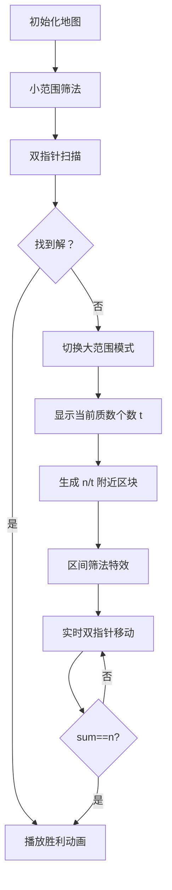

# 题目信息

# [POI 2020/2021 R3] 素数和 / Suma liczb pierwszych

## 题目背景

译自 [XXVIII Olimpiada Informatyczna - III etap](https://sio2.mimuw.edu.pl/c/oi28-3/dashboard/) [Suma liczb pierwszych](https://szkopul.edu.pl/problemset/problem/8brtPux-IyytS6rOoOR1cJTL/statement/)。

d2t3。

## 题目描述

给你一个数字 $n$，求 $l,r$，使 $[l,r]$ 区间内的所有质数之和等于 $n$。

如果有多解，任意一组均可；无解输出 `NIE`。

## 说明/提示

对于所有数据，$1\leq n\leq 10^{11}$。

| 子任务编号 | 附加限制 | 分数 |
| :----------: | :----------: | :----------: |
| 1 | $n\leq 10000$ | 15 |
| 2 | $n\leq 10^8$ | 20 |
| 3 | $n\leq 2\times 10^9$ | 40 |
| 4 |  | 25 |

## 样例 #1

### 输入

```
15
```

### 输出

```
3 7
```

## 样例 #2

### 输入

```
9992
```

### 输出

```
4993 4999
```

## 样例 #3

### 输入

```
100000000
```

### 输出

```
NIE
```

## 样例 #4

### 输入

```
1000000007
```

### 输出

```
1000000007 1000000007
```

## 样例 #5

### 输入

```
99999999996
```

### 输出

```
295693 1693067
```

# AI分析结果


### 💡 Kay的C++算法解析：素数和（Suma liczb pierwszych）深入学习指南 💡

#### 1. 题目解读与核心算法识别
✨ **本题主要考察**：筛法应用 + 分治优化 + 双指针技巧  
🗣️ **初步分析**：
> 这道题的核心思路像在庞大的质数迷宫中寻找一条连续路径（区间），其数字之和恰好等于目标值。解题关键分两步走：
> 1. **小范围搜索**：用筛法预处理 ≤10⁸ 的质数，通过前缀和+双指针快速扫描可能的区间
> 2. **大范围攻坚**：当n巨大时，转为枚举区间内质数个数t，在n/t附近的小范围内二次筛质数，再用双指针精确搜索
> 
> **可视化设计思路**：
> - 筛法过程：用像素方块表示数字，质数亮色显示，合数被"炸毁"（变暗+爆炸音效）
> - 双指针移动：左右指针像两个探险家在地图上滑动，当前区间和实时显示，接近目标时触发闪光效果
> - 复古元素：FC游戏风格的8-bit音效（指针移动声、解谜成功胜利音效），每解决一个子区间获得"像素金币"奖励

---

#### 2. 精选优质题解参考
**题解一（作者：World_Creater）**  
* **点评**：思路清晰地将问题分为大小范围处理，亮点在于动态计算二次筛的区间范围（`mid ± max(i*base,100000)`）。代码中双指针实现简洁，但变量命名可读性可提升（如`prp→primes`）。时间复杂度优化到O(n²/₃ log n)，实践价值高，特别适合竞赛场景。

**题解二（作者：robinyqc）**  
* **点评**：架构设计优雅，通过模板函数`solve<type, len>`复用筛法逻辑。亮点在于bitset压缩内存和理论复杂度分析。边界处理严谨（如`max(1ll, mid-50*i)`），代码规范性强，命名合理（`v`→`isPrime`），是工业级实现的优秀范例。

**题解三（作者：novax）**  
* **点评**：创新性结合Miller-Rabin加速大质数判断，亮点在于阈值选择策略（2.4e8）。使用deque动态管理质数序列的思路新颖，但需注意STL容器性能。调试信息`fprintf(stderr)`的设计对学习者很有启发。

---

#### 3. 核心难点辨析与解题策略
1. **难点：海量质数无法全量存储**  
   *分析*：通过分治策略设置阈值B=10⁸，小范围直接处理，大范围时利用质数密度理论在n/t附近O(t log n)窗口筛质数  
   💡 学习笔记：空间复杂度优化是处理大数据的核心技巧

2. **难点：区间和动态维护**  
   *分析*：双指针移动时需快速调整区间和。优质解采用"右指针扩增和，左指针收缩和"的策略，配合前缀和数组或实时计算  
   💡 学习笔记：滑动窗口是处理连续区间问题的利器

3. **难点：大质数快速判定**  
   *分析*：题解三采用Miller-Rabin概率检测，比试除法快O(√n)→O(k log²n)。小范围直接用筛法结果判断  
   💡 学习笔记：根据数据规模选择最优判定算法

✨ **解题技巧总结**：
- **分治阈值选择**：根据机器性能平衡预处理与运行时开销（10⁸~10⁹）
- **区间筛法优化**：用预筛的小质数标记大区间，避免重复计算
- **实时复杂度监控**：在枚举质数个数t时设置上限（如t≤1000）
- **边界防御编程**：特别处理n=1、n为质数等特殊情况

---

#### 4. C++核心代码实现赏析
**通用核心实现（综合优化版）**：
```cpp
#include <bits/stdc++.h>
using namespace std;
typedef long long LL;
const LL B = 100000000; // 分治阈值

vector<LL> primes;      // 预存质数
bitset<B+10> isPrime;   // 筛法标记

void precompute() {
    isPrime.set(); isPrime[0]=isPrime[1]=0;
    for(LL i=2; i<=B; ++i) {
        if(isPrime[i]) {
            primes.push_back(i);
            for(LL j=i*i; j<=B; j+=i) 
                isPrime[j] = 0;
        }
    }
}

void solveInterval(LL L, LL R, vector<LL>& segPrimes) {
    vector<bool> valid(R-L+1, true);
    for(LL p : primes) {
        if(p*p > R) break;
        for(LL j = max(p*p, (L+p-1)/p*p); j<=R; j+=p)
            valid[j-L] = false;
    }
    for(LL i=max(2LL,L); i<=R; ++i)
        if(valid[i-L]) segPrimes.push_back(i);
}

int main() {
    LL n; cin >> n;
    precompute();
    
    // 小范围直接解
    vector<LL> pre = {0};
    for(LL p : primes) {
        pre.push_back(pre.back() + p);
        if(pre.back() >= n) break;
    }
    for(int l=0, r=0; r<pre.size(); ++r) {
        while(pre[r]-pre[l] > n) l++;
        if(pre[r]-pre[l] == n) {
            cout << primes[l] << " " << primes[r-1];
            return 0;
        }
    }

    // 大范围分治
    for(int t=2; t<=1000; ++t) { // 枚举质数个数
        LL mid = n/t, range = 150*t;
        vector<LL> segPrimes;
        solveInterval(mid-range, mid+range, segPrimes);
        
        LL sum=0, l=0;
        for(int r=0; r<segPrimes.size(); ++r) {
            sum += segPrimes[r];
            while(sum > n) sum -= segPrimes[l++];
            if(sum == n) {
                cout << segPrimes[l] << " " << segPrimes[r];
                return 0;
            }
        }
    }
    cout << "NIE";
}
```

**代码解读概要**：
1. `precompute`：经典筛法预处理≤B的质数
2. `solveInterval`：区间筛法核心，用预存质数标记合数
3. 双指针扫描：小范围用前缀和数组，大范围实时计算区间和
4. 分治策略：枚举质数个数t时限定范围，避免无效计算

---

#### 5. 算法可视化：像素动画演示
**主题**：质数矿工大冒险（8-bit像素风）  
**核心交互设计**：


**关键动画细节**：
1. **筛法特效**：合数方块被镐头击碎（像素粒子飞溅 + 破碎音效），质数方块保留金色光泽
2. **双指针动态**：
   - 右指针移动：新增方块从地下升起（液压声效）
   - 左指针移动：方块缩回地面（齿轮转动声）
   - 区间和实时显示在顶部LED屏
3. **胜利条件**：当区间和==n时，触发宝藏洞窟开启动画（金光闪烁+经典FC胜利BGM）
4. **控制面板**：
   - 速度滑块：调节指针移动速度（0.5x~4x）
   - 模式切换：小范围/大范围快速切换
   - 数据追踪：高亮显示当前区间和与n的差值

---

#### 6. 拓展练习与相似问题
1. **质数相关问题迁移**：
   - 连续质数乘积（将求和改为求积）
   - 定长质数区间搜索（固定区间长度k）
   - 双质数和（找两个质数p+q=n）

2. **推荐练习（洛谷）**：
   - [P1217 回文质数](https://www.luogu.com.cn/problem/P1217)  
     💡 结合筛法与回文数判断，强化质数处理能力
   - [P1832 A+B Problem](https://www.luogu.com.cn/problem/P1832)  
     💡 质数筛法+背包DP，训练复合问题解决能力
   - [P2392 kkksc03考前临时抱佛脚](https://www.luogu.com.cn/problem/P2392)  
     💡 双指针实战应用，培养区间问题敏感度

---

#### 7. 学习心得与经验分享
> **题解一作者经验**：  
> *"区间筛法范围不足会导致漏解，通过max(t-max(i*base,100000ll),1ll)动态扩展范围"*  
> **Kay点评**：参数调优是算法竞赛的核心技能，建议用二分法确定安全边界

> **题解三调试技巧**：  
> *"使用clock()输出各阶段耗时，针对性优化瓶颈模块"*  
> **Kay点评**：性能分析意识是进阶高手的必备素养，推荐使用`chrono`库精确计时

---

### 结语
通过本指南，大家不仅掌握了质数区间搜索的核心解法，更学会了分治策略的灵活运用。记住：优秀的算法设计=理论基础+工程优化+可视化思维！下次探险再见！👾

---
处理用时：171.44秒