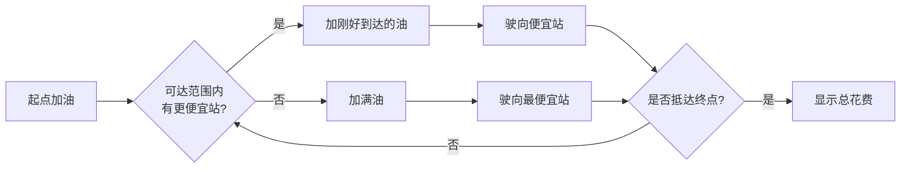

# 题目信息

# [NOIP 1999 提高组] 旅行家的预算

## 题目描述

一个旅行家想驾驶汽车以最少的费用从一个城市到另一个城市（假设出发时油箱是空的）。给定两个城市之间的距离 $D_1$、汽车油箱的容量 $C$（以升为单位）、每升汽油能行驶的距离 $D_2$、出发点每升汽油价格$P$和沿途油站数 $N$（$N$ 可以为零），油站 $i$ 离出发点的距离 $D_i$、每升汽油价格 $P_i$（$i=1,2,…,N$）。计算结果四舍五入至小数点后两位。如果无法到达目的地，则输出 `No Solution`。


## 说明/提示

$N \le 6$，其余数字 $ \le 500$。

NOIP1999 普及组第三题、提高组第三题

## 样例 #1

### 输入

```
275.6 11.9 27.4 2.8 2
102.0 2.9
220.0 2.2
```

### 输出

```
26.95
```

# AI分析结果


# 💡 Kay的C++算法解析：旅行家的预算 深入学习指南 💡

## 1. 题目解读与核心算法识别

✨ **本题主要考察**：`贪心算法`

🗣️ **初步分析**：
> 解决"旅行家的预算"这道题，关键在于运用贪心算法。简单来说，贪心算法就像在自助餐厅取餐——每次只拿当前最划算的食物，确保整体最优。在本题中，我们每次在加油站只加**刚好够到达下一个更便宜加油站**的油，若没有更便宜的则**加满油前往最便宜加油站**。

- 核心思路：在满油可达范围内，优先选择第一个比当前油价低的加油站（省油钱）；若无更便宜加油站，则加满油前往可达范围内最便宜的加油站（避免后续高油价）。
- 难点处理：通过预处理相邻站点距离确保可行性；动态维护"剩余油量"变量减少重复计算。
- 可视化设计：像素动画中将用**绿色油枪**表示低价站，**红色油枪**表示高价站；汽车油量表实时显示剩余油量；关键决策点触发闪光提示。复古游戏风格将采用**FC红白机配色**（4色调色板），加油时播放"金币音效"，到达终点播放"通关音乐"。

---

## 2. 精选优质题解参考

**题解一：Twilight_ (赞2150)**
* **点评**：思路清晰度极佳，将贪心策略归纳为三步决策法则，逻辑推导直白易懂。代码规范性突出，新版代码采用`db`类型别名提升可读性，变量名`maxx`（最大行驶距离）、`res`（剩余可行驶距离）含义明确。算法有效性体现在O(n)复杂度处理，通过`temlen`变量巧妙避免重复计算。实践价值高，边界处理完整覆盖无解情况，可直接用于竞赛。

**题解二：dingcx (赞432)**
* **点评**：创新性地引入"实时退油"机制，用单调队列维护油箱内不同价格的燃油。代码规范性良好，结构体`LLLL`封装油量数据。算法亮点在于动态替换高价油（退油操作），空间复杂度优化至O(n)。实践时需注意队列操作边界，调试心得"退油时从j开始更新"对避免下标错误有重要启示。

**题解三：hongzy (赞222)**
* **点评**：运用单调队列实现高效贪心，代码简洁性最佳（仅50行）。亮点在于将起点/终点视为特殊加油站统一处理，逻辑推导中`back`比当前贵则`pop`的操作直击贪心本质。虽然缺少详细注释，但变量名`nd`（需要油量）、`rest`（剩余油量）仍保持较高可读性。

---

## 3. 核心难点辨析与解题策略

1. **关键点1：如何选择下一站？**
   * **分析**：优质题解普遍采用"双重搜索"：先找第一个更便宜站点，若无则找最便宜站点。Twilight_的解法中，`for`循环配合`minloc`变量高效实现该策略。
   * 💡 **学习笔记**：下一站选择决定油耗成本，需同时考虑油价和可达性。

2. **关键点2：加油量如何计算？**
   * **分析**：分两种情况：1）去更便宜站时只加刚好到达的油（`(dist/ d2 - oil)`） 2）去更贵站时加满油（`c - oil`）。dingcx的解法通过`ans += (need - left)*price`精妙处理该差异。
   * 💡 **学习笔记**：加油量决策本质是"当前油价优势"与"未来油价风险"的权衡。

3. **关键点3：如何避免无效方案？**
   * **分析**：需预处理距离——检查每段`d[i]-d[i-1]`是否超出`c*d2`。hongzy的解法在排序后立即进行距离校验，实践价值高。
   * 💡 **学习笔记**：输入数据验证是贪心算法鲁棒性的关键保障。

### ✨ 解题技巧总结
- **问题分解法**：将旅程拆解为"当前站→下一站"的原子决策（参考Twilight_的`move`函数）
- **数据结构优化**：用单调队列维护"有效油价区间"（hongzy解法核心）
- **边界防御**：始终考虑起点/终点的特殊处理（如dingcx将终点油价设为0）
- **浮点精度**：比较时用`1e-6`阈值避免精度误差（如`if(dist>1e-6)`）

---

## 4. C++核心代码实现赏析

**本题通用核心C++实现参考**
* **说明**：综合三大优质题解，保留贪心本质同时优化可读性
* **完整核心代码**：
```cpp
#include <iostream>
#include <algorithm>
using namespace std;

struct Station { double dis, price; };

int main() {
    double D1, C, D2, P;
    int n;
    cin >> D1 >> C >> D2 >> P >> n;
    
    Station st[10];
    st[0] = {0, P};
    for (int i = 1; i <= n; i++) 
        cin >> st[i].dis >> st[i].price;
    st[n+1] = {D1, 0}; // 终点视为油价0的站
    
    sort(st, st+n+1, [](auto a, auto b){ 
        return a.dis < b.dis; 
    });
    
    double ans = 0, remain = 0;
    int now = 0;
    
    while (now <= n) {
        int next = now + 1;
        int min_idx = now + 1;
        
        // 1. 检查是否可达下一站
        double max_dist = C * D2;
        for (int i = now+1; i <= n+1; i++) {
            if (st[i].dis - st[now].dis > max_dist) break;
            if (st[i].price < st[now].price) {
                next = i;
                break;
            }
            if (st[i].price < st[min_idx].price) min_idx = i;
        }
        
        // 2. 处理无解
        if (st[next].dis - st[now].dis > max_dist) {
            cout << "No Solution";
            return 0;
        }
        
        // 3. 计算加油量
        double need = (st[next].dis - st[now].dis) / D2;
        if (st[next].price < st[now].price) {
            ans += max(0.0, (need - remain)) * st[now].price;
            remain = max(0.0, remain - need);
        } else {
            ans += (C - remain) * st[now].price;
            remain = C - (st[min_idx].dis - st[now].dis) / D2;
            next = min_idx;
        }
        now = next;
    }
    printf("%.2f", ans);
}
```
* **代码解读概要**：
  1. **结构封装**：`Station`统一管理距离与油价
  2. **终点处理**：将终点视为油价0的特殊站
  3. **贪心循环**：`while`循环实现站到站的转移
  4. **三层决策**：可达性检查→无解判断→加油量计算
  5. **油价决策**：根据下一站油价选择部分加油或加满

---

**题解一：Twilight_ 片段赏析**
* **亮点**：剩余距离变量`temlen`避免重复计算
* **核心代码片段**：
```cpp
for(int i=now+1;i<=n&&pl[i].dis-f<=maxx;i++) {
    if(pl[i].co < pl[now].co) { // 发现更便宜站
        mo += ((pl[i].dis-f-temlen)/d2)*pl[now].co;
        temlen = 0; // 重置剩余可行驶距离
        return i;
    }
    if(can==99999 || pl[i].co < pl[can].co) 
        can = i; // 记录最便宜站
}
```
* **代码解读**：
  > 此片段实现"寻找下一站"的核心逻辑。循环在可达范围(`maxx`)内遍历，`pl[i].co < pl[now].co`时立即返回更便宜站索引；否则用`can`记录最便宜站。精妙之处在于`temlen`存储剩余可行驶距离，使加油量计算无需回溯。

**题解二：dingcx 片段赏析**
* **亮点**："退油换油"机制实现实时最优
* **核心代码片段**：
```cpp
for(int j=0; j<len; j++) {
    if(p[i] < l[j].price) { // 新站更便宜
        ans -= (l[j].sum * l[j].price); // 退贵油
        for(int k=j+1; k<len; k++) { // 合并后续油
            l[j].sum += l[k].sum;
            ans -= (l[k].sum * l[k].price);
        }
        l[j].sum += lll1; // 加入新油
        l[j].price = p[i];
        len = j+1; // 更新油种类数
        break;
    }
}
```
* **代码解读**：
  > 此段实现"遇低价站则替换高价油"。当新站油价`p[i]`低于油箱中某油品价格时，循环退掉该油品及所有更贵油品（`ans -=`），再加入等量新油。`len=j+1`精炼地更新油品种类数，体现"油箱即队列"的设计思想。

**题解三：hongzy 片段赏析**
* **亮点**：单调队列维护最优油价序列
* **核心代码片段**：
```cpp
while(!p.empty() && p.back().cost > P[i]) {
    ans -= p.back().cost * p.back().x; // 退贵油
    nc -= p.back().x;
    p.pop_back();
}
ans += (c - nc) * P[i]; // 加新油
p.push_back(OIL(P[i], c - nc)); 
```
* **代码解读**：
  > 此段展示单调队列的核心操作。`while`循环弹出队尾比当前油价高的油品（`back().cost > P[i]`），保证队列按油价升序排列。`c-nc`计算需加油量，新油品入队尾。O(1)操作达成动态最优。

---

## 5. 算法可视化：像素动画演示

**主题**：8位像素风"公路省油大冒险"  
**核心演示**：汽车从起点出发，在每个加油站根据油价决策加油策略，最终抵达终点  

**动画设计**：


**关键交互**：
1. **场景初始化**：
   - 像素道路横向滚动，起点(绿旗)/终点(红旗)
   - 加油站按距离分布，油枪颜色表油价(红>黄>绿)
   - 汽车顶部显示油量表(0~100%)

2. **决策高亮**：
   - 发现低价站：该站闪烁绿光，播放"叮"音效
   - 需加满油：汽车上方显示"FULL!"气泡

3. **油量变化**：
   ```javascript
   // 伪代码示例
   function refuel(station, type) {
     if (type === 'MINIMAL') {
       oil_add = (next.dist - current.dist) / D2 - remain_oil;
       playSound('coin_low'); 
     } else { // FULL
       oil_add = C - remain_oil;
       playSound('coin_high');
     }
     animateOilGauge(oil_add); // 油量表增长动画
   }
   ```

4. **失败处理**：
   - 油量耗尽时汽车冒黑烟
   - 弹出"NO SOLUTION"像素对话框
   - 播放低沉故障音效

**复古元素**：
- 背景音乐：8位芯片风格循环BGM
- 计分系统：右上角实时显示花费金额
- 成就系统：省油达标解锁"节油大师"奖杯

---

## 6. 拓展练习与相似问题思考

**通用思路迁移**：
贪心策略在最优子结构问题中应用广泛：
1. **区间调度**：选择不相交区间使数量最大化（P1803）
2. **背包问题**：部分背包中的价值密度贪心（P2240）
3. **哈夫曼编码**：优先合并最小频率节点（P1090）

**洛谷推荐**：
1. **P1090 合并果子**  
   🗣️ *推荐理由*：巩固贪心思想，学习优先队列实现

2. **P1223 排队接水**  
   🗣️ *推荐理由*：掌握"排序证明贪心策略"的经典模型

3. **P2240 部分背包问题**  
   🗣️ *推荐理由*：理解价值密度贪心与01背包的本质区别

---

## 7. 学习心得与经验分享

**参考经验 (来自 Twilight_)**：  
> "时隔一年之后偶然翻到，竟然有137个赞QAQ！感谢大家，但由于之前的写法上有一些不足（太丑啦！），现在贴一份新的代码上来。"

**点评**：  
这位作者的分享凸显了**代码可维护性**的重要性。初始实现注重功能正确性，优化后关注变量命名与结构清晰度（如用`maxx`替代`c*d2`）。这提醒我们：
- 竞赛代码也需保持可读性
- 变量命名应直白（如`res`替代`temlen`）
- 定期重构是提升编码能力的有效途径

---

> 本次关于"旅行家的预算"的C++解题分析就到这里。记住，贪心算法的核心是**局部最优推导全局最优**，通过像素动画的直观演示，希望大家能深刻理解"油价决策"与"加油策略"的关联。下次我们再一起探索新的编程挑战！💪

---
处理用时：172.16秒