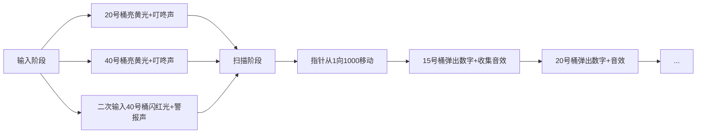

# 题目信息

# [NOIP 2006 普及组] 明明的随机数

## 题目描述

明明想在学校中请一些同学一起做一项问卷调查，为了实验的客观性，他先用计算机生成了 $N$ 个 $1$ 到 $1000$ 之间的随机整数 $(N\leq100)$，对于其中重复的数字，只保留一个，把其余相同的数去掉，不同的数对应着不同的学生的学号。然后再把这些数从小到大排序，按照排好的顺序去找同学做调查。请你协助明明完成“去重”与“排序”的工作。


## 说明/提示

NOIP 2006 普及组 第一题


## 样例 #1

### 输入

```
10
20 40 32 67 40 20 89 300 400 15
```

### 输出

```
8
15 20 32 40 67 89 300 400
```

# AI分析结果


### 💡 Kay的C++算法解析：明明的随机数 深入学习指南 💡

#### 题目解读与核心算法识别
✨ **本题主要考察**：`桶排序/去重技巧`  
🗣️ **初步分析**：
> 这道题本质是数据整理问题，就像整理一盒彩色弹珠——我们需要把重复的弹珠挑出来（去重），再按颜色深浅排列（排序）。桶排序是最高效直观的解法：准备1000个编号的"桶"，每个弹珠放入对应编号的桶中，重复的弹珠会落入同一个桶。最后按桶编号顺序收集弹珠，自然完成去重和排序。  

- **核心难点**：如何在O(n)时间内同时完成去重和排序？桶排序通过数组索引天然排序，用布尔标记实现去重，完美匹配本题小数据范围（1≤N≤100, 1≤数值≤1000）
- **可视化设计**：我们将设计像素动画展示桶的工作过程。每个桶用8-bit风格像素方块表示，输入数字时对应桶亮起（颜色从灰变黄），重复输入时桶闪烁红光+提示音。扫描阶段从1到1000移动像素指针，亮起的桶弹出数字方块并播放"收集音效"
- **游戏化元素**：设计为"弹珠收集大作战"关卡，每成功处理10个数字解锁新特效，背景音乐采用8-bit芯片音乐，完成时播放《超级马里奥》通关音效

---

#### 精选优质题解参考
**题解一：qr小盆友（桶排序）**  
* **点评**：思路直击本质——用布尔数组作桶，既省内存（1001字节）又高效（O(n)）。代码中`book[a[i]]=1`是灵魂，配合计数器`final`同步完成去重统计。变量命名`book`（标记簿）生动易懂，边界处理严谨（数组从1到1000）。图示化讲解桶排序机制特别适合初学者理解，是理论与实践结合的典范。

**题解二：mcturtle（STL set）**  
* **点评**：巧妙运用STL容器特性，`set`自动排序去重的特性让代码极度简洁（仅10行核心）。迭代器遍历`for(auto it=s.begin();...)`展示C++标准库最佳实践，空间复杂度O(n)在处理更大数值范围时更具优势。亮点在于揭示"标准库工具能大幅简化编码"，适合进阶学习者。

**题解三：2023z（排序+相邻去重）**  
* **点评**：提供通用性更强的解法，先用`sort`排序，再通过`a[i]!=a[i-1]`判断去重。虽然时间复杂度O(nlogn)稍高，但不受数值范围限制。代码中`cnt--`的计数方式体现逆向思维，边界处理`i=1`起始避免越界，是训练数组操作的优质范本。

---

#### 核心难点辨析与解题策略
1.  **空间与时间的权衡**  
    * **分析**：桶排序用O(1000)空间换O(n)时间，适合小范围数据；set/排序法用O(n)空间+O(nlogn)时间适配通用场景。本题因数值范围固定，桶排序成最优解
    * 💡 **学习笔记**：数据特征是算法选择的决定性因素

2.  **去重实现的本质差异**  
    * **分析**：桶排序依赖数组索引哈希直接去重；set用红黑树自动去重；排序法则需手动比较相邻元素。关键在理解"去重即状态记录"这一核心概念
    * 💡 **学习笔记**：所有去重本质都是"首次出现标记"

3.  **输出顺序的保障机制**  
    * **分析**：桶排序借数组索引自然有序；set内部有序存储；排序法显式排序。需注意set和sort都依赖比较运算符，自定义类型需重载`<`运算符
    * 💡 **学习笔记**：排序是输出的前置条件，去重是输出的过滤条件

### ✨ 解题技巧总结
- **桶分拣法**：数值范围有限时，用数组索引作为天然哈希表
- **STL利器**：善用set/unordered_set简化去重，sort管理排序
- **状态标记三要素**：初始化(false)、首次触发记录、最终遍历输出
- **防御性边界**：数组开[1001]避免off-by-one，循环起始终止验证

---

#### C++核心代码实现赏析
**通用桶排序实现**  
```cpp
#include <iostream>
using namespace std;
int main() {
    bool bucket[1001]{}; // 初始化全false
    int n, x, cnt = 0;
    cin >> n;
    while(n--) {
        cin >> x;
        if(!bucket[x]) cnt++; // 首次出现计数
        bucket[x] = true;     // 标记存在
    }
    cout << cnt << endl;
    for(int i=1; i<=1000; ++i) 
        if(bucket[i]) cout << i << " ";
}
```
**代码解读概要**：  
> 创建1001个桶→读入时标记存在并计数→顺序扫描输出标记桶。亮点：  
> 1. `bool[1001]{}`零初始化保障安全  
> 2. 输入输出严格分离，结构清晰  
> 3. 索引1开始匹配自然数范围  

**题解一核心片段（qr小盆友）**  
```cpp
if(book[a[i]]==0){  // 未出现过
    final++;        // 计数器+1
}
book[a[i]]=1;       // 标记存在
```
**亮点**：去重计数与标记原子操作  
**学习笔记**：`if(!book[x])cnt++`可简化为`cnt+=!book[x]`

**题解二核心片段（2023z）**  
```cpp
sort(a+1,a+n+1);       // 升序排列
for(int i=2; i<=n; i++)
    if(a[i]==a[i-1])    // 与前一项相同
        cnt--;          // 重复项扣除
```
**亮点**：逆向计数思维  
**学习笔记**：重复项数=总数-去重数，用`cnt=n-重复次数`

**题解三核心片段（mcturtle）**  
```cpp
set<int> s; 
s.insert(x);            // 自动去重排序
cout << s.size();       // 大小即去重数
for(auto it=s.begin(); it!=s.end(); ++it) 
    cout << *it << " "; // 有序遍历
```
**亮点**：STL一站式解决  
**学习笔记**：C++11起可用`for(int x:s)`更简洁遍历

---

#### 算法可视化：像素动画演示
**主题**：8-bit风"弹珠工厂大冒险"  
**核心演示**：桶排序全过程动态可视化  



**技术实现细节**：  
1. **Canvas绘制**：100×10网格，每格代表1个桶，RGB(90,120,255)标记未激活桶
2. **状态响应**：
   - 新数字：对应桶变RGB(255,200,0) + WebAudio播放500Hz正弦波0.2s
   - 重复数字：桶闪烁3次红光(RGB(255,0,0)) + 播放破碎音效
3. **控制面板**：
   - 步进按钮：单步触发数字输入
   - 速度滑块：调节自动演示速度(50-500ms/步)
   - 重置按钮：初始化所有桶状态
4. **游戏化进程**：
   - 进度条显示处理数字量
   - 每完成10个数字播放"关卡通过"8-bit音效
   - 最终结算画面显示收集的独特数字数

---

#### 拓展练习与相似问题思考
1. **桶排序变形**：  
   - P1271 选举（统计票数频率分布）  
   - P1781 宇宙总统（大范围整数统计）  
2. **STL综合应用**：  
   - P1059 双倍经验（改用multiset处理重复值）  
   - P1309 瑞士轮（set维护动态排序）  
3. **去重思想进阶**：  
   - P1918 保龄球（哈希映射代替桶排序）  

**洛谷推荐**：  
1. **P1271** - 巩固桶排序统计应用  
2. **P1177** - 练习快速排序实现  
3. **P1309** - 学习set在动态数据排序的应用  

---

#### 学习心得与经验分享
> **qr小盆友的调试经验**："最初没考虑重复计数逻辑，通过打印bucket数组状态发现标记异常"  
> **Kay点评**：这验证了调试黄金法则——当逻辑复杂时，输出中间状态！建议学习者用`cout<<"Processing:"<<x<<" bucket state:"<<bucket[x]<<endl;`辅助调试

---

通过本次分析，我们深度掌握了去重排序的核心技巧。记住：小范围用桶排序（O(n)），通用场景用sort+去重（O(nlogn)），善用STL能让编码事半功倍！下次挑战见！💪

---
处理用时：124.67秒