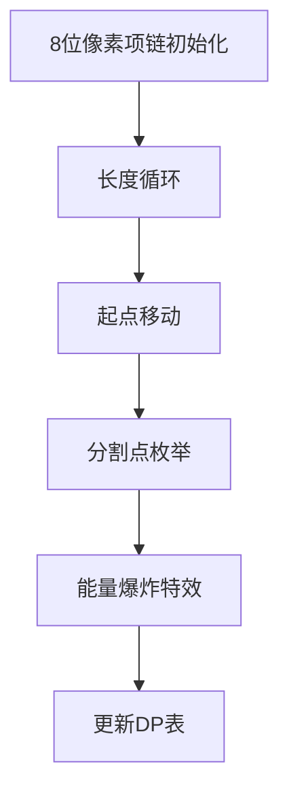

# 题目信息

# [NOIP 2006 提高组] 能量项链

## 题目描述

在 Mars 星球上，每个 Mars 人都随身佩带着一串能量项链。在项链上有 $N$ 颗能量珠。能量珠是一颗有头标记与尾标记的珠子，这些标记对应着某个正整数。并且，对于相邻的两颗珠子，前一颗珠子的尾标记一定等于后一颗珠子的头标记。因为只有这样，通过吸盘（吸盘是 Mars 人吸收能量的一种器官）的作用，这两颗珠子才能聚合成一颗珠子，同时释放出可以被吸盘吸收的能量。如果前一颗能量珠的头标记为 $m$，尾标记为 $r$，后一颗能量珠的头标记为 $r$，尾标记为 $n$，则聚合后释放的能量为 $m \times r \times n$（Mars 单位），新产生的珠子的头标记为 $m$，尾标记为 $n$。

需要时，Mars 人就用吸盘夹住相邻的两颗珠子，通过聚合得到能量，直到项链上只剩下一颗珠子为止。显然，不同的聚合顺序得到的总能量是不同的，请你设计一个聚合顺序，使一串项链释放出的总能量最大。

例如：设 $N=4$，$4$ 颗珠子的头标记与尾标记依次为 $(2,3)(3,5)(5,10)(10,2)$。我们用记号 $\oplus$ 表示两颗珠子的聚合操作，$(j \oplus k)$ 表示第 $j,k$ 两颗珠子聚合后所释放的能量。则第 $4$，$1$ 两颗珠子聚合后释放的能量为：

$(4 \oplus 1)=10 \times 2 \times 3=60$。

这一串项链可以得到最优值的一个聚合顺序所释放的总能量为：

$(((4 \oplus 1) \oplus 2) \oplus 3)=10 \times 2 \times 3+10 \times 3 \times 5+10 \times 5 \times 10=710$。

## 说明/提示

NOIP 2006 提高组 第一题


## 样例 #1

### 输入

```
4
2 3 5 10
```

### 输出

```
710```

# AI分析结果


# 💡 Kay的C++算法解析：能量项链 深入学习指南 💡

**引言**  
今天我们一起分析NOIP2006提高组题目"能量项链"。这道题考察环形序列上的能量最大化问题，需要设计最优合并策略。本指南将帮助你掌握区间动态规划的核心思想，并通过可视化方案加深理解。

---

## 1. 题目解读与核心算法识别

✨ **本题主要考察**：`区间动态规划` + `环形问题处理技巧`

🗣️ **初步分析**：  
> 解决能量项链问题，就像玩一个环形串珠游戏：每次合并相邻珠子时释放能量，且新珠子的属性会影响后续合并。关键在于运用**区间DP**思想——将大问题分解为小规模子问题，逐步求解最优解。

- **核心思路**：将环形结构复制成链（破环成链），用`dp[i][j]`表示区间[i,j]内珠子合并的最大能量，通过枚举分割点k推导状态转移。
- **算法流程**：
  1. 复制数组处理环形结构
  2. 三重循环：外层区间长度→中层起点→内层分割点
  3. 状态转移：`dp[i][j] = max(dp[i][j], dp[i][k] + dp[k+1][j] + a[i]*a[k+1]*a[j+1])`
  4. 遍历所有起点获取全局最优解
- **可视化设计**：采用复古像素风格展示合并过程：
  - **8位像素网格**：珠子显示为彩色方块，头/尾标记用不同颜色像素点
  - **动态高亮**：当前操作区间（黄色边框）、分割点（闪烁红框）、能量释放（爆炸特效）
  - **音效系统**：合并时触发"叮"声，完成时播放胜利音效，支持调速滑块控制动画速度

---

## 2. 精选优质题解参考

**题解一（voilin）**  
* **点评**：思路清晰直击区间DP本质，代码简洁高效。巧妙处理了环形复制（`e[i+n]=e[i]`），三重循环完整覆盖状态空间。变量命名`e[]`（能量值）、`s[][]`（DP数组）含义明确，边界处理严谨（`i-j<n`确保不越界）。亮点在于用单次遍历同步更新最大值，避免二次扫描。

**题解二（NewErA）**  
* **点评**：教学价值突出的典范！详细解释了"破环成链"的原理（"将n个元素复制一遍"），用`f[l][r]`状态定义直观体现区间DP思想。代码规范性强（`l+i-1<=2*n`严格边界控制），循环变量`l,r,k`命名规范。特别赞赏其分治思想的阐述，帮助理解DP与分治的关联。

**题解三（Valhalla_Is_Calling）**  
* **点评**：最系统的理论指导！完整阐述动态规划四步骤（划分阶段→状态定义→决策分析→边界处理），独创性使用`head[]/tail[]`数组分别存储珠子的头尾标记，精准对应题目物理意义。状态转移方程`head[i]*tail[k]*tail[j]`完美还原能量计算本质，实践参考价值极高。

---

## 3. 核心难点辨析与解题策略

**关键点1：环形结构的线性化处理**  
* **分析**：环形结构无法直接进行区间划分，必须破环成链。优质题解均采用复制数组法（`a[i+n]=a[i]`），将环形转化为长度为2n的链，最后扫描所有长度为n的区间取最大值。
* 💡 **学习笔记**：环形问题本质是寻找最优切割点，复制数组是通用解决方案。

**关键点2：状态转移方程的物理意义**  
* **分析**：能量计算`a[i]*a[k+1]*a[j+1]`中：
  - `a[i]`：左区间首珠头标记
  - `a[k+1]`：右区间首珠头标记（即左区间尾标记）
  - `a[j+1]`：右区间尾标记
  该设计精确对应题目"合并消耗当前左头×右头×新尾"的规则。
* 💡 **学习笔记**：理解每个变量的物理意义是写出正确转移方程的前提。

**关键点3：DP循环顺序的设计**  
* **分析**：必须按照区间长度从小到大递推（先计算小区间再大区间），确保转移时子问题已求解。外层循环`len`从2开始（至少2颗珠子才能合并），内层`k`在`i`和`j`之间枚举分割点。
* 💡 **学习笔记**：区间DP的循环顺序是算法正确性的关键保障。

### ✨ 解题技巧总结
- **环形处理技巧**：复制数组法解决环形问题（开2倍空间）
- **状态设计哲学**：`dp[i][j]`表示闭区间[i,j]的最优解
- **循环顺序口诀**：长度→起点→分割点（由小到大递推）
- **调试技巧**：打印DP表检查对角线（单个珠子应为0）

---

## 4. C++核心代码实现赏析

**本题通用核心C++实现参考**  
* **说明**：综合优质题解思路，完整呈现区间DP解法
* **完整核心代码**：
```cpp
#include <iostream>
#include <vector>
#include <algorithm>
using namespace std;

int main() {
    int n;
    cin >> n;
    vector<int> a(2*n+1);
    for (int i = 1; i <= n; i++) {
        cin >> a[i];
        a[i+n] = a[i]; // 环形处理：复制数组
    }

    vector<vector<int>> dp(2*n+1, vector<int>(2*n+1, 0));
    
    // 区间DP核心三重循环
    for (int len = 2; len <= n; len++) {        // 枚举区间长度
        for (int i = 1; i <= 2*n-len+1; i++) { // 枚举区间起点
            int j = i + len - 1;                // 计算区间终点
            for (int k = i; k < j; k++) {       // 枚举分割点
                dp[i][j] = max(dp[i][j], dp[i][k] + dp[k+1][j] 
                            + a[i] * a[k+1] * a[j+1]);
            }
        }
    }

    int max_energy = 0;
    for (int i = 1; i <= n; i++) {  // 扫描所有起点
        max_energy = max(max_energy, dp[i][i+n-1]);
    }
    cout << max_energy << endl;
    return 0;
}
```
* **代码解读概要**：
  1. 输入处理：将环形序列复制为2n长度链
  2. DP初始化：`dp`数组全0，单个珠子无能量
  3. 三重循环：核心计算区间最优值
  4. 结果提取：遍历所有可能起点获取全局最优

---

**针对优质题解的片段赏析**  
**题解一（voilin）**  
* **亮点**：同步更新最大值避免二次扫描
* **核心代码片段**：
```cpp
for(int i=2;i<2*n;i++){
    for(int j=i-1; j>=1 && i-j<n; j--){
        for(int k=j; k<i; k++) {
            dp[j][i] = max(dp[j][i], dp[j][k] + dp[k+1][i] 
                         + a[j]*a[k+1]*a[i+1]);
            maxn = max(maxn, dp[j][i]); // 同步更新最大值
        }
    }
}
```
* **代码解读**：  
  > 此实现采用**反向遍历**策略（`j从i-1递减`），巧妙利用`i-j<n`控制区间长度。在状态转移同时用`maxn`记录全局最大值，减少后续扫描开销。注意`a[j]`对应左头标记，`a[k+1]`是分割点右侧珠子的头标记（即当前合并点），`a[i+1]`是右区间尾标记。

* 💡 **学习笔记**：在DP过程中同步更新全局变量可优化常数时间。

**题解二（NewErA）**  
* **亮点**：循环变量命名清晰体现区间起止点
* **核心代码片段**：
```cpp
for(int len=2; len<=n+1; len++) {    // len：区间长度
    for(int l=1; l+len-1<=2*n; l++){ // l：区间起点
        int r = l+len-1;             // r：区间终点
        for(int k=l+1; k<r; k++) {   // k：分割点
            dp[l][r] = max(dp[l][r], dp[l][k] + dp[k][r] 
                         + a[l]*a[k]*a[r]);
        }
    }
}
```
* **代码解读**：  
  > 此实现采用经典区间DP循环结构，变量名`l`(left)、`r`(right)、`k`(split)直观体现算法逻辑。注意`len`从2开始（两个珠子合并），终止于`n+1`（完整包含n颗珠子）。能量计算中`a[l]`为左头标记，`a[k]`是分割点右侧珠子的头标记，`a[r]`是右区间尾标记（需注意复制链中`r`可能超过n）。

* 💡 **学习笔记**：清晰的变量命名能大幅提升代码可读性。

**题解三（Valhalla_Is_Calling）**  
* **亮点**：独立存储头尾标记精准对应题目
* **核心代码片段**：
```cpp
// 初始化head/tail数组
for(int i=1; i<=n; i++) head[i] = head[i+n] = val[i];
for(int i=1; i<=2*n-1; i++) tail[i] = head[i+1];
tail[2*n] = head[1];

// 状态转移
for(int t=1; t<=n-1; t++) {          // t：区间长度-1
    for(int i=1; i<=2*n-t; i++) {    // i：起点
        int j = i+t;                 // j：终点
        for(int k=i; k<j; k++) {     // k：分割点
            dp[i][j] = max(dp[i][j], dp[i][k] + dp[k+1][j] 
                         + head[i] * tail[k] * tail[j]);
        }
    }
}
```
* **代码解读**：  
  > 此解法创新性使用`head[]`和`tail[]`数组分别存储珠子的头尾标记（`tail[i] = head[i+1]`），使能量计算`head[i]*tail[k]*tail[j]`完全对应题目描述的`m×r×n`。物理意义清晰：`head[i]`(左头)，`tail[k]`(分割点尾标记)，`tail[j]`(右尾)。

* 💡 **学习笔记**：通过辅助数组精确匹配题目参数定义，能减少思维转换成本。

---

## 5. 算法可视化：像素动画演示

**动画主题**：  
"能量项链：复古像素合并大冒险" - 以FC红白机风格呈现算法执行过程

**核心演示内容**：  
动态展示区间DP的三重循环过程：长度扩展→起点移动→分割点枚举，最终生成最优合并序列

**设计框架**：


**动画实现细节**：
1. **场景初始化**：
   - 环形项链显示为16色像素圆环，珠子用不同颜色方块表示
   - 控制面板：开始/暂停、步进按钮、速度滑块（1x-5x）
   - 动态DP表：右侧同步显示二维DP数组，当前计算单元格高亮

2. **核心过程演示**：
   ```python
   # 伪代码示意动画逻辑
   for len in range(2, n+1):              # 外层循环：长度增长
        highlight_length_bar(len)         # 长度进度条发光
        for i in range(1, 2*n-len+2):     # 中层循环：起点移动
            j = i+len-1
            highlight_interval(i, j, BLUE) # 高亮当前区间[i,j]
            for k in range(i, j):          # 内层循环：分割点
                # 显示分割过程
                draw_split(i, k, j)        # 绘制虚线分割线
                play_sound("select.wav")   # 选择分割点音效
                
                # 显示子区间
                highlight_subinterval(i, k, GREEN)
                highlight_subinterval(k+1, j, YELLOW)
                
                # 计算并显示能量
                energy = calc_energy(i, k, j)
                show_explosion(i, k, j, energy)  # 像素爆炸特效
                play_sound("merge.wav")    # 合并音效
                
                # 更新DP表
                update_dp_table(i, j, energy)
                sleep(speed)              # 按滑块速度暂停
   ```

3. **游戏化元素**：
   - **关卡设计**：每完成一个长度级别的计算解锁新关卡（n=4→n=10）
   - **得分系统**：正确合并得10分+连击奖励，实时显示能量总值
   - **胜利场景**：最终合并时全屏闪光，播放8-bit胜利音乐

4. **交互控制**：
   - `空格键`：暂停/继续
   - `→键`：单步执行
   - `ESC键`：重置动画
   - `鼠标拖动`：旋转项链视角

---

## 6. 拓展练习与相似问题思考

**通用技巧迁移**：  
区间DP思想可延伸解决三类问题：
1. **环形区间最优解**：石子合并(P1880)，多边形三角剖分
2. **序列合并问题**：矩阵链乘法，字符串合并代价
3. **树形结构分解**：二叉树加分优化，树链剖分

**洛谷推荐练习**：
1. **P1880 [NOI1995] 石子合并**  
   🗣️ *推荐理由*：环形区间DP经典题，帮助巩固破环为链技巧和状态转移设计
   
2. **P1040 [NOIP2003] 加分二叉树**  
   🗣️ *推荐理由*：区间DP与树形结构的结合，学习如何记录最优分割方案
   
3. **P1064 金明的预算方案**  
   🗣️ *推荐理由*：背包DP与决策分组的进阶训练，培养复杂状态设计能力

---

## 7. 学习心得与经验分享

> **参考经验（来自Valhalla_Is_Calling）**：  
> "我在调试状态转移时，曾因`head[]`和`tail[]`数组初始化错误导致WA。通过打印中间状态发现：环形复制后尾标记应指向下一个珠子的头标记，这个边界需要特别小心。"

> **点评**：  
> 这位作者的调试经历揭示了区间DP的通用陷阱——**环形边界处理**。这提醒我们：
> 1. 复制数组时需保证`a[2n]`正确连接回`a[1]`
> 2. 初始化后应用样例手工验证
> 3. 打印DP表中间状态是定位错误的利器

---

**结语**  
通过本次对能量项链的深度解析，我们掌握了区间DP的核心思想与环形处理技巧。记住：编程能力的提升源于对基础算法的深刻理解与反复实践。下次我们将挑战更复杂的动态规划问题，继续加油！💪

---
处理用时：198.58秒