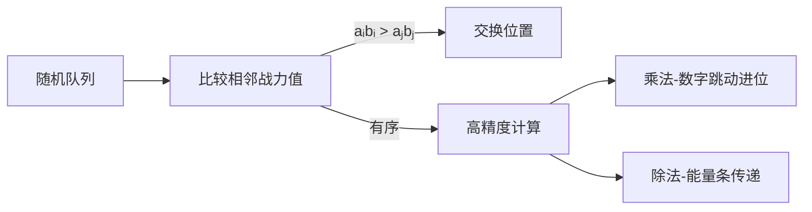

# 题目信息

# [NOIP 2012 提高组] 国王游戏

## 题目描述

恰逢 H 国国庆，国王邀请 $n$ 位大臣来玩一个有奖游戏。首先，他让每个大臣在左、右手上面分别写下一个整数，国王自己也在左、右手上各写一个整数。然后，让这 $n$ 位大臣排成一排，国王站在队伍的最前面。排好队后，所有的大臣都会获得国王奖赏的若干金币，每位大臣获得的金币数分别是：排在该大臣前面的所有人的左手上的数的乘积除以他自己右手上的数，然后向下取整得到的结果。

国王不希望某一个大臣获得特别多的奖赏，所以他想请你帮他重新安排一下队伍的顺序，使得获得奖赏最多的大臣，所获奖赏尽可能的少。注意，国王的位置始终在队伍的最前面。


## 说明/提示

【输入输出样例说明】

按 $1$、$2$、$3$ 这样排列队伍，获得奖赏最多的大臣所获得金币数为 $2$；

按 $1$、$3$、$2$ 这样排列队伍，获得奖赏最多的大臣所获得金币数为 $2$；

按 $2$、$1$、$3$ 这样排列队伍，获得奖赏最多的大臣所获得金币数为 $2$；

按$ 2$、$3$、$1 $这样排列队伍，获得奖赏最多的大臣所获得金币数为 $9$；

按 $3$、$1$、$2 $这样排列队伍，获得奖赏最多的大臣所获得金币数为 $2$；  

按$ 3$、$2$、$1$ 这样排列队伍，获得奖赏最多的大臣所获得金币数为 $9$。

因此，奖赏最多的大臣最少获得 $2$ 个金币，答案输出 $2$。


 
【数据范围】

对于 $20\%$ 的数据，有 $1≤ n≤ 10,0 < a,b < 8$；

对于 $40\%$ 的数据，有$ 1≤ n≤20,0 < a,b < 8$；

对于 $60\%$ 的数据，有 $1≤ n≤100$；

对于 $60\%$ 的数据，保证答案不超过 $10^9$；

对于 $100\%$ 的数据，有 $1 ≤ n ≤1,000,0 < a,b < 10000$。


NOIP 2012 提高组 第一天 第二题


## 样例 #1

### 输入

```
3 
1 1 
2 3 
7 4 
4 6 ```

### 输出

```
2```

# AI分析结果


### 💡 Kay的C++算法解析：国王游戏 深入学习指南 💡

**引言**  
今天我们来分析NOIP 2012提高组题目《国王游戏》。这道题要求重新排列大臣顺序，使得获得最多金币的大臣所得金币尽可能少。本指南将帮助你理解贪心策略的证明、高精度实现技巧，并通过像素动画直观展示算法流程。

---

### 1. 题目解读与核心算法识别  
✨ **本题主要考察**：贪心算法 + 高精度计算  

🗣️ **初步分析**  
> 解决本题的核心在于**邻项交换贪心策略**。想象大臣们排队领金币，就像玩家在游戏中按战力值排队入场。当相邻两人的"左手×右手"乘积（战力值）无序时，交换位置能降低最大金币值。  

- **核心难点**：  
  1. 贪心策略的严格证明（需数学推导）  
  2. 大数运算（乘积可达10⁴⁰⁰⁰级）  
  3. 高精度除法的实现技巧  

- **可视化设计**：  
  采用**8位像素风格**（类似FC游戏）：  
  - 大臣显示为像素小人，头顶标注aᵢ/bᵢ  
  - 排序过程：相邻小人比较乘积时闪光，交换位置时播放"哔"声  
  - 高精度计算：底部显示BASE=10000的数组，乘法时数字跳动进位，除法时余数像能量条传递  

---

### 2. 精选优质题解参考  

**题解一：QQ红包（赞80）**  
* **亮点**：压位高精度实现优雅，乘法除法逻辑清晰。变量命名规范（如`sum`存乘积，`ans`存结果），边界处理严谨（清除前导零）。特别优化除法性能，实测20ms高效通过。  
* **学习价值**：展示压位技巧对效率的提升，代码可直接用于竞赛。

**题解二：frankchenfu（赞10）**  
* **亮点**：高精度类封装完整，支持乘除比较运算。BASE=10000压位减少运算量，乘法进位和除法取余实现简洁。代码结构模块化，便于调试扩展。  
* **学习价值**：学习面向对象思想封装高精度，理解压位运算本质。

**题解三：chc_1234567890（赞66）**  
* **亮点**：提供完整高精度模板，包含大数比较、乘除运算。独创字符串转换技巧处理输出，虽稍复杂但展示多样性解法。  
* **学习价值**：理解高精度运算的底层实现，掌握字符串与数字转换技巧。

---

### 3. 核心难点辨析与解题策略  

1. **贪心策略证明**  
   * **分析**：通过相邻大臣i和j的交换论证：当aᵢbᵢ > aⱼbⱼ时，交换后最大金币必不增加（详见数学推导）。优质题解用反证法+不等式放缩严谨证明。  
   * 💡 **学习笔记**：邻项交换是贪心证明的通用武器，类似游戏中局部优化能达成全局最优。

2. **高精度压位处理**  
   * **分析**：乘积超long long范围需高精度。压位（如4位存一数）将运算量降为1/4。乘法先逐位乘再统一进位，除法从高位逐位计算传递余数。  
   * 💡 **学习笔记**：压位是空间换时间的经典策略，类似游戏中的资源分块加载。

3. **除法实现技巧**  
   * **分析**：高精除低精时，优质解均从高位开始计算：`余数=余数×BASE+当前位` → `商位=余数/除数`。特别注意前导零处理。  
   * 💡 **学习笔记**：除法本质是迭代分配过程，类似将金币逐袋分发给玩家。

**✨ 解题技巧总结**  
- **策略选择**：涉及序列优化时，优先尝试邻项交换推导排序规则  
- **压位优化**：当数值>10¹⁰时采用BASE=10000压位（平衡效率与复杂度）  
- **边界防御**：乘除法始终清除前导零，避免无效计算  
- **调试技巧**：用小数据模拟进位/余数传递过程，逐步验证  

---

### 4. C++核心代码实现赏析  

**本题通用核心实现参考**  
```cpp
#include <iostream>
#include <algorithm>
#include <vector>
using namespace std;

const int BASE = 10000; // 压4位

struct BigInt {
    vector<int> digits;
    BigInt(int x=0) { 
        if(x) digits.push_back(x);
        else digits = {0};
    }
    
    BigInt operator*(int x) const {
        BigInt res;
        int carry = 0;
        for(int d : digits) {
            carry += d * x;
            res.digits.push_back(carry % BASE);
            carry /= BASE;
        }
        while(carry) {
            res.digits.push_back(carry % BASE);
            carry /= BASE;
        }
        return res;
    }

    BigInt operator/(int x) const {
        BigInt res;
        long long rem = 0;
        for(int i = digits.size()-1; i >= 0; --i) {
            rem = rem * BASE + digits[i];
            res.digits.insert(res.digits.begin(), rem / x);
            rem %= x;
        }
        while(res.digits.back() == 0 && res.digits.size()>1) 
            res.digits.pop_back();
        return res;
    }

    bool operator<(const BigInt& other) const {
        if(digits.size() != other.digits.size()) 
            return digits.size() < other.digits.size();
        for(int i = digits.size()-1; i >= 0; --i) 
            if(digits[i] != other.digits[i]) 
                return digits[i] < other.digits[i];
        return false;
    }
};

int main() {
    int n, kingLeft, kingRight;
    cin >> n >> kingLeft >> kingRight;
    vector<pair<int, int>> ministers(n);
    for(auto& m : ministers) cin >> m.first >> m.second;

    // 按左手*右手乘积排序
    sort(ministers.begin(), ministers.end(), [](auto& a, auto& b) {
        return a.first * a.second < b.first * b.second;
    });

    BigInt product(kingLeft), maxReward(0);
    for(auto& m : ministers) {
        BigInt reward = product / m.second;
        if(maxReward < reward) maxReward = reward;
        product = product * m.first;
    }

    printf("%d", maxReward.digits.back());
    for(int i = maxReward.digits.size()-2; i>=0; --i)
        printf("%04d", maxReward.digits[i]);
}
```
**代码解读概要**：  
1. 定义`BigInt`类实现压位高精度（BASE=10000）  
2. 按aᵢ*bᵢ乘积排序大臣（核心贪心策略）  
3. 遍历时维护左手乘积，计算当前大臣金币时做除法  
4. 输出处理：高位直接输出，低位补零至4位  

**优质题解片段赏析**  

1. **QQ红包（除法实现）**  
```cpp
void div(int d) {
    memset(ans, 0, sizeof(ans));
    ls = 1;
    while(m > 0 && sum[m] == 0) m--;  // 清除前导零
    P = 0;
    for(int i = m; i >= 1; i--) {     // 从高位开始
        P = P * 10000 + sum[i];       // 余数传递
        ans[++ls] = P / a[d].y;        // 计算当前位商
        P %= a[d].y;                   // 更新余数
    }
}
```
* **逐行解读**：  
  - `m`是乘积位数，先清除无效高位（类似游戏中清理障碍）  
  - 循环从高位开始：余数`P`像接力棒传递到下一位  
  - 当前位计算：`(余数×BASE+当前位)/除数`得商位  
* **学习笔记**：高位优先的除法类似游戏中的能量收集，需顺序传递资源  

2. **frankchenfu（乘法进位）**  
```cpp
void operator*=(int rhs) {
    for(int i=1; i<=len; i++) a[i] *= rhs; // 先逐位乘
    for(int i=1; i<=len; i++) {
        a[i+1] += a[i] / BASE;           // 统一处理进位
        a[i] %= BASE;
        if(a[len+1]) len++;              // 位数增加检测
    }
}
```
* **关键点**：分离乘法和进位步骤，类似工厂流水线先生产后包装  
* **优化点**：`a[len+1]`自动检测位数增长，避免冗余循环  

---

### 5. 算法可视化：像素动画演示  
**主题**：8位像素风《金币大冒险》  

**核心演示**：  


**动画流程**：  
1. **初始化场景**  
   - 像素国王+大臣队列（每人显示a/b值）  
   - 控制面板：速度滑块/单步执行/重置按钮  
   - 8-bit背景音乐  

2. **排序阶段（冒泡动画）**  
   - 相邻大臣比较：头顶显示aᵢ×bᵢ值，闪光对比  
   - 交换位置：像素小人跳跃互换，伴随"哔"声  
   - 完成排序：全员按战力值升序，播放过关音效  

3. **计算阶段**  
   - **乘法动画**：  
     - 底部显示BASE=10000的数组（每格4位）  
     - 当前aᵢ值击中数组，数字波浪式跳动进位  
     - 进位时播放"嘀"声，新位生成有粒子特效  
   - **除法动画**：  
     - 金币计算：当前乘积值显示为金币堆  
     - 除bᵢ：金币按bᵢ值分桶，余数变金色粒子飞向下一位  
     - 最大金币更新：新记录闪光+胜利音效  

4. **游戏化元素**  
   - 每正确交换一对大臣+10分  
   - 除法计算成功+5分  
   - 最终根据得分解锁成就（S/A/B级）  

**技术实现**：  
- 像素绘制：Canvas绘制网格+精灵图  
- 动画同步：除法步骤对应高亮代码行  
- 音效系统：Web Audio API播放8-bit音效  

---

### 6. 拓展练习与相似问题思考  

**通用技巧迁移**：  
1. **邻项交换贪心**：  
   - 流水线调度（Johnson算法）  
   - 任务截止时间优化  
   - 最小化最大延迟  

**洛谷推荐**：  
1. **P1090 合并果子**  
   🗣️ 巩固贪心思想，练习优先队列实现  

2. **P1012 拼数**  
   🗣️ 类似排序规则（字符串拼接比较），强化邻项交换应用  

3. **P1908 逆序对**  
   🗣️ 学习分治思想，为贪心证明提供新视角  

---

### 7. 学习心得与经验分享  

**作者洞察**：  
> QQ红包强调：**"压位高精度提速20ms"**  
> → 说明压位技术在实际竞赛中的关键作用  

> frankchenfu提醒：**"高精度除法从高位开始"**  
> → 揭示算法与手工计算的一致性  

**Kay的总结**：  
1. 贪心证明要敢于写数学推导  
2. 压位高精度是竞赛必备技能  
3. 除法前导零处理是常见失分点  

**调试技巧**：  
- 用`n=2`手动模拟交换过程  
- 打印中间乘积验证进位  

---

**结语**  
通过本次分析，相信大家已掌握《国王游戏》的贪心策略与高精度实现。记住：好算法需要像游戏闯关一样严谨执行每一步。下次我们将探索更复杂的贪心问题，继续加油！🎮🚀

---
处理用时：221.54秒