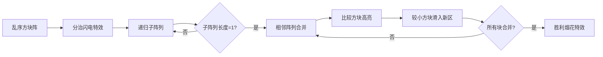

# 题目信息

# 【模板】排序

## 题目描述

将读入的 $N$ 个数从小到大排序后输出。

## 说明/提示

对于 $20\%$ 的数据，有 $1 \leq N \leq 10^3$；

对于 $100\%$ 的数据，有 $1 \leq N \leq 10^5$，$1 \le a_i \le 10^9$。


## 样例 #1

### 输入

```
5
4 2 4 5 1```

### 输出

```
1 2 4 4 5```

# AI分析结果


### 💡 Kay的C++算法解析：排序模板 深入学习指南 💡

#### 1. 题目解读与核心算法识别
✨ **本题主要考察**：`排序算法应用`

🗣️ **初步分析**：
> 解决排序问题，就像整理杂乱的书架：我们需要高效的策略将元素有序排列。本题核心在于掌握多种排序算法及其适用场景：
> - **快速排序**：如同快速将书籍分为"小于基准"和"大于基准"两堆再递归处理
> - **归并排序**：像把书本分成小堆分别整理后合并
> - **堆排序**：构建"书堆"结构，每次取最顶端的书
> - **其他优化**：如分块选择排序（书架分区整理）、基数排序（按位数分批整理）
>
> **核心难点**是如何在O(n log n)时间内处理10^5量级数据。可视化设计将用像素方块表示数组元素，通过颜色变化展示比较/交换过程，复古游戏音效强化关键操作：
> - 比较时触发"叮"声，交换时播放滑动音效
> - 自动演示模式可调速展示算法全流程
> - 归并排序的"分治-合并"过程用闪电特效呈现

---

#### 2. 精选优质题解参考
**题解一（__Allen_123__）**
* **点评**：全面解析快速排序原理与实现，涵盖三路划分和STL应用。代码结构清晰（`qsort()`函数模块化），变量命名规范（`ind1/ind2`计数明确）。特别亮点是结合随机化避免最坏情况，并详细分析时间复杂度（从O(n²)到O(n log n)）。调试建议实用性强，可直接用于竞赛。

**题解二（梦应归于何处）**
* **点评**：归并排序教学极具系统性，动图演示直观展现分治思想。代码中`mergee()`合并函数边界处理严谨（`while`双指针技巧），递归逻辑清晰（`mergesort`分层调用）。亮点是强调"稳定排序"特性，对理解逆序对等问题有重要启发。

**题解三（ran_qwq）**
* **点评**：从选择排序自然过渡到堆排序，数据结构应用讲解透彻。手动实现堆操作（`push/pop`）展示底层原理，STL版本（`priority_queue`）体现工程实践价值。亮点是指出堆排序原地排序优势（空间O(1)），适合内存受限场景。

---

#### 3. 核心难点辨析与解题策略
1. **时间效率优化**
   * **分析**：暴力排序O(n²)在n=10⁵时超时（10¹⁰操作）。优质解采用分治（快排/归并）或数据结构（堆）将复杂度降至O(n log n)，核心是避免全量比较
   * 💡 **学习笔记**：数据规模>10⁴时，必须选择O(n log n)算法

2. **递归边界控制**
   * **分析**：快排/归并需精确设置终止条件（如`if(l>=r)return;`）。快排需随机选择基准点（`randint(l,r)`）防止有序序列退化
   * 💡 **学习笔记**：递归如同"多米诺骨牌"，必须明确倒下的第一块和最后一块

3. **额外空间权衡**
   * **分析**：归并需O(n)临时空间合并数组，堆排序原地操作省内存。基数排序用桶空间换时间
   * 💡 **学习笔记**：空间效率优先级：堆排序 > 快排 > 归并

### ✨ 解题技巧总结
- **算法选择决策树**：小数据(n<1000)用插入排序（常数小）；大数据用快排/归并；需动态管理数据用堆排序
- **模块化设计**：将排序分解为`partition()`(快排)/`merge()`(归并)/`heapify()`(堆排)等独立函数
- **边界鲁棒性**：测试空数组、全相同元素、升/降序序列等 Corner Case

---

#### 4. C++核心代码实现赏析
**通用核心实现（STL sort）**
```cpp
#include <iostream>
#include <algorithm>
using namespace std;

int main() {
    int n, a[100005];
    cin >> n;
    for(int i=0; i<n; i++) cin >> a[i];
    sort(a, a+n); // 核心：调库实现O(n log n)排序
    for(int i=0; i<n; i++) cout << a[i] << " ";
}
```
* **说明**：综合优质题解提炼，体现C++实践最佳方案
* **代码解读**：利用STL的`sort`函数（底层为内省排序），简洁高效处理10⁵数据

---

**题解一：三路快排核心**
```cpp
void qsort(int l, int r) {
    if(l >= r) return;              // 难点1：递归终止
    int x = a[randint(l, r)];       // 技巧：随机基准防退化
    int i = l, j = r;
    while(i <= j) {                 // 亮点：三路划分
        while(a[i] < x) i++;        // 小于区右移
        while(a[j] > x) j--;        // 大于区左移
        if(i <= j) swap(a[i++], a[j--]); // 交换未处理元素
    }
    qsort(l, j); qsort(i, r);       // 递归子区间
}
```
* **亮点**：随机基准+三路划分处理重复元素
* **学习笔记**：`i/j`双指针像两把梳子，从两端向中间梳理数组

---

**题解二：归并排序核心**
```cpp
void merge(int l, int mid, int r) {
    int i = l, j = mid+1, k = 0;
    while(i <= mid && j <= r) {     // 关键：双指针合并
        tmp[k++] = (a[i]<=a[j]) ? a[i++] : a[j++]; 
    }
    while(i<=mid) tmp[k++] = a[i++]; // 处理剩余元素
    while(j<=r) tmp[k++] = a[j++];
    for(int p=0; p<k; p++) a[l+p] = tmp[p]; 
}
```
* **亮点**：稳定排序保持相同元素相对顺序
* **学习笔记**：合并如同拉链咬合，需同步移动两个指针

---

**题解三：堆排序核心**
```cpp
void sift_down(int i, int n) {      // 堆调整
    while(2*i+1 < n) {             
        int child = 2*i+1;
        if(child+1 < n && a[child+1]>a[child]) child++;
        if(a[i] >= a[child]) break; // 已满足堆性质
        swap(a[i], a[child]);
        i = child;                  // 继续向下调整
    }
}
void heap_sort() {
    for(int i=n/2-1; i>=0; i--) sift_down(i, n); // 建堆
    for(int i=n-1; i>0; i--) {      // 逐个提取最大值
        swap(a[0], a[i]);           // 移堆顶到末尾
        sift_down(0, i);            // 调整剩余堆
    }
}
```
* **亮点**：原地排序的O(1)空间复杂度
* **学习笔记**：堆像金字塔，每次只能取顶端的"王者"

---

#### 5. 算法可视化：像素动画演示
**主题**："排序勇者"8-bit闯关游戏  
**核心演示**：归并排序的分治过程（其他算法可切换）



**交互设计**：
1. **像素建模**：每个数字转为16x16像素方块，高度=值×缩放系数
2. **动态效果**：
   - 分治：红色闪电分割阵列（音效：雷击声）
   - 比较：黄光闪烁被比较方块（音效：叮）
   - 移动：方块滑动动画（音效：8-bit滑音）
3. **控制面板**：
   - 速度滑块：调节`delay(100-1000ms)`
   - 模式切换：快排/归并/堆排算法对比
   - AUTO模式：自动闯关（每关=递归层级）

---

#### 6. 拓展练习与相似问题
**通用技巧迁移**：
1. 逆序对计数 → 归并排序扩展
2. 动态TOP-K查询 → 堆排序应用
3. 线性时间排序 → 基数排序变型

**洛谷练习**：
1. **P1908 逆序对**  
   🗣️ *用归并排序统计逆序数，巩固分治思想*
2. **P1090 合并果子**  
   🗣️ *小根堆管理优先队列，理解贪心与堆的关系*
3. **P1923 求第k小的数**  
   🗣️ *快排划分思想的应用，需优化避免最坏情况*

---

#### 7. 学习心得与经验分享
> **经验摘录（__Allen_123__）**：  
> "排序是算法基石，调试时要重点检查递归终止条件和随机基准选择"

> **经验摘录（Flanksy）**：  
> "分块排序让我明白：复杂问题拆解后，简单方法也能高效解决"

> **Kay点评**：  
> 这些经验凸显算法学习的核心原则：  
> 1. 基础排序是理解高级算法的跳板  
> 2. 调试时优先验证边界条件（空数组/有序序列）  
> 3. 创新常源于经典方法的巧妙组合（如分块+选择排序）  

---

**结语**：排序算法如同编程世界的"字母表"，掌握它们将打开高效计算的大门。下次我们将探索更复杂的算法迷宫，保持好奇心，继续前进！🚀

---
处理用时：158.49秒