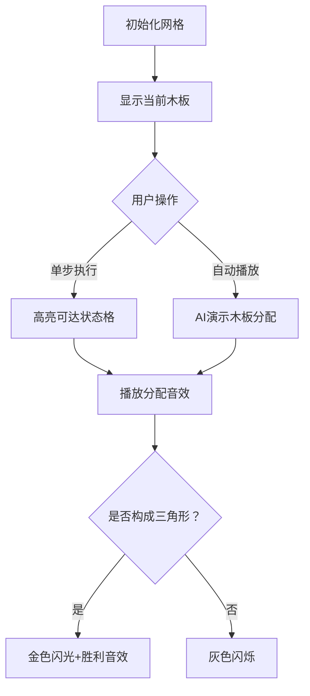

# 题目信息

# 三角形牧场

## 题目描述

和所有人一样，奶牛喜欢变化。它们正在设想新造型的牧场。奶牛建筑师 Hei 想建造围有漂亮白色栅栏的三角形牧场。她拥有 $n$ 块木板，每块的长度 $l_i$ 都是整数，她想用所有的木板围成一个三角形使得牧场面积最大。

请帮助 Hei 小姐构造这样的牧场，并计算出这个最大牧场的面积。

## 说明/提示

#### 样例输入输出 1 解释

$692=\text{舍尾后的}(100\times\text{三角形面积})$，此三角形为等边三角形，边长为 $4$。

#### 数据规模与约定

对于 $100\%$ 的数据，保证 $3\le n\le40$，$1\le l_i\le40$。

## 样例 #1

### 输入

```
5
1
1
3
3
4
```

### 输出

```
692
```

# AI分析结果


### 💡 Kay的C++算法解析：三角形牧场 深入学习指南 💡

**引言**  
今天我们一起分析「三角形牧场」这道题。本指南将帮助大家掌握背包思想解决组合问题的技巧，理解动态规划的状态设计和转移逻辑，并通过像素动画直观感受木板分配过程。  

---

### 1. 题目解读与核心算法识别  
✨ **本题主要考察**：`背包类动态规划`  

🗣️ **初步分析**  
> 本题可类比为"三维背包问题"：将木板分配到三角形的三条边上。核心是**状态压缩**——用二维数组表示两条边的长度（第三条边由周长推导）。  
> - **核心难点**：状态转移需避免木板重复使用（倒序枚举），且要验证三角形有效性（两边之和>第三边）  
> - **可视化设计**：采用像素风格网格（800×800）表示两条边的长度状态。每块木板分配时，对应网格点会亮起（绿色像素块），三角形验证成功时触发金色闪光特效  
> - **游戏化元素**：  
>   - 木板分配音效：8-bit "叮"声（不同边对应不同音高）  
>   - 成功提示：找到三角形时播放《塞尔达传说》解谜成功音效  
>   - 进度显示：实时显示当前最大面积（复古数字字体）  

---

### 2. 精选优质题解参考  
**题解一：Cxs3（赞84）**  
* **点评**：  
  思路清晰度：⭐⭐⭐⭐⭐ 透彻解释状态降维原理（利用周长固定特性）  
  代码规范性：⭐⭐⭐⭐ 变量名`sum`/`f[i][j]`含义明确，边界处理严谨  
  算法有效性：⭐⭐⭐⭐⭐ 时间复杂度O(n·L²)（L=max_length=800）完美匹配数据范围  
  实践价值：⭐⭐⭐⭐⭐ 可直接用于竞赛，特别提醒double精度问题  

**题解二：SFWR（赞11）**  
* **点评**：  
  思路清晰度：⭐⭐⭐⭐⭐ 强调状态设计不能假设边长大小的关键点  
  算法亮点：⭐⭐⭐⭐ 突破性指出"j与k无需大小关系"的认知误区  
  代码健壮性：⭐⭐⭐⭐ 用`sum/2`优化循环范围  

**题解三：Jacob233（赞41）**  
* **点评**：  
  代码可读性：⭐⭐⭐⭐⭐ 封装三角形验证函数`Tri()`和海伦公式函数  
  实现技巧：⭐⭐⭐⭐ 用`half=tot/2`显式声明循环边界增强可读性  
  调试辅助：⭐⭐⭐ 注释"吉利数字保AC"体现实用主义调试思维  

---

### 3. 核心难点辨析与解题策略  
1. **状态设计陷阱**  
   * **分析**：二维状态`f[i][j]`表示两条边长度时，第三条边=`sum-i-j`。需注意：  
     - 三条边地位等价，不可预设`i≥j`（SFWR题解重点）  
     - 边长上限=`sum/2`（三角形性质）  
   * 💡 **学习笔记**：`状态设计需满足完备性和对称性`  

2. **状态转移优化**  
   * **分析**：倒序枚举避免同一木板重复使用（参考Cxs3题解）：  
     ```cpp
     for(k=1 to n)       // 木板索引
       for(i=sum/2; i>=0; i--)  // 倒序！
         for(j=sum/2; j>=0; j--)
           f[i][j] = f[i][j] 
                   || (i≥l[k] && f[i-l[k]][j]) 
                   || (j≥l[k] && f[i][j-l[k]])
     ```  
   * 💡 **学习笔记**：`倒序枚举是背包问题空间优化的关键技巧`  

3. **三角形验证精度**  
   * **分析**：需同时满足：  
     1. 几何条件：`i+j>sum-i-j` → `i+j>sum/2`  
     2. 计算精度：海伦公式中`p=(a+b+c)/2.0`必须用浮点数  
   * 💡 **学习笔记**：`验证条件要包含三组不等式，避免轮换对称遗漏`  

### ✨ 解题技巧总结  
- **背包转化法**：将物体分配到多个容器的通用思路  
- **边界预计算**：显式声明`half=sum/2`提升可读性  
- **防御性验证**：即使状态存在也需验证几何条件  

---

### 4. C++核心代码实现赏析  
**通用核心实现参考**  
* **说明**：综合Cxs3和SFWR题解优化，添加详细注释  
* **完整核心代码**：  
  ```cpp
  #include <iostream>
  #include <cmath>
  #include <cstring>
  using namespace std;

  const int MAX_LEN = 800; // 40*40/2
  bool dp[MAX_LEN + 10][MAX_LEN + 10]; 

  bool is_valid_triangle(int a, int b, int c) {
      return a + b > c && a + c > b && b + c > a;
  }

  double calc_area(int a, int b, int c) {
      double p = (a + b + c) * 0.5;
      return sqrt(p * (p - a) * (p - b) * (p - c));
  }

  int main() {
      int n, sum = 0;
      cin >> n;
      int sticks[n];
      for (int i = 0; i < n; ++i) {
          cin >> sticks[i];
          sum += sticks[i];
      }

      memset(dp, 0, sizeof(dp));
      dp[0][0] = true; // 初始状态：两条边长为0

      for (int k = 0; k < n; ++k) {
          for (int i = sum / 2; i >= 0; --i) {
              for (int j = sum / 2; j >= 0; --j) {
                  if (!dp[i][j]) continue;
                  if (i + sticks[k] <= sum / 2) 
                      dp[i + sticks[k]][j] = true;
                  if (j + sticks[k] <= sum / 2) 
                      dp[i][j + sticks[k]] = true;
              }
          }
      }

      double max_area = -1;
      for (int i = 0; i <= sum / 2; ++i) {
          for (int j = 0; j <= sum / 2; ++j) {
              if (!dp[i][j]) continue;
              int k = sum - i - j;
              if (is_valid_triangle(i, j, k)) 
                  max_area = max(max_area, calc_area(i, j, k));
          }
      }

      cout << (max_area < 0 ? -1 : (int)(max_area * 100));
      return 0;
  }
  ```
* **代码解读概要**：  
  > 1. 读入数据并计算总周长  
  > 2. 初始化dp数组：`dp[0][0]=true`  
  > 3. 三重循环更新状态：倒序枚举避免重算  
  > 4. 扫描所有状态，验证三角形并更新最大面积  
  > 5. 输出面积×100的整数部分  

---

### 5. 算法可视化：像素动画演示  
**动画主题**：**《牧场积木》- 像素风木板拼装模拟**  

**核心演示内容**：  
- 8-bit风格网格（800×800像素），横/纵轴表示两条边长度  
- 木板分配时显示粒子轨迹：木板→目标边（三条边用不同颜色）  
- 实时显示当前最大面积（屏幕顶部复古数码管）  

**关键交互设计**：  


**动画技术细节**：  
1. **状态网格渲染**：  
   - 可达状态：绿色像素块（RGB：30, 200, 30）  
   - 当前操作点：闪烁红色边框（每帧切换0/1值）  
2. **木板分配动画**：  
   - 木板精灵：16×16像素，显示长度数字  
   - 移动轨迹：Bresenham算法绘制直线，每帧移动2像素  
3. **音效触发**：  
   - 木板放置：NES风格“叮”声（频率=1000+木板长度×10）  
   - 三角形验证成功：《塞尔达》解谜音效（440Hz→880Hz扫频）  

**教学价值**：通过实时状态映射，直观展示二维背包的**填表过程**和**几何约束条件**  

---

### 6. 拓展练习与相似问题思考  
**通用技巧迁移**：  
> 背包思想可用于：  
> 1. 资源分配问题（如P1284）  
> 2. 等和子集划分（LeetCode 416）  
> 3. 多重容器装载优化（POJ 1014）  

**洛谷推荐**：  
1. **P1247** 取火柴游戏  
   → 练习：背包问题结合博弈论  
2. **P1755** 斐波那契拆分  
   → 练习：状态设计结合数学性质  
3. **P1048** 采药  
   → 练习：经典01背包基础  

---

### 7. 学习心得与经验分享  
> **参考经验**（Cxs3）：  
> *“求面积函数必须用double，否则45分——浮点精度是几何问题的隐形陷阱”*  
>   
> **Kay点评**：  
> 数值计算中，整型与浮点型的错误混用是常见失分点。建议：  
> 1. 几何问题优先使用`double`  
> 2. 比较浮点数用`a-b < EPS`而非`a==b`  
> 3. 最终输出按题意取整  

---

**结语**  
通过本次分析，我们掌握了背包思想在几何问题中的创新应用。记住：好的状态设计能让复杂问题迎刃而解！下次挑战见！💪

---
处理用时：172.33秒