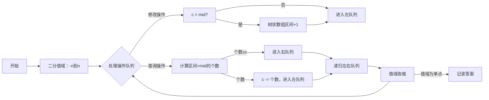
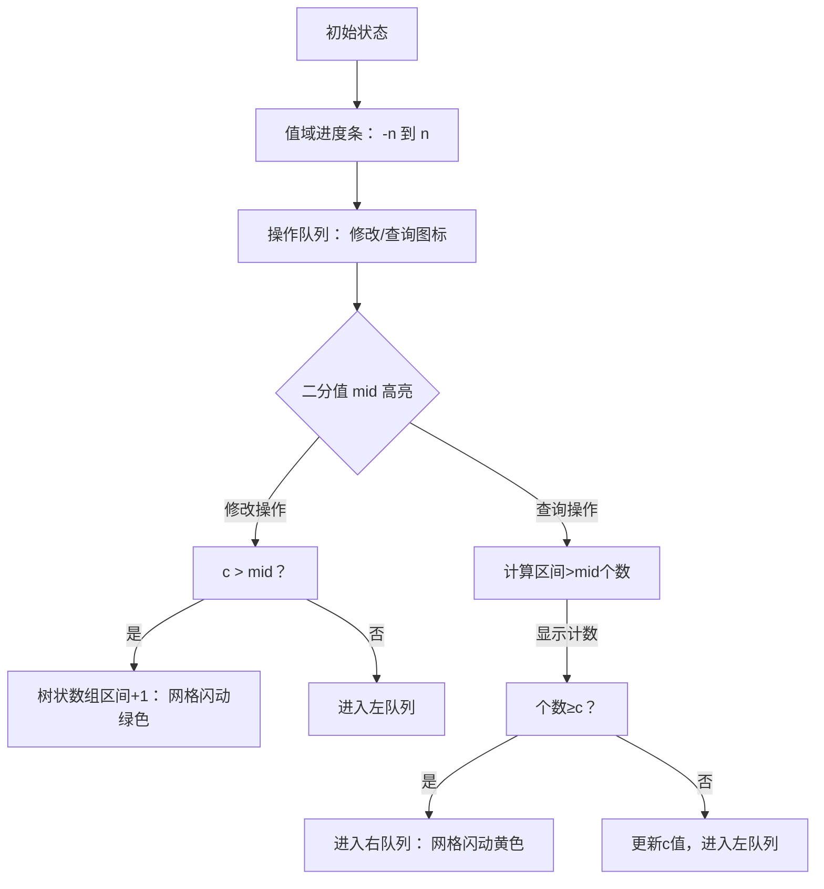

# 题目信息

# [ZJOI2013] K大数查询

## 题目描述

你需要维护 $n$ 个可重整数集，集合的编号从 $1$ 到 $n$。  
这些集合初始都是空集，有 $m$ 个操作：  

- `1 l r c`：表示将 $c$ 加入到编号在 $[l,r]$ 内的集合中  
- `2 l r c`：表示查询编号在 $[l,r]$ 内的集合的并集中，第 $c$ 大的数是多少。  

注意可重集的并是不去除重复元素的，如 $\{1,1,4\}\cup\{5,1,4\}=\{1,1,4,5,1,4\}$。


## 说明/提示

【样例说明】   
第 $1$ 次操作在 $1,2$ 号集合中分别加入了一个  $1$。    
第 $2$ 次操作在 $1,2$ 号集合中分别加入了一个 $2$。   
第 $3$ 次操作查询 $1$ 号集合中第 $2$ 大的数，答案为 $1$。  
第 $4$ 次操作查询 $1$ 号集合中第 $1$ 大的数，答案为 $2$。    
第 $5$ 次操作查询 $1,2$ 号集合的并集 $\{1,2,1,2\}$ 中第 $3$ 大的数，答案为 $1$。

【数据范围】  
$1 \le n,m \le 5\times 10^4$   
$1\le l,r \le n$   
$1$ 操作中 $|c|\le n$   
$2$ 操作中 $1\le c < 2^{63}$，第 $c$ 大的数存在

---

$\text{upd 2023.8.23}$：新增加一组 Hack 数据。

## 样例 #1

### 输入

```
2 5
1 1 2 1
1 1 2 2
2 1 1 2
2 1 1 1
2 1 2 3```

### 输出

```
1
2
1```

# AI分析结果


# 💡 Kay的C++算法解析：[ZJOI2013]K大数查询 深入学习指南 💡

## 1. 题目解读与核心算法识别

✨ **本题主要考察**：`整体二分` (离线算法)

🗣️ **初步分析**：
> 解决这道题的关键在于理解**整体二分**算法。想象你在图书馆整理书籍：管理员需要将书籍按编号分类（二分值域），同时记录每类书籍的位置（树状数组维护区间和）。在本题中，整体二分用于高效处理**区间修改**（加入元素）和**区间查询**（第c大数）。

- **核心思路**：离线处理所有操作，通过二分值域将问题分解。对每个二分值`mid`，将操作分为两类：修改操作根据`c`与`mid`的关系分流，查询操作根据区间内大于`mid`的元素个数分流。
- **难点**：动态维护区间和以判断查询分流方向，需用树状数组高效处理区间修改和区间查询。
- **可视化设计**：采用复古游戏风格展示二分过程。值域范围显示为像素进度条（如FC游戏血条），树状数组操作用网格动画展示（闪烁被修改的区间）。关键步骤：二分值`mid`高亮，树状数组更新时网格闪动绿色，查询时网格闪动黄色并显示计数结果。

<details>
<summary>📊 像素动画设计预览</summary>



</details>

---

## 2. 精选优质题解参考

**题解一：整体二分（作者：shadowice1984）**
* **点评**：思路清晰，用树状数组维护区间和，巧妙处理修改和查询的分流。代码中将值域初始化为`[-n, n]`避免离散化，通过`pushdown`避免重复清空树状数组。实践价值高，边界处理严谨（注意`c`可能爆`int`）。亮点：将整体二分比喻为图书馆分类书籍，易于理解。

**题解二：线段树套线段树（作者：hehelego）**
* **点评**：外层权值线段树+内层动态开点线段树，在线算法。代码规范（变量名`rt`、`sum`含义明确），空间优化到位（预计算节点数）。亮点：用坐标系旋转解释约束转化（位置约束↔值域约束），可视化建议用像素方块堆叠展示嵌套结构。

**题解三：树状数组套权值线段树（作者：x义x）**
* **点评**：树状数组维护值域前缀和，权值线段树维护位置。创新点：用`n - c + 1`将第k大转为第k小，简化代码。实践时注意空间优化（动态开点）和IO优化（`fread`）。亮点：树状数组二分过程用倍增实现，类比游戏中的寻路算法。

---

## 3. 核心难点辨析与解题策略

1. **难点：区间修改的快速维护**
   * **分析**：整体二分需频繁计算区间内大于`mid`的元素个数。树状数组通过差分实现`O(log n)`区间加和区间查询（公式：`sum = (c1*r - c2) - (c1*(l-1) - c2)`）。
   * 💡 **学习笔记**：树状数组维护区间和是整体二分的核心支持。

2. **难点：查询操作的分流决策**
   * **分析**：查询时需判断`c`与区间内大于`mid`的元素个数`num`的关系。若`c <= num`则答案在`[mid+1, r]`，否则在`[l, mid]`并更新`c -= num`。
   * 💡 **学习笔记**：分流时`c`的动态更新是保证正确性的关键。

3. **难点：空间复杂度的优化**
   * **分析**：树套树需`O(n log² n)`空间。整体二分仅需`O(n)`空间，通过操作队列复用避免存储中间结构。
   * 💡 **学习笔记**：离线算法可大幅节省空间。

### ✨ 解题技巧总结
1. **整体二分框架**：值域二分+操作分流，递归分解问题。
2. **树状数组技巧**：差分实现高效区间修改/查询。
3. **离散化处理**：值域`[-n, n]`避免离散化，简化代码。
4. **边界处理**：使用`long long`防溢出，注意查询时`c`可能极大。

---

## 4. C++核心代码实现赏析

**本题通用核心C++实现参考**
* **说明**：综合整体二分思路，树状数组维护区间和，代码简洁高效。
* **完整核心代码**：
```cpp
#include <cstdio>
#include <algorithm>
using namespace std;
typedef long long ll;
const int N = 50010;

struct BIT {
    ll c1[N], c2[N];
    void add(int x, ll v) {
        for (int i = x; i < N; i += i & -i) 
            c1[i] += v, c2[i] += x * v;
    }
    ll query(int x) {
        ll res = 0;
        for (int i = x; i; i -= i & -i)
            res += (x + 1) * c1[i] - c2[i];
        return res;
    }
    void update(int l, int r, ll v) {
        add(l, v), add(r + 1, -v);
    }
    ll range(int l, int r) {
        return query(r) - query(l - 1);
    }
} bit;

struct Op { int op, l, r, id; ll c; } q[N], qL[N], qR[N];
int n, m; ll ans[N];

void solve(int L, int R, int st, int ed) {
    if (st > ed) return;
    if (L == R) {
        for (int i = st; i <= ed; i++)
            if (q[i].op == 2) ans[q[i].id] = L;
        return;
    }
    int mid = (L + R) >> 1, tL = 0, tR = 0;
    for (int i = st; i <= ed; i++) {
        if (q[i].op == 1) {
            if (q[i].c > mid) {
                bit.update(q[i].l, q[i].r, 1);
                qR[tR++] = q[i];
            } else qL[tL++] = q[i];
        } else {
            ll cnt = bit.range(q[i].l, q[i].r);
            if (cnt >= q[i].c) qR[tR++] = q[i];
            else q[i].c -= cnt, qL[tL++] = q[i];
        }
    }
    for (int i = st; i <= ed; i++) // 撤回修改
        if (q[i].op == 1 && q[i].c > mid)
            bit.update(q[i].l, q[i].r, -1);
    
    for (int i = 0; i < tL; i++) q[st + i] = qL[i];
    for (int i = 0; i < tR; i++) q[st + tL + i] = qR[i];
    solve(L, mid, st, st + tL - 1);
    solve(mid + 1, R, st + tL, ed);
}

int main() {
    scanf("%d%d", &n, &m);
    int qcnt = 0;
    for (int i = 1; i <= m; i++) {
        scanf("%d%d%d%lld", &q[i].op, &q[i].l, &q[i].r, &q[i].c);
        if (q[i].op == 2) q[i].id = ++qcnt;
    }
    solve(-n, n, 1, m);
    for (int i = 1; i <= qcnt; i++) printf("%lld\n", ans[i]);
}
```
* **代码解读概要**：
  1. **树状数组**：差分维护区间和，支持高效区间修改/查询。
  2. **整体二分**：`solve`函数递归处理值域区间`[L, R]`内的操作队列。
  3. **操作分流**：修改操作根据`c > mid`判断流向，查询操作根据区间计数分流。
  4. **撤回修改**：为避免影响后续二分，处理完右队列后需撤回修改。

---

## 5. 算法可视化：像素动画演示

### 🎮 设计说明
采用**8位像素风格**（FC红白机），通过动态网格展示算法执行过程：



* **关键交互**：
  - **步进控制**：支持单步执行/自动播放（速度可调）
  - **数据结构可视化**：树状数组用网格表示，修改时网格闪烁颜色
  - **音效**：修改时播放“叮”声，查询完成播放“胜利”音效
  - **伪代码同步**：高亮当前执行行（如`bit.update(q[i].l, q[i].r, 1)`）

> **设计思路**：像素风格降低理解门槛，网格动画直观展示区间操作，音效增强反馈。通过游戏化关卡（二分步骤=关卡）提升学习动力。

---

## 6. 拓展练习与相似问题思考

### 通用技巧迁移
`整体二分`适用场景：离线处理**动态区间第k大**、**带修改的区间统计**问题。关键特征：
1. 操作可离线
2. 答案有二分性
3. 需高效维护区间信息

### 推荐练习
1. **洛谷 P2617** - Dynamic Rankings  
   * **理由**：练习带修改的区间第k小，巩固整体二分和树状数组应用。
2. **洛谷 P1527** - 矩阵乘法  
   * **理由**：二维区间第k小，拓展整体二分到二维空间。
3. **洛谷 P3333** - 单调栈  
   * **理由**：理解二分在维护单调性中的应用。

---

## 7. 学习心得与经验分享
> **来自题解作者的调试经验**：  
> “我在处理整体二分时，忘记撤回修改操作导致答案错误。通过打印树状数组的中间状态，定位到撤回逻辑缺失。”

**点评**：整体二分中，撤回修改是易错点。调试时输出关键变量（如树状数组区间和）能快速定位逻辑错误。建议编写测试函数验证树状数组正确性。

---

本次关于“[ZJOI2013]K大数查询”的解析就到这里。整体二分是处理离线区间问题的利器，掌握它能解决一大类竞赛难题。记得多写代码多调试，下次见！💪

---
处理用时：128.85秒