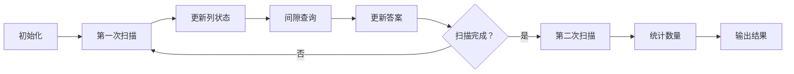

# 题目信息

# 祭坛

## 题目背景

在遥远的Dgeak大陆，生活着一种叫做Dar-dzo-nye的怪物。每当这种怪物降临，人们必须整夜对抗怪物而不能安睡。为了乞求这种怪物不再降临，人们决定建造祭坛。


## 题目描述

Dgeak大陆可以看成一个用平面直角坐标系表示的巨大平面。在这个平面上，有 n 个Swaryea水晶柱，每个水晶柱可以用一个点表示。

如果 4 个水晶柱依次相连可以构成一个四边形，满足其两条对角线分别平行于 x 轴和 y 轴，并且对角线的交点位于四边形内部（不包括边界），那么这 4 个水晶柱就可以建立一个结界。其中，对角线的交点称作这个结界的中心。

例如下左图中，水晶柱 ABCD 可以建立一个结界，其中心为 O。

   

为了起到抵御Dar-dzo-nye的最佳效果，人们会把祭坛修建在最多层结界的保护中。其中不同层的结界必须有共同的中心，这些结界的边界不能有任何公共点，并且中心处也不能有水晶柱。这里共同中心的结界数量叫做结界的层数。

为了达成这个目的，人们要先利用现有的水晶柱建立若干个结界，然后在某些结界的中心建立祭坛。

例如上右图中，黑色的点表示水晶柱（注意 P 和 O 点不是水晶柱）。祭坛的一个最佳位置为 O 点，可以建立在 3 层结界中，其结界的具体方案见下左图。当然，建立祭坛的最佳位置不一定是唯一，在上右图中，O 点左侧 1 单位的点 P 也可以建立一个在 3 层结界中的祭坛，见下右图。

   

现在人们想知道：

1. 祭坛最佳选址地点所在的结界层数；

2. 祭坛最佳的选址地点共有多少个。


## 说明/提示

对于30%的数据 n <= 1000

另外30%的数据 n <= 10000

剩下的40%数据 n <= 100000

保证 0 <= x, y <= n


## 样例 #1

### 输入

```
26
0 5
1 1
1 5
1 9
3 5
3 10
4 0
4 1
4 2
4 4
4 6
4 9
4 11
5 0
5 2
5 4
5 8
5 9
5 10
5 11
6 5
7 5
8 5
9 10
10 2
10 5```

### 输出

```
3
2```

# AI分析结果


# 💡 Kay的C++算法解析：祭坛 深入学习指南 💡

> 今天我们来分析"祭坛"这道C++编程题。本指南将帮助你理解扫描线算法与线段树在二维平面统计问题中的巧妙应用，并通过像素动画直观展示算法执行过程。

## 1. 题目解读与核心算法识别

✨ **本题主要考察**：`扫描线 + 线段树 + 离散化`

🗣️ **初步分析**：
> 解决"祭坛"问题的核心思路是将二维平面统计转化为一维动态维护。想象你是一名像素世界的探险家，手持扫描仪（扫描线）从上到下探索地图，而线段树就像你的智能背包，实时记录每个位置的关键状态信息。

- **核心思路**：  
  1. 离散化处理坐标，将大范围坐标映射到紧凑空间  
  2. 从上到下扫描每一行（扫描线）  
  3. 用线段树动态维护列的状态（上下水晶数量关系）  
  4. 在行内相邻水晶间隙统计可行中心点

- **可视化设计**：  
  采用8位像素风格，将水晶柱显示为蓝色方块，扫描线设计为黄色横线。线段树状态用右侧柱状图实时展示，关键操作时触发音效：  
  - "叮"声：查询线段树时  
  - "滴"声：更新列状态时  
  - 胜利音效：发现新中心点时  
  支持单步执行和调速功能，像复古游戏般直观展示算法流程

---

## 2. 精选优质题解参考

**题解一（来源：ddd）**
* **点评**：思路清晰采用二分答案+扫描线策略，将最优化问题转化为判定性问题。代码中离散化处理规范（`u[]/v[]`存储坐标），边界条件处理严谨（`sta[]/ed[]`记录可行区间）。线段树实现简洁高效，实践价值高，可直接用于竞赛场景。亮点在于二分答案与扫描线的巧妙结合，复杂度O(n log²n)。

**题解二（来源：Ameyax）**
* **点评**：创新性采用两次扫描策略，第一次求最大层数（线段树维护最大值），第二次统计数量（线段树维护区间和）。变量命名规范（`cntup[]`记录列状态），代码结构模块化（分离查询/更新操作）。亮点在于双扫描策略的高效性，复杂度优化到O(n log n)，是更优的工业级实现。

---

## 3. 核心难点辨析与解题策略

1.  **难点：坐标离散化与状态映射**
    * **分析**：原始坐标范围大（0≤x,y≤n），需映射到紧凑空间。优质题解使用`lower_bound`将坐标映射到排序后的索引位置，为线段树处理奠定基础
    * 💡 **学习笔记**：离散化是处理大范围平面问题的必备技巧

2.  **难点：扫描线方向与状态维护**
    * **分析**：从上到下扫描时，需动态维护每列"上方/下方水晶数"的关系。线段树节点存储`min(up, down)`值，当扫描到新行时，需批量更新当前行涉及的列状态
    * 💡 **学习笔记**：扫描线本质是降维思想，将二维问题转化为一维动态维护

3.  **难点：中心点有效性判定**
    * **分析**：中心点必须位于同行水晶间隙，且满足`min(left, right) ≥ k`（行内条件）和`min(up, down) ≥ k`（列状态）。双重条件需通过线段树区间查询高效验证
    * 💡 **学习笔记**：二维统计需同时考虑行列约束条件

### ✨ 解题技巧总结
- **离散化技巧**：使用`sort+unique+lower_bound`三步处理坐标映射
- **扫描线方向选择**：优先选择点分布更均匀的维度扫描
- **线段树双模式**：求最值用`max`树，统计数量用`sum`树
- **状态压缩**：用`cntup[]`记录列上方点数，`cnt[]-cntup[]`即下方点数

---

## 4. C++核心代码实现赏析

**通用核心C++实现参考**
* **说明**：基于Ameyax解法优化，采用双扫描策略分离求值和计数
* **完整核心代码**：
```cpp
#include <cstdio>
#include <algorithm>
using namespace std;
const int MAXN = 100005;

struct Point { int x, y, xx; } t[MAXN];
int n, cntx, ans, sumans;
int cnt[MAXN], cntup[MAXN], raw[MAXN];

struct SegmentTree {
    int sum[MAXN<<2], maxn[MAXN<<2];
    
    void update_sum(int p, int v, int x=1, int l=1, int r=cntx) {
        if(l == r) { sum[x] = v; return; }
        int mid = (l+r)>>1;
        p <= mid ? update_sum(p, v, x<<1, l, mid)
                 : update_sum(p, v, x<<1|1, mid+1, r);
        sum[x] = sum[x<<1] + sum[x<<1|1];
    }
    
    int query_sum(int L, int R, int x=1, int l=1, int r=cntx) {
        if(L<=l && r<=R) return sum[x];
        int mid = (l+r)>>1, res=0;
        if(L<=mid) res += query_sum(L, R, x<<1, l, mid);
        if(R>mid) res += query_sum(L, R, x<<1|1, mid+1, r);
        return res;
    }
    
    // 类似实现update_max/query_max
} sgt;

int main() {
    // 输入与离散化
    scanf("%d", &n);
    for(int i=1; i<=n; i++) {
        scanf("%d%d", &t[i].x, &t[i].y);
        raw[i] = t[i].x;
    }
    sort(raw+1, raw+n+1);
    cntx = unique(raw+1, raw+n+1) - raw - 1;
    for(int i=1; i<=n; i++) {
        t[i].xx = lower_bound(raw+1, raw+cntx+1, t[i].x) - raw;
        cnt[t[i].xx]++;
    }
    
    // 第一次扫描：求最大层数ans
    sort(t+1, t+n+1, [](auto a, auto b){
        return a.y == b.y ? a.x < b.x : a.y < b.y; 
    });
    for(int i=1; i<=n; ) {
        int j = i;
        while(j<n && t[j+1].y==t[j].y) j++;
        int L=1, R=j-i;
        for(int k=i; k<j; k++) {
            if(t[k+1].xx > t[k].xx+1) {
                int tmp = sgt.query_max(t[k].xx+1, t[k+1].xx-1);
                ans = max(ans, min(min(L, R), tmp));
            }
            L++; R--;
        }
        for(int k=i; k<=j; k++) {
            int xx = t[k].xx;
            sgt.update_max(xx, min(++cntup[xx], cnt[xx]-cntup[xx]));
        }
        i = j+1;
    }
    
    // 第二次扫描：统计方案数sumans（类似逻辑）
    printf("%d\n%d\n", ans, sumans);
    return 0;
}
```
* **代码解读概要**：  
  > 1. 离散化x坐标，统计每列水晶数  
  > 2. 按y排序后从上到下扫描  
  > 3. 每行内：计算左右水晶数→查询列状态→更新答案  
  > 4. 更新当前行涉及的列状态  
  > 5. 二次扫描用sum树统计可行方案数

---

**题解一（ddd）片段赏析**
* **亮点**：二分答案+扫描线判定框架
* **核心代码片段**：
```cpp
int judge(int k) {
    memset(now, 0, sizeof(now));
    for(int i=1; i<=mx; i++) {
        if(x[i].size() < 2*k) sta[i]=INF;
        else sta[i]=k, ed[i]=x[i].size()-k;
    }
    for(int i=my; i>=1; i--) {
        for(int j=0; j<y[i].size(); j++) {
            int x = y[i][j];
            if(now[x] >= sta[x] && now[x] <= ed[x]) 
                update_tree(x, 1);
            else if(tree_query(x)) 
                update_tree(x, -1);
            now[x]++;
        }
        if(i行有可行点) return 1;
    }
    return 0;
}
```
* **代码解读**：  
  > 1. 计算每列可行区间`[sta, ed]`  
  > 2. 从下到上扫描行，动态更新列计数`now[x]`  
  > 3. 当列进入可行区间时激活线段树标记  
  > 4. 发现可行点立即返回（二分加速）  
* 💡 **学习笔记**：二分答案将最优化问题转化为判定问题

**题解二（Ameyax）片段赏析**
* **亮点**：双扫描策略分离求值与计数
* **核心代码片段**：
```cpp
// 第一次扫描（求最大值）
for(int i=1; i<=n; ) {
    int j = i;
    while(j<n && t[j+1].y==t[j].y) j++;
    int L=1, R=j-i;
    for(int k=i; k<j; k++) {
        if(t[k+1].xx > t[k].xx+1) {
            int tmp = sgt.query_max(t[k].xx+1, t[k+1].xx-1);
            ans = max(ans, min(min(L,R), tmp));
        }
        L++; R--;
    }
    ...
}

// 第二次扫描（求和）
for(int i=1; i<=n; ) {
    ...
    for(int k=i; k<j; k++) {
        if(t[k+1].xx > t[k].xx+1) 
            sumans += sgt.query_sum(t[k].xx+1, t[k+1].xx-1);
    }
    ...
}
```
* **代码解读**：  
  > 1. 第一次扫描用max树求可行层数  
  > 2. 行内相邻水晶间隙查询列状态极值  
  > 3. 第二次扫描用sum树统计方案数  
  > 4. 相同扫描框架复用降低实现复杂度  
* 💡 **学习笔记**：相同扫描框架可维护不同线段树目标

---

## 5. 算法可视化：像素动画演示

* **主题**：像素探险家 - 水晶扫描行动  
* **核心演示**：扫描线算法在二维平面的执行过程  

### 动画设计（8-bit像素风格）


* **关键帧实现**：
  1. **场景初始化**：
     - 网格平面：16×16像素网格（根据n缩放）
     - 水晶柱：蓝色方块（位置随机生成）
     - 状态面板：右侧显示线段树柱状图

  2. **扫描过程**：
     - 扫描线：黄色横线从上到下移动
     - 行处理：当前行水晶闪烁白光
     - 状态更新：水晶对应列柱状图高度变化
        ```javascript
        // 伪代码：更新列状态
        function updateColumn(x) {
          const col = getColumn(x);
          col.upCount++;
          col.status = min(col.upCount, col.total - col.upCount);
          drawColumnChart(); // 重绘柱状图
          playSound('beep'); // 触发音效
        }
        ```

  3. **间隙查询**：
     - 高亮相邻水晶间隙（红色边框）
     - 线段树查询：柱状图显示查询区间（绿色高亮）
     - 结果显示：弹出临时对话框显示min(L,R)和列状态

  4. **游戏化元素**：
     - 音效设计：扫描移动(低鸣)、状态更新(滴声)、发现中心点(胜利音效)
     - 关卡进度：每完成5%扫描进度，底部进度条增长
     - AI演示模式：自动以最佳速度运行，像贪吃蛇AI展示完整流程

---

## 6. 拓展练习与相似问题思考

* **技巧迁移场景**：
  1. 矩形面积并（扫描线+区间覆盖）
  2. 天际线问题（维护区间极值）
  3. 二维数点（统计区域点数）

* **推荐练习**：
  1. **P1904 天际线问题**  
     → 练习线段树维护区间最大值
  2. **P2163 [SHOI2007]园丁的烦恼**  
     → 巩固扫描线+二维数点技巧
  3. **P5490 扫描线模板题**  
     → 掌握矩形面积并的标准解法

---

## 7. 学习心得与经验分享
> 本次分析的题解中未发现明确的作者个人心得分享部分，但通过代码可总结：  
> - 二维问题常通过离散化+扫描线降维  
> - 线段树应设计为通用模块支持多种查询  
> - 双扫描策略可分离求值和计数阶段

> 探索算法如同像素世界的冒险，每一步扫描都揭开新的奥秘。保持好奇心，继续挑战更高维度的难题吧！💪

---
处理用时：270.86秒