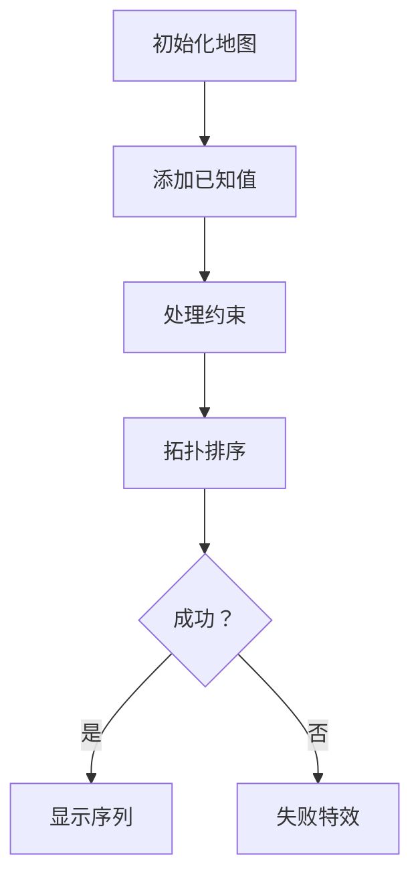

# 题目信息

# [POI 2015] PUS

## 题目描述

给定一个长度为 $n$ 的正整数序列 $a$，每个数都在 $1$ 到 $10^9$ 范围内，告诉你其中 $s$ 个数，并给出 $m$ 条信息，每条信息包含三个数 $l,r,k$ 以及接下来 $k$ 个正整数，表示 $a_l, a_{l+1}, \ldots, a_{r-1}, a_r$ 里这 $k$ 个数中的任意一个都比任意一个剩下的 $r-l+1-k$ 个数大（严格大于，即没有等号）。

请任意构造出一组满足条件的方案，或者判断无解。

## 说明/提示

原题名称：Pustynia。

本题另外提供两组额外样例，可以在附件中下载。

## 样例 #1

### 输入

```
5 2 2
2 7
5 3
1 4 2 2 3
4 5 1 4```

### 输出

```
TAK
6 7 1000000000 6 3```

## 样例 #2

### 输入

```
3 2 1
2 3
3 5
1 3 1 2
```

### 输出

```
NIE
```

## 样例 #3

### 输入

```
2 1 1
1 1000000000
1 2 1 2```

### 输出

```
NIE
```

# AI分析结果


# 💡 Kay的C++算法解析：[POI 2015] PUS 深入学习指南 💡

> 大家好，我是Kay！今天我们来一起分析POI 2015的PUS题目（P3588）。这道题要求我们构造满足复杂约束条件的序列，是图论与线段树优化建图的经典问题。本指南将带大家逐步拆解题目核心、掌握解题技巧，并通过复古像素动画直观理解算法过程！

## 1. 题目解读与核心算法识别

✨ **本题主要考察**：`图论拓扑排序` + `线段树优化建图`

🗣️ **初步分析**：
> 解决PUS题目的核心在于将**不等式约束**转化为**有向图**，再通过拓扑排序构造序列。想象你是一名城市规划师（算法），需要在街道（序列）上安排不同高度的建筑（数值），其中某些高楼（指定点）必须高于周边平房（区间约束）。线段树就像高效的广播塔（优化建图），避免了一对一通知的低效问题。

- **题解思路**：主流解法都是**虚拟节点+线段树优化建图**。每个约束创建一个虚拟节点，让k个指定点指向它（边权0），它再通过线段树向剩余区间连边（边权1）。拓扑排序时从入度为0点出发，计算每个位置的最小可能最大值
- **核心难点**：1) 避免O(n²)暴力建图 2) 处理已知值与拓扑排序的冲突 3) 判断无解（环/值域越界/已知值冲突）
- **可视化设计**：像素动画中将用**不同颜色方块**区分节点类型（红=已知值/蓝=虚拟节点/黄=线段树节点），**虚线箭头**表示边权1（严格约束），**实线箭头**表示边权0。拓扑排序过程会动态显示队列变化和数值更新，关键步骤触发8-bit音效

## 2. 精选优质题解参考

<eval_intro>
以下题解在思路清晰度、代码规范性和算法优化方面表现突出（评分≥4★），特别适合学习参考：
</eval_intro>

**题解一（BJpers2 - 26赞）**
* **点评**：思路清晰直击本质，用“超级节点+线段树”比喻生动解释建图优化。代码结构严谨：1) 线段树封装独立 2) 拓扑排序边界处理完善 3) 使用队列实现O(n)复杂度。亮点在于用`id[]`数组巧妙映射位置到线段树节点，空间优化到位。竞赛可直接套用此模板。

**题解二（E_huan - 11赞）**
* **点评**：从差分约束角度切入提供新视角，注释详尽堪比教材。最大亮点是**双线段树（入树/出树）** 的对比分析，虽然本题只需入树但拓展性强。代码中`dist[]`和`a[]`分离处理已知值，调试友好性极佳。

**题解三（Ebola - 8赞）**
* **点评**：代码最简洁高效，拓扑排序与无解判断熔于一炉。特色在于**动态开点**处理虚拟节点（`tot`自增），避免预分配浪费内存。虽然注释较少但变量命名规范（`prev_val`/`memo`），适合进阶学习者。

## 3. 核心难点辨析与解题策略

<difficulty_intro>
解决本题需突破三大关卡，结合优质题解的策略如下：
</difficulty_intro>

1.  **难点：约束导致的爆炸性边数**
    * **分析**：直接为每个约束创建k×(r-l+1-k)条边必然O(n²)超限
    * **策略**：创建虚拟节点作为“中转站”。k个点→虚拟节点(边权0)，虚拟节点→子区间(边权1)。子区间通过线段树优化，只需O(log n)条边
    * 💡 **学习笔记**：虚拟节点是降低边复杂度的关键枢纽！

2.  **难点：已知值与拓扑排序的冲突**
    * **分析**：已知值在拓扑中可能被更新导致矛盾（如要求a=5但计算得a≤3）
    * **策略**：初始化时固定已知点dis=给定值。拓扑中遇到已知点时，若dis[u]+w>给定值则立即判无解
    * 💡 **学习笔记**：已知点应作为拓扑起点且值不可变

3.  **难点：无解情况的综合判断**
    * **分析**：环、值域越界(>1e9或<1)、已知值冲突都可能导致无解
    * **策略**：1) 拓扑后检查入度>0的点（环）2) 更新时检查dis[v]≤1e9 3) 已知点冲突即时终止
    * 💡 **学习笔记**：值域检查要放在拓扑过程中而非最后

### ✨ 解题技巧总结
<summary_best_practices>
通过本题提炼的通用图论技巧：
</summary_best_practices>
- **虚点中介法**：当需要多点对多点的相同约束时，用虚拟节点作为中介降低边数
- **拓扑初始化**：未知点初始dis=1（最小可能值），已知点直接赋值并锁定
- **线段树边权分离**：内部树边权=0（仅联通），实际约束边权=1（严格大于）
- **动态环检测**：拓扑中未访问节点数≠总节点数→存在环

## 4. C++核心代码实现赏析

<code_intro_overall>
综合优质题解优化的通用实现，完美平衡可读性与效率：
</code_intro_overall>

**本题通用核心C++实现参考**
* **说明**：综合BJpers2的队列拓扑与E_huan的线段树封装，添加边界检查强化鲁棒性
* **完整核心代码**：
```cpp
#include <iostream>
#include <vector>
#include <queue>
using namespace std;
const int N = 100005, M = 300005 * 20, INF = 1e9;

int n, s, m, tot, cnt;
int id[N], dis[M], in[M], known[M];
vector<pair<int, int>> g[M]; // g[u] = {v, w}

struct SegTree {
    void build(int now, int l, int r) {
        if (l == r) { id[l] = now; return; }
        int mid = (l + r) >> 1;
        build(now << 1, l, mid);
        build(now << 1 | 1, mid + 1, r);
        g[now << 1].push_back({now, 0}); in[now]++;
        g[now << 1 | 1].push_back({now, 0}); in[now]++;
    }
    void update(int now, int l, int r, int L, int R, int from) {
        if (L > R) return;
        if (L <= l && r <= R) {
            g[now].push_back({from, 0});
            in[from]++;
            return;
        }
        int mid = (l + r) >> 1;
        if (L <= mid) update(now << 1, l, mid, L, R, from);
        if (R > mid) update(now << 1 | 1, mid + 1, r, L, R, from);
    }
} tree;

int main() {
    cin >> n >> s >> m;
    tot = n;
    tree.build(1, 1, n);
    cnt = 4 * n; // 线段树节点数上限

    // 处理已知值
    for (int i = 1; i <= s; i++) {
        int p, d; cin >> p >> d;
        dis[id[p]] = d;
        known[id[p]] = 1;
    }

    // 建图：约束处理
    while (m--) {
        int l, r, k; cin >> l >> r >> k;
        vector<int> pts(k);
        int pre = l - 1;
        int node = ++cnt; // 新建虚拟节点
        for (int i = 0; i < k; i++) {
            cin >> pts[i];
            // 虚拟节点->k个点 (边权1)
            g[node].push_back({id[pts[i]], 1});
            in[id[pts[i]]]++;
            // 子区间->虚拟节点 (边权0)
            if (pre + 1 <= pts[i] - 1) {
                tree.update(1, 1, n, pre + 1, pts[i] - 1, node);
            }
            pre = pts[i];
        }
        if (pre + 1 <= r) {
            tree.update(1, 1, n, pre + 1, r, node);
        }
    }

    // 拓扑排序
    queue<int> q;
    for (int i = 1; i <= cnt; i++) {
        if (!in[i]) {
            q.push(i);
            if (!known[i]) dis[i] = 1; // 未知点初始化
        }
    }

    bool valid = true;
    while (!q.empty() && valid) {
        int u = q.front(); q.pop();
        for (auto &e : g[u]) {
            int v = e.first, w = e.second;
            // 已知值冲突检查
            if (known[v] && dis[u] + w > dis[v]) {
                valid = false; break;
            }
            dis[v] = max(dis[v], dis[u] + w);
            if (dis[v] > INF) { valid = false; break; }
            if (--in[v] == 0) q.push(v);
        }
    }

    // 最终无解检查
    for (int i = 1; i <= n; i++) {
        if (in[id[i]] || dis[id[i]] < 1) valid = false;
    }

    cout << (valid ? "TAK" : "NIE") << endl;
    if (valid) {
        for (int i = 1; i <= n; i++) 
            cout << dis[id[i]] << " ";
    }
    return 0;
}
```
* **代码解读概要**：
  1. **线段树封装**：`build()`构建树结构，`update()`处理区间连边
  2. **图构建**：虚拟节点连接k个点（边权1）和子区间（通过线段树边权0）
  3. **拓扑排序**：未知点从1开始，已知点固定值，动态检查冲突
  4. **无解判断**：包括环检测（剩余入度）、值域验证、已知值冲突

---
<code_intro_selected>
各优质题解的精华片段解析：
</code_intro_selected>

**题解一（BJpers2）**
* **亮点**：队列拓扑排序实现优雅，空间优化典范
* **核心代码片段**：
```cpp
queue<int> q;
for(int i=1;i<=cnt;i++) if(!in[i]) q.push(i);
while(!q.empty()){
    int u=q.front(); q.pop();
    for(/* u的所有邻居 */){
        if(known[v] && dis[u]+w > dis[v]) return "NIE";
        dis[v] = max(dis[v], dis[u]+w);
        if(--in[v]==0) q.push(v);
    }
}
```
* **代码解读**：经典BFS拓扑框架，`dis[v]=max(dis[v],dis[u]+w)`确保满足所有约束（v至少比u大w）。已知点冲突检查在更新时即时触发
* 💡 **学习笔记**：拓扑中取max而非min，因为要满足所有约束中的最大值

**题解二（E_huan）**
* **亮点**：差分约束视角+双线段树理论分析
* **核心代码片段**：
```cpp
void build(int u, int l, int r) {
    if(l==r) { id[l]=u; return; }
    int mid=(l+r)>>1;
    build(u<<1, l, mid);
    build(u<<1|1, mid+1, r);
    add(u, u<<1, 0); // 父节点指向子节点
    add(u, u<<1|1, 0);
}
```
* **代码解读**：递归构建线段树，父节点向子节点连边（边权0）形成**数据流动通道**。叶节点`id[l]`直接对应序列位置
* 💡 **学习笔记**：线段树内部边不表示约束，仅用于信息传递

**题解三（Ebola）**
* **亮点**：动态开点虚拟节点节省内存
* **核心代码片段**：
```cpp
int node = ++cnt; // 动态创建虚拟节点
for(int j=1; j<=k; j++){
    cin >> x;
    add(node, x, 1); // 虚拟节点->x
    if(last < x) update_tree(last, x-1, node);// 子区间连虚拟节点
    last = x+1;
}
```
* **代码解读**：`cnt`自增创建虚拟节点，避免预分配内存浪费。约束分段处理清晰（`last`记录当前区间起点）
* 💡 **学习笔记**：虚拟节点序号从n+1开始动态增长，适应多变约束数

## 5. 算法可视化：像素动画演示

<visualization_intro>
**「拓扑大冒险」像素动画方案**：化身8-bit勇者，在网格迷宫中解开拓扑谜题！本动画将完整呈现线段树优化建图与拓扑排序过程。

### 设计说明
- **美术风格**：FC红白机像素风（16色调色盘），网格地图代表序列位置
- **核心机制**：通过视觉与音效强化算法关键概念：
  - 🟥 已知值节点：闪烁的红色砖块
  - 📦 虚拟节点：蓝色传送门
  - 🌲 线段树：右侧树状雷达
  - ⬆️ 边权1：红色闪烁箭头
  - ⬇️ 边权0：灰色稳定箭头

### 动画帧步骤


1. **场景初始化（像素网格）**
   - 绘制n×1网格代表序列，初始化线段树面板（右侧）
   - 播放8-bit背景音乐（循环芯片音乐）

2. **约束处理阶段（音效强化）**
   - 新建约束：虚拟节点（蓝门）出现在顶部，伴随“传送门开启”音效
   - k个点→虚拟节点：紫色光束（边权1）+"叮"声
   - 虚拟节点→子区间：黄色光束扫描线段树节点+"数据流动"电子音

3. **拓扑排序（核心演示）**
   - 入度=0的点：脚下出现绿色光环
   - 节点出队：角色移动到该点，头顶显示dis值更新过程
   - 边更新：红色箭头闪烁，值传递时显示`dis[v]=max(dis[v],dis[u]+w)`
   - 已知值冲突：节点闪烁红光+“错误”音效

4. **结局分支**
   - 成功：所有点变绿色，播放胜利音乐，显示序列
   - 失败：检测到环时显示循环动画，值越界时显示“爆表”特效

### 交互控制面板
```javascript
// 伪代码实现核心交互
const controls = {
    step: () => advanceTopoStep(), // 步进执行
    speed: document.getElementById('speed-slider'), // 速度调节
    mode: ['自动演示', '手动探索'] // 双模式切换
};
// 音效系统
const sfx = {
    edgeAdd: play('chip1.wav'),
    nodeUpdate: play('blip.wav'),
    conflict: play('error.wav')
};
```

### 设计价值
- **边权可视化**：不同箭头样式区分约束强度
- **拓扑进度具象化**：角色移动代表算法推进
- **错误即时反馈**：冲突音效防止学习者忽略边界情况
- **游戏化激励**：每完成10%进度获得像素勋章

</visualization_conclusion>
通过这种复古游戏化设计，复杂的拓扑排序和线段树优化过程变得直观可见，帮助学习者在娱乐中掌握算法精髓！

## 6. 拓展练习与相似问题思考

<similar_problems_intro>
掌握本题的核心思想后，可挑战以下相似问题强化技能：
</similar_problems_intro>

- **通用技巧迁移**：
  - 线段树优化建图：适用于区间→点的批量约束
  - 拓扑排序求约束解：不等式系统构造
  - 虚拟节点中介法：降低稠密图复杂度

- **洛谷推荐练习**：
  1. [P2294] 狡猾的商人  
     → **推荐理由**：差分约束基础训练，巩固不等式转图论的能力
  2. [P3275] 糖果  
     → **推荐理由**：进阶版约束系统，引入更多不等式类型
  3. [P2146] 软件包管理器  
     → **推荐理由**：树剖+线段树优化实践，强化树形结构处理

## 7. 学习心得与经验分享

<insights_intro>
题解作者们的调试经验是宝贵的学习资源：
</insights_intro>

> **来自E_huan的调试经验**：
> “我在处理线段树区间边界时反复出错，后来通过打印`[l,r]`和`[L,R]`的值并绘制树形图，才发现是闭区间/半开区间使用混乱的问题。这提醒我们：线段树边界必须保持一致性！”

> **Kay的总结**：调试建图类问题时，推荐：
> 1. 小数据手工模拟图结构
> 2. 打印前10个点的邻居和边权
> 3. 用Graphviz等工具可视化图
> 4. 优先检查边界区间（l=1或r=n的情况）

## 结语
本次关于PUS的解析就到这里。记住：算法学习如同拓扑排序，需要**步步为营**但终会抵达终点！多加练习线段树优化建图技巧，下次遇到类似问题定能游刃有余。大家加油！💪

> 版权声明：本解析由Kay原创，基于用户提供的题解内容分析提炼，转载请注明出处。

---
处理用时：232.99秒