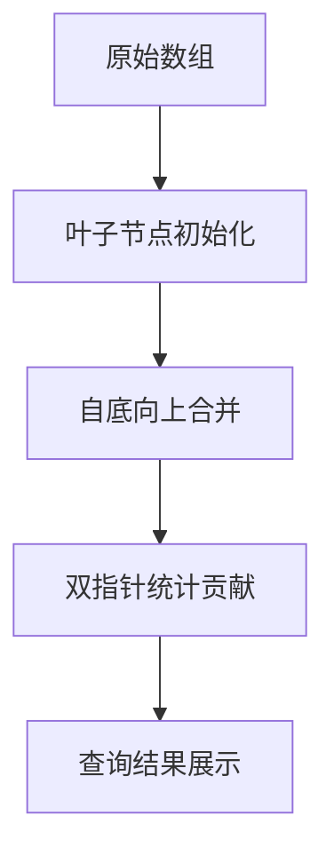

# 题目信息

# [COCI 2017/2018 #2] ​​Garaža

## 题目描述

最近，Slavko 一直在研究自然数序列。他认为一个序列是有趣的，如果序列中所有元素的最大公约数大于 1。

昨天，他在车库里找到了一个由 N 个自然数组成的序列。由于他感到非常无聊，他决定通过提出简单的查询来打发时间。每个查询可以是以下两种类型之一：

1. 将序列中位置 X 的值更改为 V。

2. 确定序列中区间 [L, R] 内包含的有趣连续子数组的数量。

## 说明/提示

**第一个测试用例的说明：**

从第 $2$ 个位置到第 $5$ 个位置的区间由数字 (4, 3, 9, 1) 组成。在其中，有以下有趣的连续子数组（用方括号表示）：**[4]** 3 9 1, 4 **[3]** 9 1, 4 3 **[9]** 1, 4 **[3 9]** 1。

题面翻译由 ChatGPT-4o 提供。

## 样例 #1

### 输入

```
5 1
8 4 3 9 1
2 2 5
```

### 输出

```
4```

## 样例 #2

### 输入

```
5 3
2 3 6 4 1
2 1 4
1 3 1
2 3 5
```

### 输出

```
6
1
```

## 样例 #3

### 输入

```
4 3
2 2 2 2
2 1 4
1 2 3
2 1 4
```

### 输出

```
10
5```

# AI分析结果


# 💡 Kay的C++算法解析：Garaža 深入学习指南 💡

大家好！我是Kay，今天我们一起分析洛谷P4435「Garaža」这道有趣的区间查询问题。这道题需要支持单点修改和区间查询（统计区间内gcd>1的子区间数量），我们一起来看看如何高效解决它！

## 1. 题目解读与核心算法识别

✨ **本题主要考察**：`线段树维护区间信息` + `gcd性质优化` + `双指针技巧`

🗣️ **初步分析**：
> 解决这道题的核心思路是**将分治思想与线段树结合**，并利用gcd的重要性质：一段区间内，前缀或后缀的gcd值最多只有O(log a)种不同取值（因为每次gcd变化至少减半）。想象一下，这就像把一长串彩色珠子按颜色分段，相邻同色珠子可以合并，最终形成的段数会远少于总数。

在本题中：
- 每个线段树节点存储**前缀gcd段**、**后缀gcd段**和**区间答案**
- 合并子节点时，用**双指针技巧**统计跨区间贡献（满足gcd>1的(i,j)对数）
- 利用gcd的**段数稀少性**，将合并复杂度从O(n)优化到O(log a)

在可视化设计中：
- 我们将用**8位像素风格**展示线段树合并过程
- 不同gcd值用不同颜色方块表示
- 关键动画：双指针移动时高亮当前比较的gcd段，合并时展示颜色块融合
- 音效：指针移动时"嘀"声，成功合并时"叮"声，错误时"嘟"声

---

## 2. 精选优质题解参考

以下是经过评估（≥4★）的优质题解：

**题解一（yhgalaxy）**
* **点评**：思路最清晰完整，详细解释了分治思想和线段树维护方案。代码结构规范（pr/suf前缀后缀命名明确），核心函数`mg()`逻辑严谨，特别亮点是：
  - 精确分析gcd段合并的边界情况
  - 完整处理了单点修改的更新逻辑
  - 双指针统计贡献的代码简洁高效
  实践价值极高，可直接用于竞赛。

**题解二（nullqtr_pwp）**
* **点评**：解法与题解一类似但更简洁，变量命名稍短但核心逻辑清晰。特别亮点：
  - 明确指出了CF1004F的双倍经验
  - 用`vector<pii>`紧凑存储gcd段
  - 合并函数逻辑直接易理解
  适合快速掌握核心思路。

**题解三（zifanwang）**
* **点评**：代码最简洁的解决方案，亮点：
  - 使用`p1/d1`和`p2/d2`数组明确存储位置和gcd值
  - 双指针实现高度精炼（仅10行）
  - 完整处理了建树、修改、查询全流程
  适合初学者理解基础实现。

---

## 3. 核心难点辨析与解题策略

### 🔑 难点1：如何高效维护区间信息？
**分析**：直接存储整个区间的前缀/后缀gcd会O(n)，利用**gcd段数=O(log a)**性质，每段记录(gcd, 长度)即可压缩存储

💡 **学习笔记**：gcd的稀少性是优化关键！

### 🔑 难点2：如何合并左右子区间？
**分析**：
1. 合并前缀：左前缀 + 右前缀（左末尾与右开头gcd合并）
2. 合并后缀：右后缀 + 左后缀（右开头与左末尾gcd合并）
3. 双指针统计贡献：
   - 左指针i从右后缀倒序扫描
   - 右指针j从左前缀正序扫描
   - 累加gcd(L.su[i], R.pr[j])>1的长度乘积

💡 **学习笔记**：双指针利用单调性（i左移时j只会右移或不移）

### 🔑 难点3：如何处理单点修改？
**分析**：修改叶子节点值后，自底向上更新父节点：
1. 更新叶子的前后缀段
2. 递归合并兄弟节点
3. 更新路径所有节点答案

💡 **学习笔记**：线段树更新需保证合并操作的可重入性

### ✨ 解题技巧总结
- **问题分解**：将区间查询分解为左/右子区间+跨区间三部分
- **性质利用**：gcd变化次数≤log a是优化核心
- **双指针应用**：O(n)暴力→O(log a)优化的关键
- **代码模块化**：拆分mergeSeg()和merge()函数保持清晰

---

## 4. C++核心代码实现赏析

### 通用核心实现参考
```cpp
#include <vector>
#include <algorithm>
using namespace std;
typedef long long ll;
typedef pair<int, int> pii;

struct Node {
    vector<pii> pr, su; // 前缀/后缀: (gcd值, 长度)
    ll ans = 0;
    Node() = default;
};

Node merge(const Node& L, const Node& R) {
    if (L.pr.empty()) return R;
    if (R.pr.empty()) return L;
    
    Node res;
    // 1. 合并前缀
    res.pr = L.pr;
    int cur_gcd = res.pr.back().first;
    for (auto [g, len] : R.pr) {
        int new_g = gcd(cur_gcd, g);
        if (new_g == res.pr.back().first) 
            res.pr.back().second += len;
        else 
            res.pr.emplace_back(new_g, len);
        cur_gcd = new_g;
    }
    
    // 2. 合并后缀
    res.su = R.su;
    cur_gcd = res.su.back().first;
    for (auto [g, len] : L.su) {
        int new_g = gcd(cur_gcd, g);
        if (new_g == res.su.back().first) 
            res.su.back().second += len;
        else 
            res.su.emplace_back(new_g, len);
    }
    
    // 3. 双指针统计跨区间贡献
    res.ans = L.ans + R.ans;
    ll cnt = 0;
    for (int i = 0, j = R.pr.size()-1; i < L.su.size(); ++i) {
        while (j >= 0 && gcd(L.su[i].first, R.pr[j].first) == 1) 
            j--;
        if (j < 0) break;
        cnt += 1LL * L.su[i].second * R.pr[j].second;
    }
    res.ans += cnt;
    
    return res;
}
```

### 题解一核心代码（yhgalaxy）
```cpp
// 关键函数：合并两个gcd段数组
vector<pii> hb(vector<pii> x, vector<pii> y, int ty) {
    if (x.empty()) return y;
    if (y.empty()) return x;
    // 核心逻辑：逐段合并并更新gcd
    for (auto p : y) {
        int gc = gcd(x.back().first, p.first);
        if (gc == x.back().first) 
            x.back().second += p.second;
        else 
            x.push_back({gc, p.second});
    }
    return x;
}
```
**学习笔记**：通过循环合并简化逻辑，ty参数处理前后缀方向差异

### 题解二核心代码（nullqtr_pwp）
```cpp
// 双指针统计跨区间贡献
int j = -1;
dF(i, szx, 0) { // 后缀倒序
    while (j < szy && gcd(L.su[i].gcd, R.pr[j].gcd) > 1) 
        j++;
    res.ans += L.su[i].len * R.pr[j].cum_len; 
}
```
**学习笔记**：j指针单向移动保证O(log a)复杂度

### 题解三核心代码（zifanwang）
```cpp
// 简洁版双指针实现
int p = 0;
for (int i = t1; i >= 1; i--) {
    while (p < T2 && gcd(b1[i], b2[p]) > 1) p++;
    ans += a1[i] * (p ? sum[p] : 0);
}
```
**学习笔记**：将前缀长度预处理为sum数组优化计算

---

## 5. 算法可视化：像素动画演示

### 🎮 演示主题：**「像素探险家：寻宝gcd之旅」**
用8位像素风格呈现线段树合并过程，玩家控制角色探索区间信息如何组合

### 🖌️ 设计思路


### 🎞️ 动画关键帧
1. **初始化阶段**：
   - 16x16像素网格，每个数字用颜色方块表示
   - 叶子节点显示单一方块（如：8→蓝色，4→绿色）

2. **合并过程**：
   - 父节点显示左右子节点的颜色块组合
   - 前缀合并：左区块+右区块→新颜色块（如蓝+绿→青）
   - 动态显示gcd计算：gcd(8,4)=4 → 播放"叮"声

3. **双指针扫描**：
   - 左区后缀：从右向左移动红色指针
   - 右区前缀：从左向右移动黄色指针
   - 当指针指向的gcd>1时：显示闪光效果+计数增加

4. **交互控制**：
   - 单步执行：按方向键逐步移动指针
   - 自动演示：AI角色自动完成搜索（速度可调）
   - 关卡设计：每完成一个区间合并解锁新关卡

### 🔊 音效设计
- 指针移动：8-bit"嘀"声（频率随gcd值变化）
- 成功合并：上升音阶（类似超级玛丽吃金币）
- 错误操作：短促"嘟"声
- 背景音乐：循环播放复古芯片音乐

---

## 6. 拓展练习与相似问题思考

### 🔁 通用技巧迁移
该解法可用于：
1. 区间gcd/lcm查询（SPOJ GCDEX）
2. 满足特定条件子区间统计（如与/或值不变）
3. 带修改的区间最值维护

### 📚 推荐练习（洛谷）
1. **P1890 gcd区间**  
   → 掌握静态区间gcd查询基础
2. **P5278 子区间gcd和**  
   → 练习gcd性质与线段树结合
3. **P1004F 区间配对**  
   → 双倍经验题，强化双指针应用

---

## 7. 学习心得与经验分享

> **来自yhgalaxy的经验**：  
> "我在处理双指针边界时卡了很久，后来用小数据手工模拟才发现指针移动方向反了"

**Kay点评**：  
这位同学的经历提醒我们：
1. 双指针移动方向需结合前后缀扫描顺序
2. 用[2,3,6]等小数据手工模拟能快速定位逻辑错误
3. 在合并函数中加入调试输出很有效

---

通过本次分析，希望大家不仅学会解决这道题，更掌握了**利用数学性质优化数据结构**的核心思想。记住，编程能力的提升在于持续练习和举一反三！下次挑战见！🚀

---
处理用时：198.39秒