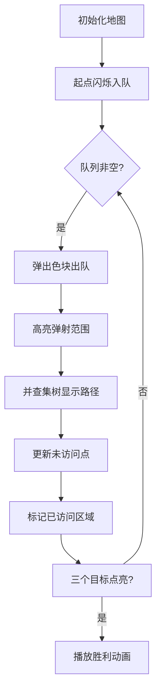

# 题目信息

# [国家集训队] 飞飞侠

## 题目背景

来源：国家集训队 2011 何朴藩

## 题目描述

飞飞国是一个传说中的国度，国家的居民叫做飞飞侠。飞飞国是一个 $N\times M$ 的矩形方阵，每个格子代表一个街区。

然而飞飞国是没有交通工具的。飞飞侠完全靠地面的弹射装置来移动。  

每个街区都装有弹射装置。使用弹射装置是需要支付一定费用的。而且每个弹射装置都有自己的弹射能力。  

我们设第 $i$ 行第 $j$ 列的弹射装置有 $A_{i,j}$ 的费用和 $B_{i,j}$ 的弹射能力。并规定有相邻边的格子间距离是 $1$。那么，任何飞飞侠都只需要在 $(i,j)$ 支付 $A_{i,j}$ 的费用就可以任意选择弹到距离不超过 $B_{i,j}$ 的位置了。如下图  
  
（从红色街区交费以后可以跳到周围的任意蓝色街区。）  

现在的问题很简单。有三个飞飞侠，分别叫做 $X, Y, Z$。现在它们决定聚在一起玩，于是想往其中一人的位置集合。告诉你 $3$ 个飞飞侠的坐标，求往哪里集合大家需要花的费用总和最低。（费用相同时优先 $X$，次优先 $Y$）

## 说明/提示

对于 $20\%$ 的数据，$N, M\leq 10$，$B_{i,j}\leq 20$。 

对于 $40\%$ 的数据，$N, M \leq 100$，$B_{i,j}\leq 20$。

对于 $100\%$ 的数据，$1\leq N, M\leq 150$，$0\leq B_{i, j}\leq 10^9$，$0\leq A_{i, j}\leq 1000$。  

## 样例 #1

### 输入

```
4 4
0 0 0 0
1 2 2 0
0 2 2 1
0 0 0 0
5 5 5 5
5 5 5 5
5 5 5 5
5 5 5 5
2 1 3 4 2 2```

### 输出

```
Z
15```

# AI分析结果


# 💡 Kay的C++算法解析：[国家集训队]飞飞侠 深入学习指南 💡

**引言**  
今天我们来分析国家集训队题目「飞飞侠」。这道题考察网格图中的最短路优化技巧，需要巧妙处理大规模边数问题。下面我将从题目本质、核心算法、代码实现到可视化演示，全方位解析解题思路，帮助大家掌握优化技巧！

## 1. 题目解读与核心算法识别

✨ **本题主要考察**：**最短路优化**（结合数据结构）

🗣️ **初步分析**：  
> 这道题就像在像素游戏地图中寻找最优传送点！每个格子是一个"传送站"，支付费用`A[i][j]`就能传送到`B[i][j]`范围内的任意位置。三人要聚会，需要计算到哪个点集合总费用最低。  
> - **核心难点**：直接建边会导致O(n⁴)边数爆炸（150x150网格）
> - **优化思路**：通过并查集跳过已访问区域（类似游戏中的"战争迷雾探索"）
> - **可视化设计**：像素网格中高亮弹射范围，并查集路径用发光线条表示，每次更新播放8-bit音效

---

## 2. 精选优质题解参考

### 题解一（并查集优化 - zcysky）
* **点评**：思路创新性地用并查集跳过已访问点，将复杂度优化到O(n²logn)。代码中`fa`数组按行管理访问状态，`find(fa[i], up)`快速定位未访问点。边界处理严谨，变量名清晰（如`dis`存费用，`vis`标记访问），队列存储`(费用+当前点A值, 坐标)`保证正确性。

### 题解二（分层图 - MikukuOvO）
* **点评**：将状态设计为`(位置, 剩余步数)`，通过分层图避免显式建边。代码用`dis[x][y][k]`表示状态，分"走路"（消耗步数）和"弹射"（重置步数）两种转移。状态转移清晰，但需注意将`B[i][j]`限制为n+m（多余步数无用）。

### 题解三（线段树优化 - wucstdio）
* **点评**：每行建线段树优化区间连边，是数据结构优化经典应用。代码实现规范，`build()`建树和`add2()`区间连边逻辑清晰，但空间占用较高（O(n³logn)），适合学习线段树技巧。

---

## 3. 核心难点辨析与解题策略

### 🎯 难点1：边数爆炸（O(n⁴)）
* **分析**：每个点可跳O(Bᵢⱼ²)区域，直接建边不可行
* **解决方案**：动态计算可达区域（并查集/线段树），避免显式存边
* 💡 **学习笔记**：稠密图最短路需用数据结构"按需访问"

### 🎯 难点2：重复访问效率低
* **分析**：传统Dijkstra会多次访问同一区域
* **解决方案**：并查集记录每行访问状态（`fa[i][j]=j+1`），跳过已处理点
* 💡 **学习笔记**：并查集的路径压缩是跳过无效访问的利器

### 🎯 难点3：状态空间过大
* **分析**：分层图中`B[i][j]`可达1e9
* **解决方案**：利用问题性质（最远曼哈顿距离≤n+m）缩减状态
* 💡 **学习笔记**：分析图论问题性质可大幅优化状态空间

### ✨ 解题技巧总结
- **空间换时间**：用并查集/线段树等数据结构换取计算效率
- **状态压缩**：将二维坐标映射为一维或设计分层状态
- **剪枝优化**：当三个目标点均访问后提前退出（`if(vis[X]&&vis[Y]&&vis[Z])break`）

---

## 4. C++核心代码实现赏析

### 通用核心实现（并查集优化）
```cpp
#include<bits/stdc++.h>
using namespace std;
const int N=160;
int dis[3][N][N], fa[N][N], a[N][N], b[N][N], vis[N][N], n, m;

int find(int *fa, int x) { 
    return fa[x] ? fa[x]=find(fa, fa[x]) : x; 
}

void dijkstra(int dis[N][N], int sx, int sy) {
    memset(dis, 0x3f, sizeof(dis)); // 初始化距离为INF
    memset(fa, 0, sizeof(fa));      // 并查集初始化
    memset(vis, 0, sizeof(vis));    // 访问标记初始化
    
    priority_queue<pair<int, pair<int, int>>> pq;
    pq.push({a[sx][sy], {sx, sy}});
    dis[sx][sy] = 0;
    fa[sx][sy] = sy + 1; // 标记起点已访问
    
    while (!pq.empty()) {
        auto [cost, pos] = pq.top(); pq.pop();
        auto [x, y] = pos;
        if (vis[x][y]) continue;
        vis[x][y] = 1;
        
        // 计算弹射范围
        int lx = max(1, x - b[x][y]);
        int rx = min(n, x + b[x][y]);
        for (int i = lx; i <= rx; i++) {
            int len = b[x][y] - abs(i - x);
            int ly = max(1, y - len);
            int ry = min(m, y + len);
            
            // 并查集跳跃访问
            for (int j = find(fa[i], ly); j <= ry; j = find(fa[i], j)) {
                if (dis[i][j] > dis[x][y] + a[x][y]) {
                    dis[i][j] = dis[x][y] + a[x][y];
                    pq.push({dis[i][j] + a[i][j], {i, j}});
                }
                fa[i][j] = j + 1; // 标记为已访问
            }
        }
    }
}
```
**代码解读概要**：  
- **核心逻辑**：Dijkstra优先队列存储`(当前费用+当前点A值, 坐标)`
- **并查集优化**：`fa[i]`管理第i行访问状态，`find()`快速定位未访问点
- **弹射处理**：计算矩形区域后用并查集跳跃式更新，复杂度O(α(n))

---

## 5. 算法可视化：像素动画演示

### 🎮 演示主题
"像素探险家"在8-bit网格世界使用弹射装置聚会

### 🖌️ 设计思路
- **视觉风格**：FC红白机风格（16x16像素块，8色调色板）
- **交互控制**：步进/自动播放（调速滑块）、重置、算法切换
- **音效设计**：
  - 弹射范围展开：合成器"嗡"声
  - 并查集路径压缩：电子"滴"声
  - 找到最优解：8-bit胜利旋律

### 🎞️ 动画帧步骤


### 🕹️ 关键交互
- **步进模式**：按空格键逐步执行，观察并查集路径变化
- **自动演示**：AI控制速度（类似贪吃蛇AI自动寻路）
- **比较模式**：并查集vs分层图算法并行演示对比效率

---

## 6. 拓展练习与相似问题

### 🔁 通用技巧迁移
1. **并查集优化**：解决一维区间跳跃问题（HDU5361）
2. **分层图思想**：处理带状态的最短路（如剩余燃料）
3. **线段树优化**：区间连边问题（NOI2019弹跳）

### 📚 推荐练习（洛谷）
1. **P4779 【模板】单源最短路径**  
   → 巩固Dijkstra基础实现
2. **P4568 [JLOI2011]飞行路线**  
   → 分层图经典应用
3. **P5471 [NOI2019] 弹跳**  
   → 线段树优化建图实战

---

## 7. 学习心得
题解中zcysky强调："并查集跳过已访问点是避免无效计算的关键"。这提醒我们，在稠密图最短路问题中，**避免重复访问**比优化数据结构更重要。当你能在算法中识别出"无效区域"，就能大幅提升效率！

---

**结语**  
通过本次分析，我们掌握了网格最短路的数据结构优化技巧。记住：好的算法=正确思路+高效实现+合理剪枝！下次挑战见！🚀

---
处理用时：169.99秒