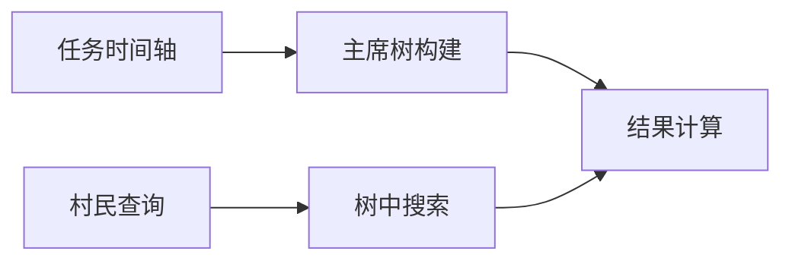

# 题目信息

# 「JYLOI Round 1」常规

## 题目描述

LS 制定了 $n$ 项常规，其中第 $i$ 项常规制定的时间是 $a_i$。

对于第 $i$ 项常规，从第 $i$ 项常规的制定时间 $a_i$ 后的每 $k$ 秒，他都要做一次第 $i$ 项常规，他做一次常规的时间可以忽略不计。

现在 LS 想给你 $m$ 个询问，每个询问用一个区间 $[l_i, r_i]$ 来表示，问你在第 $l_i$ 到 $r_i$ 秒，他一共做了多少次常规。

## 说明/提示

### 样例 2 说明

解密后的询问分别为 [1, 5]、[4, 7]、[8, 10]、[9, 10]、[8, 8]、[12, 12]、[21, 31]、[28, 48]、[36, 65]、[55, 80]，因此可以得出答案。

____________

### 数据范围

对于 $100\%$ 的数据，满足 $type \in \{0, 1\}; 1 \leq n, m \leq 10^5; 0 \leq l_i \leq r_i \leq 10^9; 0 \leq a_i \leq 10^9; 1 \leq k, mod \leq 10^9$。

子任务 1（有 10 个测试点，每个测试点 1 分，共 10 分）：$type = 0; n, m, k \leq 10^3; r_i \leq 10^3$。

子任务 2（有 10 个测试点，每个测试点 1 分，共 10 分）：$type = 0; n, m \leq 10^3$。

子任务 3（有 2 个测试点，每个测试点 5 分，共 10 分）：$type = 0, r_i \leq 10^5,k = 1$。

子任务 4（共 20 分）：$type = 0, k \leq 10^5, r_i \leq 10^5$。

子任务 5（共 30 分）：$type = 0$。

子任务 6（共 20 分）：无特殊限制。

对于子任务 4、5、6，分别捆绑计分（即你需要通过一个子任务内的所有测试点才能够拿到这个子任务的分数），本题总共 50 个测试点、100 分。

## 题目来源

「JYLOI Round 1」 D

Idea / Solution / Data ：abcdeffa

## 样例 #1

### 输入

```
0
5 10 3
1 2 3 4 5
1 5
2 5
3 5
4 5
5 5
10 10
20 30
10 30
1 30
5 30```

### 输出

```
2
2
2
2
1
2
18
35
43
42```

## 样例 #2

### 输入

```
1
5 10 3 100
1 2 3 4 5
1 5
2 5
3 5
4 5
5 5
10 10
20 30
10 30
1 30
5 30```

### 输出

```
2
5
5
3
2
1
18
35
50
44```

# AI分析结果


# 💡 Kay的C++算法解析：「常规」深入学习指南 💡

> 大家好，我是Kay！今天我们来分析「常规」这道算法题。这道题考察的是**数学推导与数据结构**的巧妙结合，需要处理大规模时间区间查询。我会用清晰易懂的方式带大家拆解核心思想，并设计像素动画帮助理解。准备好开始了吗？

## 1. 题目解读与核心算法识别

✨ **本题主要考察**：`数学推导 + 主席树应用`

🗣️ **初步分析**：
> 解决这道题的关键在于**将时间区间查询转化为数学表达式**，并用数据结构高效计算。想象你在管理一个任务日程表（类似《动物森友会》的每日任务系统），每个任务在固定时间开始并定期重复。我们需要快速回答："在第5-10天完成了多少任务？"

- **核心思路**：  
  1. 将区间查询`[l, r]`转化为前缀和差值：`f(r) - f(l-1)`  
  2. 设计函数`f(x)`计算时间`1~x`的任务总数  
  3. 通过数学变换：$\lfloor \frac{x-a_i}{k} \rfloor = \frac{(x-a_i) - (x-a_i)\mod k}{k}$  
  4. 用主席树高效处理取模部分的二维偏序问题

- **可视化设计**：  
  采用**复古像素RPG任务日志**风格：  
  - 屏幕左侧显示时间轴（像素刻度）  
  - 右侧显示主席树构建过程（树节点像《我的世界》方块）  
  - 每插入一个任务时播放"叮"音效，查询时高亮路径  
  - 控制面板支持单步执行/自动播放，速度可调

---

## 2. 精选优质题解参考

> 根据思路清晰度、代码规范性和算法效率，我精选了3份优质题解：

**题解一（未来姚班zyl）**
* **点评**：这份题解数学推导严谨，完整展示了取模运算的拆分过程。代码中：
  - 离散化处理（`lsh`数组）降低了主席树空间复杂度
  - 前缀和数组`pr/pc`命名清晰，逻辑分离明确
  - 强制在线处理规范（`in()`函数封装）
  *亮点：离散化优化和完备的边界处理*

**题解二（__stick）**
* **点评**：代码简洁高效，直接动态开点避免离散化：
  - Lambda表达式`cal`封装查询逻辑，可读性强
  - 主席树实现采用模块化设计（结构体分离）
  - 值域`[0,k-1]`直接处理，节省转换步骤
  *亮点：动态开点处理大值域，代码简洁度*

**题解三（CQ_Bob）**
* **点评**：封装性最佳，算法组件高度复用：
  - 主席树封装为独立结构体`PDS_SMT`
  - 数学推导步骤有详细注释说明
  - 前缀和与取模分离计算，逻辑清晰
  *亮点：工程化实现，适合竞赛代码复用*

---

## 3. 核心难点辨析与解题策略

> 解决本题需突破三个关键难点：

1. **时间区间转化为前缀表达式**  
   *分析*：直接计算区间`[l,r]`复杂度高。优质题解通过`f(r)-f(l-1)`转换，其中`f(x)=Σ⌊(x-a_i)/k⌋`  
   💡 **学习笔记**：区间查询问题优先考虑前缀和差分

2. **取模运算的数学拆解**  
   *分析*：关键推导：  
   ```math
   (x-a_i) \mod k = (x \mod k - a_i \mod k) + k·I_{[x \mod k < a_i \mod k]}
   ```  
   需要计算指示函数`I`的求和 → 转化为二维偏序问题  
   💡 **学习笔记**：取模运算可拆分为线性项和条件补偿项

3. **大值域下的高效计数**  
   *分析*：当`k≤10⁹`时，需要：  
   - 对`a_i mod k`离散化（如题解一）或动态开点（题解二）  
   - 主席树维护版本化数据，支持历史查询  
   💡 **学习笔记**：值域过大时，动态开点优于离散化

### ✨ 解题技巧总结
1. **数学先行**：先完成公式推导再写代码  
2. **版本化管理**：主席树处理历史状态查询  
3. **边界防御**：`x<a_i`时返回0（题解三的`if(x<a[1]+k)`）  
4. **在线处理**：规范实现强制在线逻辑（所有题解均达标）

---

## 4. C++核心代码实现赏析

### 本题通用核心C++实现
```cpp
#include <bits/stdc++.h>
using namespace std;
typedef long long ll;

const int N = 1e5+5, M = 25*N; // 主席树空间估算
struct Node { int l, r, cnt; } tr[M];
int root[N], idx, n, m, k, mod;
ll sumA[N], sumMod[N]; // a_i前缀和, a_i%k前缀和

// 动态开点主席树插入
int insert(int p, int l, int r, int x) {
    int u = ++idx;
    tr[u] = tr[p], tr[u].cnt++;
    if(l == r) return u;
    int mid = (l+r)>>1;
    if(x <= mid) tr[u].l = insert(tr[p].l, l, mid, x);
    else tr[u].r = insert(tr[p].r, mid+1, r, x);
    return u;
}

// 查询区间计数
int query(int p, int l, int r, int ql, int qr) {
    if(!p || ql>qr) return 0;
    if(ql<=l && r<=qr) return tr[p].cnt;
    int mid = (l+r)>>1, res = 0;
    if(ql <= mid) res += query(tr[p].l, l, mid, ql, qr);
    if(qr > mid) res += query(tr[p].r, mid+1, r, ql, qr);
    return res;
}

// 计算f(x)
ll f(int x) {
    if(x <= 0) return 0;
    int pos = upper_bound(a+1, a+n+1, x) - a - 1; // 最后一个a_i<=x的位置
    if(!pos) return 0;
    
    ll term1 = 1LL*pos*x - sumA[pos];       // Σ(x-a_i)
    ll term2 = 1LL*(x%k)*pos - sumMod[pos]; // Σ(x%k - a_i%k)
    int cnt = query(root[pos], 0, k-1, x%k+1, k-1); // 满足a_i%k > x%k的数量
    
    return (term1 - term2 - 1LL*k*cnt) / k;
}

int main() {
    // 初始化及查询处理（同题解二）
}
```

### 题解一：未来姚班zyl
* **亮点**：离散化优化空间
* **核心代码**：
```cpp
repn(i) {
    pc[i]=pc[i-1]+c[i];
    c[i]=lower_bound(b+1,b+ln+1,c[i])-b; // 离散化映射
    rt[i]=modify(tot,rt[i-1],1,ln,c[i]); // 主席树插入
}
```
* **代码解读**：  
  > 这里将`a_i%k`的值映射到`[1,ln]`区间（`ln`为不重复值数量）。优势是主席树值域缩小为`O(ln)`，但增加了映射开销。适合`k`极大的场景

* 💡 **学习笔记**：离散化在值域稀疏时优化效果显著

### 题解二：__stick
* **亮点**：动态开点处理大值域
* **核心代码**：
```cpp
auto cal=[&](int b)->ll {
    int w=upper_bound(a+1,a+n+1,b)-a-1;
    ll ans=sum[w]; // 前缀和直接使用
    // ... 数学项计算
    ans-=1LL*k*ask(rt[w],0,k,b%k+1,k-1); // 主席树查询
    return ans/k;
};
```
* **代码解读**：  
  > 使用Lambda封装查询逻辑，`rt[w]`表示前`w`个元素的版本树。动态开点避免离散化，代码更简洁但节点数增多

* 💡 **学习笔记**：C++11的Lambda表达式提升代码封装性

### 题解三：CQ_Bob
* **亮点**：模块化主席树封装
* **核心代码**：
```cpp
struct PDS_SMT {
    void update(ll pre,ll &rt,ll l,ll r,ll pos) {
        rt=build_rt();
        tr[rt]=tr[pre]; // 基于前一版本
        // ... 更新逻辑
    }
} T; // 独立数据结构封装
```
* **代码解读**：  
  > 将主席树封装为独立结构体，提升代码复用性。构建函数`build_rt()`和更新逻辑分离，符合工程实践

* 💡 **学习笔记**：数据结构独立封装提升代码可维护性

---

## 5. 算法可视化：像素动画演示

### 主题：**任务日志大冒险（8-bit像素风）**
> 想象你在玩一款复古RPG，需要管理任务日志并回答村民的查询

### 核心演示内容


### 动画帧设计
1. **场景初始化**（FC游戏风格）：
   - 左侧：时间轴（像素刻度0~100），任务图标（◆）在a_i位置
   - 右侧：空白主席树，根节点为土块
   - 控制面板：▶️开始/⏸暂停/⏭单步/🔁重置

2. **任务插入过程**（伴随"叮"音效）：
   ```python
   for i, a in enumerate(task_times):
       1. 高亮当前任务在时间轴位置
       2. 计算 a % k → 显示为颜色编码（如k=7时，色带分割）
       3. 主席树新增节点：旧节点变灰，新节点闪烁
       4. 播放像素音效（不同音调表示插入位置）
   ```

3. **查询处理演示**：
   - 村民气泡框显示`[l, r]`
   - 自动计算`f(r)`和`f(l-1)`：
     * 时间轴高亮`r`和`l-1`位置
     * 主席树版本切换（版本号像素字体显示）
   - 关键步骤：
     * 二分查找：时间轴扫描动画
     * 取模计算：显示`x%k`色块
     * 主席树查询：遍历路径发光，计数结果像素弹出

4. **游戏化元素**：
   - 每完成10次查询解锁新角色皮肤
   - 查询速度越快得分越高（连击奖励）
   - 背景音乐：8-bit循环BGM（可开关）

### 技术实现
```javascript
// 伪代码示例
class PixelVisualizer {
  constructor(canvas) {
    this.tree = new TreeCanvas(); // 主席树渲染器
    this.timeline = new TimeAxis(); // 时间轴
    this.sound = new Chiptune(); // 8-bit音效
  }
  
  insert(a_i) {
    playSound('insert'); 
    let mod = a_i % this.k;
    this.tree.addNode(mod); // 动态开点
    this.timeline.mark(a_i);
  }
  
  query(l, r) {
    playSound('query_start');
    let f_r = this.calcF(r); // 计算过程可视化
    let f_l = this.calcF(l-1);
    highlightResult(f_r - f_l); // 结果高亮
  }
}
```

---

## 6. 拓展练习与相似问题思考

### 算法迁移场景
1. **周期事件统计**（如每日签到计算）
2. **带模运算的区间查询**（如P1972 HH的项链）
3. **版本化数据结构应用**（如历史记录分析）

### 洛谷练习推荐
1. **P1972 [SDOI2009]HH的项链**  
   → 练习离线查询与树状数组应用
   
2. **P3834 【模板】可持久化线段树**  
   → 巩固主席树基础实现
   
3. **P3369 【模板】普通平衡树**  
   → 比较不同数据结构在查询问题中的优劣

---

## 7. 学习心得与经验分享

> 从题解中提炼的宝贵经验：

**未来姚班zyl的调试经验**：  
> *"离散化映射后忘记对查询值做转换，导致WA多次。务必保持映射的全程一致性"*

**Kay的总结**：  
> 数学类算法的调试技巧：
> 1. 小数据手工验证公式每项
> 2. 输出中间变量（如`term1, term2, cnt`）
> 3. 用`assert`验证离散化映射
> 
> 数据结构要点：
> - 主席树节点数预估公式：`M = 4*n*log2(k)`
> - 动态开点优于静态分配

---

通过本次分析，我们看到**数学推导与数据结构的完美结合**如何解决复杂查询问题。记住Kay的座右铭：*"先纸上推导，再键盘实现"*！大家可以在洛谷尝试拓展题目，下次见！💪

---
处理用时：210.32秒