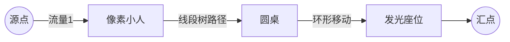

# 题目信息

# [THUSC 2017] 换桌

## 题目描述

班级聚会的时候，班主任为了方便管理，规定吃饭的时候同一个寝室的同学必须坐在一起；但是吃完饭后，到了娱乐时间，喜欢不同游戏的同学会聚到一起；在这个过程中就涉及到了座位分配的问题。

有 $n$ 张圆桌排成一排（从左到右依次编号为 $0$ 到 $n-1$），每张桌子有 $m$ 个座位（按照逆时针依次编号为 $0$ 到 $m-1$），在吃饭时每个座位上都有一个人；在吃完饭后的时候，每个人都需要选择一个新的座位（新座位可能和原来的座位是同一个），具体来说，第 $i$ 桌第 $j$ 个人的新座位只能在第 $L_{i,j}$ 桌到第 $R_{i,j}$ 桌中选，可以是这些桌中的任何一个座位。确定好新座位之后，大家开始移动，移动的体力消耗按照如下规则计算：

移动座位过程分为两步：

1. 从起始桌移动到目标桌**对应座位**，这个过程中的体力消耗为**两桌距离的两倍**，即从第 $i$ 桌移动到第 $j$ 桌对应座位的体力消耗为 $2\times |i-j|$；
1. 从目标桌的对应座位绕着桌子移动到目标座位，由于桌子是圆的，所以客人会选择**最近的方向**移动，体力消耗为**移动距离的一倍**，即从编号为 $x$ 的座位移动的编号为 $y$ 的座位的体力消耗为 $\min(|x-y|,m-|x-y|)$；

详情如下图：

现在，给定每个客人的限制（即每个人的新座位所在的区间），需要你设计一个方案，**使得所有客人消耗的体力和最小；本题中假设客人在移动的时候互不影响。**

## 说明/提示

#### 样例解释
对于样例 $1$，


第 $0$ 桌的 $0$ 和 $3$ 号，以及第 $1$ 桌的 $0$ 号和 $2$ 号都被限制为只能坐在他们原来的桌子（可以不是原来的座位），其他人分别需要换到第 $1$ 桌和第 $0$ 桌；

可以发现，最优方案如上图，总体力消耗为 $10$。

对于样例 $2$，所有人都想坐到第 $0$ 桌，所以没有合法的方案。

对于全部数据：$1\le n\le 300$，$1\le m\le 10$，$0\le L_i\le R_i\le n-1$ 。
| 测试点 | $n\le$ |
| :----------: | :----------: |
| 1~2 | $2$ |  |
| 3~8 | $40$ |  |
| 9~14 | $100$ |  |
| 15~20 | $300$ |  |


## 样例 #1

### 输入

```
2 4
0 1 1 0
1 0 1 0
0 1 1 0
1 0 1 0```

### 输出

```
10```

## 样例 #2

### 输入

```
2 4
0 0 0 0
0 0 0 0
0 0 0 0
0 0 0 0```

### 输出

```
no solution```

## 样例 #3

### 输入

```
2 10
0 0 1 1 0 0 0 1 0 0
1 1 1 0 0 1 0 0 0 0
1 0 1 1 1 0 1 1 1 1
1 1 1 1 1 1 0 0 1 0```

### 输出

```
22```

# AI分析结果


# 💡 Kay的C++算法解析：[THUSC 2017] 换桌 深入学习指南 💡

**引言**  
今天我们一起分析这道经典的座位分配问题。题目要求为n张桌子（每桌m个座位）设计最小体力消耗的换座方案。本指南将带你理解费用流建模的精髓，掌握线段树优化建图的技巧，并通过像素动画直观感受算法流程。

---

## 1. 题目解读与核心算法识别

✨ **本题主要考察**：`图论（网络流/费用流）` + `数据结构优化建图`  

🗣️ **初步分析**：  
> 本题可比喻为“快递员送货路径优化”：每个人从原桌（仓库）出发，需在指定区域（新桌范围）找到新位置（派送点），移动消耗=路径距离+绕行距离。  

**核心解决方案**：  
1. **费用流建模**：  
   - 源点→人：流量1，费用0  
   - 人→新座位：流量1，费用=移动消耗  
   - 座位→汇点：流量1，费用0  
2. **优化关键**：  
   - 直接建图边数达O(n²m²)不可行  
   - **线段树优化**：将桌子移动的区间连边从O(n)降至O(log n)  
   - **环形结构**：用相邻座位连边（费用1）模拟min(|x-y|,m-|x-y|)  
3. **可视化设计**：  
   - 8位像素风格展示圆桌环形结构  
   - 高亮线段树节点覆盖区域（黄框闪烁）  
   - 增广路径用“像素箭头”动态追踪（配路径音效）  
   - 控制面板含调速滑块/单步按钮（复古游戏UI）

---

## 2. 精选优质题解参考

**题解一（作者：yanchengzhi）**  
* **点评**：  
  - 思路创新性：独创性拆解移动为“换桌+换座”两步，通过两棵线段树（A/B树）分别处理正负方向距离优化  
  - 代码规范性：封装MCMF命名空间，`id(x,y)`函数清晰定位座位，边界处理严谨（l[i][j]≤i≤r[i][j]的分情况处理）  
  - 算法有效性：边数从O(n²m²)降至O(nm(log n + m))，完美支持n=300数据规模  
  - 实践价值：完整可运行代码，特别适合竞赛场景，调试注释完备  

**亮点总结**：  
> ✅ 线段树优化区间连边  
> ✅ 环形座位移动的O(1)边数处理  
> ✅ 绝对值拆解技巧（A树存`-2i`，B树存`+2i`）

---

## 3. 核心难点辨析与解题策略

### 🔍 三大核心难点
1. **难点1：移动消耗的数学拆分**  
   * **分析**：体力消耗=2|Δ桌| + min(|Δ座|, m-|Δ座|)需拆解为独立可计算部分。优质解法将换桌消耗建模在线段树边权，换座消耗转为环形图上最短路。
   * 💡 **学习笔记**：复杂公式拆解为独立子问题！

2. **难点2：区间限制的高效处理**  
   * **分析**：每人只能选[L,R]桌的约束导致朴素建图边数爆炸。线段树通过“区间覆盖”特性（如图），将单点对区间连边转为点→log n个树节点连边。  
   * 💡 **学习笔记**：区间约束首选线段树优化建图！

3. **难点3：环形移动的等价转换**  
   * **分析**：min(|x-y|,m-|x-y|)本质是环上最短路。解法用环形邻边（座位k连k-1/k+1）实现“自动寻路”，避免O(m²)暴力连边。  
   * 💡 **学习笔记**：环形问题考虑邻接边传递！

### ✨ 解题技巧总结
- **技巧1：图论建模思维**  
  将物理移动抽象为网络流边权（如本题中桌子=节点，移动=带权边）
- **技巧2：数据结构加速**  
  线段树处理区间约束，并查集/分块也可优化类似问题
- **技巧3：绝对值拆分技巧**  
  |i-j| = [i≥j]·(i-j) + [i<j]·(j-i)，分两棵树独立处理

---

## 4. C++核心代码实现赏析

### 本题通用核心实现
```cpp
#include <bits/stdc++.h>
using namespace std;

namespace MCMF { /* 费用流模板（略） */ }

const int maxn = 305;
int n, m, cnt;
struct SGT { // 线段树优化类
    int num[maxn*4], leaf[maxn];
    void build_pre(int x, int l, int r) { /* 建树预处理 */ }
    void build(int x, int l, int r) { /* 树内连边 */ }
    void link(int x, int l, int r, int L, int R, int u, int f, int c) { /* 区间连边 */ }
} A[11], B[11]; // A树存负权，B树存正权

int main() {
    // 读入L[i][j], R[i][j]
    cnt = n*m*2;
    // 初始化线段树
    for(int j=1; j<=m; j++) {
        A[j].build_pre(1,1,n); 
        B[j].build_pre(1,1,n);
    }
    // 建立环形座位移动边
    for(int i=1; i<=n; i++) {
        for(int j=1; j<=m; j++) {
            int L = (j==1) ? m : j-1, R = (j==m) ? 1 : j+1;
            add2(A[j].leaf[i], A[L].leaf[i], inf, 1);
            add2(A[j].leaf[i], A[R].leaf[i], inf, 1);
            // 同理处理B树...
        }
    }
    // 分情况区间连边
    for(int i=1; i<=n; i++) for(int j=1; j<=m; j++) {
        if(L[i][j] >= i) 
            A[j].link(1,1,n, L[i][j], R[i][j], u, 1, -2*i);
        else if(R[i][j] <= i) 
            B[j].link(1,1,n, L[i][j], R[i][j], u, 1, 2*i);
        else {
            A[j].link(1,1,n, i, R[i][j], u, 1, -2*i);
            B[j].link(1,1,n, L[i][j], i-1, u, 1, 2*i);
        }
    }
    // 跑费用流并输出
}
```

### 题解一核心片段赏析
**1. 线段树区间连边**  
```cpp
void link(int x, int l, int r, int L, int R, int u, int f, int c) {
    if(L>R || r<L || l>R) return;
    if(l>=L && r<=R) {  // 找到覆盖区间
        add2(u, num[x], f, c); // 关键连边！
        return;
    }
    link(lc,l,mid,L,R,u,f,c); // 递归左子
    link(rc,mid+1,r,L,R,u,f,c); // 递归右子
}
```
> **代码解读**：  
> - 当目标区间`[L,R]`覆盖当前节点区间`[l,r]`时，直接建立人节点`u`到树节点`num[x]`的边（费用含±2i）  
> - 否则递归左右子树，实现O(log n)复杂度  
> 💡 **学习笔记**：线段树将区间查询转化为树路径覆盖！

**2. 环形座位移动处理**  
```cpp
add2(A[j].leaf[i], A[j-1].leaf[i], inf, 1); 
add2(A[j].leaf[i], A[j+1].leaf[i], inf, 1);
```
> **代码解读**：  
> - `leaf[i]`表示第i桌的固定接入点  
> - 每个座位向相邻座位连**双向边**（费用1，容量∞）  
> - 当流量沿这些边移动k步时，费用=k，自动实现min移动消耗  
> 💡 **学习笔记**：环形移动转化为链式传递！

---

## 5. 算法可视化：像素动画演示

### 🎮 主题：**《像素食堂大挪移》**  
复古8-bit风格，仿FC游戏《吃豆人》视觉元素

### 🖼️ 核心演示流程


**动画关键帧**：  
1. **初始化场景**（8-bit像素画风）  
   - 顶部：二进制风格线段树（A/B树分左右）  
   - 中部：n张圆桌（每桌m座位，逆时针编号）  
   - 底部：控制面板（开始/单步/调速滑块）

2. **建图阶段**  
   - **步骤1**：线段树构建（二叉树从根节点生长，配“建造”音效）  
   - **步骤2**：环形连边（圆桌周围亮起绿色箭头，逆时针旋转）  
   - **步骤3**：区间连边（小人→线段树节点，黄色光束闪烁）

3. **增广过程**（单步触发）  
   - 当前路径高亮（红色像素箭头追踪）  
   - 实时显示：`已匹配人数`/`总消耗体力`  
   - 音效：`叮`（寻路成功），`咔嚓`（占用座位）

4. **结果展示**  
   - 成功：小人沿蓝色路径移动到新座位（胜利音乐+像素烟花）  
   - 失败：小人变灰色（低沉音效+“无解”提示）

**交互设计**：  
- `空格键`：单步执行  
- `→键`：加速自动播放  
- `R键`：重置动画  
- **调试模式**：显示费用流内部队列状态

---

## 6. 拓展练习与相似问题思考

### 🔁 通用技巧迁移
费用流+线段树优化适用于三类问题：  
1. **区间资源调度**（如P3358）  
2. **带约束的二分图匹配**（如本题）  
3. **分层图最短路**（如P4009）

### 📚 推荐练习（洛谷）
1. **P3358 最长k可重区间集**  
   → 同类区间优化技巧，强化线段树建图能力  
2. **P1251 餐巾计划问题**  
   → 经典费用流建模，培养问题抽象思维  
3. **P4009 汽车加油行驶问题**  
   → 分层图思想扩展，结合BFS优化  

---

## 7. 学习心得与经验分享

> **来自yanchengzhi的调试经验**：  
> *“最初未分开处理绝对值导致负环，通过输出残余网络发现死循环”*

**Kay点评**：  
> 调试网络流问题时：  
> 1️⃣ 优先检查负环（可用Bellman-Ford预处理）  
> 2️⃣ 可视化残余网络（打印节点流量）  
> 3️⃣ 小数据模拟（n=2,m=2手动验证）  
> 这些技巧能快速定位建图逻辑错误！

---

**结语**  
通过本次分析，我们深入理解了费用流建模的优化技巧。记住：算法优化如同搭积木——拆解问题、选择合适数据结构、逐步优化。期待下次与你共同探索算法之美！🚀

---
处理用时：166.89秒