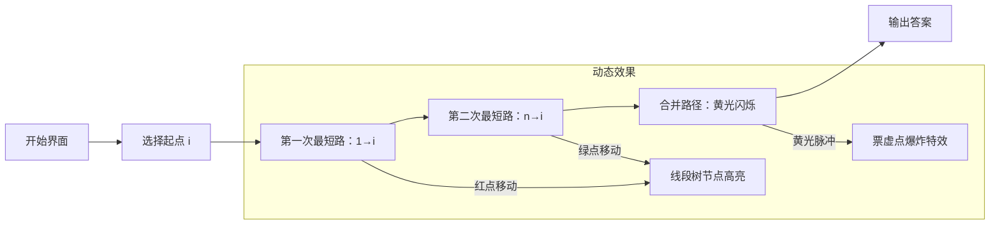

# 题目信息

# [USACO21DEC]  Tickets P

## 题目描述

Bessie 正在参加远足旅行！她当前正在旅行的路线由编号为 $1\ldots N$（$1\le N\le 10^5$）的 $N$ 个检查点组成。

有 $K$（$1\le K\le 10^5$）张票可供购买。第 $i$ 张票可以在检查站 $c_i$（$1\le c_i\le N$）以 $p_i$（$1\le p_i\le 10^9$）的价格购得，并且可以用其进入所有检查站 $[a_i,b_i]$（$1\le a_i\le b_i\le N$）。在进入任何检查站之前，Bessie 必须已购买一张允许其进入该检查站的票。一旦 Bessie 可以前往某一检查站，她就可以在未来的任何时候回到该检查站。

对于每一个 $i\in [1,N]$，如果 Bessie 最初只能进入检查点 $i$，输出使得可以进入检查点 $1$ 和 $N$ 所需的最低总价。如果无法这样做，输出 $-1$。


## 说明/提示

【样例解释】

如果 Bessie 从检查点 $i=4$ 开始，那么一种购得进入检查点 $1$ 和 $N$ 的方法如下：

在检查点 $4$ 购买第一张票，使 Bessie 可以进入检查点 $2$ 和 $3$。

在检查点 $2$ 购买第三张票，使 Bessie 可以进入检查点 $7$。

回到检查点 $4$ 购买第二张票，使 Bessie 可以进入检查点 $5$ 和 $6$。

在检查点 $6$ 购买第四张票，使 Bessie 可以进入检查点 $1$。

【数据范围】

- 测试点 1-7 满足 $N,K\le 1000$。
- 测试点 8-19 没有额外限制。


## 样例 #1

### 输入

```
7 6
4 1 2 3
4 10 5 6
2 100 7 7
6 1000 1 1
5 10000 1 4
6 100000 5 6```

### 输出

```
-1
-1
-1
1111
10100
110100
-1```

# AI分析结果


# 💡 Kay的C++算法解析：[USACO21DEC] Tickets P 深入学习指南 💡

## 1. 题目解读与核心算法识别

✨ **本题主要考察**：`线段树优化建图 + 最短路算法`

🗣️ **初步分析**：
> 解决本题的关键在于巧妙结合线段树优化建图和最短路算法。想象你有一张大地图（检查点），但每次买票可解锁整个区域（区间），这就像在游戏中购买通行证可开启多个关卡。线段树优化建图将区间连边复杂度从O(n²)降至O(n log n)，如同用高效索引系统快速定位区域。  
> - **核心思路**：将每张票视为虚点，检查点→票连边（票价），票→区间连边（0权）。建反图后跑三次最短路：第一次从1出发，第二次从n出发，第三次合并前两次结果（解决路径重叠问题）。
> - **可视化设计**：像素动画中将用不同颜色标记三次最短路过程：红色（1→i）、绿色（n→i）、黄色（合并松弛）。线段树节点会高亮显示区间覆盖过程，票虚点闪烁提示购买操作。
> - **复古游戏化**：采用8-bit音效——"叮"（入队）、"咔"（松弛）、胜利音效（找到解）。控制面板支持步进/自动播放，速度滑块调速。AI演示模式将自动展示最优路径寻找过程，如同经典游戏《吃豆人》的自动寻路。

---

## 2. 精选优质题解参考

### 题解一（作者：ETHANK）
* **点评**：  
  该题解思路清晰，直击核心矛盾——路径重复计算问题。创新性提出三次最短路解决方案，并对比了线段树优化（O(n log² n)）与Benq的势能线段树优化（O(n log n)）两种实现。代码中`memo`数组命名明确体现记忆化思想，边界处理严谨（如`dis[i]>inf/2`判断溢出），实践价值极高。亮点在于用"虚拟节点+区间覆盖"比喻解释线段树建图，帮助理解抽象概念。

### 题解二（作者：vectorwyx）
* **点评**：  
  代码简洁高效，亮点在于Lambda表达式封装Dijkstra（`auto Dij = [&]...`），增强可读性与复用性。线段树建图部分逻辑紧凑，变量命名规范（`ls/rs`区分左右子树）。虽解释略简，但核心逻辑抓取精准——指出状态转移方程`f_i = dis_{i,1} + dis_{i,n}`的本质是路径合并起点，再通过松弛消除重叠。

---

## 3. 核心难点辨析与解题策略

### 难点1：区间连边时空复杂度爆炸
* **分析**：直接连边需O(n²)空间，不可行。优质题解采用线段树优化：父节点向子节点连0权边形成"广播通道"，区间查询时只需连log n个节点。
* 💡 **学习笔记**：线段树是处理区间操作的瑞士军刀

### 难点2：路径重复计算
* **分析**：从i到1和n的路径可能有重叠边，直接相加会重复计算。解决方案：设置初始值`g[i]=dis1[i]+disn[i]`后，再跑最短路松弛（`g[i]=min(g[i], g[j]+w)`），重叠部分仅算一次。
* 💡 **学习笔记**：最短路松弛本质是动态规划的状态转移

### 难点3：多源最短路整合
* **分析**：需同时处理1和n两个起点的信息。解决：分别计算后，用优先队列将`g[i]`作为初始距离再松弛。
* 💡 **学习笔记**：优先队列是高效管理多源信息的工具箱

### ✨ 解题技巧总结
- **技巧1（虚拟节点法）**：将票抽象为虚点，分离价格与区域权限
- **技巧2（三次最短路策略）**：  
  `1→i` → `n→i` → `(1→i)+(n→i)松弛`
- **技巧3（边界防御）**：用`inf/2`避免溢出误判，如`if(dis[i]>inf/2)`

---

## 4. C++核心代码实现赏析

### 通用核心实现（综合优化）
```cpp
#include <bits/stdc++.h>
#define rep(i,a,b) for(int i=(a);i<=(b);++i)
#define ll long long
using namespace std;
const int N=1e6+5;
const ll INF=1e16;
vector<pair<int,int>> G[N<<2]; // 四倍空间存线段树节点

void add_edge(int u, int v, int w) {
    G[u].emplace_back(v, w);
}

void build(int p, int l, int r) {
    if(l == r) {
        add_edge(p + N, l, 0); // 叶子连接原图
        return;
    }
    int mid = (l+r)/2;
    add_edge(p, p*2, 0);     // 父->子
    add_edge(p*2+N, p+N, 0); // 子->父（反向边）
    build(p*2, l, mid);
    build(p*2+1, mid+1, r);
}

void update(int p, int l, int r, int L, int R, int v, int w) {
    if(L <= l && r <= R) {
        add_edge(v, p + N, w); // 虚点->线段树节点
        return;
    }
    int mid = (l+r)/2;
    if(L <= mid) update(p*2, l, mid, L, R, v, w);
    if(R > mid) update(p*2+1, mid+1, r, L, R, v, w);
}

void dijkstra(vector<ll>& dist, int s) {
    priority_queue<pair<ll,int>> pq;
    pq.push({0, s});
    dist[s] = 0;
    while(!pq.empty()) {
        auto [d, u] = pq.top(); pq.pop();
        if(-d != dist[u]) continue;
        for(auto [v, w] : G[u]) {
            if(dist[v] > dist[u] + w) {
                dist[v] = dist[u] + w;
                pq.push({-dist[v], v});
            }
        }
    }
}
```

### 题解一（ETHANK）片段赏析
```cpp
// 三次最短路核心逻辑
dijkstra(dis1, 1);        // 1为起点
dijkstra(dis2, n);        // n为起点
for(int i=1; i<=nodes; ++i) {
    total[i] = dis1[i] + dis2[i]; // 初始合并
    pq.push({-total[i], i}); 
}
dijkstra_final(total);    // 最终松弛
```
- **亮点**：用`total[i]`直观表示路径和，队列复用减少冗余
- **学习笔记**：状态转移方程`g[i]=min(g[i], g[j]+w)`通过优先队列隐式实现

### 题解二（vectorwyx）片段赏析
```cpp
auto dijk = [&](vector<ll>& dis, int s) {
    // Lambda封装实现
};
dijk(dis1, 1);
dijk(dis2, n);
// 简洁的合并操作
```
- **亮点**：Lambda捕获引用避免全局变量，函数式编程提升安全性
- **学习笔记**：C++11的Lambda是封装算法的利器

---

## 5. 算法可视化：像素动画演示

### 设计思路
> 采用《超级马里奥》式8-bit像素风，用三种颜色区分三次最短路：
> - 🔴 **红色路径**：从1出发的最短路（伴随"叮"音效）
> - 🟢 **绿色路径**：从n出发的最短路（"叮"音调升高）
> - 🟡 **黄色脉冲**：松弛过程（闪烁+"咔"音效）

### 关键帧演示


### 交互控制
- **控制面板**：  
  ▶️ 开始/⏸️ 暂停/⏹️ 重置/🐢🐇 速度滑块
- **数据结构可视化**：
  - 网格地图：检查点编号（1~n）
  - 右侧线段树：动态展开覆盖区间
  - 票虚点：购买时显示价格$p_i$

---

## 6. 拓展练习与相似问题

### 通用技巧迁移
线段树优化建图适用于：
1. 区间→单点连边（如CF786B）
2. 动态开点最短路（如P6348）
3. 分层图区间访问（如P2146）

### 洛谷推荐
1. **P786B Legacy**  
   🗣️ 线段树优化建图模板题，巩固基础技巧
2. **P6348 [JOI 2017] Railway**  
   🗣️ 区间覆盖问题变种，训练建模能力
3. **P2146 [NOI2015] Package**  
   🗣️ 树链剖分+线段树优化，挑战进阶应用

---

## 7. 学习心得与经验分享

> **ETHANK的调试经验**：  
> *"最初在重复计算问题上卡了很久，后来通过将路径分解为相交段与无交段，才想到三次最短路方案"*  
> **Kay点评**：这提醒我们复杂问题要分解验证——可先在小样例（如n=4）手动模拟路径合并过程。

> **vectorwyx的优化心得**：  
> *"Lambda封装让代码减少全局变量，调试更聚焦"*  
> **Kay点评**：封装不仅是代码风格，更是降低认知负荷的关键策略。

---

通过本次分析，我们深入掌握了线段树优化建图与最短路整合的技巧。记住：算法学习就像解锁游戏关卡——先理解机制，再优化策略，终将成为解题高手！🚀

---
处理用时：173.60秒