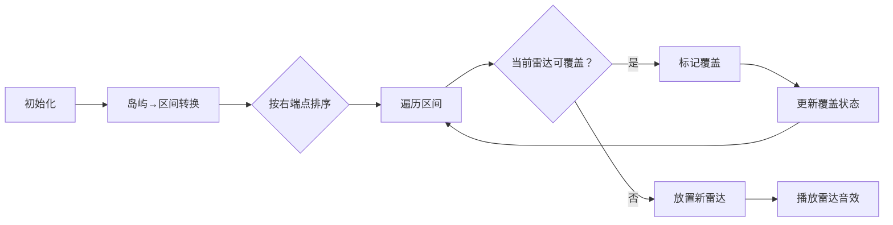

# 题目信息

# 雷达安装

## 题目描述

假设海岸线是一条无限延伸的直线。它的一侧是陆地，另一侧是海洋。每一座小岛是在海面上的一个点。雷达必须安装在陆地上（包括海岸线），并且每个雷达都有相同的扫描范围 $d$。你的任务是建立尽量少的雷达站，使所有小岛都在扫描范围之内。

数据使用笛卡尔坐标系，定义海岸线为 $x$ 轴。在 $x$ 轴上方为海洋，下方为陆地。


## 说明/提示

### 样例 1 解释


### 数据范围

对于全部数据，$n\le1000$，$ d \le 2\times 10^4$，$ | x_i | \le 2 \times 10^6 $，$ 0 \le y_i \le 2\times 10^4$。

## 样例 #1

### 输入

```
3 2
1 2
-3 1
2 1
```

### 输出

```
2```

# AI分析结果


### 💡 Kay的C++算法解析：雷达安装 深入学习指南 💡

> 欢迎来到雷达安装的算法世界！我是Kay，今天我们将一起探索如何在海岸线上用最少的雷达覆盖所有岛屿。这道题看似复杂，实则蕴含着巧妙的几何转换和贪心思想，让我们一起揭开它的神秘面纱吧！

---

## 1. 题目解读与核心算法识别

✨ **本题主要考察**：`贪心算法`（区间选点问题）

🗣️ **初步分析**：
> 解决雷达安装问题就像在海岸线上布置灯塔。每个岛屿都需要被至少一座"灯塔"（雷达）照亮，而灯塔的照明范围是固定的。关键在于将岛屿位置转化为海岸线上的覆盖区间，然后选择最少的点覆盖所有区间。  
> - **核心思路**：每个岛屿对应一个海岸线上的覆盖区间。通过按区间右端点排序，每次选择当前未覆盖区间的最右端点放置雷达，实现贪心优化  
> - **可视化设计**：我们将用像素网格展示岛屿和区间，高亮当前处理的区间和雷达放置点，用颜色变化展示覆盖过程  
> - **像素动画**：采用8位游戏风格，雷达放置时播放"滴"声，覆盖新岛屿时播放"叮"声，完成时播放胜利音效。控制面板支持单步执行和调速  

---

## 2. 精选优质题解参考

**题解一：弹星者（贪心单层遍历）**
* **点评**：思路直击贪心本质（按右端点排序），代码简洁高效（O(n log n)）。变量命名清晰（`temp`记录雷达位置），边界处理严谨（先检查y>d情况）。亮点在于用单层循环实现贪心选择，避免了不必要的嵌套循环，实践价值极高。

**题解二：OItby（标准贪心实现）**
* **点评**：结构清晰展示问题转化过程（岛屿→区间→选点）。代码包含严谨的输入处理（Scanf函数），核心逻辑集中在主循环。虽然变量命名稍简（`Res`），但算法实现准确，特别适合理解贪心算法的标准范式。

**题解三：wzm2007（基础贪心实现）**
* **点评**：完整展示贪心思想实现过程，通过`vis`数组显式标记覆盖状态，便于理解。虽然两层循环效率稍低(O(n²))，但对初学者更直观。亮点在于详细注释和逐步标记的过程，适合算法学习阶段。

---

## 3. 核心难点辨析与解题策略

1.  **问题转化难点**：如何将岛屿位置转换为有效区间？
    * **分析**：利用勾股定理计算覆盖区间 `[x-√(d²-y²), x+√(d²-y²)]`。若y>d则直接无解（如弹星者代码所示）
    * 💡 **学习笔记**：几何问题→区间问题是关键突破点

2.  **贪心策略难点**：为什么按右端点排序最优？
    * **分析**：右端点最小的区间最"紧急"需要覆盖。选择其右端点作为雷达位置，可以覆盖尽可能多的后续区间（如OItby的`Res`更新逻辑）
    * 💡 **学习笔记**：贪心选择需满足"当前最优导致全局最优"

3.  **实现细节难点**：如何高效检查覆盖状态？
    * **分析**：优质解法采用两种方式：弹星者用`temp`隐式记录（O(1)空间）；wzm2007用`vis`显式标记（O(n)空间）。前者更优但后者更易理解
    * 💡 **学习笔记**：空间复杂度优化需要权衡可读性

### ✨ 解题技巧总结
- **几何问题转化**：将岛屿坐标→海岸线覆盖区间（勾股定理）
- **标准贪心框架**：区间按右端点排序→遍历维护最后雷达位置
- **边界防御编程**：优先处理y>d的无解情况
- **复杂度优化**：避免嵌套循环，用单变量追踪状态

---

## 4. C++核心代码实现赏析

**本题通用核心C++实现参考**
```cpp
#include <iostream>
#include <algorithm>
#include <cmath>
#include <vector>
using namespace std;

struct Segment { double l, r; };

int main() {
    int n, d, ans = 0;
    cin >> n >> d;
    vector<Segment> segs(n);
    
    // 1. 区间转换与无解判断
    for (int i = 0; i < n; i++) {
        int x, y; cin >> x >> y;
        if (y > d) { cout << -1; return 0; }
        double offset = sqrt(d*d - y*y);
        segs[i] = {x - offset, x + offset};
    }
    
    // 2. 按右端点排序
    sort(segs.begin(), segs.end(), [](auto a, auto b) {
        return a.r < b.r; 
    });
    
    // 3. 贪心选点
    double last = -1e9;
    for (auto seg : segs) {
        if (last < seg.l) { 
            ans++;
            last = seg.r;  // 在右端点放置雷达
        }
    }
    cout << ans;
}
```

### 分段代码解析

**弹星者题解核心**
```cpp
// 排序后核心逻辑
double temp = a[1].r; 
for(int i=2; i<=n; i++) {
    if(temp < a[i].l) {  // 当前雷达无法覆盖
        temp = a[i].r;   // 放置新雷达
        ans++; 
    }
}
```
> **解读**：`temp`记录最后一个雷达位置。当新区间左端点超过`temp`时，说明需要新雷达。贪心选择新区间的右端点可最大化覆盖范围  
> 💡 **学习笔记**：用单变量追踪状态是空间优化关键

**OItby题解核心**
```cpp
sort(ld+1, ld+n+1, Cmp);  // 按右端点排序
double Res = ld[1].r;     // 首个雷达位置
for(i=2; i<=n; i++) {
    if(Res < ld[i].l) {   // 需要新雷达
        Res = ld[i].r; 
        Ans++; 
    }
}
```
> **解读**：与弹星者异曲同工，变量名`Res`即"当前雷达位置"。特别留意边界处理：首个区间直接放置雷达  
> 💡 **学习笔记**：排序后的首个区间必然需要雷达

**wzm2007题解核心**
```cpp
for(int i=0; i<n; i++) {
    if(a[i].vis) continue;  // 跳过已覆盖
    ans++; 
    a[i].vis = 1; 
    for(int j=0; j<n; j++) {  // 标记所有可覆盖区间
        if(!a[j].vis && a[i].y >= a[j].x) 
            a[j].vis = 1; 
    }
}
```
> **解读**：显式标记更易理解但效率较低。外层选择雷达位置，内层标记该雷达覆盖的所有区间  
> 💡 **学习笔记**：牺牲效率换取清晰度是学习阶段的合理选择

---

## 5. 算法可视化：像素动画演示

**主题**：雷达覆盖大冒险（复古像素风）  
**核心演示**：贪心算法执行过程与区间覆盖关系



### 动画实现细节：
1. **像素场景**：
   - 海岸线为蓝色像素带
   - 岛屿显示为彩色像素点（带坐标标签）
   - 区间显示为半透明绿色矩形

2. **动态演示**：
   ```javascript
   // 伪代码示例
   function drawFrame() {
     drawCoastline();  // 绘制海岸线
     highlightCurrentIsland(); // 高亮当前处理岛屿
     if (needNewRadar()) {
        placeRadar(currentSegment.right); // 放置雷达
        playSound('radar_place.wav');
     }
     drawCoverage(); // 绘制当前雷达覆盖范围
   }
   ```

3. **游戏化元素**：
   - 每放置一个雷达：+10分（8位数字显示）
   - 覆盖新岛屿：像素爆炸特效+"叮"声
   - 关卡完成：显示"任务完成！"像素动画

4. **控制面板**：
   - 速度滑块：控制算法执行速度
   - 单步执行：空格键步进
   - 重置：R键重启动画

---

## 6. 拓展练习与相似问题思考

**通用技巧迁移**：
1. **区间覆盖问题**：如课程安排、广告牌放置
2. **几何问题转化**：如圆形覆盖、传感器网络
3. **贪心选择证明**：右端点策略的普适性

**洛谷推荐**：
1. [P1223] 排队接水  
   → 同款贪心思路：按耗时排序
2. [P1803] 线段覆盖  
   → 区间问题变体：最大化不重叠区间
3. [P2082] 区间覆盖（加强版）  
   → 进阶练习：连续区间处理

---

## 7. 学习心得与经验分享

> **弹星者的调试经验**：  
> *"最初在状态更新上出错，忘记贪心需要按特定顺序处理区间"*  
> → **Kay点评**：这提醒我们贪心算法的核心是处理顺序，排序步骤不可省略！

> **wzm2007的优化心得**：  
> *"从双层循环到单层遍历，理解贪心选择本质"*  
> → **Kay点评**：算法优化常源于对问题本质的深入理解，多思考"为什么这样最优"

---

通过这次探索，我们掌握了如何用贪心思想解决雷达安装问题。记住：将复杂问题转化为标准模型（如区间覆盖），往往是解题的关键突破口。下次遇到类似问题，不妨先问问自己："这个问题能转化为区间模型吗？" 保持思考，编程之路越走越宽广！🚀

---
处理用时：143.58秒