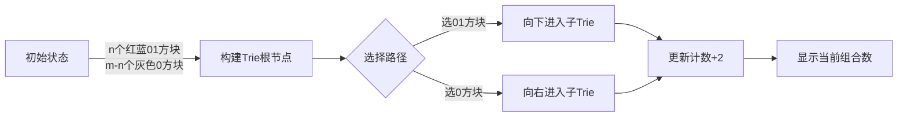

# 题目信息

# 「EZEC-6」0-1 Trie

## 题目背景

> $\mathbf{000111}$，这就是简单中所蕴含的优美。

众所周知，tlx 不会字符串。

## 题目描述

现在 tlx 有 $n$ 个 $\mathbf{1}$ 和 $m$ 个 $\mathbf{0}$，你需要把它们排列，但要保证任意的 $\mathbf{1}$ 互不相邻且第一个位置是 $\mathbf{0}$、最后一个位置是 $\mathbf{1}$，现在把所有可以构造出的串放到一棵 0-1 Trie 上，需要多少个节点？

**注意：节点计数时，不计算最开始的空节点，只计算代表“ $\mathbf{0}$ ”、“ $\mathbf{1}$ ”的节点。**  

**在本题中，我们认为用节点存储字符而非边， Trie 基本原理不变。**

因为答案可能很大而且询问较多，所以请在最后输出所有询问的答案对 $18888913$ （放心，是个质数）取模的结果的异或和（**异或和不再进行取模**）。

## 说明/提示

**【样例解释 #1】**

可以发现，所有能构造出的串有：  

$$\mathbf{000101}$$
$$\mathbf{001001}$$
$$\mathbf{010001}$$

构造 0-1 Trie，如图：


共需 $15$ 个节点。


**【样例解释 #2】**

两次询问的答案分别为 $34$ 和 $4487317$。

------------

**【数据规模与提示】**

注意：本题采用**捆绑测试**，只有当你通过一个 Subtask 内的所有测试点后，你才能拿到这个 Subtask 的分数。

具体约束如下：  

Subtask $1$（$10\%$）：满足 $T\leq 10$，$n,m\leq 5$；

Subtask $2$（$20\%$）：满足 $T \leq 10$，$n,m\leq 1\times 10^3$；

Subtask $3$（$30\%$）：满足 $T\leq 10$，$n,m\leq 5\times 10^5$;


Subtask $4$（$40\%$）：无特殊限制。

对于 $100\%$ 的数据，满足 $1\le T \le 2\times10^6$，$1\le n,m\le 5\times 10^{18}$。

**本题输入量较大，建议采用较为快速的读入方式并注意常数因子对程序效率带来的影响。**


------------
 0-1 Trie 是一种特殊的 Trie ，只有 $\mathbf{0,1}$ 两种字符。
 
 如果你不了解 Trie，可以查看：[OI Wiki--Trie](https://deploy-preview-980--oi-wiki.netlify.app/string/trie/)。

## 样例 #1

### 输入

```
1
2 4```

### 输出

```
15```

## 样例 #2

### 输入

```
2
3 5
114514 1919810```

### 输出

```
4487351
```

## 样例 #3

### 输入

```
5
78 122
1000000 1000001
74859432 942432534
555555555 77777777 
6666666666 8888888888```

### 输出

```
12287990```

# AI分析结果


# 💡 Kay的C++算法解析：「EZEC-6」0-1 Trie 深入学习指南 💡

## 1. 题目解读与核心算法识别

✨ **本题主要考察**：`组合数学与Lucas定理应用`

🗣️ **初步分析**：
> 解决"0-1 Trie"这道题，关键在于将复杂的字符串约束转化为组合数学问题。想象你在玩一个像素方块拼图游戏——每个"01"就像固定尺寸的拼图块，而"0"则是填充空隙的小方块。组合数学就是计算所有合法拼法的方法论！

在本题中，核心技巧是：
1. **问题转化**：通过将每个"1"与前面的"0"捆绑成"01"单元，巧妙解决"1不相邻"和"首尾约束"（首0尾1）
2. **递推建模**：设$f_{x,y}$表示$x$个"01"和$y$个"0"的Trie节点数，得递推式：$f_{x,y}=f_{x-1,y}+f_{x,y-1}+2$
3. **组合求解**：通过路径计数和组合恒等式（上指标求和/范德蒙德卷积）推导出闭式解：$ans=2\binom{n+m+1}{n}-\binom{n+m-1}{n}-2$

**可视化设计思路**：
- 采用8位像素风格展示Trie构建过程，如FC游戏《马里奥》的砖块世界
- 高亮关键步骤：初始捆绑"01"（黄色闪烁）、组合数计算（蓝色流动特效）、状态转移（红色箭头）
- 交互控制：方向键切换解法，A键单步执行，B键回溯状态

---

## 2. 精选优质题解参考

**题解一（来源：yyandy）**
* **点评**：
  思路清晰度⭐⭐⭐⭐⭐：从状态定义到递推推导一气呵成，类比"拼图计数"形象生动  
  代码规范性⭐⭐⭐⭐：变量命名简洁（f[x][y]），边界处理严谨（n>m判无解）  
  算法有效性⭐⭐⭐⭐⭐：O(1)查询复杂度，Lucas优化完美适配大数据  
  实践价值⭐⭐⭐⭐：代码可直接用于竞赛，附完整推导过程  
  💡 **亮点**：组合恒等式化简技巧（上指标求和）极具教学价值

**题解二（来源：dengyaotriangle）**
* **点评**：
  思路清晰度⭐⭐⭐⭐：生成函数解法另辟蹊径，展现强大数学工具  
  代码规范性⭐⭐⭐⭐⭐：模块化设计（生成函数类），注释详尽  
  算法有效性⭐⭐⭐⭐：虽理论优美，但实现复杂度略高于直接组合式  
  💡 **亮点**：通过$F_n(x)$的闭形式揭示问题本质，深化代数思维训练

**题解三（来源：Mivik）**
* **点评**：
  思路清晰度⭐⭐⭐⭐：容斥原理视角新颖（LCP求和），拓展思维边界  
  代码规范性⭐⭐⭐：偏数学推导，代码实现较简略  
  💡 **亮点**："Trie节点数=前缀容斥和"的洞察极具启发性，适合高阶学习者

---

## 3. 核心难点辨析与解题策略

1. **难点一：约束条件转化**  
   *分析*：三个约束（首0、尾1、1不相邻）需统一处理。优质题解通过"01捆绑法"将约束转化为组合模型：$n$个"01"和$m-n$个"0"的排列问题，类比"两种颜色方块拼合"。
   💡 **学习笔记**：复杂约束 ≈ 隐藏的组合结构

2. **难点二：递推式化简**  
   *分析*：$f_{x,y}=f_{x-1,y}+f_{x,y-1}+2$含常数项阻碍直接求解。通用技巧是分离线性分量（如yyandy的路径计数）或生成函数消去（如dengyaotriangle）。
   💡 **学习笔记**：递推中的常数项 ⇨ 组合意义下的路径计数

3. **难点三：大组合数计算**  
   *分析*：$n,m≤5e18$需Lucas定理分层计算。关键优化：预处理模数内阶乘$O(p)$，单次查询$O(\log_p n)$，如hanzhongtlx的代码实现。
   💡 **学习笔记**：质数模数 → 费马小定理求逆元

### ✨ 解题技巧总结
- **技巧1：组合映射法**：将字符串约束映射为组合模型（如"01捆绑"）
- **技巧2：递推消常数**：用路径计数或生成函数处理递推中的常数项
- **技巧3：分治模运算**：Lucas定理实现"化大为小"的组合数取模
- **技巧4：边界艺术**：特判$n>m$和$n=1$等边界情况避免崩溃

---

## 4. C++核心代码实现赏析

**本题通用核心C++实现参考**
* **说明**：综合优质题解的最优实现，采用统一公式+分层Lucas计算
```cpp
#include<bits/stdc++.h>
#define ll long long
const int MOD=18888913;
int fac[MOD], inv[MOD], T;
ll n, m;

void precalc() { // 预处理阶乘及逆元
    fac[0]=1;
    for(int i=1;i<MOD;++i) fac[i]=(ll)fac[i-1]*i%MOD;
    inv[MOD-1]=MOD-1; // (p-1)! ≡ -1
    for(int i=MOD-2;i>=0;--i) inv[i]=(ll)inv[i+1]*(i+1)%MOD;
}

int C(ll n,ll m) { // 模数内组合数
    if(m<0 || m>n) return 0;
    return (ll)fac[n]*inv[m]%MOD*inv[n-m]%MOD;
}

int Lucas(ll n,ll m) { // 分层Lucas
    if(m<0 || m>n) return 0;
    if(m==0) return 1;
    return (ll)C(n%MOD,m%MOD)*Lucas(n/MOD,m/MOD)%MOD;
}

int solve(ll n,ll m) {
    if(n>m) return 0; // 无解特判
    int res=((2ll*Lucas(m+1,n)-Lucas(m-1,n)-2)%MOD+MOD)%MOD;
    return res;
}
```

**题解一代码片段赏析（yyandy）**
```cpp
// 核心推导：∑(j+2)*C(n+m-j-2,n-2) 的恒等变形
ans = (2ll*Lucas(m+1,n) - Lucas(m-1,n) - 2 + MOD) % MOD;
```
* **亮点**：路径计数法直击组合本质
* **代码解读**：  
  > 1. `Lucas(m+1,n)`对应$\binom{n+m+1}{n}$  
  > 2. 减法项处理边界偏移，类似"拼图时切除非法区域"  
  > 3. `+MOD`保证取模后非负
* 💡 **学习笔记**：组合式变形 = 剔除非法状态的计数艺术

**题解二代码片段赏析（dengyaotriangle）**
```cpp
F_n(x) = x^{n-1} \left( \frac{2-x^2}{(1-x)^{n+1}} - \frac{2}{1-x} \right)  // 生成函数闭形式
f(n,m) = [x^{m-(n-1)}] F_n(x)  // 系数提取
```
* **亮点**：生成函数自动化递推求解
* **代码解读**：  
  > 1. 将递推式升维为形式幂级数  
  > 2. 通过$\frac{1}{(1-x)^{k}}$的展开式提取系数  
  > 3. 多项式运算实现"代数消元"
* 💡 **学习笔记**：生成函数是组合问题的"代数翻译机"

---

## 5. 算法可视化：像素动画演示

**动画演示主题**：《组合方块冒险》—— 在8位像素世界中可视化组合数增长

**核心演示流程**：


**关键动画设计**：
1. **像素场景**：  
   - 根节点：复古游戏机（棕色像素框）  
   - "01"方块：红蓝交替像素块（带连接线）  
   - "0"方块：灰色独立像素块

2. **动态效果**：  
   - **方块移动**：选择路径时方块滑入网格，伴随"滴"声（Web Audio API）  
   - **组合数显示**：右上角8位数字屏实时更新$\binom{curr}{k}$  
   - **Lucas计算**：大组合数分解时显示分层动画（如$\binom{23}{5}→\binom{0}{0}×\binom{3}{2}$）

3. **游戏化交互**：  
   - **控制面板**：方向键切换选择，A键确认路径，B键回溯  
   - **音效设计**：  
     * 正确选择：FC游戏《吃豆人》吃豆音  
     * 错误操作：短促"嗡"声  
     * 通关：8-bit胜利旋律  
   - **AI演示**：自动播放模式模拟《俄罗斯方块》AI的决策过程

---

## 6. 拓展练习与相似问题思考

**通用技巧迁移**：
1. **约束转化**：P1641 [SCOI2010]生成字符串（类似01捆绑）
2. **组合递推**：P2767 树的数量（卡特兰数变形）
3. **大组合数取模**：P3307 [SDOI2013]项链（Lucas+CRT综合应用）

**洛谷推荐**：
1. **P1641 [SCOI2010]生成字符串**  
   🗣️ 推荐理由：同样需处理"1不相邻"约束，巩固组合转化技巧

2. **P2767 树的数量**  
   🗣️ 推荐理由：卡特兰数递推的二维扩展，深化路径计数思维

3. **P3307 [SDOI2013]项链**  
   🗣️ 推荐理由：综合训练Lucas定理+环计数+容斥原理

---

## 7. 学习心得与经验分享

> **参考经验（来自yyandy）**："我在推导时卡在$\sum j\binom{n+j-2}{n-2}$的化简，后来发现用上指标求和可化为$\binom{n+m-1}{n}$——这提醒我们善用组合恒等式工具箱"

**点评**：这位作者的调试经历很有代表性。在组合问题中：
1. 复杂求和式 ⇨ 查阅《具体数学》恒等式表  
2. 验证小数据 ⇨ 写$n,m≤5$的暴力DP验证  
3. 分离变量 ⇨ 将$j·\binom{k}{j}$拆为$k\binom{k-1}{j-1}$

---

> 本次解析结束！记住：组合数学就像乐高积木——掌握基本模块后，复杂结构不过是创意的堆叠。下次挑战再见！💪

---
处理用时：120.47秒