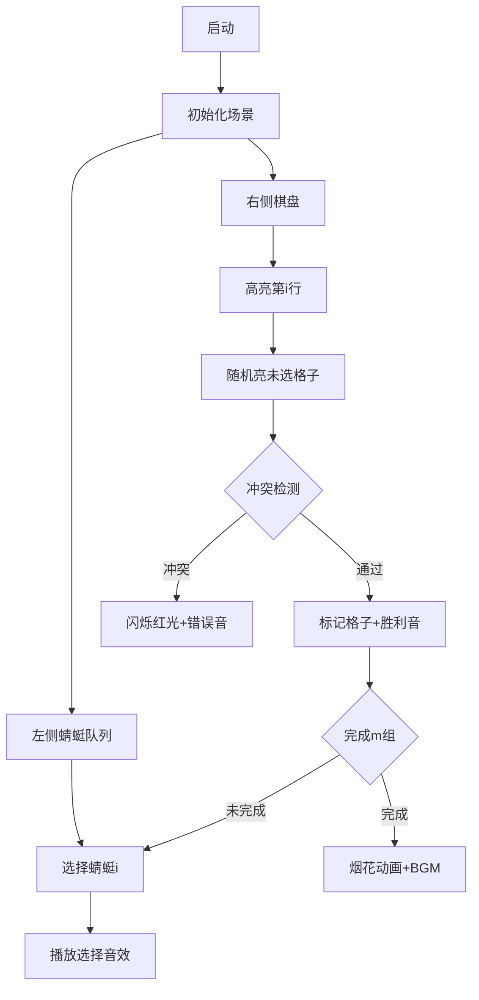

# 题目信息

# 「Stoi2031」黑色毛衣

## 题目背景

> 看着那白色的蜻蜓 在空中忘了前进 还能不能 重新编织 脑海中起毛球的记忆 再说我爱你 可能雨也不会停 黑色毛衣 藏在哪里 就让回忆永远停在那里 ——《黑色毛衣》

## 题目描述

让想起了和雨在一起的时候。由于雨是一个爱玩的女孩子，所以他们有很多玩具，其中就有一种像 **白色蜻蜓** 一样的玩具，现在留在了让的身边，共有 $n$ 只。每只 **白色蜻蜓** 的翅膀长度分别是 $1,2,\dots,n$，并且可以张开成 $(0,\pi)$ 之间的任意角度。让认为使其中 $m$ 只 **白色蜻蜓** 分别张开翅膀使双翅末端的距离都为整数且互不相同的场景是在 **编织** 一份 **记忆**。他认为两份 **记忆** 相同当且仅当可以将 $m$ 只 **白色蜻蜓** 按某种方式重排后一一对应使对应的蜻蜓翅膀长度和双翅距离都相等。他想请你告诉他能编织出多少份不同的记忆。你只需要求出答案 $ans\bmod{p}$ 的值。

## 说明/提示

#### 简述版题意

求不同的腰长 $1 \le a \le n$，底长 $1 \le b \le 2a-1$ 且都为整数，腰长互不相同，底长也互不相同的 $m$ 个等腰三角形构成的不同组数。两组相同当且仅当可以使 $m$ 个三角形按某种方式重排后一一对应全等。

#### 样例解释：

限于篇幅，只对样例 $3$ 作解释。

可以 **编织** 出 $1,1,1$，$2,2,1$，$2,2,2$，$2,2,3$，$3,3,1$，$3,3,2$，$3,3,3$，$3,3,4$，$3,3,5$ 共 $9$ 种 **记忆**，取模 $7$ 后为 $2$。

**本题采用捆绑测试，每个 Subtask 的分数与限制如下。**

| Subtask No. | $m \le n \le$ | 特殊限制 | 分值 |
| :-----------: | :-----------: | :-----------: | :-----------: |
| $1$ | $10^3$ | 无 | $13$ |
| $2$ | $10^6$ | 无 | $37$ |
| $3$ | $10^{18}$ | 无 | $37$ |
| $4$ | $10^{18}$ | $p$是质数 | $13$ |

对于所有数据， $1 \le m \le n \le 10^{18},1 \le p \le 10^5$，不保证 $p$ 是质数。

## 样例 #1

### 输入

```
32 2 47
```

### 输出

```
36
```

## 样例 #2

### 输入

```
233 223 1926817
```

### 输出

```
620162
```

## 样例 #3

### 输入

```
3 1 7```

### 输出

```
2```

# AI分析结果


### 💡 Kay的C++算法解析：「黑色毛衣」深入学习指南 💡

#### 1. 题目解读与核心算法识别
✨ **本题主要考察**：`组合数学与模运算技巧`

🗣️ **初步分析**：
> 题目要求从腰长1~n的等腰三角形中选出m个，满足腰长和底边长度均互不相同。核心难点在于处理超大范围（n≤10¹⁸）的组合数取模问题。  
> - **核心思路**：将问题转化为在Ferrers棋盘上放置非攻击车，结论为方案数=组合数C(n,m)的平方×m!  
> - **算法流程**：特判m≥p时答案为0；否则用exLucas计算C(n,m) mod p，再平方乘m! mod p  
> - **可视化设计**：像素棋盘动态演示选蜻蜓过程。左侧蜻蜓队列（长度1~n），右侧棋盘（第i行有2i-1格）。选中蜻蜓时播放"叮"音效，对应行随机亮起未选格子，冲突时闪烁红光并播放"嘟"错误音效。

---

#### 2. 精选优质题解参考
**题解（作者：VinstaG173）**
* **点评**：
  - **思路清晰性**：双推导路径（数学归纳法+棋盘理论）完美互证，结论简洁深刻
  - **代码规范性**：模块化设计（exgcd/qpw/fac独立函数），变量名语义明确（pi/pk表质因子）
  - **算法有效性**：exLucas处理非质数模数，时间复杂度O(plogp)突破n≤10¹⁸限制
  - **实践价值**：特判m≥p的边界情况，乘法取模防溢出，可直接用于竞赛

---

#### 3. 核心难点辨析与解题策略
1. **难点：超大范围组合数取模**
   * **分析**：当n>10⁷时传统公式失效。题解通过质因数分解p，分治计算阶乘模质数幂（fac函数）
   * 💡 **学习笔记**：exLucas本质是分治+CRT，将大模数拆解为小质数幂

2. **难点：数学结论推导**
   * **分析**：需证明方案数Q(n,m)=C(n,m)²×m!。棋盘模型将三角形参数映射为车的位置
   * 💡 **学习笔记**：组合问题可尝试建立棋盘/多项式模型

3. **难点：边界处理**
   * **分析**：m≥p时m!≡0(mod p)，直接特判返回0避免无效计算
   * 💡 **学习笔记**：模运算中阶乘的零因子特性可优化计算

✨ **解题技巧总结**：
- **质因数分治**：将非质数模数分解为质数幂求解
- **递归降维**：fac函数递归处理n/pi将指数级规模降至对数级
- **CRT缝合**：中国剩余定理合并子问题解

---

### 4. C++核心代码实现赏析
**通用核心C++实现**
```cpp
#include<iostream>
using namespace std;
typedef long long LL;
LL n,m,p;

LL exgcd(LL a,LL b,LL &x,LL &y){
    if(!b){x=1;y=0;return a;}
    LL r=exgcd(b,a%b,y,x);
    y-=(a/b)*x;
    return r;
}

LL qpw(LL a,LL b,LL m){
    LL res=1;
    for(;b;b>>=1,a=a*a%m)
        if(b&1)res=res*a%m;
    return res;
}

LL fac(LL n,LL pi,LL pk){
    if(!n)return 1;
    LL res=1;
    for(LL i=2;i<=pk;++i)
        if(i%pi)res=res*i%pk;
    res=qpw(res,n/pk,pk);
    for(LL i=2;i<=n%pk;++i)
        if(i%pi)res=res*i%pk;
    return res*fac(n/pi,pi,pk)%pk;
}

LL exlucas(LL n,LL m,LL pi,LL pk){
    LL a=fac(n,pi,pk),b=fac(m,pi,pk),c=fac(n-m,pi,pk);
    LL k=0;
    for(LL i=n;i;i/=pi)k+=i/pi;
    for(LL i=m;i;i/=pi)k-=i/pi;
    for(LL i=n-m;i;i/=pi)k-=i/pi;
    return a*qpw(b,pk/pi*(pi-1)-1,pk)%pk*qpw(c,pk/pi*(pi-1)-1,pk)%pk*qpw(pi,k,pk)%pk;
}

int main(){
    cin>>n>>m>>p;
    if(m>=p){cout<<0;return 0;}
    LL ans=1;
    for(LL t=p,i=2;i*i<=t;++i)
        if(t%i==0){
            LL pk=1;
            while(t%i==0)pk*=i,t/=i;
            ans=(ans+(p/pk)*qpw(p/pk,pk/i*(i-1)-1,p)%p*exlucas(n,m,i,pk))%p;
        }
    if(t>1)ans=(ans+(p/t)*qpw(p/t,t-2,p)%p*exlucas(n,m,t,t))%p;
    cout<<ans*ans%p;
    for(int i=1;i<=m;++i)ans=ans*i%p;
    cout<<ans;
}
```
* **代码解读概要**：
  1. 特判m≥p时输出0
  2. 质因数分解p，对每个质因子pi计算C(n,m) mod pi^k
  3. 中国剩余定理合并结果
  4. 最终计算ans = C(n,m)² × m! mod p

---

### 5. 算法可视化：像素动画演示
**主题**：8-bit风格《蜻蜓棋盘物语》  
**核心演示**：组合选择过程的棋盘映射  

**动画设计**：  


**交互控制**：
- **单步执行**：手动点击蜻蜓
- **自动模式**：AI随机选合法位置（速度可调）
- **音效方案**：
  - 选择蜻蜓：8-bit "叮"
  - 格子冲突：短促"嘟"
  - 完成组合：胜利旋律

---

### 6. 拓展练习与相似问题思考
**通用技巧迁移**：
1. 超大范围组合数取模：P3807【模板】卢卡斯定理
2. 棋盘组合模型：P3158 放棋子
3. 质因数分治优化：P3300 烤猪

**洛谷推荐**：
1. **P3807** - 卢卡斯定理  
   🗣️ 巩固exLucas的质因数分治技巧
2. **P3158** - 放棋子  
   🗣️ 学习棋盘模型的建立与方案数推导
3. **P3300** - 烤猪  
   🗣️ 练习质因数分解在优化中的应用

---

> 通过本指南，我们不仅解决了「黑色毛衣」的组合难题，更掌握了处理超大范围组合数的核心方法。记住：将复杂问题分解为质因子世界的小问题，是算法优化的钥匙！🚀

---
处理用时：140.42秒