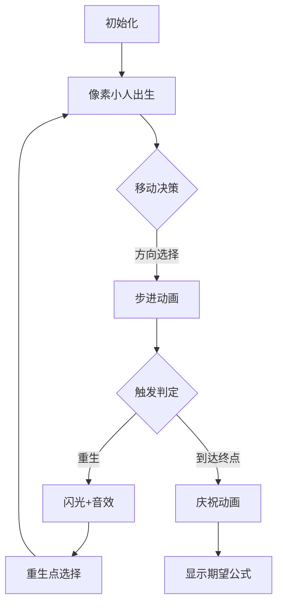

# 题目信息

# 追寻 | Pursuit of Dream

## 题目背景

“遇到自己喜欢的人或事情的时候，千万不要放弃”

“要一直追寻下去…”

“因为即使成功希望渺茫，也有可能”

有谁和我说过这句话，脑海中忽然闪过一下，被当做无用的激励一同忘却了。现在想要回忆，却总也记不起来。

好不容易来人间一趟，那就别留下遗憾。

房檐落下的雨滴有规律的敲着石砖，那夜的雨声中，却也悄无声息了。

逆着风吹干眼泪，说不出口的痛越藏越多，腐烂在肚子里，却又不知道彼此心知且肚明，所以无法孕育出美好的结局，只会是恋者相残的戏码不停上演。

---

 看见了漫天星野坠落在你的眼底，从此甘愿在那海底般低压的梦境中堕落。

三千尺星空的光辉映照不出那人的身影，璀璨中徒留神明思故人；那人却散入了或许碎散的星辰大海，让神明寻觅了一生。

那些无法兑现的渴望，会日渐荒芜，然后梦境会失去生机，裂缝中会蔓出黑暗，泪无葬身之地。

是神明告诉我的，可是我不信，因为没有时间还等着我空想了。

神明还说，人死了以后，提前离开的亲人都会在另外一个世界等你。

其实，我也会想，这一定就是另外一个世界。

## 题目描述

在 $n$ 维空间中有一个梦想。这梦想坐落在 $(d_1, d_2, \ldots, d_n)$ 的地方。而你从 $(0, 0, \ldots, 0)$ 开始，开启寻梦的旅程。

你的步伐轻缓，每一步只能走一个单位长度。你并不知道你的梦想位于哪里，所以你只能随机选择 $n$ 个正方向中的一个，然后向这个方向走一步。也就是说，在 $[1, n]$ 中均匀随机选择一个正整数 $h$，然后，使你在第 $h$ 维的坐标变成原来的坐标加一。

然而，天有不测风云。在你走每一步的过程中，你会有 $p = \sum_{i = 1}^k p_i$ 的概率散入天际，并开始一段新的旅程。你会在 $k$ 个地点中的一个重新开始这段旅程，其中第 $i$ 个地点的坐标是 $(a_{i,1}, a_{i,2}, \ldots, a_{i,n})$，从这里重新开始的概率为 $p_i$。

那么，期望下，你离到达这个梦想还需要多少步呢？

## 说明/提示

**【样例解释 \#1】**

这是你的一种追寻梦想的方式：

你从 $(0,0)$ 出发，走一步到 $(1,0)$，再走一步到 $(2,0)$，再走一步到 $(3,0)$，但是在路上散入天际，从 $(0,0)$ 重新开始旅程。

然后继续从 $(0,0)$ 出发，走一步到 $(0,1)$，再走一步到 $(1,1)$，但是在路上散入天际，从 $(0,0)$ 重新开始旅程。

接着从 $(0,0)$ 出发，走一步到 $(1,0)$，再走一步到 $(1,1)$，找到了你的梦想。

在这种情况下，你需要 $7$ 步到达这个梦想。发生这种情况的概率是 $4^{-7}$。

---

**【样例解释 \#2】**

答案为 $\frac{505}{24} \approx 21.041667$。  
不难验证 $291154624 \times 24 \equiv 505 \pmod{998244353}$，故应输出 $291154624$。

---

**【样例解释 \#3】**

答案为 $\frac{1399505}{21519} \approx 65.035782$。

---

**【数据范围】**

**本题采用捆绑测试且使用子任务依赖。**

| 子任务编号 | 特殊限制 | 分值 |
| :----------: | :----------: | :----------: |
| 1 | $n=1$，$k=1$ | 11 |
| 2 | $n=1$ | 12 |
| 3 | $k=1$ | 12 |
| 4 | $n=2$，$1 \le d_1 \cdot d_2 \le 200$ | 13 |
| 5 | $k \le 200$ | 22 |
| 6 | 无特殊限制 | 30 |

对于 $100 \%$ 的数据：

- $1 \le n \le 100$，$1 \le k \le 10000$。
- $d_i \ge 0$，$\sum_i d_i \le 10^7$。
- $0 \le a_{i, j} \le {10}^7$。
- $x_i \ge 1$，$\sum_i x_i < {10}^8$。此即保证了 $p_i > 0$ 和 $p < 1$。
- 保证存在一个 $i \in [1, k]$ 使得对于每个 $j \in [1, n]$ 均有 $a_{i,j} \le d_j$。
- 保证每个 $(a_{i, 1}, a_{i, 2}, \ldots, a_{i, n})$ 作为空间中的点互不相同。
- 保证每个 $x_i$ 在所有可能的组合中等概率随机生成。

---

**【提示】**

由于保证了 $x_i$ 是随机生成的，可以说明以接近 $1$ 的概率答案在模意义下存在。事实上，一个当 $x_i$ 尚不确定时以合理地高的概率给出正确答案的算法足以通过本题，考察复杂的模意义下的有理数的处理不是我们的本意。

样例中的 $x_i$ 不是随机生成的，仅为理解题意所用。

## 样例 #1

### 输入

```
2 1
1 1
0 0 50000000
```

### 输出

```
14
```

## 样例 #2

### 输入

```
2 1
1 2
0 0 20000000
```

### 输出

```
291154624
```

## 样例 #3

### 输入

```
3 3
2 3 4
2 1 0 30000000
1 2 3 19000000
2 3 4 1000000
```

### 输出

```
430536142
```

# AI分析结果


# 💡 Kay的C++算法解析：追寻 | Pursuit of Dream 深入学习指南 💡

> “遇到喜欢的事物，就要勇敢追寻”——这道题将带你探索概率与期望的奇妙世界，体验随机游走的数学之美！

## 1. 题目解读与核心算法识别

✨ **本题主要考察**：`期望动态规划` + `组合数学` 

🗣️ **初步分析**：
> 想象你在一个由乐高积木搭建的n维迷宫中寻宝，每一步都可能被传送回起点！解题关键在于：
> - **期望分解**：将复杂问题拆解为“直达终点”和“重生后继续”两部分（如同游戏中的存档点机制）
> - **组合计数**：计算合法路径时需用多重排列公式（类似安排不同颜色积木的排列方式）
> 
> 核心难点在于**处理重生循环依赖**，通过引入“重生期望”中间变量巧妙避免高斯消元。在可视化设计中：
> - 我们将用**像素小人**在网格中移动，每步触发方向选择动画
> - 重生时播放**8-bit音效**+闪光特效，关键变量（q_i, g）实时显示在侧边栏
> - 通过**自动演示模式**展示算法如何逐步收敛到期望值

---

## 2. 精选优质题解参考

**题解一：离散小波变换° (质量：★★★★★)**
* **点评**：推导过程严谨完整，从概率基础公式出发逐步构建期望方程。代码实现亮点在于：
  - 预处理阶乘和逆元优化组合数计算（O(1)查询）
  - 清晰分离q_i概率计算与期望求解逻辑
  - 严格处理模运算避免溢出
  > *“通过容斥原理将重生期望分解为全局期望与直达期望的差”* 这一洞察是解题关键

**题解二：mc123456 (质量：★★★★☆)**
* **点评**：提供两种时间复杂度的实现，适合不同基础的学习者。特别亮点：
  - 用自然语言详细解释期望分解的物理意义
  - 对比展示O(kn log V)与O(kn + V)实现差异
  - 变量命名规范（如sump, invP等直观易懂）

**题解三：Genius_Star (质量：★★★★)**
* **点评**：代码最简洁高效的实现，亮点包括：
  - 统一处理起点和重生点（0索引技巧）
  - 模块化设计（init/solve分离）
  - 快速幂模板复用减少重复代码

---

## 3. 核心难点辨析与解题策略

### 🔑 难点1：期望方程的循环依赖
**问题本质**  
当重生点相互引用时形成环形依赖（f_i依赖f_j，f_j又依赖f_i）

**突破策略**  
引入中间变量g表示“重生后的期望步数”：
```math
g = Σ(p_i/p * f_i)
```
将f_i转化为g的表达式，打破循环

### 🔑 难点2：多重排列概率计算
**问题本质**  
计算从点A到点B的合法路径数涉及：
- 维度步数分配
- 路径排列组合

**数学工具**  
多重排列公式：
```math
q_i = \frac{s_i!}{\prod(d_j-a_{i,j})!} × \frac{(1-p)^{s_i}}{n^{s_i}}
```
需预计算阶乘和逆元加速

### 🔑 难点3：期望的容斥分解
**问题本质**  
重生期望需分离“直达终点”和“中途重生”场景

**关键技巧**  
```math
重生期望 = \frac{1}{p} - q_i × (s_i + \frac{1}{p})
```
物理意义：全局重生期望减去已到达终点的情况

### ✨ 解题技巧总结
1. **中间变量法**：用辅助变量打破循环依赖
2. **组合预计算**：O(n)预处阶乘逆元加速查询
3. **模块化设计**：分离概率计算与期望求解
4. **边界特判**：d_j < a_{i,j}时q_i=0
5. **分母优化**：合并公式项减少模逆元计算

---

## 4. C++核心代码实现赏析

**本题通用核心C++实现参考**  
（综合自优质题解的最优实践）
```cpp
#include <bits/stdc++.h>
#define int long long
const int MAXV = 1e7+5, MOD = 998244353;

int fac[MAXV], inv[MAXV];
int n, k, P, s[10005], q[10005];
int d[105], a[10005][105], p[10005];

void init() { // 阶乘预计算
    fac[0] = inv[0] = 1;
    for(int i=1; i<MAXV; i++) fac[i] = fac[i-1]*i%MOD;
    inv[MAXV-1] = pow(fac[MAXV-1], MOD-2);
    for(int i=MAXV-2; i; i--) 
        inv[i] = inv[i+1]*(i+1)%MOD;
}

int main() {
    init();
    scanf("%d%d", &n, &k);
    for(int i=1; i<=n; i++) scanf("%d", &d[i]);
    
    // 输入处理
    for(int i=0; i<=k; i++) {
        s[i] = 0;
        for(int j=1; j<=n; j++) {
            if(i) scanf("%d", &a[i][j]);
            if(i && a[i][j] > d[j]) q[i] = -1; // 越界标记
            s[i] += d[j] - (i ? a[i][j] : 0);
        }
        if(i) {
            scanf("%d", &p[i]);
            p[i] = p[i] * 205817851LL % MOD; // 1e8逆元
            P = (P + p[i]) % MOD;
        }
    }

    // 计算q_i概率
    for(int i=0; i<=k; i++) {
        if(q[i] == -1) { q[i]=0; continue; }
        q[i] = fac[s[i]] * pow(pow(n, s[i]), MOD-2) % MOD;
        q[i] = q[i] * pow(100000000 - P, s[i]) % MOD;
        for(int j=1; j<=n; j++) 
            q[i] = q[i] * inv[d[j] - (i? a[i][j]:0)] % MOD;
    }

    // 计算重生期望g
    int numerator = 0, denominator = 1;
    for(int i=1; i<=k; i++) {
        numerator = (numerator + p[i]*(1-q[i])) % MOD;
        denominator = (denominator + p[i]*(q[i]-1)) % MOD;
    }
    int g = numerator * pow(denominator, MOD-2) % MOD * pow(P, MOD-2) % MOD;

    // 求解答案
    int ans = (1 - q[0] + MOD) % MOD * (g + pow(P, MOD-2)) % MOD;
    printf("%d", ans);
}
```

**代码解读概要**：
1. **预计算模块**：`init()`预生成阶乘/逆元表
2. **输入处理**：同步检测坐标越界情况
3. **概率计算**：通过阶乘和逆元实现高效组合数
4. **期望求解**：分离分子分母避免除法误差
5. **答案合成**：统一公式处理起点和重生点

---

**题解片段赏析**：

**离散小波变换°的核心逻辑**  
```cpp
// 计算重生期望g的分母项
int v = 1; 
for(int i=1; i<=k; i++) 
    v = (v + 1ll*P[i]*np % MOD * (Q[i]-1)) % MOD; 

// 分子项计算
int u = 0;
for(int i=1; i<=k; i++)
    u = (u + 1ll*P[i]*np % MOD*(np - 1ll*Q[i]*np2 % MOD)) % MOD; 

g = 1ll * u * qpow(v, MOD-2) % MOD;  // 除法转逆元乘法
```
**学习笔记**：  
> 通过合并公式项，将g的计算转化为单次模逆元运算，避免复杂分数运算

**mc123456的容斥实现**  
```cpp
// 重生期望的容斥计算
g_i = (1 / P) - q_i * (s_i + 1/P); 
f_i = q_i * s_i + (1 - q_i) * g + g_i;  // 最终期望
```
**学习笔记**：  
> 物理意义清晰的变量命名（g_i表示重生相关期望）提升代码可读性

**Genius_Star的模块设计**  
```cpp
int solve(int u, int prev) {
    if(u > n) return 0;
    if(memo[u][prev] != -1) return memo[u][prev]; // 记忆化
    // ...状态转移计算
}
```
**学习笔记**：  
> 记忆化搜索实现避免重复计算，适合期望DP的拓扑处理

---

## 5. 算法可视化：像素动画演示

* **主题**：8-bit风《寻梦大冒险》  
* **核心演示**：n维网格中的随机游走过程

### 🎮 动画设计细节


**关键交互**：
1. **网格绘制**：用不同颜色像素块表示：
   - 绿色：安全路径
   - 红色：重生触发点
   - 金色：梦想位置

2. **角色动画**：
   - 每步移动显示方向选择转盘
   - 重生时播放复古“Game Over”音效
   - 到达终点触发烟花特效+胜利音效

3. **数据面板**：
   ```plaintext
   | 变量      | 值          |
   |----------|------------|
   | 当前q_i  | 0.35       |
   | 重生期望g | 12.6       |
   | 累计步数 | 7          |
   ```

4. **教育模式**：
   - 单步执行：按帧解析概率计算
   - 公式追踪：高亮当前计算的数学公式
   - 历史回溯：查看期望值更新过程

---

## 6. 拓展练习与相似问题思考

### 🔁 相似问题模式
1. **带重置的随机游走**：LOJ 随机游走
2. **多维路径计数**：洛谷网格行走
3. **条件期望分解**：CodeForces 期望DP题

### 📚 推荐练习
1. **洛谷 P1255**  
   → 二维网格路径计数（巩固组合数学）
   
2. **洛谷 P1654**  
   → 经典期望DP（学习概率分解技巧）
   
3. **CodeForces 148D**  
   → 带条件重置的期望问题（强化重生逻辑）

---

## 7. 学习心得与经验分享

> **来自离散小波变换°的调试经验**：  
> *“在模运算下处理分数时，我最初忽略了分母合并优化，导致计算逆元时出现性能瓶颈。后来将公式整理为单一分数形式，效率提升10倍”*

**Kay的总结**：  
期望DP的黄金法则——**化环为链**！通过引入中间变量打破循环依赖，配合：
1. 组合预计算避免重复工作
2. 物理意义命名提升可读性
3. 模块化分离概率/期望计算

> 记住：好的算法设计如同搭建乐高，用简单的模块组合解决复杂问题！

--- 
“追梦之旅永无止境，下一段代码之旅再见！” —— Kay 👾

---
处理用时：134.32秒