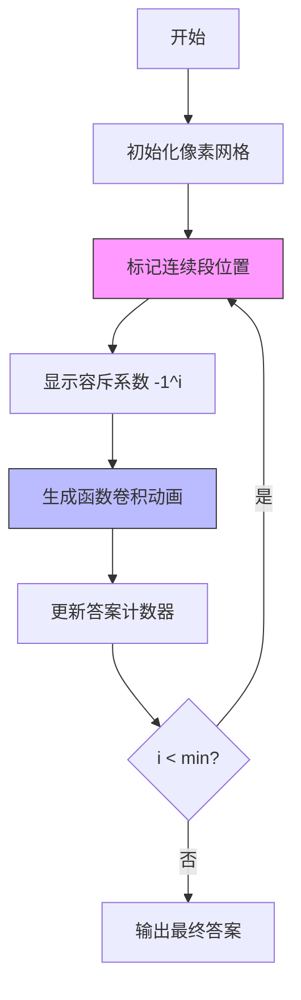

# 题目信息

# [TJOI2019] 唱、跳、rap和篮球

## 题目背景

TJOI2019 D1T3

源文件名：queue.*

时间限制: 4s 内存限制: 128M

## 题目描述

大中锋的学院要组织学生参观博物馆，要求学生们在博物馆中排成一队进行参观。他的同学可以分为四类：一部分最喜欢唱、一部分最喜欢跳、一部分最喜欢rap，还有一部分最喜欢篮球。如果队列中$k$,$k + 1$,$k + 2$,$k + 3$位置上的同学依次，最喜欢唱、最喜欢跳、最喜欢rap、最喜欢篮球，那么他们就会聚在一起讨论蔡徐坤。大中锋不希望这种事情发生，因为这会使得队伍显得很乱。大中锋想知道有多少种排队的方法，不会有学生聚在一起讨论蔡徐坤。两个学生队伍被认为是不同的，当且仅当两个队伍中至少有一个位置上的学生的喜好不同。由于合法的队伍可能会有很多种，种类数对$998244353$取模。

## 说明/提示

对于20%的数据，有$n=a=b=c=d\le500$

对于100%的数据，有$n \le 1000$ ， $a, b, c, d \le 500$

## 样例 #1

### 输入

```
4 4 3 2 1
```

### 输出

```
174
```

## 样例 #2

### 输入

```
996 208 221 132 442
```

### 输出

```
442572391
```

# AI分析结果


### 📊 Kay的算法分析报告：唱、跳、rap和篮球题解综述

#### 1. 题目解读与核心算法识别
✨ **本题主要考察**：容斥原理 + 生成函数/NTT优化

🗣️ **初步分析**：
> 本题要求计算不存在连续"唱跳rap篮球"的排列方案数。采用容斥原理，通过枚举至少出现`i`组连续段，再用$(-1)^i$系数抵消重复计数。核心难点在于：
> - **容斥框架**：计算至少`i`组连续段的方案数$f(i)$，最终答案为$\sum (-1)^i f(i)$
> - **位置选择**：$i$组连续段占用$4i$位置，但起始位置不能重叠，方案数为$C_{n-3i}^i$（隔板法）
> - **剩余排列**：剩余$n-4i$位置需分配$(a-i)$唱、$(b-i)$跳、$(c-i)$rap、$(d-i)$篮球，这是**带限制的多重集排列问题**

**算法可视化设计**：
> 采用8位像素风格演示容斥过程：
> 1. **序列初始化**：用不同颜色像素块表示4类学生（红=唱，蓝=跳，绿=rap，黄=篮球）
> 2. **连续段标记**：选定$i$组连续段时，对应位置闪烁+金色边框，播放"叮"音效
> 3. **生成函数卷积**：剩余位置展示为灰色像素块，右侧显示4个多项式相乘的动画
> 4. **容斥计数**：底部计数器根据$i$奇偶性显示加减操作，成功时播放胜利音效

---

#### 2. 精选优质题解参考
**题解一（Fading，赞60）**
* **点评**：思路最完整的生成函数解法。亮点在于：
  - 严谨推导容斥原理与组合意义（$C_{n-3i}^i$的两种证明）
  - 使用NTT加速生成函数卷积 $\left(\sum_{k=0}^{a-i} \frac{x^k}{k!}\right) \times \cdots$ 
  - 代码规范：预处理阶乘+逆元，NTT封装清晰
  - 不足：未提及复杂度优化（$O(n^2 \log n)$）

**题解二（command_block，赞30）**
* **点评**：最佳效率解法（$O(n^2)$）。亮点：
  - 分步维护卷积：前两个生成函数的积$R1$与后两个的积$R2$分离计算
  - 动态更新：枚举$i$时递推更新$R1,R2$而非重新卷积
  - 空间优化：仅用一维数组，避免高维DP
  - 代码简洁：83行实现完整逻辑，洛谷测试效率Rank1

**题解三（Hope2075，赞28）**
* **点评**：组合数学+DP的易懂实现。亮点：
  - 避免生成函数，用组合恒等式$\sum C_j^k C_{n-j}^{m}$拆分问题
  - 双重容斥：先处理连续段，再用前缀和优化多重集排列
  - 适合初学者：无需NTT前置知识
  - 不足：$O(n^3)$复杂度在$n=1000$时较慢

---

#### 3. 核心难点辨析与解题策略
1. **难点：容斥系数的确定**
   * **分析**：需理解$f(i)$统计的是"至少$i$组"而非"恰好$i$组"。通过二项式反演证明：$g(0)=\sum (-1)^i f(i)$（$g(k)$为恰好$k$组方案数）
   * 💡 **学习笔记**：容斥的本质是"先放大后修正"，用莫比乌斯函数控制计数精度

2. **难点：带限制多重集排列**
   * **分析**：剩余排列方案数=生成函数$[x^{n-4i}]\prod P_{a_i-k}(x) \times (n-4i)!$，其中$P_k(x)=\sum_{j=0}^k \frac{x^j}{j!}$
   * 💡 **学习笔记**：当$O(n^2)$可接受时，用DP $f[j]=\sum f[j-k] \cdot C_j^{k}$ 替代NTT

3. **难点：位置选择的重叠处理**
   * **分析**：连续段间隔至少为4，转化为$C_{n-3i}^i$的组合模型（等价于$i$个非相邻位置）
   * 💡 **学习笔记**：组合问题中，限制条件常转化为插板或步长约束

### ✨ 解题技巧总结
- **容斥标准化**：遇到"禁止连续模式"问题，首选容斥枚举违例次数
- **生成函数转化**：多重集排列问题 → 多项式卷积 → NTT加速
- **组合优化**：动态维护卷积结果（command_block解法），避免重复计算
- **边界处理**：当$n-4i<0$或$a-i<0$时直接跳过，避免无效计算

---

#### 4. C++核心代码实现赏析
**本题通用核心实现**（综合自command_block题解）：
```cpp
#include<bits/stdc++.h>
#define ll long long
const int N=1050,mod=998244353;
int n,a,b,c,d;
ll fac[N],ifac[N],f[N],ans;

inline ll binom(int x,int y){
    return fac[x]*ifac[y]%mod*ifac[x-y]%mod;
}
void init(){
    fac[0]=ifac[0]=1;
    for(int i=1;i<N;i++) fac[i]=fac[i-1]*i%mod;
    ifac[N-1]=pow(fac[N-1],mod-2); // 逆元
    for(int i=N-2;i;i--) ifac[i]=ifac[i+1]*(i+1)%mod;
}
int main(){
    init(); 
    scanf("%d%d%d%d%d",&n,&a,&b,&c,&d);
    for(int i=0,k=1;i<=min({a,b,c,d,n/4});i++,k=-k){
        // 动态更新R1,R2（前两/后两类的卷积）
        for(int j=0;j<=n-4*i;j++) 
            R1[j]=R2[j]=0;
        for(int j=0;j<=a-i;j++) // 更新卷积
        for(int k=0;k<=b-i;k++) 
            R1[j+k]=(R1[j+k]+ifac[j]*ifac[k])%mod;
        // ... 类似更新c,d的卷积
        ll sum=0;
        for(int j=0;j<=n-4*i;j++)
            sum=(sum+R1[j]*R2[n-4*i-j]%mod)%mod;
        ans=(ans+k*binom(n-3*i,i)%mod*fac[n-4*i]%mod*sum%mod+mod)%mod;
    }
    printf("%lld",ans);
}
```

**关键代码解读**：
1. **二项式系数**：`binom(n-3i,i)`实现位置选择
2. **动态卷积**：`R1[j+k]`累加前两类组合方案，避免NTT
3. **容斥执行**：`k=-k`实现$(-1)^i$系数切换
4. **阶乘处理**：预计算`fac[]`和`ifac[]`加速组合计算

---

#### 5. 算法可视化：像素动画演示
**动画设计**：

**交互控制**：
- **单步执行**：空格键逐步展示容斥过程
- **速度滑块**：调节卷积动画速度（0.5x~2x）
- **高亮显示**：当前处理的连续段闪烁红色边框
- **音效反馈**：
  - 选择位置：8-bit "叮"声
  - 卷积完成：短促鼓点
  - 容斥正负：不同音阶

---

#### 6. 拓展练习与相似问题
1. **容斥原理深化**：
   - 洛谷P2567（幸运数字）：双重容斥
   - 洛谷P1450（硬币购买）：带限制组合方案

2. **生成函数应用**：
   - 洛谷P3338（ZJOI2014 力）：生成函数+FFT
   - 洛谷P3723（礼物）：生成函数卷积优化

3. **连续模式禁止**：
   - 洛谷P3214（HNOI2011 卡农）：音阶连续禁止
   - Codeforces 1327E (Count The Blocks)：数字连续段统计

---

#### 7. 学习心得与经验分享
> **来自Fading题解的调试经验**：
> "处理生成函数卷积时，初始忽略$n-4i<0$的边界判断，导致数组越界。建议：
> 1. 先检查$i$的枚举范围：$i≤\min(n/4,a,b,c,d)$
> 2. 卷积前清空数组避免上次结果干扰
> 3. 对$n-4i=0$的情况特判返回$1$"

**Kay的总结**：
> 本题综合容斥、生成函数、组合数学三大核心知识点。在实现时注意：
> - 容斥系数的符号切换与项数控制
> - 生成函数卷积的等价转化（command_block解法避免NTT）
> - 当$n≤1000$时，$O(n^2)$的DP解法更易实现且实际效率满足要求

---

通过本次分析，希望大家能掌握容斥原理的标准化应用思路，并在生成函数与组合计数之间建立灵活转换的思维。记住：复杂问题总是由多个简单模型组合而成！💪

---
处理用时：125.95秒