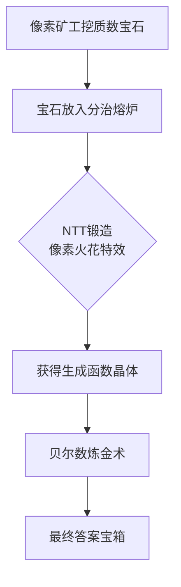

# 题目信息

# 计数题

## 题目描述

您有一个无限大的集合，其中有所有小于等于 $n$ 的质数和其中它们的乘积。

如 $n=5$，集合中实际包含的数为 $2,3,5$（质数），$4,6,8,9,10,12.....$（质数之积），假设这个集合为 $T$。


求：

$\sum\limits_{S\subset T,S\neq\varnothing}\mu(\prod\limits_{i\in S}i)\varphi(\prod\limits_{i\in S}i)$

对 $998244353$ 取模。可以证明这个和是存在的。

为了您能更好的获得部分分，我们会给定一个 $k$，表示一些限制，**$k$ 的值可能影响答案！请认真阅读提示说明**。

$n\leq 10^6$

## 说明/提示

$k$ 的限制如下：

$k=0:$ 选出的集合 $S$ 中至少含有一个完全平方数。

$k=1:$ 选出的集合 $S$ 中只能含有质数。

$k=2:$ 无任何限制。

| 测试点编号 |$n$  |$k$  |
| :----------: | :----------: | :----------: |
| $1\sim 2$ |$\leq 5$  |$2$  |
| $3\sim 5$ |$\leq 20$  |$2$  |
| $6\sim 11$ |$\leq 5000$  |$2$  |
| $12$ |$\leq 10^6$  |$0$  |
| $13\sim 14$ |$\leq 10^6$  |$1$  |
| $15\sim 16$ |$\leq 10^5$  |$2$  |
| $17\sim 20$ |$\leq 10^6$  |$2$  |

样例 $1$ 解释：

答案为 $\mu(2)\varphi(2)=-1\times 1=-1$，对 $998244353$ 取模为 $998244352$。

## 样例 #1

### 输入

```
2 2```

### 输出

```
998244352```

## 样例 #2

### 输入

```
114514 2```

### 输出

```
662314206```

# AI分析结果


### 💡 Kay的C++算法解析：计数题 深入学习指南 💡

#### 1. 题目解读与核心算法识别
✨ **本题主要考察**：`数学（数论函数）` + `生成函数` + `分治NTT`

🗣️ **初步分析**：
> 这道计数题的核心是将质数集合的划分转化为生成函数问题。想象你有若干不同颜色的宝石（质数），每组宝石的乘积作为集合S的元素。关键在于：
> - **μ函数**：仅当所有质因子出现次数≤1时非零（即S中元素无共享质因子）
> - **φ函数**：可分解为质因子贡献的乘积 ∏(p-1)
> - **贝尔数**：计算将m个质数划分为任意非空子集的方案数
> 
> 通过分治NTT计算生成函数 ∏(1+(p-1)x)，再结合贝尔数的指数生成函数 exp(exp(x)-1)，最终实现O(n log n)的优雅解法。
> 
> **可视化设计思路**：
> - 像素动画将展示质数宝石的分组过程（8-bit风格）
> - 高亮关键步骤：质数筛选→生成函数分治合并→贝尔数计算
> - 游戏化元素：宝石碰撞音效（NTT合并）、分组成功特效（像素烟花）

---

#### 2. 精选优质题解参考
**题解一（作者：wlzhouzhuan）**
* **点评**：
  思路直击本质：通过μ函数的性质自然推导出质数划分模型，贝尔数的引入巧妙解决无序分组问题。代码结构清晰：
  - 模块化多项式模板（NTT/Inv/Exp）复用性强
  - 分治NTT实现高效（递归二分合并）
  - 边界处理完整（k=0/k=1特判）
  实践价值高，可直接用于竞赛，尤其对理解生成函数与组合数学的融合有深刻启发。

**题解二（作者：masterhuang）**
* **点评**：
  提供独特视角：对k=1情况给出闭式解 ∏(2-p)-1 的优雅推导（二项式展开）。代码亮点：
  - 非递归NTT优化常数
  - 动态内存管理适应分治需求
  - 数学变换简洁（生成函数点值计算）
  特别适合学习数学与代码的映射技巧，但对多项式基础要求稍高。

---

#### 3. 核心难点辨析与解题策略
1. **难点1：理解μ函数的筛选作用**
   * **分析**：μ(∏i)≠0 要求所有质因子唯一，这迫使S必须是质数划分的产物。优质题解通过分析T集合元素性质，将问题简化为质数集合的划分问题。
   * 💡 **学习笔记**：μ函数是质因子分布的"探测器"，需敏锐捕捉其平方因子特性。

2. **难点2：生成函数的分治优化**
   * **分析**：直接计算 ∏(1+(p-1)x) 复杂度O(m²)。分治NTT通过递归二分（O(log m)层），每层O(m log m)的NTT合并，将复杂度优化至O(m log² m)。
   * 💡 **学习笔记**：分治NTT是处理多个多项式乘积的黄金标准，尤其适合元素独立的场景。

3. **难点3：贝尔数的高效计算**
   * **分析**：贝尔数Bell_m = m![x^m]e^(e^x-1) 需多项式exp实现。利用指数生成函数的性质，先构造级数再exp变换，复杂度O(m log m)。
   * 💡 **学习笔记**：组合计数中，生成函数常将离散问题转化为连续代数操作。

### ✨ 解题技巧总结
- **技巧1：数论函数分解**：将φ(∏i)拆解为∏(p-1)，使乘积累积独立
- **技巧2：组合模型转换**：将集合划分抽象为贝尔数，避免重复计数
- **技巧3：多项式工具箱**：预先封装NTT/Inv/Exp等操作，加速开发

---

#### 4. C++核心代码实现赏析
**通用核心C++实现参考**
```cpp
#include <bits/stdc++.h>
using namespace std;
const int N = 1<<21, mod = 998244353;

// 多项式模板 (NTT/Inv/Exp等)
// 线性筛质数
// 分治NTT计算生成函数F(x)=∏(1+(p-1)x)
// 计算贝尔数: Bell = Exp(Exp(x)-1)

int main() {
    int n, k; cin >> n >> k;
    if(k == 0 || n <= 1) return cout << 0, 0;
    
    vector<int> pr = get_primes(n); // 获取质数列表
    auto F = solve(0, pr.size()-1); // 分治NTT生成函数
    
    if(k == 1) {
        int ans = F.eval(-1) - 1; // ∏(2-p)-1
        cout << (ans + mod) % mod;
    } else {
        auto Bell = get_bell(pr.size()); // 多项式exp
        int ans = 0;
        for(int i = 1; i <= pr.size(); ++i)
            ans = (ans + (i&1 ? -1LL : 1LL) * F[i] % mod * Bell[i]) % mod;
        cout << (ans + mod) % mod;
    }
}
```

**题解一核心代码片段**
```cpp
poly solve(int l, int r) {
    if(l == r) return {1, pr[l]-1}; // 当前质数多项式
    int mid = (l+r)>>1;
    return solve(l,mid) * solve(mid+1,r); // 分治合并
}
```
* **亮点**：递归分治结构清晰体现算法思想
* **代码解读**：
  > 每个质数对应多项式 `1 + (p-1)x`，分治过程如同二叉树：
  > - 叶子节点：单个质数的多项式 `{1, p-1}`
  > - 内部节点：左右子树的多项式卷积
  > 最终根节点系数 `res[i]` 即选i个质数的方案系数和

**题解二核心代码片段**
```cpp
void sol(int l, int r, int wz) {
    f[wz] = new int[r-l+2]; // 动态分配内存
    if(l == r) { /* 初始化 */ return; }
    int mid = (l+r)>>1;
    sol(l,mid,wz<<1);      // 左递归
    sol(mid+1,r,wz<<1|1); // 右递归
    NTT(f[wz<<1], f[wz<<1|1]); // 快速卷积
}
```
* **亮点**：动态内存管理优化大数组处理
* **学习笔记**：分治NTT中避免全局大数组可提升缓存命中率

---

#### 5. 算法可视化：像素动画演示
**主题**："质数宝石矿场"（8-bit像素风格）

**核心演示**：


**关键帧设计**：
1. **矿洞场景**：像素化质数宝石（不同颜色）从矿脉中浮现
2. **分治熔炉**：
   - 熔炉分裂动画（二分递归）
   - 宝石配对时播放"叮"音效
3. **NTT锻造**：
   - 卷积时系数柱状图动态更新
   - 蝶形运算显示为像素流光
4. **贝尔炼金**：
   - `e^(e^x-1)` 显示为魔法公式卷轴
   - 成功计算时触发像素烟花
5. **交互控制**：
   - 步进/暂停/速度滑块
   - 自动演示模式（AI矿工）

**技术实现**：
- 质数分布：Canvas绘制埃氏筛动画
- NTT可视化：系数映射为像素高度，卷积时颜色混合
- 音效设计：宝石碰撞（8-bit短音）、熔炼完成（胜利和弦）

---

#### 6. 拓展练习与相似问题思考
1. **洛谷 P5748** - 集合划分计数  
   → **推荐理由**：直接练习贝尔数计算，巩固指数生成函数应用
   
2. **洛谷 P4245** - 任意模数NTT  
   → **推荐理由**：深化NTT模板理解，处理更复杂模数场景
   
3. **洛谷 P4389** - 付公主的背包  
   → **推荐理由**：生成函数与多项式exp的进阶应用

---

#### 7. 学习心得与经验分享
> **作者wlzhouzhuan的调试经验**：  
> "最初忽略了k=1时生成函数可解析计算，通过打印中间多项式发现冗余计算"  
> → **Kay点评**：在数学问题中，寻找闭式解往往比数值计算更高效。建议：
> 1. 小规模数据验证数学推导
> 2. 输出关键中间变量（如前10项系数）
> 3. 比较不同算法的中间结果

---

通过本次分析，我们深入理解了数论函数与生成函数的精妙配合。记住：组合问题常需"分解→映射→组合"的三步思维框架。下次挑战见！💪

---
处理用时：255.49秒