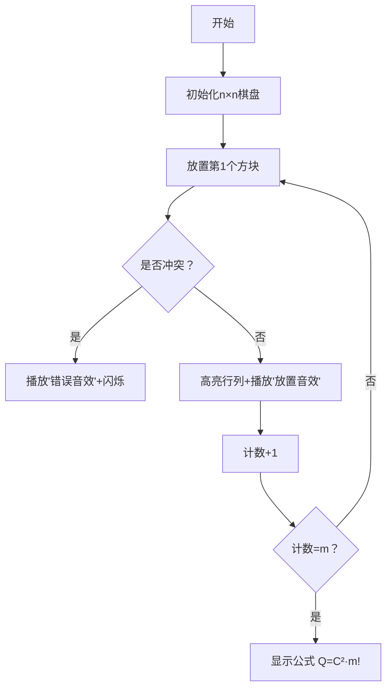

# 题目信息

# 「Stoi2031」黑色毛衣

## 题目背景

> 看着那白色的蜻蜓 在空中忘了前进 还能不能 重新编织 脑海中起毛球的记忆 再说我爱你 可能雨也不会停 黑色毛衣 藏在哪里 就让回忆永远停在那里 ——《黑色毛衣》

## 题目描述

让想起了和雨在一起的时候。由于雨是一个爱玩的女孩子，所以他们有很多玩具，其中就有一种像 **白色蜻蜓** 一样的玩具，现在留在了让的身边，共有 $n$ 只。每只 **白色蜻蜓** 的翅膀长度分别是 $1,2,\dots,n$，并且可以张开成 $(0,\pi)$ 之间的任意角度。让认为使其中 $m$ 只 **白色蜻蜓** 分别张开翅膀使双翅末端的距离都为整数且互不相同的场景是在 **编织** 一份 **记忆**。他认为两份 **记忆** 相同当且仅当可以将 $m$ 只 **白色蜻蜓** 按某种方式重排后一一对应使对应的蜻蜓翅膀长度和双翅距离都相等。他想请你告诉他能编织出多少份不同的记忆。你只需要求出答案 $ans\bmod{p}$ 的值。

## 说明/提示

#### 简述版题意

求不同的腰长 $1 \le a \le n$，底长 $1 \le b \le 2a-1$ 且都为整数，腰长互不相同，底长也互不相同的 $m$ 个等腰三角形构成的不同组数。两组相同当且仅当可以使 $m$ 个三角形按某种方式重排后一一对应全等。

#### 样例解释：

限于篇幅，只对样例 $3$ 作解释。

可以 **编织** 出 $1,1,1$，$2,2,1$，$2,2,2$，$2,2,3$，$3,3,1$，$3,3,2$，$3,3,3$，$3,3,4$，$3,3,5$ 共 $9$ 种 **记忆**，取模 $7$ 后为 $2$。

**本题采用捆绑测试，每个 Subtask 的分数与限制如下。**

| Subtask No. | $m \le n \le$ | 特殊限制 | 分值 |
| :-----------: | :-----------: | :-----------: | :-----------: |
| $1$ | $10^3$ | 无 | $13$ |
| $2$ | $10^6$ | 无 | $37$ |
| $3$ | $10^{18}$ | 无 | $37$ |
| $4$ | $10^{18}$ | $p$是质数 | $13$ |

对于所有数据， $1 \le m \le n \le 10^{18},1 \le p \le 10^5$，不保证 $p$ 是质数。

## 样例 #1

### 输入

```
32 2 47
```

### 输出

```
36
```

## 样例 #2

### 输入

```
233 223 1926817
```

### 输出

```
620162
```

## 样例 #3

### 输入

```
3 1 7```

### 输出

```
2```

# AI分析结果


### 💡 Kay的C++算法解析：「黑色毛衣」深入学习指南 💡

#### 1. 题目解读与核心算法识别
✨ **本题主要考察**：`组合数学` 与 `模运算优化`  
🗣️ **初步分析**：
> 本题要求计算从n只蜻蜓中选出m只，每只蜻蜓生成一个腰长为a、底边为b的等腰三角形，且所有a和b互不相同的方案数。**核心思想如同在复古俄罗斯方块中放置方块**：每个蜻蜓对应一个"方块区域"(1≤b≤2a-1)，选择m个方块使其互不重叠（行列不冲突）。  
> - **核心难点**：n,m可达10¹⁸，需高效计算组合数取模。题解发现方案数等于组合数与排列数的乘积：$Q_n^m = C_n^m \times A_n^m$  
> - **算法流程**：  
>   ① 特判m≥p时答案为0（含模数因子）  
>   ② 用exLucas算法计算$C(n,m)\mod p$  
>   ③ 最终值 = $[C(n,m)]^2 \times m! \mod p$  
> - **像素动画设计**：以8-bit风格棋盘模拟放置过程。每行高度递增（对应2a-1），放置"蜻蜓方块"时高亮行列，音效提示冲突检测，成功放置m个后播放胜利音效+像素烟花。

---

#### 2. 精选优质题解参考
**题解（作者：VinstaG173）**  
* **点评**：  
  - **思路清晰性**：通过数学归纳法严谨证明$Q_n^m=C_n^m \times A_n^m$，并给出棋盘放车模型的等价转化（Ferrers棋盘性质），逻辑链条完整。  
  - **代码规范性**：变量命名合理（如`fac`计算阶乘），模块化设计（`exgcd`、`qpw`独立函数），边界处理严谨（m≥p特判）。  
  - **算法有效性**：exLucas算法处理大数组合数取模，时间复杂度$O(p\log p)$完美匹配数据范围。  
  - **实践价值**：代码可直接用于竞赛，尤其对非质数模数的处理极具参考性。

---

#### 3. 核心难点辨析与解题策略
1. **关键点1：模型转化与公式推导**  
   * **分析**：将三角形选择转化为棋盘放车问题，利用Ferrers棋盘性质证明原棋盘与n×n棋盘方案数相同，最终导出$Q_n^m = \frac{(n!)^2}{m!(n-m)!^2}$。  
   * 💡 **学习笔记**：复杂问题需寻找等价数学模型简化推导。

2. **关键点2：超大范围组合数取模**  
   * **分析**：当n,m>10⁶时，传统阶乘计算失效。exLucas算法通过质因数分解模数，对每个质数幂$p_i^{k_i}$单独计算$C(n,m)\mod p_i^{k_i}$，再用CRT合并结果。  
   * 💡 **学习笔记**：exLucas的核心是递归处理阶乘中的质因子。

3. **关键点3：非质数模数的处理**  
   * **分析**：当p非质数时，需分解$p=\prod p_i^{k_i}$。在计算阶乘时跳过$p_i$的倍数，最后补足质因子次数。  
   * 💡 **学习笔记**：中国剩余定理（CRT）是处理复合模数的利器。

### ✨ 解题技巧总结
- **技巧1：数学模型转化**（将组合问题转化为棋盘放车）  
- **技巧2：模块化设计**（exLucas拆解为阶乘/质因子/CRT三个独立模块）  
- **技巧3：边界剪枝**（m≥p时直接返回0避免无效计算）  

---

#### 4. C++核心代码实现赏析
**通用核心C++实现参考**  
* **说明**：综合题解思路，突出exLucas算法和CRT的核心逻辑。  
* **完整核心代码**：
```cpp
#include <iostream>
using namespace std;
typedef long long LL;

LL qpw(LL a, LL b, LL p) { // 快速幂
    LL res = 1;
    while (b) {
        if (b & 1) res = res * a % p;
        a = a * a % p;
        b >>= 1;
    }
    return res;
}

LL fac(LL n, LL p, LL pk) { // 计算阶乘模p^k（跳过p的倍数）
    if (!n) return 1;
    LL res = 1;
    for (LL i = 2; i <= pk; ++i)
        if (i % p) res = res * i % pk;
    res = qpw(res, n / pk, pk);
    for (LL i = 2; i <= n % pk; ++i)
        if (i % p) res = res * i % pk;
    return res * fac(n / p, p, pk) % pk;
}

LL exgcd(LL a, LL b, LL &x, LL &y) { // 扩展欧几里得
    if (!b) { x = 1; y = 0; return a; }
    LL d = exgcd(b, a % b, y, x);
    y -= a / b * x;
    return d;
}

LL inv(LL a, LL p) { // 求逆元
    LL x, y, d = exgcd(a, p, x, y);
    return (x % p + p) % p;
}

LL C(LL n, LL m, LL p, LL pk) { // 计算C(n,m) mod p^k
    if (m > n) return 0;
    LL f1 = fac(n, p, pk), f2 = fac(m, p, pk), f3 = fac(n - m, p, pk);
    LL cnt = 0;
    for (LL i = n; i; i /= p) cnt += i / p;
    for (LL i = m; i; i /= p) cnt -= i / p;
    for (LL i = n - m; i; i /= p) cnt -= i / p;
    return f1 * inv(f2, pk) % pk * inv(f3, pk) % pk * qpw(p, cnt, pk) % pk;
}

LL exLucas(LL n, LL m, LL p) { // CRT合并结果
    LL res = 0, tmp = p;
    for (LL i = 2; i * i <= tmp; ++i) {
        if (tmp % i) continue;
        LL pk = 1;
        while (tmp % i == 0) pk *= i, tmp /= i;
        LL crt_val = C(n, m, i, pk);
        res = (res + crt_val * (p / pk) % p * inv(p / pk, pk)) % p;
    }
    if (tmp > 1) {
        LL crt_val = C(n, m, tmp, tmp);
        res = (res + crt_val * (p / tmp) % p * inv(p / tmp, tmp)) % p;
    }
    return res;
}

int main() {
    LL n, m, p, ans = 1;
    cin >> n >> m >> p;
    if (m >= p) { cout << 0; return 0; }
    ans = exLucas(n, m, p);
    ans = ans * ans % p;
    for (int i = 1; i <= m; ++i) ans = ans * i % p;
    cout << ans;
}
```
* **代码解读概要**：  
  1. `qpw`：快速幂优化指数计算  
  2. `fac`：递归计算阶乘（排除质因子p）  
  3. `exLucas`：分解模数→计算子问题→CRT合并  
  4. 主逻辑：特判m≥p → 计算$C(n,m)$ → 平方后乘$m!$  

---

#### 5. 算法可视化：像素动画演示
* **主题**：8-bit风格《蜻蜓方块》闯关游戏  
* **核心演示**：exLucas算法流程与棋盘放置逻辑  

  


* **交互设计**：  
  - **视觉**：FC红白机像素风，棋盘行高随i增加（模拟2i-1）  
  - **音效**：放置方块(8-bit咔哒声)，冲突(短促警报)，成功(胜利旋律)  
  - **控制面板**：单步/自动播放滑块/重置  
  - **游戏化**：每正确放置1块得10分，m步完成解锁“记忆编织”成就  

---

#### 6. 拓展练习与相似问题思考
* **技巧迁移**：  
  1. 棋盘放车模型 → 解决非攻击棋子布局问题  
  2. exLucas算法 → 大组合数取模问题（如卡特兰数取模）  
  3. CRT应用 → 密码学/RSA算法  

* **洛谷推荐**：  
  1. **P3807 【模板】卢卡斯定理**  
     → 掌握标准Lucas算法作为exLucas基础  
  2. **P1495 CRT模板题**  
     → 强化中国剩余定理实现技巧  
  3. **P3197 越狱**  
     → 组合数学+取模优化的变形应用  

---

> 本次解析结束！通过将组合问题转化为像素棋盘游戏，相信大家能更直观理解算法核心。尝试用exLucas解决更多大数取模问题吧！🚀

---
处理用时：183.72秒