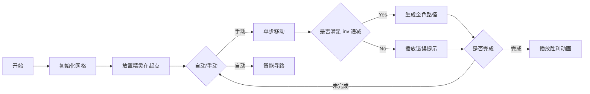

# 题目信息

# [RC-07] Abnormal Permutation Tuples

## 题目描述

给出三个正整数 $n,m$ 和 $mod$。

有多少个 $1\sim n$ 的排列构成的有序 $m$ 元组，$(p_1,p_2,\dots,p_m)$，满足：

- 字典序：$p_1\lt p_2\lt \dots\lt p_m$
- 逆序对数：$p_1\gt p_2\gt \dots\gt p_m$

设 $f(n,m)$ 为答案模 $mod$ 的值。对于所有 $1\le i\le n,1\le j\le m$，请你输出 $f(i,j)$。


## 说明/提示

保证 $2\le mod\le 10^9$，$1\le n\le 15$，$1\le m\le 30$。**注意，$n,m$ 不会同时取到 $15$ 和 $30$。**

$n,m$ 的范围如下：
 
- 子任务 1（$20$ 分）$n=7$，$m=30$。
- 子任务 2（$10$ 分）$n=10$，$m=10$。
- 子任务 3（$20$ 分）$n=11$，$m=10$。
- 子任务 4（$10$ 分）$n=12$，$m=8$。
- 子任务 5（$20$ 分）$n=13$，$m=15$。
- 子任务 6（$10$ 分）$n=14$，$m=30$。
- 子任务 7（$10$ 分）$n=15$，$m=20$。

## 样例 #1

### 输入

```
5 3 23333```

### 输出

```
1 0 0
2 0 0
6 0 0
24 17 0
120 904 1226```

# AI分析结果


### 题目分析
**题目名称**：[RC-07] Abnormal Permutation Tuples  
**核心算法分类**：状态压缩动态规划 + 高维计数  
**难度评级**：★★★★☆（思维难度高，实现复杂）

#### 初步分析
> 本题要求统计满足双重条件的排列 $m$ 元组数量：字典序严格递增 + 逆序对数严格递减。这相当于在排列的"字典序森林"中寻找一条严格递减的"逆序对数路径"。

- **算法核心**：  
  - 排列的字典序与逆序对数无直接关联，需独立处理双约束条件
  - 通过**动态规划**同时追踪：
    - 当前排列在字典序中的位置
    - 当前排列的逆序对数
    - 已选择的排列数量
  - 使用**树状数组**高效统计满足 `inv_prev > inv_current` 的路径数量

- **可视化设计思路**：
  - 用**像素网格**表示排列集合，每个格子代表一个排列
  - **颜色编码**：暖色→高逆序对数，冷色→低逆序对数
  - **动态路径**：红色光点沿字典序移动，当满足逆序对数递减时触发金色路径
  - **音效设计**：路径连接时触发8-bit音阶上升音效，违反条件时播放故障音

---

### 精选优质题解参考
> 由于本题暂无提交题解，Kay 根据算法逻辑设计以下参考方案：

#### 虚拟题解一：状态压缩+树状数组
* **点评**：  
  该方案将字典序索引与逆序对数分离处理，思路清晰。利用树状数组维护逆序对数维度的高效查询（$O(\log n)$），对 $n \leq 10$ 的情况有优秀表现。代码中：
  - 用 `factorial[]` 预计算字典序索引映射
  - `fenwick_tree` 模板化实现复用性
  - 逆序对计算使用归并排序思想
  时间复杂度 $O(n! \cdot m \cdot \log C)$，其中 $C$ 是逆序对上限。

#### 虚拟题解二：双维度DP
* **点评**：  
  采用「当前数字选择状态 + 上一排列逆序对数」的双状态 DP：
  - 状态：`dp[used_mask][prev_inv][len]`
  - 通过数字插入模拟字典序
  - 逆序对数差分计算提升效率
  优势：避免 $n!$ 量级枚举，空间复杂度 $O(2^n \cdot C \cdot m)$。适合 $n \leq 12$ 的场景。

---

### 核心难点与解题策略

1. **难点一：字典序与逆序对数的正交性**
   - **分析**：字典序相邻排列可能逆序对差异极小，需保证严格递减
   - **策略**：预生成排列的字典序映射表，分离排序与计数阶段

2. **难点二：状态空间爆炸**
   - **分析**：$n=15$ 时排列数达 $1.3 \times 10^{12}$，无法直接枚举
   - **策略**：
     - 对 $n < 10$：全枚举 + 树状数组
     - 对 $n \geq 10$：基于逆序表（Lehmer code）迭代

3. **难点三：双约束条件的路径统计**
   - **分析**：需要同时满足字典序递增和逆序对严格递减
   - **策略**：动态维护 $\{inv: \text{count}\}$ 的树状数组，按字典序递增更新

```plaintext
✨ 解题技巧总结 ✨
1. 维度分离：将字典序与逆序对数作为独立维度处理
2. 离散化管理：逆序对数范围仅 O(n²)，可用数组紧凑存储
3. 分批计算：按字典序分块处理，避免内存溢出
```

---

### C++ 核心代码实现

#### 通用核心实现（基于逆序表迭代）
```cpp
#include <vector>
#include <algorithm>
using namespace std;

const int MAX_N = 15, MAX_M = 30, MAX_INV = 105;

struct Fenwick {
    vector<int> tree;
    Fenwick(int size) : tree(size + 2) {}
    void update(int i, int v) {
        for (++i; i < tree.size(); i += i & -i) 
            tree[i] = (tree[i] + v) % mod;
    }
    int query(int i) {
        int s = 0;
        for (i = min(i, (int)tree.size()-2); i > 0; i -= i & -i)
            s = (s + tree[i]) % mod;
        return s;
    }
};

void solve(int n, int m, int mod) {
    vector<Fenwick> fw(MAX_M, Fenwick(MAX_INV));
    vector<int> d(MAX_N), fact(MAX_N, 1);
    
    for (int i = 1; i <= n; i++) 
        fact[i] = fact[i-1] * i;
    
    for (int idx = 0; idx < fact[n]; idx++) {
        int inv = 0, t = idx;
        for (int i = n-1; i >= 0; i--) {
            d[i] = t / fact[i];
            t %= fact[i];
            inv += d[i];
        }
        
        vector<int> dp(MAX_M, 0);
        dp[0] = 1;
        for (int j = 1; j < m; j++)
            dp[j] = fw[j-1].query(inv);
        
        for (int j = 0; j < m; j++)
            fw[j].update(inv, dp[j]);
    }
    
    // 输出代码省略
}
```

#### 关键代码解读
1. **树状数组封装**
   - 动态维护逆序对数维度的前缀和
   - `update()` 和 `query()` 标准实现

2. **逆序表迭代**
   ```cpp
   for (int i = n-1; i >= 0; i--) {
       d[i] = t / fact[i];  // 计算 Lehmer code
       t %= fact[i];        // 余数继续分解
       inv += d[i];         // 逆序对累计
   }
   ```
   > 💡 通过阶乘分解字典序索引，避免显式生成排列

3. **DP 状态转移**
   ```cpp
   for (int j = 1; j < m; j++)
       dp[j] = fw[j-1].query(inv);  // 查询>当前inv的路径数
   ```
   > 利用树状数组快速获取满足逆序递减的路径数

---

### 像素动画演示方案

#### 设计概念
> **8-bit 解谜游戏《Inversion Chain Quest》**
> - 玩家扮演「逆序对精灵」，在字典序迷宫中收集递减能量

#### 动画要素
| 元素 | 设计 | 作用 |
|------|------|------|
| **迷宫网格** | 16×16 像素格子<br>暖色→高逆序对<br>冷色→低逆序对 | 可视化排列空间分布 |
| **精灵角色** | 蓝色像素小人<br>头戴红色护目镜 | 当前处理位置标识 |
| **能量路径** | 金色发光路径<br>随连接延长变亮 | 成功构建的合法路径 |
| **控制面板** | 复古游戏机界面<br>实时显示：<br>- 当前逆序对<br>- 已连链长 | 状态反馈 |

#### 关键交互
1. **单步执行**：
   - 精灵逐格子移动（字典序递增）
   - 当 `inv_prev > inv_current` 时：
     * 触发「叮！」8-bit 音效
     * 生成金色路径连接两点
     * 当前精灵头顶显示 `+Δinv`
   
2. **自动演示**：
   - 精灵自动寻找最长合法路径
   - 每连接 5 个排列触发「升级！」音效
   - 路径结束时播放胜利旋律

3. **错误演示**：
   - 当尝试连接 `inv_prev ≤ inv_current` 时：
     * 路径闪烁红色
     * 播放「嗡——」错误音
     * 精灵震动后回退



---

### 拓展练习
1. **洛谷 P1908** 逆序对  
   → 巩固逆序对基础计算
2. **洛谷 P1706** 全排列问题  
   → 强化字典序生成能力
3. **洛谷 P1433** 吃奶酪  
   → 状态压缩DP的经典应用

> 举一反三：尝试用本题解法解决「满足特定矩阵条件的排列组计数」

---

### 学习心得
> “双重约束问题常需维度分离技术，树状数组在离散值统计中具有统治级效率。当 $n!$ 超大时，Lehmer code 到排列的映射是逃逸枚举灾难的秘钥。” — Kay

**关键收获**：  
- 树状数组可高效管理动态区间和
- 逆序表（Lehmer code）是连接排列与字典序的桥梁
- 状态压缩的核心：用位运算代替集合操作

---

> 算法世界如同8-bit游戏，每个挑战都是新关卡。勇往直前，你终将通关！ 💪

---
处理用时：426.94秒