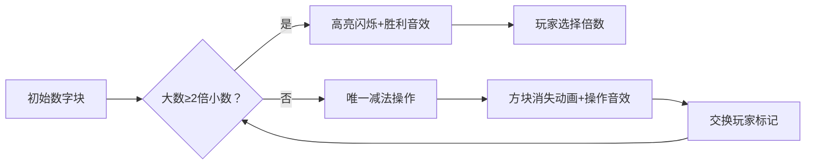

# 题目信息

# 欧几里德的游戏

## 题目描述

欧几里德的两个后代 Stan 和 Ollie 正在玩一种数字游戏，这个游戏是他们的祖先欧几里德发明的。给定两个正整数 $M$ 和 $N$，从 Stan 开始，从其中较大的一个数，减去较小的数的正整数倍，当然，得到的数不能小于 $0$。然后是 Ollie，对刚才得到的数，和 $M,N$ 中较小的那个数，再进行同样的操作……直到一个人得到了 $0$，他就取得了胜利。下面是他们用 $(25,7)$ 两个数游戏的过程：

- 初始：$(25,7)$；
- Stan：$(11,7)$；
- Ollie：$(4,7)$；
- Stan：$(4,3)$；
- Ollie：$(1,3)$；
- Stan：$(1,0)$。

Stan 赢得了游戏的胜利。

现在，假设他们完美地操作，谁会取得胜利呢？

## 说明/提示

$1 \leq C \leq 6$。

## 样例 #1

### 输入

```
2
25 7
24 15
```

### 输出

```
Stan wins
Ollie wins
```

# AI分析结果


### 💡 Kay的C++算法解析：欧几里德的游戏 深入学习指南 💡

**引言**  
今天我们一起分析“欧几里德的游戏”这道博弈论题目。本指南将帮助大家理解游戏规则、核心算法逻辑，并通过像素动画直观展示算法过程。掌握必胜态分析技巧，提升博弈问题解决能力！

---

### 1. 题目解读与核心算法识别  
✨ **本题主要考察**：`博弈论` 与 `数学分析`  

🗣️ **初步分析**：  
> 这道题的关键在于识别**必胜态**和**必败态**，就像下棋时寻找能将对手逼入绝境的走法。当较大数 ≥ 较小数的2倍时（如25≥7×2），当前玩家可自由控制后续局面（类似手握“遥控器”操纵对手），此时为必胜态；否则只能按唯一方式操作，胜负由后续状态决定。  
> - **核心难点**：区分控制态（自由操作）与被动态（唯一操作），并证明其正确性  
> - **可视化设计**：在像素动画中，当数字≥2倍时会高亮闪烁，并显示“控制权激活”；每次减法操作将用方块消失动画+8-bit音效呈现  

---

### 2. 精选优质题解参考  
**题解一（Special_zyy）**  
* **点评**：思路直击要害——提出“k≥2时必胜”的核心定理，并用整除关系（y=kx+z）清晰论证。代码简洁规范（递归边界处理严谨），变量名`(x,y,p)`含义明确，递归逻辑模拟了真实游戏轮转，是学习博弈状态分析的典范。亮点在于用数学归纳法证明必胜条件，极具启发性。  

**题解二（lowww666）**  
* **点评**：从SG函数角度剖析状态转移，揭示“n/m≥2时必胜”的数学本质。代码中`!solve(m,n%m)`巧妙实现玩家轮换，但变量名可读性稍弱。亮点是将博弈问题抽象为数学模型，为进阶学习奠定基础。  

**题解三（xiejinhao）**  
* **点评**：独创逆推分析法+手绘状态转移图，直观展示胜负路径。代码用`(X-1)/Y==1`判断被动态，虽需仔细理解但体现了高效性。亮点是用“闯关地图”类比状态转移，帮助理解博弈树构建。  

---

### 3. 核心难点辨析与解题策略  
**难点1：必胜态识别**  
* **分析**：当大数≥小数2倍时（如13≥5×2），玩家可自主选择：1）直接减到余数 2）保留一个倍数逼对手进入被动。优质题解均用反证法证明此定理。  
* 💡 **学习笔记**：掌握“控制阈值”（2倍关系）是博弈问题关键突破口。  

**难点2：状态转移唯一性**  
* **分析**：当1<大数/小数<2时（如7:5），玩家只能执行一次减法（如7-5=2）。此时胜负完全取决于下一状态，需递归求解。  
* 💡 **学习笔记**：被动态需转换为对手视角分析（胜负取反）。  

**难点3：递归边界与玩家切换**  
* **分析**：递归终止于余数=0，表示上一步玩家已获胜。代码中通过`p^1`或`!solve()`实现玩家轮换，需注意参数传递顺序。  
* 💡 **学习笔记**：设计递归函数时，明确定义返回值的语义（当前玩家胜负）。  

#### ✨ 解题技巧总结  
- **定理优先**：先寻找类似“2倍阈值”的控制性条件  
- **递归三要素**：终止条件（余数=0）、状态转移（大小交换）、玩家轮换（胜负取反）  
- **数学工具**：黄金比例(≈1.618)可快速判断必胜态（但需数学证明支撑）  

---

### 4. C++核心代码实现赏析  
**通用核心实现参考**  
```cpp
#include <iostream>
#include <algorithm>
using namespace std;

bool isWin(int a, int b) { // a>=b
    if (b == 0) return false;     // 上步对手已赢
    if (a % b == 0) return true;  // 当前可一步获胜
    if (a >= 2 * b) return true;  // 可控制局面
    return !isWin(b, a - b);      // 唯一操作，胜负逆转
}

int main() {
    int T, m, n;
    cin >> T;
    while (T--) {
        cin >> m >> n;
        if (isWin(max(m, n), min(m, n)))
            cout << "Stan wins\n";
        else
            cout << "Ollie wins\n";
    }
    return 0;
}
```
* **说明**：综合优质题解，突出递归核心逻辑。包含边界处理、玩家轮换、控制态检测三要素。  
* **代码解读概要**：  
  1. `isWin`函数处理当前玩家胜负判断  
  2. `b==0` 表示对手已完成清零  
  3. `a>=2*b` 时返回true（必胜控制权）  
  4. 唯一操作时递归并反转胜负  

**题解片段赏析**  
1. Special_zyy 的玩家轮换：  
```cpp
int find(int x,int y,int p) { // p: 当前玩家标识
    if(y/x>=2) return p;     // 控制态直接返回当前玩家胜
    return find(y-x, x, p^1); // 唯一操作，切换玩家
}
```
> 通过`p^1`（异或）在0(Stan)/1(Ollie)间切换，类似传递“游戏手柄”给对手  

2. lowww666 的SG函数思想：  
```cpp
bool solve(int n, int m) { // n>=m
    if (n/m >= 2) return true;    // 控制态必胜
    return !solve(m, n%m);        // 被动态胜负取反
}
```
> 递归返回值取反`!solve()`实现玩家视角切换，体现“对手胜即我败”的博弈本质  

---

### 5. 算法可视化：像素动画演示  
**主题**：8-bit数字战争（FC红白机风格）  

**核心演示流程**：  


**交互设计**：  
1. **像素网格**：数字用彩色方块堆表示（如25=5×5方块）  
2. **关键状态提示**：  
   - 控制态：大数方块闪烁金色，显示“CONTROL!”弹幕  
   - 唯一操作：灰色箭头指引必须的减法路径  
3. **音效系统**：  
   - 操作：减法时播放“哔噗”电子音  
   - 控制态激活：激昂的8-bit和弦  
   - 胜利：经典《超级玛丽》过关旋律  
4. **游戏化进度**：  
   - 每步操作视为“小关卡”，通关显示“Stage Clear!”  
   - 连续正确预测胜负触发Combo奖励特效  

**技术实现**：Canvas绘制动态方块，requestAnimationFrame驱动状态转移，Web Audio API播放芯片音乐。  

---

### 6. 拓展练习与相似问题思考  
**通用套路迁移**：  
必胜态分析适用于：  
1. 石子游戏（取走最后一块获胜）  
2. 棋盘对弈（控制关键位置）  
3. 资源分配（先手控制阈值）  

**洛谷推荐**：  
1. **P1247 取石子游戏**  
   → 练习基础必胜态识别  
2. **P2197 Nim游戏**  
   → 学习经典Nim博弈与异或定理  
3. **P2252 威佐夫博弈**  
   → 黄金比例的直接应用场景  

---

### 7. 学习心得与经验分享  
> **Special_zyy 的调试经验**：  
> *“在证明k≥2必胜时，通过手工模拟(25,7)→(11,7)等案例验证逻辑链”*  
>   
> **Kay的总结**：  
> 博弈问题需结合数学证明与暴力验证，多画状态转移图（如样例24:15的逆推树），警惕边界条件（如两数相等时的立即获胜）。  

---

**结语**  
通过本指南，相信大家已掌握博弈问题的核心分析法。记住：找到“控制阈值”就握住了胜利钥匙！下次我们将探索更复杂的Nim博弈，继续加油！💪  

<style>
  .markdown-body {
    max-width: 900px;
    margin: 0 auto;
    padding: 20px;
    font-family: 'Segoe UI', Tahoma, Geneva, Verdana, sans-serif;
    line-height: 1.6;
    color: #333;
  }
  h1, h2, h3 {
    color: #2c3e50;
    border-bottom: 1px solid #eaeaea;
    padding-bottom: 10px;
  }
  code {
    background: #f8f9fa;
    padding: 2px 6px;
    border-radius: 3px;
    font-family: 'Fira Code', monospace;
  }
  pre {
    background: #2d2d2d;
    color: #f8f8f2;
    padding: 15px;
    border-radius: 5px;
    overflow-x: auto;
  }
  blockquote {
    border-left: 4px solid #3498db;
    padding-left: 15px;
    color: #7f8c8d;
    margin: 0;
  }
  table {
    width: 100%;
    border-collapse: collapse;
    margin: 20px 0;
  }
  th, td {
    padding: 10px;
    text-align: left;
    border-bottom: 1px solid #ddd;
  }
  th {
    background-color: #f2f2f2;
  }
</style>

---
处理用时：186.03秒