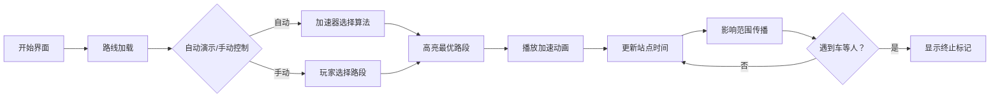

# 题目信息

# [NOIP 2011 提高组] 观光公交

## 题目背景

感谢 @Transhumanist 提供的一组 Hack 数据

## 题目描述

风景迷人的小城 Y 市，拥有 $n$ 个美丽的景点。由于慕名而来的游客越来越多，Y 市特意安排了一辆观光公交车，为游客提供更便捷的交通服务。观光公交车在第 $0$ 分钟出现在 $1$ 号景点，随后依次前往 $2,3,4,\cdots,n$ 号景点。从第 $i$ 号景点开到第 $i+1$ 号景点需要 $D_i$ 分钟。任意时刻，公交车只能往前开，或在景点处等待。

设共有 $m$ 个游客，每位游客需要乘车 $1$ 次从一个景点到达另一个景点，第 $i$ 位游客在 $T_i$ 分钟来到景点 $A_i$，希望乘车前往景点 $B_i$（$A_i<B_i$）。为了使所有乘客都能顺利到达目的地，公交车在每站都必须等待需要从该景点出发的所有乘客都上车后才能出发开往下一景点。

假设乘客上下车不需要时间。一个乘客的旅行时间，等于他到达目的地的时刻减去他来到出发地的时刻。因为只有一辆观光车，有时候还要停下来等其他乘客，乘客们纷纷抱怨旅行时间太长了。于是聪明的司机 ZZ 给公交车安装了 $k$ 个氮气加速器，每使用一个加速器，可以使其中一个 $D_i-1$。对于同一个 $D_i$ 可以重复使用加速器，但是必须保证使用后 $D_i\ge0$。

那么 ZZ 该如何安排使用加速器，才能使所有乘客的旅行时间总和最小？

## 说明/提示

**【输入输出样例说明】**

对 $D_2$ 使用 $2$ 个加速器，从 $2$ 号景点到 $3$ 号景点时间变为 $2$ 分钟。

公交车在第 $1$ 分钟从 $1$ 号景点出发，第 $2$ 分钟到达 $2$ 号景点，第 $5$ 分钟从 $2$ 号景点出发，第 $7$ 分钟到达 $3$ 号景点。

第 $1$ 个旅客旅行时间 $7-0=7$ 分钟。

第 $2$ 个旅客旅行时间 $2-1=1$ 分钟。

第 $3$ 个旅客旅行时间 $7-5=2$ 分钟。

总时间 $7+1+2=10$ 分钟。

**【数据范围】**

对于 $10\%$ 的数据，$k=0$。

对于 $20\%$ 的数据，$k=1$。

对于 $40\%$ 的数据，$2 \le n \le 50$，$1 \le m \le 10^3$，$0 \le k \le 20$，$0 \le D_i \le 10$，$0 \le T_i \le 500$。

对于 $60\%$ 的数据，$1 \le n \le 100$，$1 \le m \le 10^3$，$0 \le k \le 100$，$0 \le D_i \le 100$，$0 \le T_i \le 10^4$。

对于 $100\%$ 的数据，$1 \le n \le 10^3$，$1 \le m \le 10^4$，$0 \le k \le 10^5$，$0 \le D_i \le 100$，$0 \le T_i \le 10^5$。

## 样例 #1

### 输入

```
3 3 2
1 4
0 1 3
1 1 2
5 2 3```

### 输出

```
10
```

# AI分析结果


# 💡 Kay的C++算法解析：观光公交 深入学习指南 💡

欢迎各位算法探索者！今天我们来一起分析NOIP 2011提高组「观光公交」这道经典贪心题。本指南将帮助大家理解题目核心、掌握解题思路，并通过生动的可视化方案加深对算法的理解。

## 1. 题目解读与核心算法识别

✨ **本题主要考察**：贪心算法（带后效性处理）

🗣️ **初步分析**：
> 这道题就像一位公交车司机在时间紧张的观光路线上优化行程。我们手中有k个"时间压缩器"（氮气加速器），每次使用可以让某段路程缩短1分钟。但要注意：如果使用后公交车提前到达站点，但乘客还没到，司机仍需等待——这会影响后续站点的加速效果。

在本题中，贪心策略的核心思想是：**每次选择能惠及最多乘客的路段使用加速器**。想象你在玩时间管理游戏，每次选择能让最多游客开心的路段加速，这就是最优策略！

- **核心难点**：加速效果具有"连锁反应"。减少一段路程时间可能影响后续多个站点，直到遇到"车等人"的情况（公交车提前到达但需等待乘客）。我们需要精确计算每次加速的影响范围。
- **算法流程**：
  1. 计算初始到达时间（无加速）
  2. 循环k次：找出当前加速效果最佳的路段
  3. 更新到达时间和加速器使用情况
- **可视化设计**：采用复古像素风格模拟公交车行驶。关键元素：
  - 公交车到达站点时：若需等待乘客，显示闪烁的像素小人
  - 使用加速器时：路段闪烁黄色，播放"嗖"的音效
  - 影响范围：蓝色光波从加速点传播至终止站点

---

## 2. 精选优质题解参考

以下是思路清晰、代码规范的优质题解：

**题解一（作者：tth37）**
* **点评**：这份题解堪称贪心策略的教科书级示范！作者用清晰的四步框架（读数据→初始规划→找最优加速区间→更新）拆解问题。代码中`Latest`（最晚乘客时间）、`Arrive`（到站时间）等变量名直白易懂。亮点在于对"影响范围"的精准把控——通过`tmp_num`累加下车人数直到遇到"车等人"状态。边界处理严谨（如D[i]=0时跳过），竞赛可直接使用。

**题解二（作者：CalvinJin）**
* **点评**：这位选手展现了惊人的建模能力——将加速器分配转化为费用流问题！通过超源限制加速器总数，站点拆点控制影响范围，边权表示时间收益。虽然复杂度高于贪心，但这种"问题转化"的思维极具启发性。代码中结构体封装网络流边，变量名如`down`（下车人数）、`Mx`（最晚到达时间）简洁规范。

**题解三（作者：lucario）**
* **点评**：面向大数据的高阶优化典范！作者推导出到达时间的数学表达式`Begin_i = max{Maxn_j-pre_j} + pre_i`，并用线段树维护。亮点在于处理加速时的区间分裂策略：当D[i]减至0时，将原区间拆分为左右子树。虽然代码较复杂，但注释详细，对想挑战高阶优化的同学是绝佳学习材料。

---

## 3. 核心难点辨析与解题策略

**难点1：如何计算加速器的"影响范围"？**  
* **分析**：加速某路段D[i]后，后续站点到达时间可能连锁更新，直到遇到"车等人"状态（`Arrive[j] ≤ Latest[j]`）。优质题解通过"向后传播"解决：从加速点i开始，累加后续站点j的下车人数，当`Arrive[j] ≤ Latest[j]`时停止传播。
* 💡 **学习笔记**：影响范围终止于第一个"车等人"的站点，如同水流遇到礁石！

**难点2：如何避免无效加速？**  
* **分析**：当某路段D[i]已为0时加速无效；若加速后出现"人等车"（`Arrive[j] < Latest[j]`），后续站点到达时间不再更新。代码需检查`D[i]>0`，并在传播过程中及时break。
* 💡 **学习笔记**：加速器要用在"刀刃"上——选择D[i]>0且影响范围大的路段。

**难点3：复杂度优化**  
* **分析**：朴素贪心每轮扫描所有路段（O(n)），共k轮，最坏O(kn²)。优化方案包括：记录影响范围避免重复计算（Zyj6的g数组）、线段树查询最大收益区间（lucario）、二分加速器使用数量（a2956331800）。
* 💡 **学习笔记**：预处理影响范围可使复杂度降至O(kn)，线段树进一步优化至O(k log n)。

### ✨ 解题技巧总结
- **递推预处理**：先计算无加速时的`Arrive`（到站时间）、`Leave`（离站时间）、`off`（下车人数）
- **前缀和妙用**：`sum[i]`记录1~i站的下车人数，快速计算区间受益人数
- **实时更新**：每次加速后，仅需更新影响范围内的站点时间
- **边界防御**：始终检查`D[i]≥0`，避免无效加速

---

## 4. C++核心代码实现赏析

**本题通用核心C++实现参考**：
```cpp
#include <iostream>
#include <algorithm>
using namespace std;
const int MAXN = 1005, MAXM = 10005;

int main() {
    // 输入与初始化
    int n, m, k, D[MAXN], Latest[MAXN] = {0}, off[MAXN] = {0}, Arrive[MAXN] = {0};
    struct Passenger { int t, a, b; } pas[MAXM];
    cin >> n >> m >> k;
    for (int i = 1; i < n; i++) cin >> D[i];
    for (int i = 1; i <= m; i++) {
        cin >> pas[i].t >> pas[i].a >> pas[i].b;
        Latest[pas[i].a] = max(Latest[pas[i].a], pas[i].t); // 站点最晚乘客时间
        off[pas[i].b]++; // 下车人数统计
    }

    // 初始到达时间计算
    int time = 0;
    for (int i = 1; i <= n; i++) {
        Arrive[i] = time; // 到达i站时间
        time = max(time, Latest[i]); // 等待最晚乘客
        time += D[i]; // 行驶到下一站
    }

    // 贪心使用加速器
    while (k--) {
        int max_num = 0, max_pos = 0;
        // 寻找最优加速路段
        for (int i = 2; i <= n; i++) {
            if (D[i-1] == 0) continue; // 跳过无法加速路段
            int tmp_num = 0;
            // 计算影响范围内受益人数
            for (int j = i; j <= n; j++) {
                tmp_num += off[j];
                if (Arrive[j] <= Latest[j]) break; // 遇到"车等人"停止
            }
            if (tmp_num > max_num) max_num = tmp_num, max_pos = i;
        }
        if (!max_pos) break; // 无加速空间
        D[max_pos-1]--; // 使用加速器
        // 更新影响范围内到达时间
        for (int i = max_pos; i <= n; i++) {
            Arrive[i]--;
            if (Arrive[i] < Latest[i]) break; // 提前遇到等待
        }
    }

    // 计算总旅行时间
    long long ans = 0;
    for (int i = 1; i <= m; i++) 
        ans += Arrive[pas[i].b] - pas[i].t;
    cout << ans << endl;
    return 0;
}
```
**代码解读概要**：
1. **初始化**：读入景点数n、乘客数m、加速器数k，以及各路段行驶时间D[i]
2. **乘客数据处理**：记录每个站点的最晚乘客到达时间(Latest)和下车人数(off)
3. **模拟初始行程**：计算无加速时各站点到达时间(Arrive)
4. **加速器分配**：循环k次，选择能使最多乘客受益的路段加速
5. **影响范围更新**：减少选定路段的D[i]，并更新后续站点到达时间
6. **结果计算**：累加每位乘客的旅行时间（目的地到达时间-出发时间）

---

## 5. 算法可视化：像素动画演示

**主题**："时间管理者"像素公交模拟器  
**核心演示**：贪心策略下加速器的选择与影响范围传播  

### 设计细节：


**关键交互**：
1. **像素场景**：
   - 16色复古调色板，FC游戏风格
   - 景点：不同颜色像素方块（1号站：红色城堡，n号站：蓝色湖泊）
   - 公交车：8x8像素小车，车顶显示当前时间
   - 乘客：站点闪烁的像素小人，数量随等待人数变化

2. **控制面板**：
   - 速度滑块：调节演示速度
   - 单步执行：按帧查看算法步骤
   - 加速器计数器：剩余加速器数量

3. **动画事件**：
   - 最优路段选择：黄色边框脉冲闪烁
   - 加速瞬间：路段长度缩短，播放"嗖"声（8-bit音效）
   - 影响传播：蓝色波纹从加速点扩散至终止站
   - 车等人：显示"Waiting..."像素标语，播放提示音

4. **自动演示模式**：
   - AI像玩"吃豆人"一样自动选择加速路段
   - 每完成k次加速，播放胜利音效
   - 实时显示总旅行时间减少量

---

## 6. 拓展练习与相似问题思考

**通用思路迁移**：
1. **资源分配问题**：将有限资源（加速器）分配给收益最大（减少时间最多）的单位
2. **后效性处理**：类似动态规划中的状态压缩，需考虑当前操作对未来的影响
3. **区间影响模型**：适用于传播类问题（如森林火灾蔓延、信息传播）

**洛谷推荐**：
1. **P1080 国王游戏**（NOIP 2012）
   - 🗣️ 同样考察贪心策略的相邻交换证明，巩固排序贪心思想
2. **P1230 智力大冲浪** 
   - 🗣️ 时间线贪心经典题，学习如何用有限时间完成最多任务
3. **P5019 铺设道路**（NOIP 2018）
   - 🗣️ 贪心选择连续区间，体验"影响范围"的变式应用

---

## 7. 学习心得与经验分享

> **参考经验**（来自tth37）：  
> "本题思维含量特别大，我和同学讨论了好几天才整明白...关键在于理解加速器的连锁影响范围，动手画路线图特别有帮助！"  
>
> **点评**：  
> 这位选手的经验十分宝贵！在解决复杂贪心问题时：
> 1. 画图模拟小规模数据（如n=3）是最佳学习方式
> 2. 重点理解"影响范围终止条件"（车等人状态）
> 3. 调试时输出中间变量（如每次加速后的到达时间）  

> **避坑提示**（来自lucario）：
> "线段树实现时，D[i]减至0后需分裂区间，但要注意维护区间端点！"
>
> **点评**：
> 边界处理是代码健壮性的关键：
> - 始终检查`D[i]≥0`
> - 更新影响范围时及时break
> - 大规模数据优先验证n=10的边界情况

---

本次关于"观光公交"的算法之旅就到这里！记住：掌握贪心策略的关键在于理解"局部最优如何导向全局最优"。下次挑战见！💪

---
处理用时：189.24秒