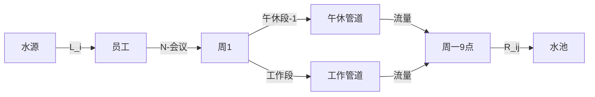

# 题目信息

# 时间表

## 题目背景

小 A 是一个电话服务中心的主管，他的团队有一大批人。他们团队中的每个人都会花费他们的时间参加会议和通过电话与客户通话，当然还有研究团队的项目也是要花费他们的时间的。


## 题目描述

他们中的每个人在每个小时只能在参加会议、和客户通话、研究项目三者中选择一个来进行。为了提高效率，每个小时必须完整地奉献到这一项工作中，不能中途改变。

小 A 所在的地方很奇怪，他们一个星期有 $D$ 天，从 $1$ 到 $D$ 标号。为了照顾员工的嗓子，第 $i$ 个人在每个星期最多能够与客户通话 $L_i$ 小时。

开会是已经计划好的事情，对于每个人他们需要在什么时间参加会议是确定的。这个电话服务中心每天要有 $H$ 个小时的时间是可以回复客户的电话的，为了简便，这 $H$ 个小时被从 $1$ 到 $H$ 标号。

对于每周的每个小时，有多少客户会连接到电话服务中心是已知的。因此，小 A 知道他在第 $i$ 天的第 $j$ 个小时必须安排 $R_{i,j}$ 个员工来和客户通话。如果第 $k$ 个人在第 $i$ 天的第 $j$ 个小时没有会议可以和客户通话，那么 $F_{k,i,j}$ 的值为 $1$，如果有会议则为 $0$。

再次说明，小  A的世界十分奇怪，他们除了每周可能不是 $7$ 天以外，每天也可能不是 $24$ 个小时。

小 A 需要为每个员工创建一个时间表。由于员工也需要吃饭和休息，每天都会有一个午休时间，这段时间是从 $L_{\text{T}_\text{begin}}$ 开始到 $L_{\text{T}_\text{end}}$ 结束（$L_{\text{T}_\text{begin}}$ 和 $L_{\text{T}_\text{end}}$ 也包含在内）。小 A 需要确保每个员工在这段时间内至少有一个小时是没有参加会议或与客户通话的，以便他们可以吃饭和休息，或者做自己想做的事情。

如果某个人在某个小时内没有会议也没有和客户通话，那他在这个小时就可以去研究公司项目，研究公司项目也算在工作时间之内。另外，他们有可能会去研究自己的项目，然而这是不算在工作时间内的。

小 A 想要知道，他是否有可能安排出这样一个时间表，并且满足：

- 每个人每天最多花费 $N$ 个小时在参加会议和客户通话上；
- 每个人每周最多花费 $L_i$ 个小时和客户通话；
- 每个人在午休时间至少有一个小时没有参加会议或和客户通话；
- 对于第 $i$ 天第 $j$ 个小时，恰好有 $R_{i,j}$ 个人可以与客户通话。


## 说明/提示

对于 $100\%$ 的数据满足有

$1 \leq T \leq 5,1 \leq N \leq H \leq 70$

$1 \leq D, P\leq 70,1 \leq L_i \leq N\times D, 0 \leq R_{i, j} \leq 15$

$0 \leq F_{k, i, j} \leq 1,1 \leq L_{\text{T}_\text{begin}} \leq L_{\text{T}_\text{end}} \leq N$。


## 样例 #1

### 输入

```
2
2 2 3 2
4 1
2 3
0 1 1
0 1 0
1 1 1
1 1 1
1 1 1
1 0 1
2 2 3 2
4 1
2 3
0 1 2
0 1 0
1 1 1
1 1 1
1 1 1
1 0 1```

### 输出

```
Yes
No```

# AI分析结果


# 💡 Kay的C++算法解析：时间表 深入学习指南 💡

## 1. 题目解读与核心算法识别

✨ **本题主要考察**：`网络流建模` (图论应用)

🗣️ **初步分析**：
> 这道题就像安排一个大型电话中心的轮班表，需要同时满足员工的工作限制和客户需求。想象你是一位餐厅经理，需要协调服务员在不同时段服务顾客，同时保证他们有休息时间——这就是网络流建模的完美应用场景！
> 
> 网络流的核心思想是将**资源分配问题**转化为**水流管道系统**：水源代表可用人力资源，管道容量代表各种限制条件，水流量代表员工的工作安排，最终能否满足所有需求就看水流能否完全填满汇点水池。
> 
> **关键建模技巧**：
> - **分层设计**：通过四层管道结构（员工→工作日→时间段→小时需求）实现多维度约束
> - **容量控制**：管道容量精确对应限制条件（如通话时长上限）
> - **负容量检测**：建图时检查是否出现"管道破裂"（负容量），立即判定无解
> 
> **可视化设计思路**：
> 我们将设计一个"像素调度员"动画，展示水流如何通过各层管道：
> - 用不同颜色像素块表示员工/工作日/时间段
> - 水流动画展示流量分配过程
> - 午休时段用闪烁的黄色块警示
> - 管道变红表示容量超限（负容量）
> - 8-bit音效：水流声（正常流动）、警报声（负容量）、欢呼声（解满足）

---

## 2. 精选优质题解参考

**题解一：(未来姚班zyl)**
* **点评**：这份题解采用**四层网络流结构**，思路清晰如管道施工图。亮点在于将午休时间拆分为独立层次，通过`Idrest`/`Idwork`双通道精确控制休息要求。代码中`Id_wd`等封装函数大幅提升可读性，边界处理严谨（如负容量检测）。Dinic算法实现标准高效，变量命名`rest_s`/`rest_e`等直观体现业务逻辑，是工程化实现的优秀范例。

**题解二：(Macesuted)**
* **点评**：此解法用**五层网络流模型**，创新性地将午休约束转化为单点容量限制。亮点在于用`g[k][i]`直接计算午休段可用时长，通过`流量=可用时长-1`的巧妙设计确保休息时间。代码采用模块化Dinic模板，逻辑分区明确。虽然变量命名较简洁，但`f`/`g`矩阵的注释补充使其在实践中易于调试，负容量检测机制完备。

---

## 3. 核心难点辨析与解题策略

1.  **难点：多维约束整合**
    * **分析**：本题有5类约束条件（周通话上限/日工作时长/午休要求/会议占用/小时需求），需统一建模。优质题解通过分层网络结构解决：员工层控制周上限，工作日层控制日上限，时间段层处理午休，小时层对接需求。
    * 💡 **学习笔记**：网络流分层就像搭积木——每层解决一类约束

2.  **难点：午休硬性要求**
    * **分析**："至少休息1小时"意味着要预留空档。题解1在时间段层设置`Idrest`点，容量=午休时长-会议数-1；题解2在`C_{i,j}`点直接设容量=g[k][i]-1，数学等价但实现路径不同。
    * 💡 **学习笔记**：减法约束是网络流处理排他条件的利器

3.  **难点：动态容量计算**
    * **分析**：管道容量需动态扣除会议占用时间。题解1用`x-=meeting[i][j][k]`实时计算，题解2预计算`f[k][i]`（会议数）。后者效率更高，前者更易理解。
    * 💡 **学习笔记**：预处理能提升性能，实时计算增强可读性

### ✨ 解题技巧总结
- **分层拆解**：将复杂约束分解到网络各层
- **容量映射**：数学约束直接转化为管道容量
- **负容量熔断**：建图时检测负值立即返回无解
- **模块化封装**：用`Id_cal_dh()`等函数管理复杂索引

---

## 4. C++核心代码实现赏析

**通用核心实现参考**
```cpp
#include <bits/stdc++.h>
using namespace std;

/* 此处插入Dinic算法模板 */

int main() {
    // 初始化网络流图
    // 第一层：源点→员工点 (容量=L_i)
    // 第二层：员工点→工作日点 (容量=N-当日会议数)
    // 第三层：分午休段/工作段点 (容量=段时长-会议数-休息预留)
    // 第四层：连接小时需求点→汇点 (容量=R_{i,j})
    
    // 负容量检测
    if (发现负容量) return cout<<"No\n",0;
    
    // 跑最大流
    long maxflow = dinic();
    cout << (maxflow==总需求 ? "Yes" : "No");
}
```

**题解一核心片段**
```cpp
// 午休时间段建图
rep(i,1,n)rep(j,1,day){
    int sum=rest_e-rest_s+1; // 午休总时长
    rep(k,rest_s,rest_e)sum -= meeting[i][j][k]; // 扣除会议
    add(Id_wd(i,j), Id_wd_restime(i,j), sum-1); // 关键！-1保证休息
    ...
}
```
* **解读**：这段代码精妙处在于`sum-1`——通过减少1个单位容量，强制午休时段至少1小时空闲。就像给水管加装限流阀，确保必有空档。

**题解二核心片段**
```cpp
// 午休段容量计算
dinic.addEdge(P+(i-1)*D+j, P+P*D+(i-1)*D+j, g[i][j]-1);
```
* **解读**：`g[i][j]-1`用极简方式实现同等效果。此处`g[i][j]`是预计算的午休段可用时长，减1形成数学约束，类似"容量扣减"的原子操作。

---

## 5. 算法可视化：像素动画演示

**主题**："管道工大冒险"（复古水管工游戏风格）

**核心演示**：


**交互设计**：
1. **像素管道系统**：8-bit风格水管网络，每层有容量计量槽
2. **动态水流**：蓝色像素块代表流量，流经各层管道
3. **报警机制**：当某层容量变负时，该段管道闪烁红色并发出警报音
4. **午休监视器**：午休段显示黄色休息倒计时，未达标时闪烁警告
5. **控制面板**：
   - 流速调节：控制动画速度
   - 透视模式：高亮显示当前流经路径
   - 自动演示：AI完成完整流量分配

**音效设计**：
- 水流声：正常流动
- "叮"声：成功分配一个通话时段
- 警报声：负容量/约束违反
- 欢呼声：所有需求满足

---

## 6. 拓展练习与相似问题思考

**技巧迁移**：
网络流建模适用于各类资源分配问题：
1. 餐厅桌位分配（桌型→时段→顾客）
2. 工厂生产线调度（机器→订单→时间槽）
3. 课程安排（教室→课程→时间段）

**洛谷推荐**：
1. **P3254 圆桌问题**  
   → 练习多层资源分配建模
2. **P2763 试题库问题**  
   → 掌握题型分类与技能点匹配
3. **P3358 最长k可重区间集**  
   → 进阶学习带权区间调度

---

## 7. 学习心得与经验分享

**题解一经验**：  
> "建图时先画草图理清层次关系，避免管道交叉混乱"

**Kay总结**：  
网络流题就像组装精密仪器——分层设计是骨架，容量计算是齿轮，负检测是保险丝。建议初学者：
1. 纸上绘制网络层次图
2. 用Excel模拟小型测试用例
3. 封装索引计算函数避免错误

---

通过本次分析，我们看到网络流如何将复杂调度问题转化为优雅的管道系统。记住：好算法如同好水管——分层明确、无泄漏、压力达标！下次遇到多重约束问题时，不妨试试"水流思考法"哦~ 💦

---
处理用时：98.64秒