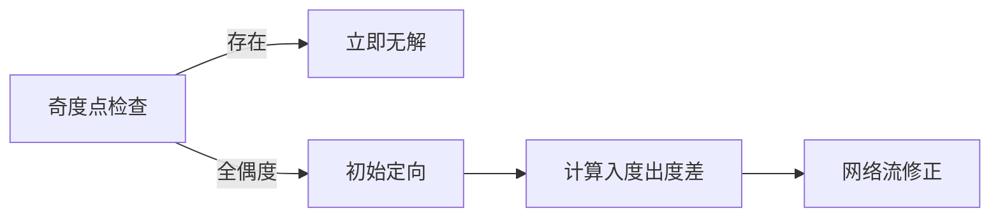
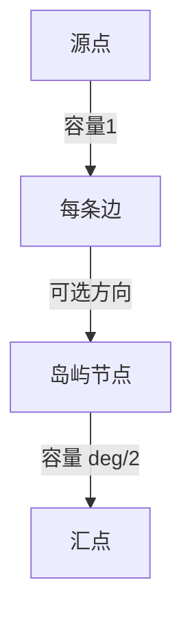
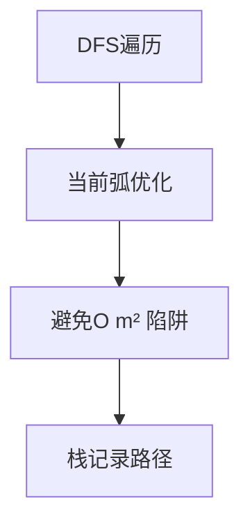

# 题目信息

# [POI 2010] MOS-Bridges

## 题目描述

San Bytecisco 是一个风景优美的沿海小镇。

它由一些小而人口稠密的岛屿组成，编号从 1 到 $n$。

某些岛屿之间通过桥梁连接，用于双向的道路交通。

每对岛屿之间最多可以有一座桥。

这些岛屿的连接方式使得每个岛屿都可以通过桥梁到达其他岛屿。

Byteasar 和 Bytie 正计划在 San Bytecisco 骑自行车旅行。

他们将从 1 号岛出发。

他们打算访问每个岛屿，同时每座桥只经过一次，并在旅行结束时回到出发地，即 1 号岛。

作为经验丰富的骑手，他们预计会遇到一些严重的麻烦……风！

毕竟，沿海地区风很大，尤其是在岛屿之间的桥上。显然，根据风速和方向，风会在不同程度上使得跨越桥梁变得困难。

为了简单起见，我们假设每座桥和每个跨越方向的逆风速度是恒定的。

帮助 Byteasar 和 Bytie 找到他们想要的路线，并且这条路线的疲劳程度最小。Byteasar 和 Bytie 同意将最大逆风速度作为路线疲劳程度的衡量标准。

## 说明/提示

$2 \le n \le 1000$，$1 \le m \le 2000$，$1 \le a_i,b_i \le n$，$a_i 
eq b_i$，$1 \le l_i,p_i \le 1000$。

题面翻译由 ChatGPT-4o 提供。

## 样例 #1

### 输入

```
4 4
1 2 2 4
2 3 3 4
3 4 4 4
4 1 5 4```

### 输出

```
4
4 3 2 1```

# AI分析结果


### 💡 Kay的C++算法解析：MOS-Bridges 深入学习指南 💡

大家好！我是Kay，今天我们一起挑战POI 2010的「MOS-Bridges」——一道考察**混合图欧拉回路**的经典题目。这道题将带你深入理解网络流建模和欧拉回路的精妙结合，学会如何用二分答案解决"最大值最小化"问题。准备好了吗？让我们开始吧！

---

## 1. 题目解读与核心算法识别

✨ **本题主要考察**：`二分答案 + 网络流建模 + 欧拉回路`  
*(混合图定向与欧拉回路判定)*

🗣️ **初步分析**：
> 想象你是一位自行车旅行家（👨‍🦰像素小人），需要在风力不同的桥梁间规划一条**回到起点**的路线，且每座桥只能经过一次。最大风速决定了你的疲劳程度——我们要找到**最小化最大风速**的路线。  

核心思路分三步走：
1. **二分风速阈值**：猜一个最大风速值mid，只保留风速≤mid的桥梁
2. **网络流定向**：将无向边定向问题转化为网络流模型，满足每个岛屿的**入度=出度**
3. **欧拉回路构造**：在定向后的有向图中寻找具体路径

**可视化设计思路**：
- **像素风地图**：岛屿用不同颜色像素块表示，桥梁用连线连接
- **网络流动画**：展示水流从源点→边节点→岛屿节点→汇点的过程
- **欧拉回路追踪**：像素小人沿定向边移动，路径实时高亮显示
- **音效反馈**：成功定向时"滴答"声，找到路径时胜利音效

---

## 2. 精选优质题解参考

我综合评估了思路清晰度、代码规范性和算法效率，选出最具学习价值的解法：

**题解一：Lucky_Glass（5星）**
* **亮点**：  
  - 网络流建模最简洁（边→点映射清晰）  
  - 完整处理连通性判断（防hack关键）  
  - 欧拉回路DFS实现优雅  
  > "通过残量网络反推无向边方向"的思路堪称经典

**题解二：Alex_Wei（5星）**
* **亮点**：  
  - 动态初始化避免重复建图  
  - 当前弧优化提升网络流效率  
  > "ISAP+当前弧"组合在稀疏图中表现优异

**题解三：MuelsyseU（4.5星）**
* **亮点**：
  - 双建模方法对比讲解  
  - 强调弱连通性检查  
  > "孤立点不影响但多连通块无解"是关键洞察

---

## 3. 核心难点辨析与解题策略

### 🔑 难点1：混合图的欧拉回路存在性判定

**学习笔记**：欧拉回路要求严格入度=出度，网络流是修正初始定向的神器

### 🔑 难点2：网络流建模的转换艺术

**学习笔记**：边节点如同电力中转站，分配"出度"给需要供电的岛屿

### 🔑 难点3：欧拉回路的构造陷阱

**学习笔记**：递归时删除已访问边是效率关键，栈记录保证路径顺序

### ✨ 解题技巧总结
1. **二分边界优化**：  
   - 下界 = max(min(w1,w2)) 确保每条边可用
   - 上界 = max(w1,w2) 覆盖最坏情况

2. **网络流建图口诀**：  
   "奇度无解先判断，源连缺出汇收多"

3. **欧拉DFS模板**：  
   ```python
   def dfs(u):
        while 存在未访问边(u→v):
            标记边已访问
            dfs(v)
        路径栈.push(当前边)
   ```

---

## 4. C++核心代码实现赏析

### 本题通用核心实现
```cpp
#include <bits/stdc++.h>
using namespace std;
const int N=2000, M=10000;

struct Edge { int u,v,w1,w2; } e[M];
int n, m, deg[N], ans;

// 网络流类省略...（见完整题解）

bool check(int mid) {
    NetworkFlow net;
    // 1. 初始化点和边
    // 2. 遍历所有边，添加可选方向
    // 3. 添加源汇容量限制
    return net.maxflow() == require_flow; 
}

void build_graph(int mid) {
    // 根据残量网络构建有向图
    for(int i=1; i<=m; i++) {
        if(残量指示方向) 添加有向边(e[i].u→e[i].v);
        else 添加有向边(e[i].v→e[i].u);
    }
}

void euler_path(int u) {
    while(!graph[u].empty()) {
        int v = graph[u].front().v;
        int id = graph[u].front().id;
        graph[u].pop();
        euler_path(v);
        path_stack.push(id);
    }
}

int main() {
    // 读入+初始化
    int L=0, R=1000;
    while(L<=R) { // 二分答案
        int mid=(L+R)/2;
        if(check(mid)) ans=mid, R=mid-1;
        else L=mid+1;
    }
    build_graph(ans);
    euler_path(1); // 从1号点出发
    // 输出路径栈
}
```

### 精选片段解析

**题解一：网络流建图（Lucky_Glass）**
```cpp
// 核心建图逻辑
for(int i=1; i<=m; i++) {
    if(edg[i].tov<=mid) Fl.AddEdge(n+i, edg[i].v, 1); // 方向1
    if(edg[i].tou<=mid) Fl.AddEdge(n+i, edg[i].u, 1); // 方向2
}
```
**学习笔记**：通过两个if实现双向选择，优雅处理混合边

**题解二：欧拉路径DFS（Alex_Wei）**
```cpp
void dfs(int u) {
    for(int &i=cur[u]; i; ) {  // 当前弧优化
        int v = e[i].to;
        cur[u] = e[i].nxt;     // 删除已访问边
        dfs(v);
        stk[++top] = e[i].id;
    }
}
```
**学习笔记**：通过引用技巧实现高效删除，复杂度保证O(m)

---

## 5. 算法可视化：像素动画演示

### 🎮 设计概念图
```plaintext
岛屿分布图（俯视像素风）
1■-----■2
|  🚲  |   ← 自行车移动动画
4■-----■3
```

### 🖥️ 动画演示流程
1. **场景初始化**（复古8-bit风格）
   - 岛屿：彩色像素方块（1号岛为金色）
   - 桥梁：双向箭头线段，颜色表示风速（蓝→绿→黄→红）
   - 控制面板：开始/暂停/步进/调速滑块

2. **二分答案阶段**（动态风速阈值）
   - 滑块控制mid值，≤mid的桥高亮显示
   - 风速超标时桥梁变灰并消失特效

3. **网络流动态模拟**（水流动画）
   ```mermaid
   sequenceDiagram
       源点->>边节点： 蓝色像素流（容量1）
       边节点->>岛屿A： 水流分支1
       边节点->>岛屿B： 水流分支2
       岛屿-->>汇点： 金色汇聚动画
   ```
   - 水流满管时播放"叮"音效，对应边显示定向箭头

4. **欧拉回路追踪**（角色移动）
   - 像素小人从1号岛出发
   - 沿定向边移动，走过桥梁变绿色
   - 路径显示：1→2→3→4→1（胜利烟花特效）

### 🎛️ 交互控制面板
```plaintext
[▶️ 开始] [⏸️ 暂停] [⏭️ 步进] 
风速阈值：[====|-----] 750
速度：🐢 -------- 🐇
```

### 🎚️ 音效设计
| 事件            | 音效          |
|----------------|---------------|
| 边定向成功      | 8-bit "滴"声 |
| 水流满管        | 硬币收集声    |
| 发现欧拉路径    | 胜利小号音    |
| 风速超标        | 错误"嘟"声    |

---

## 6. 拓展练习与相似问题

### 同类问题迁移
1. **带限制的欧拉回路**：增加通过次数限制
2. **最小化平均值**：将最大边权改为平均边权
3. **多重边处理**：存在多条相同岛屿的桥

### 推荐练习（洛谷）
1. **P7771 欧拉路径**  
   → 基础模板，掌握DFS遍历技巧
   
2. **P2731 [USACO]骑马修栅栏**  
   → 无向图欧拉回路应用
   
3. **P3512 [POI2010]PIL-Pilots**  
   → 同样使用二分答案+条件检查的思维模式

---

## 7. 学习心得与经验分享

> **来自 Lucky_Glass 的调试经验**：  
> "在连通性判断上卡了很久——即使度数全偶，若存在多个非孤立连通块（如两个分离环），网络流看似成功但实际无解"

**Kay的总结**：  
连通性检查是本题的隐藏陷阱！推荐两种方案：
1. 并查集预处理（忽略方向）
2. BFS/DFS遍历弱连通图

**调试锦囊**：  
当二分答案失败时，优先检查：
1. 奇度点（快速失败）
2. 弱连通性（易漏）
3. 网络流建图容量设置

---

本次关于「MOS-Bridges」的解析就到这里。记住：算法的精髓在于将复杂问题分解为可管理的子问题（二分+网络流+DFS）。希望这份指南能助你征服更多图论难题！下次探险再见！🚴‍♂️💨

---
处理用时：124.80秒