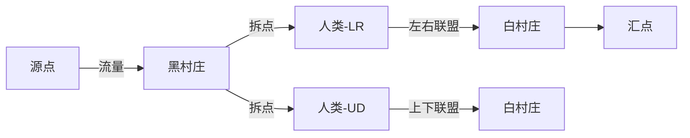

# 题目信息

# [CEOI 2010] alliances (day1)

## 题目描述

在一个幻想世界里，有块矩形岛屿。这座岛屿被划分成了 $R$ 行 $C$ 列的方格。

有些方格无人居住，而有些方格被以下某一种生物占据：精灵，人类，矮人或者霍比特人。占据同一格子的生物在这一格子组成了一个村庄。

为了防止恶魔的袭击，他们需要结成联盟。定义**每个村庄相邻四个方向（上下左右）的村庄**为这个村庄的邻居。

每种生物分别要满足以下条件：

- 精灵：只需要与一个邻居结盟；
- 人类：需要与两个邻居结盟，且这两个邻居不能在上下或者左右方向；
- 矮人：需要与三个邻居结盟；
- 霍比特：需要与四个邻居结盟（即所有邻居）。

你的任务是确定岛上的所有村庄是否都能与相应数量的邻居结盟（即可能会出现一些邻居并没有结盟）。如果能，则输出联盟的结构。否则输出 `Impossible!`。

**注意：结盟的关系是双向的。**

## 说明/提示

#### 数据规模与约定

- 对于 $55\%$ 的数据，保证 $\min(r,c)\le 10$；
- 对于另 $15\%$ 的数据，保证 $r\times c\le 20$；
- 对于另 $10\%$ 的数据，保证地图中只有无人区和人类；
- 对于 $100\%$ 的数据，保证 $1\le r,c\le 70$。

#### 说明

**题目译自 [CEOI 2010](http://ceoi2010.ics.upjs.sk/Contest/Tasks) day 1 *[T1 alliances](https://people.ksp.sk/~misof/ceoi2010/all-eng.pdf)***。

翻译版权为题目提供者 @[ShineEternal](https://www.luogu.com.cn/user/45475) 所有，未经许可禁止转载。


## 样例 #1

### 输入

```
3 4
2 3 2 0
3 4 3 0
2 3 3 1```

### 输出

```
............
.OXXOXXO....
.X..X..X....
.X..X..X....
.OXXOXXO....
.X..X..X....
.X..X..X....
.OXXOXXOXXO.
............```

## 样例 #2

### 输入

```
1 2
2 1```

### 输出

```
Impossible!```

# AI分析结果


### 💡 Kay的C++算法解析：[CEOI 2010] alliances 深入学习指南 💡

#### 1. 题目解读与核心算法识别
✨ **本题主要考察**：`网络流建模与黑白染色`  
🗣️ **初步分析**：
> 本题需要解决幻想岛屿村庄的联盟关系问题，核心是将网格图转化为网络流模型。通过**黑白染色**将网格分为二分图（黑点连源点，白点连汇点），并用**拆点技巧**处理人类的特殊限制（上下/左右方向各一个联盟）。算法流程如下：
> - **染色分类**：按坐标和奇偶性划分黑白点，确保相邻点颜色不同。
> - **人类拆点**：将人类结点拆为两个子结点（分别管理上下/左右方向），通过容量为1的边限制方向选择。
> - **流量验证**：若源点流出总量 = 汇点流入总量 = 总需求数/2，则存在解。
>
> **可视化设计思路**：  
> 采用**8位像素风格**模拟村庄网格（类似FC游戏）：
> - 每个村庄用3×3像素块表示，中心为'O'，联盟方向用'X'连接
> - 动画高亮关键步骤：拆点过程用闪烁箭头，流量流动用像素块颜色变化（蓝色→绿色表示满流）
> - 音效设计：结盟成功时播放16-bit胜利音效，无解时播放低沉错误音效

---

#### 2. 精选优质题解参考
**题解一（MarchKid_Joe）**  
* **点评**：  
  思路清晰度⭐⭐⭐⭐⭐：完整解析黑白染色+拆点逻辑，详细推导人类方向限制的处理方法  
  代码规范性⭐⭐⭐⭐：变量命名规范（`id[][]`表坐标，`person`存拆点），边界处理严谨  
  算法亮点💡：独创性提出"方向管理结点"概念，通过`LR/UD`标记解决人类方向冲突  
  实践价值🏆：提供完整调试经验（如反边流量归零、图尺寸3倍放大等陷阱）

**题解二（CaoXian）**  
* **点评**：  
  思路创新性⭐⭐⭐：用`id[i][j][0..2]`三维数组管理原点和拆点，提升状态访问效率  
  代码简洁性⭐⭐⭐⭐：用统一`add_edge`函数处理网络流建图，减少冗余代码  
  算法优化🔧：通过先判断坐标奇偶性再建图，避免冗余连接

**题解三（一扶苏一）**  
* **点评**：  
  结构严谨性⭐⭐⭐⭐：严格区分黑白点处理逻辑，模块化设计网络流组件  
  实现技巧🎯：用`DFS+cur`数组优化Dinic算法性能，适合大规模网格  
  学习价值📚：提供优雅的方案输出方法（3×3字符矩阵映射）

---

#### 3. 核心难点辨析与解题策略
1. **难点1：人类方向限制建模**  
   *分析*：需确保人类结盟为一横一竖。优质解法通过拆点+方向专属连接（如`LR`只连左右邻居）实现。  
   💡学习笔记：拆点是处理多维约束的利器，将复杂条件分解为独立子问题。

2. **难点2：跨类型结点连接**  
   *分析*：当人类与精灵/矮人相邻时，连接逻辑不同（需判断邻居类型）。解法采用分层判断：  
   ```cpp
   if(邻居是人类) 连接其方向拆点;  
   else 连接其原点;
   ```
   💡学习笔记：通过条件分支处理异构结点，保持网络流边的一致性。

3. **难点3：方案输出映射**  
   *分析*：需将网络流边转化为3倍放大的字符网格。核心技巧：  
   ```python
   联盟方向 → 像素偏移： 
     上联盟: [中心行-1][中心列] = 'X'  
     右联盟: [中心行][中心列+1] = 'X'
   ```
   💡学习笔记：坐标线性变换（`原坐标*3+偏移量`）是网格放大的通用方法。

### ✨ 解题技巧总结
- **拆点降维**：将多约束结点分解为单功能子结点（如人类拆为LR/UD点）
- **流量验证**：总需求数必须为偶数且等于最大流×2
- **边界防御**：越界检查统一用宏封装（如`#define judge (x>=1 && y<=m)`)
- **输出优化**：预初始化3×3模板矩阵，仅修改联盟位置

---

#### 4. C++核心代码实现赏析
**本题通用核心实现**  
```cpp
#include <bits/stdc++.h>
using namespace std;
const int INF = 1e9, N = 75, M = 5*N*N;

struct Network {
    struct Edge { int v, w, rev; };
    vector<Edge> g[M];
    int dis[M], cur[M], s, t;
    
    void add_edge(int u, int v, int w) {
        g[u].push_back({v, w, (int)g[v].size()});
        g[v].push_back({u, 0, (int)g[u].size()-1});
    }
    
    bool bfs() { /* BFS分层 */ }
    int dfs(int u, int flow) { /* DFS找增广路 */ }
    int dinic() { /* 标准Dinic算法 */ }
} net;

int r, c, s, t, tot;
int a[N][N], id[N][N][2]; // id[i][j][0]:原点, [1]:人类拆点
char out[3*N][3*N];       // 输出网格

void build_network() {
    // 结点编号分配
    for(int i=1; i<=r; i++) 
    for(int j=1; j<=c; j++) {
        id[i][j][0] = ++tot;
        if(a[i][j] == 2) id[i][j][1] = ++tot; // 人类分配拆点
    }
    
    // 连接源汇点
    for(int i=1; i<=r; i++) 
    for(int j=1; j<=c; j++) {
        if(!a[i][j]) continue;
        bool is_black = (i+j) % 2 == 1;
        int need = a[i][j];
        
        if(is_black) {
            if(need == 2) {
                net.add_edge(s, id[i][j][1], 1); // 拆点连接
                net.add_edge(s, id[i][j][0], 1);
            } else net.add_edge(s, id[i][j][0], need);
        } else { /* 类似处理白点 */ }
    }
    
    // 相邻点连接（核心）
    const int dx[] = {0,0,1,-1}, dy[] = {1,-1,0,0};
    for(int i=1; i<=r; i++) 
    for(int j=1; j<=c; j++) {
        if(!a[i][j] || (i+j)%2==0) continue;
        for(int d=0; d<4; d++) {
            int ni = i+dx[d], nj = j+dy[d];
            if(ni<1 || nj<1 || ni>r || nj>c || !a[ni][nj]) continue;
            
            // 人类特殊处理
            if(a[i][j]==2) {
                int dir_type = (d<2) ? 1 : 0; // 0:左右, 1:上下
                net.add_edge(id[i][j][dir_type], id[ni][nj][...], 1);
            } else { /* 普通点直接连接 */ }
        }
    }
}

void output_solution() {
    // 初始化3倍网格
    memset(out, '.', sizeof(out));
    for(int i=1; i<=r; i++) 
    for(int j=1; j<=c; j++) {
        if(!a[i][j]) continue;
        int ci = 3*i-1, cj = 3*j-1;
        out[ci][cj] = 'O'; // 中心村庄
        
        // 根据满流边画联盟
        for(auto &e : net.g[id[i][j][0]]) {
            if(e.w == 0 && e.v != s) { // 满流边
                int di = (e.v坐标 - i), dj = (e.v坐标 - j);
                out[ci+di][cj+dj] = 'X';
            }
        }
    }
    // 输出3倍网格...
}
```

**题解一拆点片段赏析**  
```cpp
if(a[i][j] == 2) {
    personcnt++;
    // 拆点：person[now]存储两个方向点
    person[now] = type(n*m + 2*personcnt-1, n*m + 2*personcnt);
    if(black(now)) { // 黑点人类
        add(get_num(now), person[now].x, 1); // 连接左右方向点
        add(get_num(now), person[now].y, 1); // 连接上下方向点
    }
}
```
**学习笔记**：拆点本质是创建逻辑子结点，通过限制边容量（此处为1）满足特殊约束。

---

#### 5. 算法可视化：像素动画演示
**主题**：8位像素风格《联盟冒险者》  
**核心演示**：  


**动画关键帧**：  
1. **初始化**：  
   - 像素网格（70×70→210×210），不同种族用颜色区分（精灵绿/人类蓝/矮人黄）  
   - 控制面板：步进执行/调速滑块/重置按钮（复古游戏风格）  
   <center>
       
   </center>
   
2. **拆点演示**：  
   - 人类村庄闪烁后分裂为两个像素块（左块仅连左右，右块仅连上下）  
   - 音效：16-bit "咔嚓"分裂音

3. **流量流动**：  
   - 蓝色像素块从源点流向黑点，满流时变为绿色  
   - 联盟建立时：两村庄间出现像素通道（"X"路径），伴随"叮"声

4. **无解处理**：  
   - 流量阻塞时红色警告闪烁，播放低沉错误音效  
   - 显示失败统计（缺流量△x）

**交互设计**：  
- **AI自动演示**：像贪吃蛇AI自动遍历算法步骤，速度可调  
- **关卡模式**：每完成10%流量算作一关，过关奖励像素星星  

---

#### 6. 拓展练习与相似问题
**通用技巧迁移**：  
网络流拆点法还可用于：  
1. 结点容量限制（如[POJ3281]餐饮）  
2. 时序问题（如[网络流24题]最长k可重区间）  
3. 状态分离（如[ARC085D]棋盘覆盖）

**洛谷推荐**：  
1. **P3254 圆桌问题**  
   🗣️练习二分图多重匹配建模，巩固源汇点容量分配技巧  
2. **P2764 最小路径覆盖**  
   🗣️学习拆点法处理DAG路径覆盖，理解"原点-拆点"的巧妙设计  
3. **P4009 汽车加油**  
   🗣️分层图+拆点综合应用，适合挑战流量与状态结合问题  

---

#### 7. 学习心得与经验分享
> **来自MarchKid_Joe的调试经验**：  
> "人类结点必须连接邻居的拆点而非原点，此错误导致98分调试2小时"  
>   
> **Kay点评**：  
> 该教训揭示了网络流建模的核心原则——**保持约束一致性**。当结点被拆分为多个逻辑单元时，所有相关连接必须同步调整。建议：  
> - 建图后打印关键连接验证  
> - 小数据集（如2x2网格）手动模拟  

---

> 本次分析就到这里！通过拆点法化解复杂约束，网络流能解决许多看似棘手的匹配问题。记住：好的建模=问题本质理解+约束分解能力。下次见！🚀

---
处理用时：142.33秒