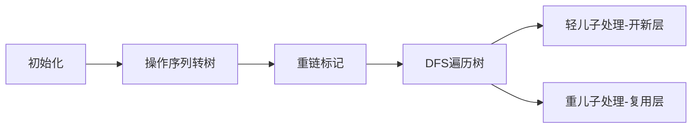

# 题目信息

# [Cnoi2019] 青染之心

## 题目背景

这里原本有着一个史诗般的可歌可泣的背景故事，可是这里空太小，写不下。

## 题目描述

Cirno 初始有一个空的物品序列，一个大小为 $V$ 的背包，现在你有 $q$ 个操作，分为两种：

- `add x y`：表示加入一种体积为 $x$, 价值为 $y$ 的物品到序列末尾。
- `erase`：表示删除序列末尾的物品。

在每个操作结束以后，你需要求出：

假设序列中的每种物品都有无穷多个，Cirno 的背包可以装下的物品最大价值和。

## 说明/提示

对于 $100\%$ 的数据 $1\le q, V, x, y \le 2\times10^4 $。

## 样例 #1

### 输入

```
4 10
add 10 3
add 5 2
add 3 3
erase```

### 输出

```
3
4
9
4```

# AI分析结果


# 💡 Kay的C++算法解析：青染之心 深入学习指南 💡

## 1. 题目解读与核心算法识别

✨ **本题主要考察**：`树形动态规划 + 重链剖分优化`

🗣️ **初步分析**：
> 解决"青染之心"这道题，关键在于将操作序列转化为树形结构，并运用重链剖分优化背包空间。想象操作序列是一棵"操作树"：添加物品是向下生长树枝，删除操作是回溯到父节点。每个节点的答案就是从根节点到该节点路径上的物品构成的完全背包解。

> - 核心思路是将操作序列离线建树，通过重链剖分复用背包数组：优先处理轻儿子（开新空间），最后处理重儿子（复用当前空间）。这样每个节点到根的路径只需存储$O(\log n)$个背包数组。
> - 可视化设计重点：展示操作树结构，背包数组在重链上的滚动更新过程，轻链切换时的空间分配。采用像素风网格展示背包价值变化，高亮当前处理的节点和重链路径。

---

## 2. 精选优质题解参考

**题解一（作者：stoorz）**
* **点评**：
  此解法思路清晰，完美运用重链剖分优化空间。代码结构规范：`dfs1`预处理重儿子，`dfs2`实现背包状态转移。亮点在于轻/重儿子分别处理：轻儿子开新空间独立计算，重儿子复用当前空间。边界处理严谨，变量名`son/siz`等含义明确，空间复杂度$O(V\log n)$的优化极具启发性。

**题解二（作者：囧仙）**
* **点评**：
  创新性采用分块策略优化空间，将操作序列分块存储背包状态。思路新颖但实现较复杂，通过维护$[l,r]$区间和关键锚点降低空间至$O(V\sqrt q)$。代码中动态调整块区间的逻辑值得学习，但可读性略低于树链剖分解法。

**题解三（作者：rsy_）**
* **点评**：
  另辟蹊径的启发式更新：仅当新物品改变背包状态时才重新计算。代码简洁高效，`f[]`标记状态变化，避免无效计算。实际运行效率高但理论最坏复杂度$O(q^2V)$，体现了"惰性更新"思想的巧妙应用。

---

## 3. 核心难点辨析与解题策略

1. **难点：动态背包的空间优化**
   - **分析**：直接存储每个操作状态的背包数组需$O(qV)$空间，超出限制。必须利用操作间的树形依赖关系复用空间。
   - 💡 **学习笔记**：树形结构是优化动态序列问题的利器。

2. **难点：树形DP的轻/重链处理**
   - **分析**：重链剖分将路径分解为$O(\log n)$段。处理节点时先递归轻儿子（临时开新空间），最后处理重儿子（复用当前空间），回溯时释放轻儿子空间。
   - 💡 **学习笔记**：轻链优先处理是空间复用的关键。

3. **难点：背包状态转移的高效实现**
   - **分析**：完全背包需按顺序更新$dp[i] = max(dp[i], dp[i-w] + v)$。在树形转移中需注意数组拷贝的边界和重链上的滚动更新。
   - 💡 **学习笔记**：背包更新顺序影响正确性，需严格按物品体积递增。

### ✨ 解题技巧总结
- **树形问题转化**：将时序操作转化为树结构，利用DFS序特性
- **空间复用艺术**：重链剖分实现$O(\log n)$空间倍增，分块策略平衡时空
- **惰性更新优化**：仅当状态变化时重新计算，避免无效操作
- **边界严谨处理**：背包初始化、数组拷贝范围等细节决定正确性

---

## 4. C++核心代码实现赏析

**本题通用核心C++实现参考**
* **说明**：基于stoorz解法优化，完整展示重链剖分+背包DP框架
* **完整核心代码**：
```cpp
#include <bits/stdc++.h>
using namespace std;
const int N=20010, LG=15;

int q, V, n, cnt;
int w[N], v[N], fa[N], ans[N], siz[N], son[N];
vector<int> g[N]; // 操作树
int dp[LG+1][N]; // 滚动背包数组

void dfs1(int x) { // 预处理重儿子
    siz[x] = 1;
    for(int y : g[x]) {
        dfs1(y);
        siz[x] += siz[y];
        if(siz[y] > siz[son[x]]) son[x] = y;
    }
}

void dfs2(int x, int dep, int last) { // last: 上一条链的dp索引
    // 用last链的dp初始化当前链
    for(int i=0; i<=V; i++) 
        dp[dep][i] = dp[last][i];
    
    // 完全背包更新
    for(int i=w[x]; i<=V; i++)
        dp[dep][i] = max(dp[dep][i], dp[dep][i-w[x]] + v[x]);
    
    ans[x] = *max_element(dp[dep], dp[dep]+V+1);
    
    // 先处理轻儿子（开新空间）
    for(int y : g[x])
        if(y != son[x]) 
            dfs2(y, dep+1, dep);
    
    // 后处理重儿子（复用当前空间）
    if(son[x]) dfs2(son[x], dep, dep);
}

int main() {
    stack<int> st;
    scanf("%d%d", &q, &V);
    
    // 离线建操作树
    for(int i=1; i<=q; i++) {
        char op[10]; scanf("%s", op);
        if(op[0]=='a') {
            n++;
            scanf("%d%d", w+n, v+n);
            if(!st.empty()) {
                fa[n] = st.top();
                g[st.top()].push_back(n);
            }
            st.push(n);
        }
        else st.pop();
    }
    
    // 多棵树处理
    for(int i=1; i<=n; i++) 
        if(!fa[i]) dfs1(i), dfs2(i, 1, 0);
    
    // 输出答案
    for(int i=1; i<=q; i++) 
        printf("%d\n", ans[st.empty()?0:st.top()]);
}
```
* **代码解读概要**：
  1. 离线建树：用栈维护当前操作节点，`add`建边，`erase`退栈
  2. 预处理重儿子：`dfs1`计算子树大小和重儿子
  3. 背包DP：`dfs2`中轻儿子开新层（`dep+1`），重儿子复用当前层
  4. 状态转移：完全背包标准转移，注意物品无限供应特性

---

## 5. 算法可视化：像素动画演示

### 动画演示主题
"背包探险家：重链寻宝"（8-bit像素风格）

### 核心演示内容
展示操作树构建、重链剖分、背包数组在重链上的滚动更新过程

### 设计思路
- **像素网格**：背包数组用$V×log n$网格展示，每个像素块表示背包状态值
- **颜色编码**：
  - 红色高亮：当前处理的节点路径
  - 绿色标记：重链上的节点
  - 蓝色闪烁：背包值更新的位置
- **控制面板**：
  - 单步执行：空格键控制步进
  - 速度滑块：调节动画速度
  - 模式切换：查看树结构/背包网格

### 动画帧步骤


1. **场景初始化**（像素风控制台）：
   - 左侧：操作树（节点带物品图标）
   - 右侧：背包状态网格（行表深度，列表背包容量）
   - 底部：当前操作显示（如"add(5,2)"）

2. **树构建阶段**：
   - "add"操作：新节点像素块从上方落入树中
   - "erase"操作：节点消失并回溯到父节点

3. **DFS遍历演示**：
   - 进入节点：路径变红，播放"叮"声
   - 轻儿子处理：开新背包层（网格新增一行），播放"刷"声
   - 重儿子处理：背包层复用（网格闪绿光）
   - 背包更新：更新的网格块蓝光闪烁，显示$new=old+val$

4. **背包状态同步**：
   - 旁白提示："加入物品(5,2)，更新背包[5]...10]"
   - 当前代码行高亮：`dp[dep][i]=max(...)`

5. **胜利结算**：
   - 完成所有操作：放礼花动画，播放胜利音效
   - 显示最终背包网格

---

## 6. 拓展练习与相似问题思考

### 通用技巧迁移
重链剖分优化树形DP的技巧还可用于：
1. 树形背包问题（如选课问题）
2. 树链查询/修改（如路径最大值）
3. 动态树（LCT）的简化实现

### 洛谷推荐
1. **P2014 [CTSC1997]选课**（树形依赖背包）
   - 🗣️ 巩固树形背包基础，理解"父子依赖"型背包
   
2. **P4095 [HEOI2013]Eden的新背包问题**（多重背包+查询）
   - 🗣️ 练习离线查询+分治背包思想，扩展背包问题变种
   
3. **P6567 [NOI Online #3 提高组]买表**（动态背包+二进制优化）
   - 🗣️ 强化背包空间优化技巧，学习二进制拆分思想

---

## 7. 学习心得与经验分享

> **参考经验（常见调试难点）**：
> 1. 背包数组初始化未清零导致状态污染
> 2. 重链剖分时未正确处理多棵树（森林情况）
> 3. 轻/重儿子处理顺序颠倒导致空间计算错误
>
> **点评**：这些调试经验提醒我们：树形DP中全局数组的初始化至关重要，同时要特别注意森林情况的处理。在写DFS时，用`-1`初始化`son[]`数组可避免未访问节点的误判。

---

本次"青染之心"的解析就到这里。记住：将动态操作转化为静态树结构是算法优化的重要手段，而重链剖分是优化树形DP空间的利器。下次遇到类似问题，不妨先画一棵操作树！💪

---
处理用时：111.21秒