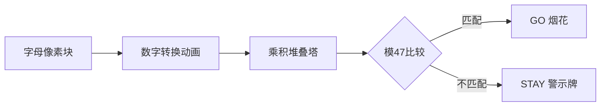

# 题目信息

# [USACO1.1] 你的飞碟在这儿 Your Ride Is Here

## 题目描述

众所周知，在每一个彗星后都有一只 UFO。这些 UFO 时常来收集地球上的忠诚支持者。不幸的是，他们的飞碟每次出行都只能带上一组支持者。因此，他们要用一种聪明的方案让这些小组提前知道谁会被彗星带走。他们为每个彗星起了一个名字，通过这些名字来决定这个小组是不是被带走的那个特定的小组（你认为是谁给这些彗星取的名字呢？）。关于如何搭配的细节会在下面告诉你；你的任务是写一个程序，通过小组名和彗星名来决定这个小组是否能被那颗彗星后面的 UFO 带走。


小组名和彗星名都以下列方式转换成一个数字：最终的数字就是名字中所有字母的积，其中 $\texttt A$ 是 $1$，$\texttt Z$ 是 $26$。例如，$\texttt{USACO}$ 小组就是 $21 \times 19 \times 1 \times 3 \times 15=17955$。如果小组的数字 $\bmod 47$ 等于彗星的数字 $\bmod 47$,你就得告诉这个小组需要准备好被带走！（记住“$a \bmod b$”是 $a$ 除以 $b$ 的余数，例如 $34 \bmod 10$ 等于 $4$）


写出一个程序，读入彗星名和小组名并算出用上面的方案能否将两个名字搭配起来，如果能搭配，就输出 `GO`，否则输出 `STAY`。小组名和彗星名均是没有空格或标点的一串大写字母（不超过 $6$ 个字母）。


## 说明/提示

题目翻译来自 NOCOW。

USACO Training Section 1.1


## 样例 #1

### 输入

```
COMETQ
HVNGAT```

### 输出

```
GO```

## 样例 #2

### 输入

```
ABSTAR
USACO```

### 输出

```
STAY```

# AI分析结果


### 📊 Kay的C++算法分析报告：USACO1.1 你的飞碟在这儿  

---

## 1. 题目解读与核心算法识别  
✨ **本题主要考察**：`编程技巧应用`（字符串处理与模运算）  

🗣️ **初步分析**：  
> 解决本题如同在玩一场**字母密码锁游戏**：每个字母对应一个数字（A=1, B=2...），名字的“密码”是所有字母数字的乘积。关键是通过“密码锁”（模47运算）验证彗星与小组的密码是否匹配。  
> - **核心流程**：  
>   1. 遍历字符串，将字母转为数字（ASCII技巧）  
>   2. 累乘所有数字（注意初始化值为1！）  
>   3. 对乘积取模47并比较结果  
> - **可视化设计**：采用**8位像素解密游戏**风格：  
>   - 字母转为数字时显示像素动画（如'A'→`1`方块）  
>   - 累乘过程用堆叠的像素方块表示乘积增长  
>   - 比较结果时：匹配则放烟花（GO），不匹配则显示"STAY"像素警示牌  
>   - 音效：字母转换→电子音，匹配→胜利音效，不匹配→错误提示音  

---

## 2. 精选优质题解参考  
**题解一 (Vanyun)**  
* **亮点**：  
  - **ASCII巧算**：用`字母-'@'`代替`字母-'A'+1`（@的ASCII=64），减少计算步骤  
  - **边界严谨**：强调乘积初始化必须为1（避免归零陷阱）  
  - **代码简洁**：直接遍历字符串，逻辑清晰无冗余  

**题解二 (DrinkOnstage)**  
* **亮点**：  
  - **流式处理**：用`cin.get()`逐字符读取，避免存储整个字符串  
  - **空间优化**：仅用两个变量动态计算，内存效率极高  
  - **循环控制**：以换行符`\n`为终止条件，适配任意输入格式  

**题解三 (Carl__2015)**  
* **亮点**：  
  - **模块化设计**：封装字母转换函数`turn()`，增强可读性  
  - **工程实践**：添加`ios::sync_with_stdio(false)`加速IO流  
  - **三目运算符**：用`(a%47==b%47)? "GO":"STAY"`简化输出逻辑  

---

## 3. 核心难点辨析与解题策略  
1. **难点1：字母转换陷阱**  
   * **分析**：字母转数字需精确对应（A=1, Z=26）。易错点：  
     - 误用ASCII值直接计算（如'A'=65未减偏移量）  
     - 混淆大小写（题目要求大写，但代码未验证）  
   * 💡 **学习笔记**：统一用`字符-'A'+1`或`字符-'@'`确保精确映射  

2. **难点2：乘积初始化归零**  
   * **分析**：累乘变量初始值=0会导致结果恒为0。优质题解均强调初始化为1  
   * 💡 **学习笔记**：乘法累积变量必须从1开始！  

3. **难点3：输入流控制**  
   * **分析**：多数字符串输入需明确终止条件（换行符/空格）。  
     - 题解2用`\n`判断更鲁棒  
     - 题解1/3假设无空格，需前置验证  
   * 💡 **学习笔记**：根据输入格式选择`cin>>`或`cin.get()`  

### ✨ 解题技巧总结  
- **技巧1：ASCII数学化** – 用字符运算代替`if-else`判断字母序号  
- **技巧2：动态累积** – 遍历中即时计算乘积，避免额外存储  
- **技巧3：模运算等效性** – `(a*b)%47 == (a%47)*(b%47)%47`，可防溢出  

---

## 4. C++核心代码实现赏析  
**通用核心实现**  
```cpp
#include <iostream>
#include <string>
using namespace std;

int main() {
    string s1, s2;
    cin >> s1 >> s2;
    long p1 = 1, p2 = 1; // 必须初始化为1!

    for (char c : s1) p1 *= c - 'A' + 1;
    for (char c : s2) p2 *= c - 'A' + 1;
    
    cout << (p1 % 47 == p2 % 47 ? "GO" : "STAY");
    return 0;
}
```
**代码解读概要**：  
1. 读入两个字符串  
2. 遍历每个字符，计算字母序号并累乘  
3. 取模后比较输出结果  

---  
**题解一核心片段**  
```cpp
for(int i=0; i<a.length(); i++) 
    ans *= a[i] - '@';  // '@'=64 → 'A'=1
```
* **亮点**：ASCII偏移妙用  
* **学习笔记**：`@`是A的前一字符，减它等效`-'A'+1`  

**题解二核心片段**  
```cpp
while((v=cin.get()) != '\n') 
    a *= v - 'A' + 1;
```
* **亮点**：流式处理节省内存  
* **学习笔记**：`cin.get()`可读取空格/换行符  

**题解三核心片段**  
```cpp
int turn(char c){ 
    return c-'A'+1;  // 封装转换逻辑
}
```
* **亮点**：函数封装提升可读性  
* **学习笔记**：重复逻辑应封装为函数  

---

## 5. 算法可视化：像素动画演示  
**主题**：**《UFO密码破译：8位像素任务》**  
**核心流程**：  


**交互设计**：  
1. **像素艺术**：  
   - 字母显示为16x16像素方块（A=红色，Z=紫色）  
   - 乘积值用堆叠的黄金方块表示  
2. **动态效果**：  
   - 字母转换：方块旋转显示数字（伴随"滴"声）  
   - 乘积增长：新方块从顶部降落堆叠（"咔嚓"声）  
3. **游戏化元素**：  
   - **音效**：匹配→8-bit胜利音乐，不匹配→低沉错误音  
   - **关卡制**：每对名字为1关，连续3关成功解锁"UFO皮肤"  
4. **调试模式**：  
   - 暂停时可查看每个字母的转换值  
   - 单步执行时高亮当前计算位置  

---

## 6. 拓展练习与相似问题  
**技巧迁移场景**：  
1. 单词权重计算（如哈希预处理）  
2. 自定义校验码生成（如产品防伪码）  
3. 字符串相似度比较（需调整计算规则）  

**洛谷推荐**：  
1. **P1308 统计单词数** – 巩固字符串遍历与匹配  
2. **P1598 垂直柱状图** – 进阶ASCII字符频率统计  
3. **P1075 质因数分解** – 强化模运算与数学思维  

---

## 7. 学习心得与经验分享  
> **参考经验 (Vanyun)**：  
> “初始化乘积=1是关键！我最初设为0，结果永远输出STAY...”  
>  
> **Kay点评**：  
> 这是典型**变量初始化陷阱**！累积操作必须注意初始值：  
> - 加法初始0 → `sum=0`  
> - 乘法初始1 → `product=1`  
> 调试时**先验核心变量初始值**可节省大量时间！  

---

**结语**：通过本题我们掌握了字符串转换与模运算的核心技巧！记住：编程如解密，细节决定成败。下次当你看到字母时，试着在脑中计算它的“密码值”吧！🚀

---
处理用时：92.17秒