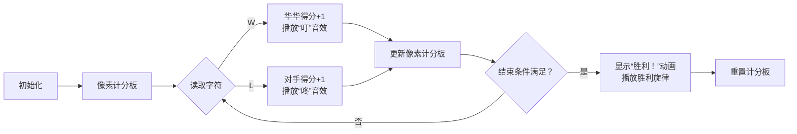

# 题目信息

# [NOIP 2003 普及组] 乒乓球

## 题目背景

国际乒联现在主席沙拉拉自从上任以来就立志于推行一系列改革，以推动乒乓球运动在全球的普及。其中 $11$ 分制改革引起了很大的争议，有一部分球员因为无法适应新规则只能选择退役。华华就是其中一位，他退役之后走上了乒乓球研究工作，意图弄明白 $11$ 分制和 $21$ 分制对选手的不同影响。在开展他的研究之前，他首先需要对他多年比赛的统计数据进行一些分析，所以需要你的帮忙。

## 题目描述

华华通过以下方式进行分析，首先将比赛每个球的胜负列成一张表，然后分别计算在 $11$ 分制和 $21$ 分制下，双方的比赛结果（截至记录末尾）。

比如现在有这么一份记录，（其中 $\texttt W$ 表示华华获得一分，$\texttt L$ 表示华华对手获得一分）：

$$\texttt{WWWWWWWWWWWWWWWWWWWWWWLW}$$

在 $11$ 分制下，此时比赛的结果是华华第一局 $11$ 比 $0$ 获胜，第二局 $11$ 比 $0$ 获胜，正在进行第三局，当前比分 $1$ 比 $1$。而在 $21$ 分制下，此时比赛结果是华华第一局 $21$ 比 $0$ 获胜，正在进行第二局，比分 $2$ 比 $1$。如果一局比赛刚开始，则此时比分为 $0$ 比 $0$。直到分差大于或者等于 $2$，才一局结束。

**注意：当一局比赛结束后，下一局立刻开始**。

你的程序就是要对于一系列比赛信息的输入（$\texttt{WL}$ 形式），输出正确的结果。


## 说明/提示

每行至多 $25$ 个字母，最多有 $2500$ 行。

（注：事实上有一个测试点有 $2501$ 行数据。）

**【题目来源】**

NOIP 2003 普及组第一题

## 样例 #1

### 输入

```
WWWWWWWWWWWWWWWWWWWW
WWLWE
```

### 输出

```
11:0
11:0
1:1

21:0
2:1
```

# AI分析结果


### 💡 Kay的C++算法解析：乒乓球 深入学习指南 💡

#### 题目解读与核心算法识别
✨ **本题主要考察**：`模拟应用`  
🗣️ **初步分析**：
> 解决"乒乓球"题目的核心在于**模拟计分过程**。就像乒乓球比赛中的计分板，每次得分都需要更新比分，并在特定条件下结束当前局。  
> - 所有题解都采用**双计数器策略**（记录双方得分），核心难点在于正确处理**局结束条件**（分差≥2且一方达分制要求）和**多行输入处理**
> - 可视化设计重点：用像素风格展示比分板动态变化，高亮触发局结束的关键得分。采用8位机音效（得分"叮"声，局结束胜利旋律），通过控制面板实现步进/调速功能

---

#### 精选优质题解参考
**题解一（来源：DengDuck）**  
* **点评**：思路清晰直击本质，创新性使用函数封装分制逻辑（`Work(int Lim)`）避免代码重复。变量命名简洁（`A/B`计数器），利用`max()`和`abs()`优雅处理结束条件。特别亮点是将11/21分制统一处理，大幅提升代码复用性，竞赛实践价值极高。

**题解二（来源：qhr2023）**  
* **点评**：代码极度精简（仅15行核心逻辑），巧妙使用三目运算符`i=='W'?a++:b++`处理得分。输入处理稳健（`while(cin>>c)`兼容多行），结束条件判断与题解一同水平。虽然缺少函数封装，但超短代码对初学者理解基础模拟非常友好。

**题解三（来源：__assassin_）**  
* **点评**：逐步推导思路对新手友好，详细注释每个操作意图。严格处理边界（遇到`E`时`i--`修正下标），显式输出未完成局比分。虽未用函数封装导致重复代码，但分步骤的裸实现更易理解底层逻辑。

---

### 核心难点辨析与解题策略
1. **难点1：局结束条件判定**  
   * **分析**：必须同时满足`max(score)≥分制值`和`|scoreA-scoreB|≥2`。优质解用`max()`取高分方，`abs()`计算分差，例如：`if(max(A,B)>=11 && abs(A-B)>=2)`
   * 💡 **学习笔记**：**绝对差分**是竞技计分模拟的核心条件！

2. **难点2：输入流的多行处理**  
   * **分析**：所有题解采用`while(cin>>ch)`持续读入，遇`E`终止。DengDuck用`string`存储，qhr2023直接操作字符数组，本质都是**跨行拼接完整序列**
   * 💡 **学习笔记**：`cin`在无输入时返回`0`的特性是处理不定长输入的关键

3. **难点3：状态重置与未完成局输出**  
   * **分析**：每次输出完胜局后必须`A=B=0`重置计数器！遍历结束需额外输出未达结束条件的比分（易遗漏点）
   * 💡 **学习笔记**：模拟类问题**终态输出**常是隐藏考察点

#### ✨ 解题技巧总结
- **函数封装复用逻辑**：如DengDuck的`Work(lim)`函数，避免11/21分制重复编码
- **标准库高效工具**：`max()`/`abs()`替代手写条件判断，提升可读性
- **边界鲁棒性测试**：特别注意`E`出现在比赛中的情况（如题解显式`break`）

---

### C++核心代码实现赏析
**通用核心实现**  
```cpp
#include<bits/stdc++.h>
using namespace std;

void simulate(int limit, string& S) {
    int A = 0, B = 0;
    for (char ch : S) {
        if (ch == 'W') A++;
        else if (ch == 'L') B++;
        
        if ((A >= limit || B >= limit) && abs(A - B) >= 2) {
            cout << A << ":" << B << endl;
            A = B = 0; // 重置计分板
        }
    }
    cout << A << ":" << B << endl; // 输出未完成局
}

int main() {
    string S;
    char ch;
    while (cin >> ch && ch != 'E') S += ch;
    
    simulate(11, S); 
    cout << endl;
    simulate(21, S);
    return 0;
}
```

**代码解读概要**：  
> 1. 循环读入字符构建完整比赛序列`S`  
> 2. `simulate()`函数封装核心逻辑：遍历序列更新比分，当满足`分制+分差条件`时输出并重置  
> 3. 两次调用分别处理11/21分制，用空行分隔结果  

---

**题解一片段赏析**  
```cpp
void Work(int Lim) {
    for(char i:S) {
        if(i=='W') A++;
        if(i=='L') B++;
        if(max(A,B)>=Lim && abs(A-B)>=2) {
            cout<<A<<":"<<B<<endl;
            A=0,B=0;   // 亮点：简洁的状态重置
        }
    }
    printf("%d:%d\n\n",A,B); // 学习：显式输出终态
}
```
> **代码解读**：  
> - `max(A,B)>=Lim` 取代冗长的`(A>=Lim||B>=Lim)`  
> - 重置计数器在输出后立即执行，确保状态干净  
> 💡 **学习笔记**：**重置时机**直接影响模拟正确性  

---

### 算法可视化：像素动画演示  
**主题**：8-bit乒乓球计分大师  
**核心演示**：实时比分变化与局结束触发动画  

**设计实现**：  


**关键交互**：  
1. **像素元素**：  
   - 绿色方块：华华得分  
   - 红色方块：对手得分  
   - 金色边框：触发局结束的关键球  
2. **音效系统**：  
   - 得分：8-bit短促"叮/咚"  
   - 局结束：16-bit胜利旋律  
3. **控制面板**：  
   - 步进/自动模式切换  
   - 速度滑块(1x-5x)  
   - 11/21分制快速切换  

**教学价值**：通过像素动画直观展示**分差累积**和**阈值触发**机制，游戏化设计降低理解门槛

---

### 拓展练习与相似问题思考
1. **P1328 [NOIP2014] 生活大爆炸版石头剪刀布**  
   → 同款计分模拟，增加手势规则映射  
2. **P1563 [NOIP2016] 玩具谜题**  
   → 方向性状态模拟训练  
3. **P1055 [NOIP2006] ISBN号码**  
   → 字符串解析+验证码模拟  

**洛谷推荐**：  
1. **P1328**：巩固带规则的状态模拟  
2. **P2670 [NOIP2015] 扫雷游戏**：二维网格模拟经典  
3. **P1067 [NOIP2009] 多项式输出**：边界条件处理特训  

---

### 学习心得与经验分享
> **经验摘录**：  
> "我在处理未完成局输出时漏掉重置，导致最后比分叠加错误" — DengDuck调试笔记  
> **Kay点评**：  
> 模拟类问题的**状态生命周期管理**是核心！牢记"重置三原则"：  
> 1. 条件触发后立即重置  
> 2. 终态必须独立输出  
> 3. 新循环开始前清零遗留状态  

---

通过本次分析，我们深入掌握了竞技类模拟问题的解决范式。记住：**清晰的状态机设计+严谨的边界处理=AC的基石**！下次遇到类似问题，不妨先画状态转移图哦！ 🏓✨

---
处理用时：106.59秒