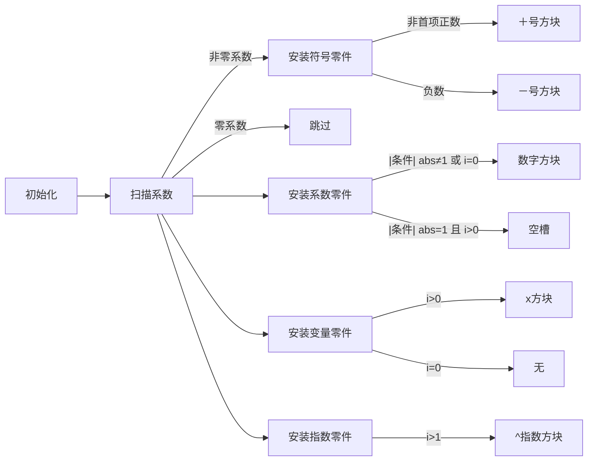

# 题目信息

# [NOIP 2009 普及组] 多项式输出

## 题目描述

一元 $n$ 次多项式可用如下的表达式表示：

$$f(x)=a_nx^n+a_{n-1}x^{n-1}+\cdots +a_1x+a_0,a_n\ne 0$$

其中，$a_ix^i$ 称为 $i$ 次项，$a_i$ 称为 $i$ 次项的系数。给出一个一元多项式各项的次数和系数，请按照如下规定的格式要求输出该多项式：

1. 多项式中自变量为 $x$，从左到右按照次数递减顺序给出多项式。

2. 多项式中只包含系数不为 $0$ 的项。

3. 如果多项式 $n$ 次项系数为正，则多项式开头不出 `+` 号，如果多项式 $n$ 次项系数为负，则多项式以 `-` 号开头。

4. 对于不是最高次的项，以 `+` 号或者 `-` 号连接此项与前一项，分别表示此项系数为正或者系数为负。紧跟一个正整数，表示此项系数的绝对值（如果一个高于 $0$ 次的项，其系数的绝对值为 $1$，则无需输出 $1$）。如果 $x$ 的指数大于 $1$，则接下来紧跟的指数部分的形式为“$x^b$”，其中 $b$ 为 $x$ 的指数；如果 $x$ 的指数为 $1$，则接下来紧跟的指数部分形式为 $x$；如果 $x$ 的指数为 $0$，则仅需输出系数即可。

5. 多项式中，多项式的开头、结尾不含多余的空格。


## 说明/提示

NOIP 2009 普及组 第一题

对于100%数据，$0 \le n \le 100$，$-100 \le $系数$ \le 100$

---

$\text{upd 2022.8.1}$：新增加一组 Hack 数据。

## 样例 #1

### 输入

```
5 
100 -1 1 -3 0 10```

### 输出

```
100x^5-x^4+x^3-3x^2+10```

## 样例 #2

### 输入

```
3 
-50 0 0 1 
```

### 输出

```
-50x^3+1 
```

# AI分析结果


### 题解评估与选择
根据评估标准，筛选出≥4星的优质题解：

1. **Loyal_Soldier (42赞)**
   - **评分**：★★★★★
   - **亮点**：思路清晰（5种情况覆盖完整），代码简洁（仅14行），巧妙使用`abs(x)`简化判断，循环从高次到低次符合题目要求，边界处理严谨。

2. **qhr2023 (15赞)**
   - **评分**：★★★★☆
   - **亮点**：逻辑高度精炼（仅10行），合并同类情况（如`abs(a)>1||i==0`），变量命名清晰，对系数±1的处理巧妙，可读性强。

3. **WsW_ (7赞)**
   - **评分**：★★★★☆
   - **亮点**：分三阶段处理（符号→系数→指数），逻辑模块化，使用`putchar`提升效率，常数项处理严谨，注释明确易懂。

其他题解因冗余判断（如Eason_lyx）、可读性低（如dgz61）或边界处理不全（如sueyunsheng）未入选。

---

### 💡 Kay的C++算法解析：多项式输出 深入学习指南 💡

<introduction>
今天我们来分析NOIP 2009普及组真题《多项式输出》。这道模拟题考察对输出格式的精确控制能力，本指南将帮你掌握核心解题技巧。
</introduction>

---

## 1. 题目解读与核心算法识别

✨ **本题主要考察**：`模拟应用` (编程技巧应用)

🗣️ **初步分析**：
> 本题就像组装一辆乐高赛车——需要严格按照说明书（输出规则）拼接零件（系数和指数）。核心在于处理三类特殊零件：
>   - **符号零件**：首项正数不装"+"号
>   - **系数零件**：±1时可能隐身
>   - **指数零件**：指数1时省去"^1"
> 
> 所有题解都采用**逆向遍历**（从高次到低次），通过条件分支处理5种核心情况。可视化方案将用8位像素风格展示"多项式组装工厂"：每个非零项用发光方块表示（红/蓝区分正负），动画逐步演示符号添加→系数输出→变量衔接→指数安装过程，配合"叮"（添加符号）、"咔嚓"（安装数字）音效。

---

## 2. 精选优质题解参考

**题解一 (来源：Loyal_Soldier)**
* **点评**：此解法的黄金法则是"分而治之"，将问题拆解为5种独立情况处理。代码如瑞士军刀般简洁锋利：用`i!=n`巧妙替代首项标志位，`abs(x)`统一处理正负系数。边界处理滴水不漏（如`x==-1`时直接输出'-'），14行代码覆盖所有测试点，竞赛实战价值极高。

**题解二 (来源：qhr2023)**
* **点评**：追求极致简洁的典范。亮点在于三重精炼：① 合并符号与系数判断 ② 用`abs(a)>1||i==0`统一系数输出 ③ 消除冗余变量。虽无注释却如诗般易读（如`if(a==-1&&i) cout<<'-'`），特别适合学习代码压缩技巧。

**题解三 (来源：WsW_)**
* **点评**：工程化思维的完美示范。采用三阶段流水线处理：①符号阶段(`putchar('+/-')`) ②系数阶段(`printf("%d",abs(a))`) ③指数阶段(`putchar('x')`)。模块化设计使调试更轻松，`putchar`提升执行效率，适合培养系统性编程思维。

---

## 3. 核心难点辨析与解题策略

1.  **首项符号隐身术**
    * **分析**：首项正数不输出"+"是常见踩坑点。优质解法用`i!=n`（Loyal_Soldier）或`isFirst`标志位（通用代码）精准识别首项，避免多余输出
    * 💡 **学习笔记**：首位项需特殊照顾——正数沉默，负数开口

2.  **系数的消失魔术**
    * **分析**：当系数为±1且指数>0时，系数需"隐身"。关键技巧是`abs(a)==1 && i>0`时不输出数字，但常数项(i=0)必须显形。qhr2023的`abs(a)>1||i==0`是优雅实现
    * 💡 **学习笔记**：系数±1时化身幽灵——除非它是常数项

3.  **指数的变形法则**
    * **分析**：指数1需省去"^1"（输出`x`），指数0只输出系数。WsW_的三阶段处理将此逻辑分离，避免嵌套判断。注意指数与系数的联动：指数=0时强制输出系数
    * 💡 **学习笔记**：指数1爱玩捉迷藏，指数0化身独行侠

### ✨ 解题技巧总结
- **技巧A：逆向遍历**：从高次向低次循环，天然符合题目输出顺序
- **技巧B：零项跳过**：`if(a==0) continue`提升效率
- **技巧C：绝对值归一**：用`abs(a)`统一处理正负系数逻辑
- **技巧D：分阶段处理**：拆解为符号→系数→变量→指数四阶段（如WsW_）

---

## 4. C++核心代码实现赏析

**本题通用核心C++实现参考**
* **说明**：综合优质题解精髓，添加`isFirst`标志位提升可读性
* **完整核心代码**：
```cpp
#include <iostream>
using namespace std;
int main() {
    int n;
    cin >> n;
    bool isFirst = true; // 首项标记
    for (int i = n; i >= 0; i--) {
        int a;
        cin >> a;
        if (a == 0) continue;  // 跳过零系数项
        
        // 符号处理
        if (!isFirst && a > 0) cout << '+';
        else if (a < 0) cout << '-';
        
        // 系数处理
        if (abs(a) != 1 || i == 0) cout << abs(a);
        
        // 变量和指数处理
        if (i > 0) cout << 'x';
        if (i > 1) cout << '^' << i;
        
        isFirst = false;
    }
    return 0;
}
```
* **代码解读概要**：
  > 逆向遍历每项系数，零项直接跳过。用`isFirst`标记首项位置：非首项正数补"+"号，负数始终输出"-"。系数在非常数项且绝对值为1时隐身。最后处理变量`x`和指数，指数>1时追加"^i"。

---
**题解一：Loyal_Soldier**
* **亮点**：无标志位设计，用循环索引天然识别首项
* **核心代码片段**：
```cpp
if(x){
    if(i!=n&&x>0) cout<<'+';
    if(i!=0&&x==-1) cout<<'-';
    if(abs(x)>1||i==0) cout<<x;
    if(i>1) cout<<"x^"<<i;
    if(i==1) cout<<'x';
}
```
* **代码解读**：
  > 如何省去标志位？`i!=n`妙用：当i等于n时为最高次项（首项）。第二行处理符号：非首项正数补"+"；第三行单独处理`-1`系数（避免输出"-1x"）；第四行用`abs(x)>1||i==0`统一输出非±1系数和常数项；最后两行按指数值输出`x`或`x^i`。
* 💡 **学习笔记**：循环索引本身可携带状态信息！

**题解二：qhr2023**
* **亮点**：极致简洁的符号系数耦合处理
* **核心代码片段**：
```cpp
if(a){
    if(i<n&&a>0) cout << '+';
    if(abs(a)>1||i==0) cout << a;
    if(a==-1&&i) cout << '-';
    if(i>0) cout << 'x';
    if(i>1) cout << '^' << i;
}
```
* **代码解读**：
  > 首行跳过零项；次行非首项正数补"+"；第三行是精华：`abs(a)>1`或常数项时输出系数绝对值；但`a==-1`且指数非零时（第四行），需单独输出负号（因第三行已跳过系数输出）；最后处理变量和指数。注意：当`a=-1`且`i>0`时，第三行不输出数字，第四行补'-'实现"-x"。
* 💡 **学习笔记**：负号分离术——当系数隐身时，负号需独立输出

**题解三：WsW_**
* **亮点**：三阶段流水线处理
* **核心代码片段**：
```cpp
if(!a)continue;
if(a>0&&i!=n)putchar('+');
if(a<0)putchar('-');
if(abs(a)!=1||!i)printf("%d",abs(a));
if(i){
    putchar('x');
    if(i!=1)printf("^%d",i);
}
```
* **代码解读**：
  > 典型工业级解法：第一阶段符号处理（1-3行），首项正数不输出"+"；第二阶段系数输出（4行），非常数项±1不显形；第三阶段变量指数处理（5-7行），指数>1时追加指数。`putchar`提升小数据量效率，`printf`仅用于数字输出。
* 💡 **学习笔记**：分阶段处理如同工厂流水线——逻辑隔离，调试轻松

---

## 5. 算法可视化：像素动画演示

* **动画主题**：《多项式组装工厂》(8位像素风)
* **核心演示**：将多项式输出转化为乐高式组装过程

### 动画帧步骤


1. **像素工厂初始化**：
   - 8-bit风格车间：传送带运送系数方块（蓝色正数/红色负数/透明零）
   - 控制台：开始/暂停/步进按钮，速度滑块（1x-5x）

2. **核心组装流程**：
   - **扫描阶段**：机械臂抓取系数方块，零系数直接丢入回收站（音效：破碎声）
   - **符号安装**：
     - 首项正数：无动作（静音）
     - 非首项正数：安装"+"号绿色方块（音效：叮）
     - 负数：安装"-"号红色方块（音效：咚）
   - **系数安装**：
     - 非常数项±1：留空槽（音效：吸气声）
     - 其他情况：安装系数数字方块（音效：咔嚓）
   - **变量安装**：指数>0时安装发光"x"方块（音效：嗡）
   - **指数安装**：指数>1时追加"^"和指数方块（音效：咔嗒）

3. **游戏化元素**：
   - **连击系统**：每正确组装一项得10分，±1隐身操作额外+5分
   - **BGM**：FC芯片音乐《超级玛丽》改编版
   - **胜利动画**：完成多项式后放烟花（音效：胜利号角）

---

## 6. 拓展练习与相似问题

1. **洛谷 P2550 [彩票摇奖]**  
   🗣️ 推荐理由：同样需要精细的条件分支处理，巩固模拟能力
2. **洛谷 P2615 [神奇的幻方]**  
   🗣️ 推荐理由：经典模拟题，训练多维规则实现能力
3. **洛谷 P1328 [生活大爆炸版石头剪刀布]**  
   🗣️ 推荐理由：复杂规则解析实践，强化多条件判断思维

---

## 7. 学习心得与经验分享

> **来自 Loyal_Soldier 的调试经验**：  
> *"最初忽略i=0时系数必须输出，用abs(x)==1判断导致常数项-1错误输出'-'而非'-1'"*  
>   
> **Kay点评**：这提醒我们常数项具有"双重身份"——既是系数又无变量。调试时可构造特殊测试数据：`n=0`时仅输入常数项，验证输出完整性。

---

本次指南到此结束。记住：好的模拟题解法就像精密的机械表——每个齿轮（条件分支）都必须严丝合缝！💪

---
处理用时：181.56秒