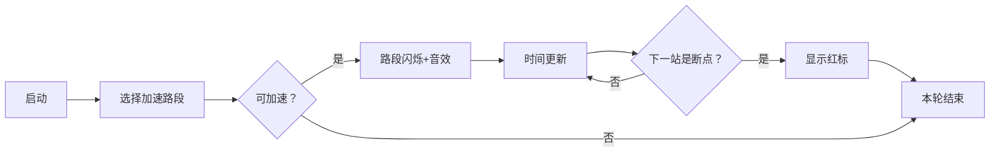

# 题目信息

# [NOIP 2011 提高组] 观光公交

## 题目背景

感谢 @Transhumanist 提供的一组 Hack 数据

## 题目描述

风景迷人的小城 Y 市，拥有 $n$ 个美丽的景点。由于慕名而来的游客越来越多，Y 市特意安排了一辆观光公交车，为游客提供更便捷的交通服务。观光公交车在第 $0$ 分钟出现在 $1$ 号景点，随后依次前往 $2,3,4,\cdots,n$ 号景点。从第 $i$ 号景点开到第 $i+1$ 号景点需要 $D_i$ 分钟。任意时刻，公交车只能往前开，或在景点处等待。

设共有 $m$ 个游客，每位游客需要乘车 $1$ 次从一个景点到达另一个景点，第 $i$ 位游客在 $T_i$ 分钟来到景点 $A_i$，希望乘车前往景点 $B_i$（$A_i<B_i$）。为了使所有乘客都能顺利到达目的地，公交车在每站都必须等待需要从该景点出发的所有乘客都上车后才能出发开往下一景点。

假设乘客上下车不需要时间。一个乘客的旅行时间，等于他到达目的地的时刻减去他来到出发地的时刻。因为只有一辆观光车，有时候还要停下来等其他乘客，乘客们纷纷抱怨旅行时间太长了。于是聪明的司机 ZZ 给公交车安装了 $k$ 个氮气加速器，每使用一个加速器，可以使其中一个 $D_i-1$。对于同一个 $D_i$ 可以重复使用加速器，但是必须保证使用后 $D_i\ge0$。

那么 ZZ 该如何安排使用加速器，才能使所有乘客的旅行时间总和最小？

## 说明/提示

**【输入输出样例说明】**

对 $D_2$ 使用 $2$ 个加速器，从 $2$ 号景点到 $3$ 号景点时间变为 $2$ 分钟。

公交车在第 $1$ 分钟从 $1$ 号景点出发，第 $2$ 分钟到达 $2$ 号景点，第 $5$ 分钟从 $2$ 号景点出发，第 $7$ 分钟到达 $3$ 号景点。

第 $1$ 个旅客旅行时间 $7-0=7$ 分钟。

第 $2$ 个旅客旅行时间 $2-1=1$ 分钟。

第 $3$ 个旅客旅行时间 $7-5=2$ 分钟。

总时间 $7+1+2=10$ 分钟。

**【数据范围】**

对于 $10\%$ 的数据，$k=0$。

对于 $20\%$ 的数据，$k=1$。

对于 $40\%$ 的数据，$2 \le n \le 50$，$1 \le m \le 10^3$，$0 \le k \le 20$，$0 \le D_i \le 10$，$0 \le T_i \le 500$。

对于 $60\%$ 的数据，$1 \le n \le 100$，$1 \le m \le 10^3$，$0 \le k \le 100$，$0 \le D_i \le 100$，$0 \le T_i \le 10^4$。

对于 $100\%$ 的数据，$1 \le n \le 10^3$，$1 \le m \le 10^4$，$0 \le k \le 10^5$，$0 \le D_i \le 100$，$0 \le T_i \le 10^5$。

## 样例 #1

### 输入

```
3 3 2
1 4
0 1 3
1 1 2
5 2 3```

### 输出

```
10
```

# AI分析结果


# 💡 Kay的C++算法解析：观光公交 深入学习指南 💡

**题目背景**  
风景迷人的小城Y市有n个景点，公交车依次往返于景点之间。每位乘客有固定出发时间和目的地，公交车必须等待每站最后一名乘客上车才能出发。司机有k个氮气加速器，每个可使某段路程时间减少1分钟。目标是**最小化所有乘客旅行时间总和**（到达目的地时间 - 到达出发地时间）。

## 1. 题目解读与核心算法识别

✨ **本题主要考察**：`贪心算法`

🗣️ **初步分析**：
> 解决"观光公交"的关键在于运用**贪心算法**。就像多米诺骨牌效应，每次在能影响最多乘客的路段使用加速器，产生连锁优化效果。核心思想是：每次选择能最大程度减少总旅行时间的路段进行加速，逐步逼近全局最优解。
> 
> - **核心难点**：加速效果具有传递性，但会被"车等人"的断点（到达时间 ≤ 乘客最晚到达时间）阻断。需要高效计算影响范围和收益。
> - **题解思路对比**：主流解法是贪心（简单高效），也有费用流建模（思维巧妙但复杂）和线段树优化贪心（高效但难实现）。
> - **可视化设计**：用像素动画展示公交车移动、时间线变化和加速影响传播。高亮：①加速路段闪烁；②受影响站点连锁更新（绿色高亮）；③断点出现（红色警示）。复古游戏风格增强趣味性，类似"像素巴士模拟器"。

---

## 2. 精选优质题解参考

**题解一：tth37 (贪心策略)**  
* **点评**：  
  思路清晰直白，通过图解分步演示贪心流程：先计算基础行程，再循环k次选择收益最大路段。代码规范（变量名`sta[i].off`表下车人数），边界处理严谨（`Dist[i-1]==0`跳过）。亮点在于用**双重循环精准定位影响区间**，逻辑如同"波浪传递"，遇到断点自动停止。实践价值高，可直接用于竞赛，是理解贪心思想的典范。

**题解二：CalvinJin (费用流建模)**  
* **点评**：  
  创新性地将加速器分配转化为**费用流问题**，展现高阶思维。通过拆点（i'和i"）巧妙限制影响范围，边费用体现乘客收益。代码中`add_edge`建图逻辑严谨，但复杂度较高（O(kn²)）。亮点在开拓性思维，虽实现较复杂，但为理解贪心本质提供新视角，适合进阶学习。

**题解三：lucario (线段树优化)**  
* **点评**：  
  针对大数据优化至O(n log n)，核心用**线段树动态维护最优加速位置**。代码实现较复杂，但`delay`数组和`welfare`前缀和的设计彰显算法深度。亮点在解决贪心瓶颈——快速定位最大收益区间，如同"雷达扫描锁定目标"。需注意边界处理（Dᵢ≥0），适合追求高效解的进阶学习者。

---

## 3. 核心难点辨析与解题策略

### 难点1：影响区间计算
**分析**：加速效果沿路线传播，直到出现"车等人"（公交车到达时间≤乘客最晚到达时间）。如tth37解法中，内层循环累加`tmp_num`时需检查`Arrive[j] ≤ Latest[j]`，一旦成立立即跳出。  
💡 **学习笔记**：影响区间是连续的，断点阻断传播！

### 难点2：贪心策略有效性
**分析**：需证明局部最优（单次加速收益最大）能导向全局最优。Hope2075题解用树形结构证明：每次选收益最大的未分割区间，最终效果等于最优的k个独立区间之和。  
💡 **学习笔记**：贪心选择必须具备无后效性，本题满足！

### 难点3：边界与优化
**分析**：加速后路段时间Dᵢ不能为负（Zyj6解法中`d[i]>0`检查）。多次加速时，lucario用线段树避免O(kn²)开销。  
💡 **学习笔记**：边界是贪心的护栏，优化是效率的引擎。

### ✨ 解题技巧总结
- **问题分解法**：将复杂行程分解为①基础时间计算 ②加速器分配 ③结果统计三阶段（tth37）  
- **等效建模法**：将物理问题转化为网络流模型（CalvinJin）  
- **实时更新法**：加速后立即连锁更新到达时间，并检测新断点（Onsin）  
- **数据结构加速**：用线段树/优先队列快速定位最优解（lucario）

---

## 4. C++核心代码实现赏析

**本题通用核心C++实现参考**  
* **说明**：综合自tth37和Zyj6的贪心解法，突出清晰性和完整性  
* **完整核心代码**：
```cpp
#include <iostream>
#include <vector>
#include <algorithm>
using namespace std;

struct Station { int arrive, latest, off; }; // 到达时间/乘客最晚时间/下车人数

int main() {
    int n, m, k;
    cin >> n >> m >> k;
    vector<int> D(n-1); // 路段耗时
    for (int i = 0; i < n-1; i++) cin >> D[i];
    
    vector<Station> sta(n+1);
    for (int i = 0; i < m; i++) {
        int t, a, b;
        cin >> t >> a >> b;
        sta[a].latest = max(sta[a].latest, t); // 更新最晚乘客时间
        sta[b].off++;                         // 记录下车人数
    }
    
    // 计算基础到达时间
    int time = 0;
    for (int i = 1; i <= n; i++) {
        sta[i].arrive = time;                  // 到达i站时间
        time = max(time, sta[i].latest);       // 等待最后乘客
        if (i < n) time += D[i-1];             // 驶向下一站
    }
    
    // 贪心使用加速器
    while (k--) {
        int max_reduce = 0, best_seg = 0;
        
        // 查找最优加速路段
        for (int i = 1; i < n; i++) {
            if (D[i-1] <= 0) continue;         // 跳过无法加速路段
            
            int reduce = 0;
            for (int j = i+1; j <= n; j++) {   // 计算影响区间
                reduce += sta[j].off;
                if (sta[j].arrive <= sta[j].latest) break; // 遇到断点停止
            }
            
            if (reduce > max_reduce) {
                max_reduce = reduce;
                best_seg = i;
            }
        }
        
        if (best_seg == 0) break; // 无加速空间
        
        D[best_seg-1]--; // 使用加速器
        // 连锁更新时间
        for (int j = best_seg+1; j <= n; j++) {
            sta[j].arrive--;
            if (sta[j].arrive < sta[j].latest) break; // 遇到新断点
        }
    }
    
    // 计算总旅行时间
    int total = 0;
    for (int i = 1; i <= n; i++) 
        total += sta[i].arrive * sta[i].off; // 到达时间*下车人数
    cout << total;
    return 0;
}
```
* **代码解读概要**：  
  1. **初始化**：读入路段时间和乘客数据  
  2. **基础行程**：模拟无加速时公交车行进（到站/等待/出发）  
  3. **加速优化**：循环k次，选影响乘客最多的路段加速  
  4. **连锁更新**：减少路段耗时，向后更新到站时间直至断点  
  5. **结果计算**：基于最终到站时间和下车人数统计总和

---

**题解一：tth37 (贪心)**  
* **亮点**：直观的双重循环实现贪心，完美展示影响区间传播  
* **核心代码片段**：
```cpp
for(int i=2; i<=n; i++) {
    if(!Dist[i-1]) continue;
    tmp_num = 0;
    for(int j=i; j<=n; j++) {
        tmp_num += sta[j].off;       // 累加影响乘客
        if(sta[j].arrive <= sta[j].latest) break; // 断点检测
    }
    if(tmp_num > max_num) { ... }    // 更新最优解
}
```
* **代码解读**：  
  > 外层遍历所有路段（i从2开始），内层从当前路段向后扫描：  
  > - `tmp_num += sta[j].off`：统计从j站下车乘客数  
  > - `if(sta[j].arrive <= sta[j].latest)`：遇到"车等人"则停止（影响中断）  
  > 如同波浪传播，内层循环计算一次加速在i-1路段产生的"影响力范围"  
* 💡 **学习笔记**：影响区间是贪心的核心，断点是边界卫士！

**题解二：CalvinJin (费用流)**  
* **亮点**：将加速器分配转化为网络流模型  
* **核心代码片段**：
```cpp
add_edge(S, S1, K, 0); // 源点->超源 (限制加速器总数)
for (int i = 1; i < n; i++) {
    add_edge(i, i+n, max(tim[i]-Mx[i],0), 0); // 拆点限制影响
    add_edge(i+n, i+1, INF, -down[i+1]);      // 影响传播及费用
    add_edge(S1, i+n, D[i], 0);               // 加速器分配
}
```
* **代码解读**：  
  > - `add_edge(i, i+n, ...)`：拆点控制加速影响（容量=可传递时长）  
  > - `add_edge(i+n, i+1, INF, -down[i+1])`：影响传递到下一站，费用为负下车人数（最小费用=最大减时）  
  > 建图完成即求最小费用流，收益=原总时-费用流结果  
* 💡 **学习笔记**：费用流是贪心的高维视角，边费用映射乘客收益！

**题解三：lucario (线段树优化)**  
* **亮点**：线段树加速最大收益区间查询  
* **核心代码片段**：
```cpp
while(k && !heap.empty()){
    segment now = heap.top(); heap.pop();
    int mind = INF, pos = 0;
    for(int i=now.l; i<now.r; i++)    // 找区间内最小delay
        if(delay[i] < mind) mind = delay[i], pos = i;
    // 二分确定加速量
    k -= use;
    heap.push(segment(now.l, pos));   // 分割左区间
    heap.push(segment(pos+1, now.r)); // 分割右区间
}
```
* **代码解读**：  
  > 1. 优先存储最大收益区间（`segment.people`=影响乘客数）  
  > 2. 在区间内找到`delay`最小点（瓶颈位置）  
  > 3. 二分加速量避免单步操作  
  > 4. 分割区间后重新入堆  
  > 线段树维护区间信息，避免O(n²)遍历！  
* 💡 **学习笔记**：线段树是贪心的"加速引擎"，用空间换时间！

---

## 5. 算法可视化：像素动画演示

**动画主题**：像素巴士环游记（复古FC风格）  

**核心演示内容**：  
- 公交车从左向右移动，站点用像素牌坊表示  
- 乘客像素头像在站点出现（显示等待时间）  
- 加速时路段闪烁黄光，耗时减少  
- 连锁更新：受影响站点绿色高亮，时间数字递减  
- 断点出现：红色停车标志+提示音  

**设计细节**：  


1. **场景设计**：
   - **背景**：横向卷轴，8-bit风格山水背景
   - **控制面板**：复古游戏按钮（开始/暂停/步进），速度滑块
   - **状态栏**：当前时间、加速器剩余、总旅行时间

2. **关键动画帧**：
   - **加速瞬间**：目标路段变黄闪烁，播放"嗖"音效
   - **时间更新**：受影响站点时间-1，绿色高亮+"叮"音效
   - **断点触发**：显示"车等人"红色图标，播放提示音

3. **游戏化元素**：
   - **关卡制**：每次完成k次加速为一关
   - **分数系统**：根据节省的时间计算得分
   - **音效设计**：
     - 加速：8-bit引擎轰鸣
     - 到站：经典FC"叮咚"
     - 断点：警示蜂鸣
   - **自动演示**：AI巴士自动运行，展示最优加速顺序

**技术实现**：Canvas绘制动画帧，时间轴同步伪代码高亮，Web Audio API播放音效。

---

## 6. 拓展练习与相似问题思考

### 通用思路迁移
贪心策略在本题的应用可延伸至三类问题：
1. **区间影响问题**：如"用最少的箭射爆气球"（LeetCode 452）
2. **资源分配问题**：如"会议室安排"（LeetCode 253）
3. **动态调整问题**：如"延迟任务调度"（LeetCode 621）

### 洛谷推荐练习
1. **P1251 餐巾计划问题**  
   🗣️ 推荐理由：费用流经典题，巩固等效建模能力，思考资源分配与本题加速器使用的共通性。

2. **P1080 国王游戏**  
   🗣️ 推荐理由：贪心策略高阶应用，通过邻项交换证明最优性，深化贪心证明思维。

3. **P5021 赛道修建**  
   🗣️ 推荐理由：结合贪心与二分，优化目标为最小化最大值，培养多算法协同思维。

---

## 7. 学习心得与经验分享
> **参考经验 (来自 tth37)**：  
> "调试时在区间传播边界卡了很久，后来通过打印每个站点的`arrive`和`latest`值才发现断点判断逻辑反了。"

> **点评**：  
> 这位作者的调试经历极具代表性。在贪心算法中，**边界条件检查**是防错关键：  
> - 通过打印`arrive`和`latest`值可视化判断逻辑  
> - 用小数据模拟（如n=3）验证连锁更新  
> 这提醒我们：**防御性编程 + 分步验证**是解决复杂贪心问题的利器！

---

**结语**：  
通过本次对"观光公交"的深度剖析，我们掌握了贪心策略的本质——在影响传播与边界限制中寻找最优解。记住：算法学习如同公交旅程，重要的不仅是到达终点，更是沿途积累的思维风景。下次挑战再见！🚌💨

---
处理用时：202.52秒