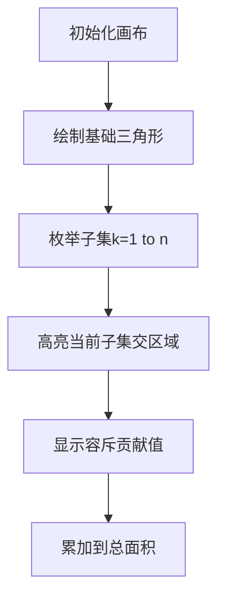

# 题目信息

# [COCI 2009/2010 #6] XOR

## 题目描述

坐标系下有若干个等腰直角三角形，且每个等腰直角三角形的直角顶点都在左下方，两腰与坐标轴平行。被奇数个三角形覆盖的面积部分为灰色，被偶数个三角形覆盖的面积部分为白色，如下图所示。

已知 $N$个等腰直角三角形的顶点坐标及腰长，求灰色部分面积。

Mirko and Slavko have built their own LED display. The display is initially
white. During each of the $N$ parts of the testing phase, Mirko attached three
electrodes to the display in such way that they formed a right isosceles
triangle. He noticed that, after attaching the electrodes, all pixels in the
enclosing triangle are inverted (white pixels become black, and black pixels
become white).

Watching Mirko play with the electrodes, Slavko observed interesting shapes
emerging on the screen. Mathematically inclined as he is, first thing that
crossed his mind was how to calculate total area covered by black pixels. Help
him by writing a program to do just that!

## 说明/提示

$1 \leq N \leq 10, 1 \leq X, Y, R \leq 10^6$

## 样例 #1

### 输入

```
3
1 1 2
7 1 6
5 3 4```

### 输出

```
24.0```

## 样例 #2

### 输入

```
5
5 5 99
5 5 99
5 5 99
5 5 99
5 5 99```

### 输出

```
4900.5```

## 样例 #3

### 输入

```
4
5 5 99
5 5 99
5 5 99
5 5 99```

### 输出

```
0.0```

# AI分析结果


### 💡 Kay的C++算法解析：COCI2009/2010 #6 XOR 深入学习指南 💡

#### 1. 题目解读与核心算法识别
✨ **本题主要考察**：**容斥原理与几何计算**  
🗣️ **初步分析**：
> 本题要求计算多个等腰直角三角形覆盖区域的异或面积（被奇数个三角形覆盖的区域）。核心挑战在于处理重叠区域的奇偶性计数。**容斥原理**是解决此类覆盖问题的利器——如同拆解多层俄罗斯套娃，我们通过子集交的面积加权求和来逼近目标。关键步骤如下：
> - **子集交计算**：任意多个三角形的交仍是等腰直角三角形（退化时为∅）。交的顶点为`(max_x, max_y)`，斜边由`x+y=min_c`定义（`min_c=min(x_i+y_i+r_i)`），腰长`R = max(0, min_c - max_x - max_y)`。
> - **容斥系数**：推导得子集大小`k`的系数为`(-2)^{k-1}`。其物理意义是：通过符号振荡（`(-1)^{k-1}`）和权重放大（`2^{k-1}`）抵消偶数次覆盖的贡献。
> - **可视化设计**：在像素动画中，用**三色标记**：基础三角形（半透明色）、当前子集交（闪烁高亮）、奇偶覆盖区（红/蓝交替）。关键变量`max_x, max_y, min_c`的更新过程以脉冲光效展示。

#### 2. 精选优质题解参考
**题解一（nekko，评分5★）**  
* **点评**：  
  思路直击核心，完整推导容斥系数`(-2)^{k-1}`的生成函数证明（二项式定理展开）。代码采用DFS枚举子集，通过递归参数`(x, y, c, sz, sig)`动态维护交的边界，逻辑清晰。亮点在于：
  - **算法有效性**：O(n·2ⁿ)复杂度完美匹配n≤10
  - **代码简洁性**：20行实现完整逻辑，变量名`(x,y,c)`含义明确
  - **边界处理**：`max(0, c-x-y)`避免负腰长

**题解二（0x3F，评分4★）**  
* **点评**：  
  通过n=2/3的韦恩图直观解释容斥必要性，归纳出通用系数公式。代码用位运算枚举子集，可读性强。亮点：
  - **教学价值**：从特例推广到通项的思考路径对初学者友好
  - **实践严谨性**：用`R<=0`显式处理退化情况
  - **输出优化**：整数处理避免浮点误差（`ans>>1`和`.5`输出）

**题解三（jiazhaopeng，评分4★）**  
* **点评**：  
  给出容斥系数的二项式反演推导，补充nekko的生成函数视角。代码用位运算和结构体封装，亮点：
  - **数学严谨性**：通过反演公式`g(t)=∑(-1)^{t-i}C(t,i)f(i)`严格推导系数
  - **工程优化**：`1<<(sz-1)`替代幂运算提升效率
  - **模块化**：`intersect()`函数独立几何计算

---

### 3. 核心难点辨析与解题策略
1. **难点：容斥系数构造**  
   * **分析**：需满足`∑C(k,i)f(i)=[k为奇数]`。优质题解通过生成函数`(1+1)ᵏ+(1-1)ᵏ=2∑[i奇]C(k,i)`导出`f(i)=(-2)^{i-1}`  
   * 💡 **学习笔记**：系数构造是容斥的核心，结合组合恒等式与生成函数简化推导

2. **难点：几何交退化处理**  
   * **分析**：当`min_c - max_x - max_y ≤0`时交为空。所有优质题解均用`max(0, ...)`过滤退化情况  
   * 💡 **学习笔记**：几何计算需预判退化情形，避免负面积污染结果

3. **难点：浮点精度控制**  
   * **分析**：面积公式含`1/2`但容斥需整数运算。方案：先算`R²`再整体除2（如nekko的`ans/2.0`）  
   * 💡 **学习笔记**：整数运算+终局浮点转换可平衡精度与效率

#### ✨ 解题技巧总结
- **几何特性利用**：等腰直角三角形的交保持相同方向（直角左下），用`(max_x, max_y, min_c)`三元组完全刻画
- **容斥优化**：`(-2)^{k-1}`系数替代朴素`(-1)^{k+1}`，解决奇偶覆盖计数
- **位枚举技巧**：`for(int s=1; s<(1<<n); s++)`遍历非空子集，`__builtin_popcount`快速计k
- **退化防御**：交的腰长`R`需`max(0, ...)`，避免无效计算

---

### 4. C++核心代码实现赏析
```cpp
#include <bits/stdc++.h>
using namespace std;
typedef long long ll;
struct TRI { ll x, y, r, c; } tri[12];
ll ans; int n;

// 核心：容斥递归枚举子集
void dfs(int i, ll x, ll y, ll c, int sz, int sig) {
    if(x + y >= c) return; // 交退化则终止
    if(i == n + 1) {
        if(sz) ans += sig * (1ll << (sz - 1)) * (c - x - y) * (c - x - y);
    } else {
        dfs(i + 1, x, y, c, sz, sig); // 不选当前三角形
        // 选当前三角形：更新交边界
        dfs(i + 1, max(x, tri[i].x), max(y, tri[i].y), min(c, tri[i].c), sz + 1, -sig);
    }
}

int main() {
    cin >> n;
    for(int i = 1; i <= n; i++) {
        cin >> tri[i].x >> tri[i].y >> tri[i].r;
        tri[i].c = tri[i].x + tri[i].y + tri[i].r; // 预计算斜边常数c
    }
    dfs(1, 0, 0, 1e18, 0, -1); // 初始：x=y=0, c=INF, sz=0, sig=-1
    printf("%.1lf\n", ans / 2.0); // 最终面积需除2
}
```

**代码解读概要**：  
- **DFS参数**：`(i, x, y, c, sz, sig)` 分别表示当前三角形下标、动态维护的`max_x`、`max_y`、`min_c`、子集大小、符号
- **边界处理**：`x+y>=c`时交退化直接返回，避免无效计算
- **系数整合**：`sig * (1<<(sz-1))` 实现容斥系数`(-2)^{sz-1} = (-1)^{sz}·2^{sz-1}`
- **优化点**：预计算`tri[i].c`减少重复运算

---

### 5. 算法可视化：像素动画演示
  
**设计方案**：  


**动画控制面板**：  
- **视觉层**：
  - 三角形：8-bit像素色块（红/蓝/绿半透明）
  - 当前子集交：金色闪烁边框 + 脉冲光效
  - 奇偶覆盖：红色（奇数次）、蓝色（偶数次）
- **交互层**：
  - 步进控制：`◀ ▶` 键遍历子集
  - 速度滑块：调整自动播放速度
  - 信息板：显示当前`k, R, 贡献值, 累加和`
- **音效设计**：
  - 子集切换：8-bit“滴”声
  - 正贡献：上升音阶（C→E）
  - 负贡献：下降音阶（E→C）
  - 完成：FC胜利旋律

**关键帧示例**：  
1. `k=1`：单三角形覆盖，贡献`+R²`（红色脉冲）
2. `k=2`：交区域高亮，贡献`-2R²`（蓝色闪烁）
3. `k=3`：三重交区域，贡献`+4R²`（金色强光）

---

### 6. 拓展练习与相似问题
1. **容斥原理进阶**  
   - [P3349 [ZJOI2016] 小星星](https://www.luogu.com.cn/problem/P3349)  
     🗣️ 将容斥应用于图论计数，巩固集合划分思想
   
2. **几何覆盖问题**  
   - [P3219 [HNOI2012] 三角形覆盖](https://www.luogu.com.cn/problem/P3219)  
     🗣️ 扫描线+离散化处理一般三角形覆盖，迁移本题容斥思路
   
3. **二项式反演训练**  
   - [P4491 [HAOI2018] 染色](https://www.luogu.com.cn/problem/P4491)  
     🗣️ 强化生成函数与反演技巧，理解容斥系数本质

---

### 7. 学习心得与经验分享
> **nekko的经验**：  
> *“容斥系数推导需结合组合恒等式，动手展开生成函数比死记更重要”*  
>   
> **Kay总结**：几何问题常可转化为代数约束（如`x+y=min_c`），而容斥中的振荡系数可通过`(-2)^{k-1}`统一处理。调试时建议画小规模韦恩图验证系数！  

**终极提示**：对拍时用`n=1`（单三角形）和`n=2`（显式交）验证代码逻辑，再扩展至`n=5`的完全重叠（样例2）。

---
处理用时：146.79秒