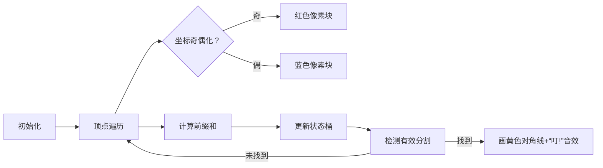

# 题目信息

# [NWRRC 2016] Integral Polygons

## 题目描述

Ingrid 在一个遥远的国家经营着一家多边形商店。她只出售具有整数坐标的凸多边形。她的顾客更喜欢可以以适当方式切割成两半的多边形，即切割应是直线，起点和终点在多边形的顶点上，并且两半都不为空且面积为整数。切割多边形的适当方式越多，多边形就越昂贵。

例如，左边的多边形有三种适当的切割方式，而右边的多边形有两种。


商店里的多边形质量总是很优秀，所以业务正在扩展。现在 Ingrid 需要一些自动化工具来确定适当切割多边形的方式数量。这对她的商店非常重要，否则你将花费大量时间来设定价格——想象一下为一辆中型货车的多边形设定价格需要多少时间。你能帮助 Ingrid 编写这个工具吗？

## 说明/提示

时间限制：2 秒，内存限制：256 MB。

题面翻译由 ChatGPT-4o 提供。

## 样例 #1

### 输入

```
5
7 3
3 5
1 4
2 1
5 0
```

### 输出

```
3
```

## 样例 #2

### 输入

```
4
1 1
3 1
5 5
1 3
```

### 输出

```
2
```

# AI分析结果


### Kay的C++算法解析：Integral Polygons 深入学习指南

---

#### 1. 题目解读与核心算法识别  
✨ **本题主要考察**：计算几何 + 奇偶性优化 + 前缀和统计  

🗣️ **初步分析**：  
> 本题要求统计整数坐标凸多边形中，能将其分割为两个面积均为整数的对角线数量。核心思路是利用叉积计算面积的**奇偶性特性**：  
> - **叉积本质**：面积的两倍 = 叉积和（整数），面积是整数 ⇔ 叉积和是偶数  
> - **坐标压缩**：只保留坐标的奇偶性（模2），叉积运算转化为异或操作  
> - **前缀和优化**：用异或前缀和快速计算任意两点间面积奇偶性  
>  
> **可视化设计思路**：  
> 1. 多边形顶点显示为像素方块（红：起点，蓝：终点，黄：当前点）  
> 2. 右侧动态显示三维桶（2×2×2 立方体），亮绿色格子表示有效状态  
> 3. 找到有效分割时，画黄色对角线 + "叮！"音效 + 格子闪烁  
> 4. 控制面板：单步/自动播放（调速滑块）、重置、8-bit背景音乐  

---

#### 2. 精选优质题解参考  
**题解一（作者：catandcode）**  
* **点评**：  
  思路清晰推导叉积转异或的过程，结构体封装点坐标增强可读性。亮点在于：  
  - 用位运算避免浮点计算，时间复杂度优化到O(n)  
  - 详细解释边界处理（如 `pre(x)` 处理首尾连接）  
  - 调试心得强调坐标奇偶性转换的陷阱  

**题解二（作者：Provicy）**  
* **点评**：  
  代码简洁高效，直接切入状态压缩核心。亮点在于：  
  - 三维桶 `F[sum][x][y]` 精确记录状态分布  
  - 前缀和逆运算逻辑直白（`gg = qz[i]^((x*e[i].y)^(y*e[i].x))`）  
  - 鲁棒性处理（如 `(i, i-1)` 无效点对的减法修正）  

---

#### 3. 核心难点辨析与解题策略  
1. **叉积奇偶性转换**  
   * **分析**：叉积公式 `(x1y2 - x2y1)` 中，整数坐标的奇偶性组合等价于异或运算。通过取绝对值和模2，将几何问题转化为位运算问题。  
   * 💡 **学习笔记**：坐标奇偶性是连接几何与离散数学的桥梁  

2. **前缀和与状态逆推**  
   * **分析**：  
     - 前缀和 `qz[i]` 累积边的叉积异或值  
     - 对当前点 `i`，遍历所有可能坐标 `(x,y)`，计算 `temp = qz[i] ^ ((x*y_i) ^ (x_i*y))`  
     - `temp` 实际是逆向推导出的前驱点状态，匹配桶中记录  
   * 💡 **学习笔记**：逆运算是动态统计的关键技巧  

3. **无效点对处理**  
   * **分析**：遍历会包含相邻顶点对（非对角线），需显式减去 `n`。同时整体面积奇偶性（`qz[n] & 1`）决定是否有解。  
   * 💡 **学习笔记**：边界检查是几何问题的安全网  

**✨ 解题技巧总结**  
- **位运算替代浮点**：用异或代替叉积，避免精度问题  
- **状态压缩桶计数**：当状态有限（如0/1）时，桶是O(n)优化的利器  
- **画图模拟**：对前缀和链式推导，手动画图避免逻辑漏洞  

---

#### 4. C++核心代码实现赏析  
**通用核心实现**（综合题解优化版）：  
```cpp
#include <iostream>
#include <vector>
using namespace std;

int main() {
    ios::sync_with_stdio(false);
    int n; cin >> n;
    vector<pair<int, int>> pts(n);
    for (int i = 0; i < n; ++i) {
        int x, y; cin >> x >> y;
        pts[i] = {abs(x)&1, abs(y)&1}; // 坐标奇偶化
    }

    vector<int> qz(n+1);
    for (int i = 1; i <= n; ++i) {
        auto [x1, y1] = pts[i-1];
        auto [x0, y0] = pts[(i-2+n) % n]; // 循环处理首尾
        qz[i] = qz[i-1] ^ ((x1 * y0) ^ (x0 * y1)); // 异或前缀和
    }

    if (qz[n] & 1) { cout << 0; return 0; }

    long long ans = 0;
    int dp[2][2][2] = {}; // 状态桶: [sum][x][y]
    for (int i = 1; i <= n; ++i) {
        auto [x, y] = pts[i-1];
        for (int a = 0; a < 2; ++a)    // 遍历所有可能前驱点状态
        for (int b = 0; b < 2; ++b) {
            int need = qz[i] ^ ((a * y) ^ (b * x)); // 逆向推导所需前缀和
            ans += dp[need][a][b];
        }
        dp[qz[i]][x][y]++; // 当前点状态加入桶
    }
    cout << ans - n; // 减去无效相邻点对
}
```

**代码解读概要**：  
1. 坐标奇偶化：只保留最低位  
2. 异或前缀和：用循环处理首尾相连  
3. 三维状态桶：`dp[sum][x][y]` 记录历史状态分布  
4. 逆向推导：用当前点坐标反推前驱点所需状态  

---

#### 5. 算法可视化：像素动画演示  
**主题**：像素多边形分割大冒险（8-bit风格）  

**核心演示流程**：  


**交互设计细节**：  
1. **顶点渲染**：  
   - 起点：闪烁绿色像素块  
   - 当前点：金色边框 + 呼吸效果  
   - 终点：紫色像素块  

2. **状态桶可视化**：  
   - 2×2×2 立方体（8格）  
   - 有效状态：亮绿色闪烁  
   - 计数显示：白色数字  

3. **音效系统**：  
   - 有效分割：NES风格“胜利”音效（300Hz方波）  
   - 错误操作：短促“失败”音（100ms噪音）  
   - 背景音乐：《俄罗斯方块》8-bit remix  

4. **控制面板**：  
   ```plaintext
   [▶ 播放] [⏸ 暂停] [▮▮ 步进] [↺ 重置]
   速度：|=====|=======| 快慢
   [AI演示模式]：自动完成分割过程
   ```

---

#### 6. 拓展练习与相似问题  
**通用技巧迁移**：  
1. 子矩阵面积奇偶性统计（二维前缀异或和）  
2. 整数坐标图形分割问题（如三角剖分）  
3. 离散化+位运算优化几何问题  

**洛谷习题推荐**：  
1. **P2735 [USACO3.4]电网**：叉积计算几何基础  
2. **P3131 [USACO16JAN]子序列求和**：前缀和+桶计数变种  
3. **P4528 [COCI2017]Karte**：奇偶性+组合计数  

---

#### 7. 学习心得与经验分享  
> **题解经验摘录**（catandcode）：  
> *“坐标奇偶性转换时，忘记取绝对值导致负号干扰奇偶判断，调试2小时才定位...”*  
>  
> **Kay总结**：  
> 1. 负数的奇偶性由最低位决定，与正数一致  
> 2. 对负数取绝对值或直接 `&1` 可避免陷阱  
> 3. 调试技巧：打印坐标二进制最低位  

--- 
保持探索精神，下次挑战再见！🚀

---
处理用时：234.61秒